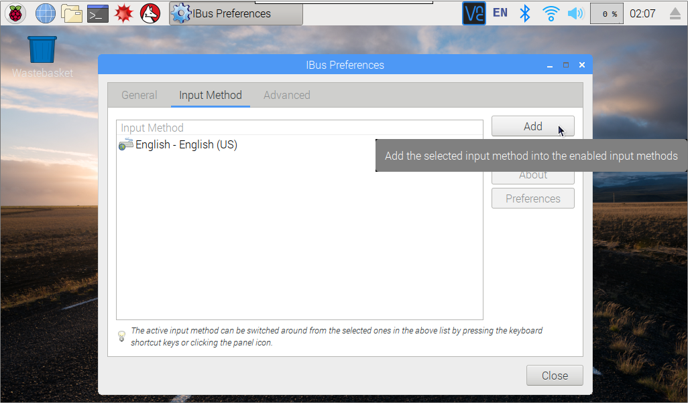
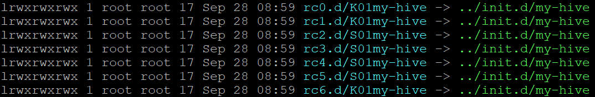
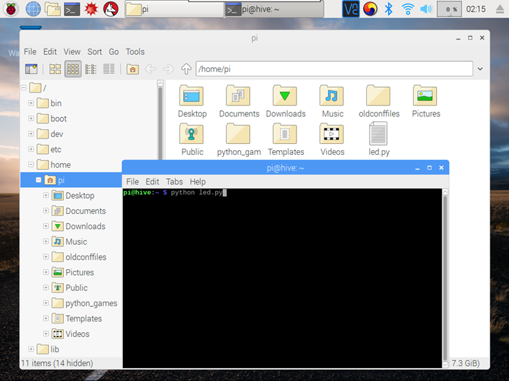
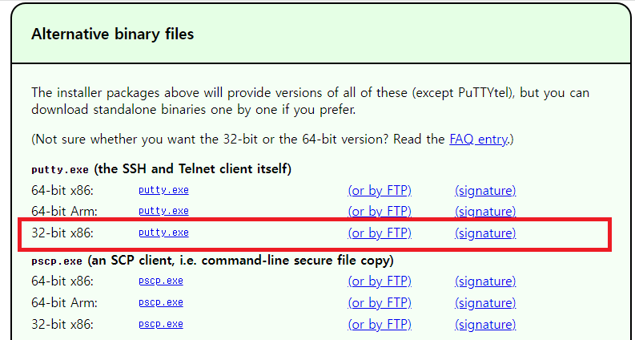
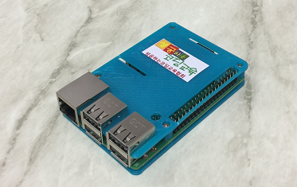
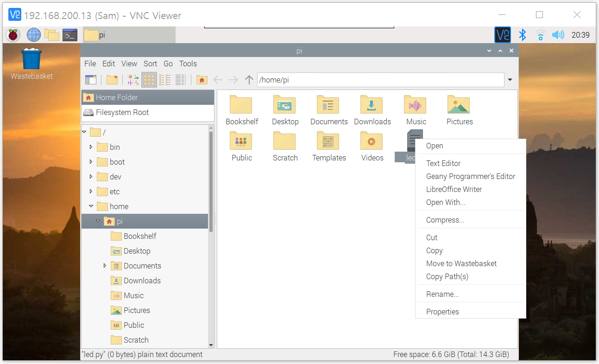
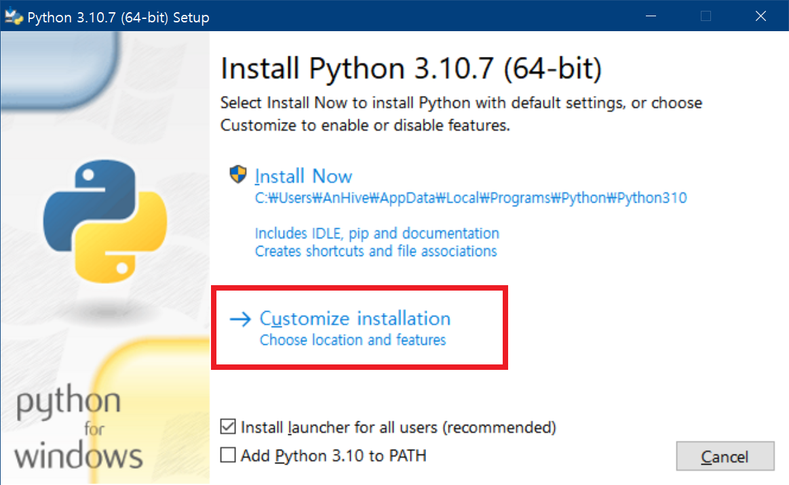

라즈베리파이로 배우는

**엣지컴퓨팅 실무입문**

**라즈베리파이 4 모델 B, bullseye**

**(RPi OS with Desktop, 2022/9/22, KV5.15. DV:11)**

성공하는코딩교육협회

www.\-\-\--.com

**라즈베리파이로 배우는**

**엣지컴퓨팅 실무입문**

라즈베리파이 4 모델 B

이 책에 실린 모든 내용, 디자인, 이미지, 편집 구성의 저작권은
성공하는코딩교육협회에 있습니다. 허락 없이 복제할 수 없습니다.

라즈베리파이로 배우는 엣지컴퓨팅 실무입문

초판인쇄 2022년 12월 20일

지은이 한용수

펴낸이 한용수

펴낸 곳 성공하는코딩교육

출판사등록번호 2017-000070호

주소 서울시 양천구 중앙로 동화목동프라자 5층

전화 02) 2062-2065

홈페이지 : http:\...\...

책값은 뒤표지에 있습니다.

잘못 만들어진 책은 구입한 서점에서 바꾸어 드립니다.

이 책의 파이썬 코드는 http:github.com 에서 확인하실 수 있습니다. 이
도서의 국립중앙도서관 출판예정도서(CIP)목록은 서지정보유통지원시스텝
홈페이지(http://seoji.nl.go.kr)와
국가자료공동목록시스템(http://www.nl.go.kr/kolisnet)에서 이용하실 수
있습니다(CIP제어번호: OOOOOOOO)

머리말

소프트웨어 코딩은 어려운가?

여러분 생각보다 훨씬 쉽습니다. 경험이 없어서 두려울 뿐입니다. 처음
자전거를 탈 때를 생각해 봅시다. 누구나 넘어질 것을 두려워합니다.
두려움을 극복하면 약간의 노력으로 곧 균형 잡는 법을 몸이 스스로
알아냅니다. 컴퓨터에 익숙하지 않은 사람들의 공동된 고민은 "컴퓨터
오동작"입니다. 잘못으로 고장나면 얼마나 수고스러운 일이 일어날지 모르기
때문입니다. 고장 복구하는 방법을 알면 두려워 할 필요가 없습니다.

고장 복구하는 가장 쉬운 방법은 다시 컴퓨터 OS를 설치하는 것입니다.
처음엔 방법을 인터넷을 찾아가면 준비하고 설치하는 과정이 반나절
필요합니다. 3-4번 설치해 보면 불과 20-30분이면 가능합니다. 컴퓨터를
배우는 동안 100번을 재설치 할 수 있다고 생각하면 문제가 생기면 다시
설치하지라는 생각을 합니다. 문제를 해결하기 위한 방법을 찾는 것도 좋지만
초보자에게 인터넷에서 적당한 자료를 검색하고 이해하는 것이 어렵습니다.
그냥 다시 설치하고 시작하는 것이 더 효과적입니다.

이 책은 디지털 시대를 이끌어야 하는 모든 분들을 위한 책입니다. SW 기술을
모르는 사람들도 하나씩 따라 하면서 배울 수 있도록 구성했습니다. 모든
사람을 소프트웨어 엔지니어로 만들고자 하지 않습니다. 자신이 아이디어가
어떻게 가능한지, 어떻게 더 발전할 수 있는지 경험을 얻는 것으로
충분합니다. 그리고 전문가에게 자신의 아이디어를 의뢰할 때 무엇을
원하는지 정확하게 전달할 수 있는 능력을 갖출 수 있도록 하는 것입니다.
물론 이 책이 전문가들에게도 여러분이 어떤 배경에서 이야기 하는지
이해하는 기반이 될 것입니다. 이책은 같은 공통지식으로 의사소통을 돕는
도구가 되고자 하는 것이 최종 목적이기도 합니다.

이 책의 내용은 실무에 사용하는 사례입니다. 사물인터넷 관점에서 센서와
기기제어를 배웁니다. 라즈베리파이를 인터넷 서버로 사용하는 방법도
배웁니다. 복잡한 이론보다는 바로 사용할 수 있는 기술을 정리하여 초보자도
효과적으로 코드를 만들 수 있도록 방향도 제시합니다. 부디 독자
여러분들에게 SW에 흥미를 가지는 계기가 되었으면 합니다.

저자 한용수

차 례

**제 1 부 소프트웨어 이해하기 1**

제 1 장 소프트웨어를 익히는 방법 1

제 2 장 라즈베리파이 학습준비 9

제 3 장 라즈베리파이 OS 설치 15

제 4 장 라즈베리파이 기본환경 설정하기 21

제 5 장 포트포워딩 그리고 UPNPC 31

제 6 장 HEADLESS로 사용하는 방법 41

제 7 장 라즈베리파이 한글 설정 51

제 8 장 무선공유기 만들기 58

제 9 장 파일공유 68

제 10 장 자동실행하기 75

제 11 장 라즈베리파이에서 LED켜기 87

제 12 장 LED 여러 개 다루기 94

제 13 장 조도센서(LDR) 102

제 14 장 프로그램 사이에 정보 전달 방법 108

제 15 장 원격제어 114

제 16 장 원격수집 120

제 17 장 광저항 값을 조도 값으로 표시하기 126

제 18 장 대형 디지털시계 만들기 130

제 19 장 스트리밍 음악 듣기 140

제 20 장 웹서버 환경 만들기 145

제 21 장 웹서버로 데이터 관리하기 154

제 22 장 웹페이지의 통신 기능 만들기(AJAX) 163

제 23 장 RESTful 서비스 만들기 187

제 24 장 사물인터넷 프레임워크를 만들기 204

제 25 장 웹서버 프레임워크 활용 219

**제 2 부 센서 및 기기 활용하기 241**

제 1 장 근접거리측정 243

제 2 장 스위치와 터치센서 250

제 3 장 디지털적외선센서(PIR)로 침입감시 254

제 4 장 온습도센서 260

제 5 장 빛의 세기 측정(ADDA) 263

제 6 장 사운드센서적용 269

제 7 장 조이스틱사용 272

제 8 장 회전 움직임 확인(자이로) 278

제 9 장 4x4 키패드 283

제 10 장 숫자표시 적용 287

제 11 장 4자리 숫자 켜기 292

제 12 장 서보모터 300

제 13 장 스텝모터 303

제 14 장 릴레이를 사용한 선풍기 켜기 310

제 15 장 전등 만들기 315

제 16 장 파이카메라 사용하기 320

제 17 장 타임랩스 카메라 만들기 325

제 18 장 파이카메라로 CCTV 만들기 329

제 19 장 MOTION패키지로 CCTV 만들기 332

제 20 장 라즈베리파이 케이스 만들기 336

제 21 장 자주 사용하는 리눅스 명령 339

제 22 장 라즈베리파이에서 TextEditor 사용 344

제 23 장 거북이로 배우는 컴퓨터 제어 알고리즘 350

제 24 장 무선공유기 네트워크 개요 355

제 25 장 TCP/IP 통신 프로그램 359

제 26 장 nodeMCU 무선실험(PC) 378

제 27 장 nodeMCU 온습도측정 383

**제 2 부 센서 및 기기 활용하기 239**

부록 A. 실습 물품 제작하기 401

부록 B. 실험 기가재 목록 406

부록 C. 분산 시스템 연결 프로젝트 413

1.  소프트웨어를 익히는 방법

\<말랑코딩???v??\>

디지털 시대의 최고의 SW 학습방법은 다양한 샘플 SW 코드를 경험하는
것이다. 그냥 따라하면서 성공하는 과정에서 스스로 자신감을 가질 수 있다.
샘플 코드를 따라만 만들어 보는 것이 비록 유치해 보일지라도 성공적으로
실행되는 코드를 하나 경험할 수 있다는 것이 무엇보다 중요하다. 샘플
코드는 눈에 보이지 않는 많은 기술적 난관을 극복하고 만들어 진다.

-   샘플은 단순하지만 속사정은 복잡하다.

이 책에는 대형 TV모니터를 디지털시계로 만드는 샘플이 있다. 전체 화면에
시간을 표시하기 위해서 웹 기술을 이용한다. Python을 이용하여 화면을
디자인 할 수도 있고 C/C++, Java, JavaScript 또는 Processing 등 다양한
방법을 사용할 수 있지만 굳이 웹기술을 사용한 것은 쉽게 화면에 표시하도록
만들어 보자는 것이고, 어렵지 않게 바로 누구나 집에서 해볼 수 있기도
하지만, 약간의 트릭을 가미하면 스마트TV에서 바로 사용할 수 있는 장점도
있기 때문이다.

이 교재의 전체 코드는 한 페이지 분량정도다. HTML로 시계를 표시할 구조
잡고, JavaScript로 매초 시간 변경을 표시하고, Style Sheet로 위치, 크기,
색 등 모양내기를 한다. PC에서 메모장을 사용해 코드를 편집하고 웹
브라우저에서 바로 확인해 볼 수 있다. 라즈베리파이도 OS설치, 한글-언어팩
설치하면 웹브라우저에서 확인 할 수 있다. 만일 라즈베리파이에 웹서버를
구성하고 파일을 스마트TV에서 웹브라우저로 접속할 수 있도록 한다면
스마트TV에서도 시계를 확인할 수 있다(스마트 TV내용은 본 교재에서 빠져
있습니다)

정확한 시간 표시에는 눈에 보이지 않는 다양한 기술을 사용하고 있다.
컴퓨터는 인터넷에서 글로벌 표준시간을 가져오고, 서울 시간대를 고려하여
서울시간으로 표시한다. 이 시간은 OS가 관리하고 있기 때문에 우리는 별도
관심을 두고 있지 않아도 항상 정확한 시간을 이용할 수 있다. 이 시간
설정은 라즈베리파이 환경 설정에서 배운다.

-   대중적인 도구를 배운다.

이 교재는 한개 IT기술만 사용하지 않는다. 이 교재는 유용한 결과물을
어떻게 만드는지 방법을 배우는데 집중한다. 사물인터넷 SW프로젝트 환경은
SW패키지, 센서, 기기, 운영환경이 다를 수 있기 때문에 상황에 따라 도구를
선택한다. 다양한 도구를 사용하게 됨으로 이 모든 도구를 교재에서 자세한
설명을 다룰 수 없기 때문에 가능한 많은 사람들이 사용하는 도구를
선정한다. 많은 사람들이 사용하면서 인터넷에 많은 자료가 있어서 도구
사용과정에서 문제점을 발견하면 인터넷에서 해답을 찾을 수 있을 것이라
생각한다. 그리고 많은 기능을 담을 도구 보다는 가능한 단순하고 명확한
기능을 가진 도구를 선정하였다.

이 책은 라즈베리파이, 리눅스, GPIO, 센서, 웹서버, 센서노드, 무선공유기,
API 등 주제를 Shell, Python, HTML, JavaScript, PHP 기술로 RESTful,
Reflective Programing, Port Forwarding, Socket Program을 응용한 사례를
배운다. 각 기술은 실습과정에서 최소한의 코드로 기술을 구현할 수 있는
방법을 배울 수 있도록 다양한 샘플링 과정에서 만들어졌다. 물론 교재에
제시한 샘플을 넘어선 좋은 사례가 분명 많이 있지만, 학습 효과를 높이기
위해서 단순화하기도 했다.

교재의 샘플은 기술적으로 서로 호환되도록 하였다. 그래서 학습자는 샘플
기능을 모아 새로운 프로그램을 만들 수 있다. 예로, 웹 샘플은 jquery
등으로 화려한 결과를 보여주는 대신 javascript 기본 기능만을 이용하여
만들 수 있도록 함으로써 vue.js, React, Angualar 등 새로운 기술로 확장할
수 있도록 했다

-   왜 라즈베리파이를 사용하는가

처음 라즈베리파이를 선택한 것은 우연이기도 했지만, 결론적으로 가장
대중적이기 때문에 선택했다. 그 대중적인 인기에는 몇 가지 중요한 이유가
있다. 첫 번째는 저렴하다는 것이다. 두 번째는 너무 풍부한 SW를 공짜로
사용할 수 있다는 것이다. 세 번째는 잘 망가지지 않는다는 점이다.

라즈베리파이에 사용 가능한 오픈소스 400 Gbytes를 넘는다. Raspberry Pi
OS를 포함하여 인공지능, 클라우드, 웹서버, 보안서버 등 우리가 접하는
대부분의 Linux 기술을 무료로 이용할 수 있다. "PC", "스마트폰"만 사용하는
일반 사람들은 설치하는 많은 앱은 이 무료 소프트웨어를 이용하여 개발한
앱이 다수다. 웹브라우저가 대표적이고, SNS 앱의 일부 기능은 역시 이
오픈소스를 이용하여 만들기도 한다.

또한 라즈베리파이는 단편적으로 학습용 컴퓨터로 알고 있지만, 인터넷
서버로도 활용할 수 있다. 100만원이 넘는 스마트폰은 동영상을 지원하기
위해 고성능 CPU와 고해상 화면이 필요하지만, 라즈베리파이 만으로도
수백명이 요청하는 정보를 제공하고 저장하는 역할을 충분히 할 수 있다.
굳이 클라우드 서비스 사용하면서 복잡한 가입 절차를 거칠 필요 없고 매월
사용료를 고민할 필요도 없다. 10분내 웹서버 만들고, 10분내 인터넷에서
접속할 수 있도록 할 수 있다. 단지 방법을 몰라서 사용하지 못하는 것
뿐이다.(웹서버 만들기와 포트포워딩 참조)

윈도우컴퓨터를 제외하면 모든 디지털 장비는 리눅스를 사용한다고해도
과언은 아니다. 리눅스를 대표해서 우분투, 라즈베리파이, 아마존 리눅스
서버에 지원하는 오픈소스 갯수를 비교해 보도록 하겠다. 우분투(22.04)
공개소스가 71000여개이고 대부분 라즈베리파이(2023.9)에서 수용하여
63000여개에 이른다. 아마존 웹서버(AWS)는 27000개 제공한다. 라즈베리파이
사용 장점은 대부분의 리눅스 패키지를 사용할 수 있다는 것이고 오히려
클라우드 보다 쉽게 다양한 실험을 할 수 있다

우분투: sudo apt-cache search \'\' \| wc -l ==\> 71000

라즈베리파이: "sudo apt-cache search \'\' \| wc -l" ==\> 63,000

AWS 리눅스: "sudo yum search \'\' \| wc -l") ==\> 27,000

(2023.01 기준)

라즈베리파이는 주로 Raspberry Pi OS를 주로 사용하고 있지만, Ubuntu OS를
포함하여 비디오 플레이어, 게임기, 사이니지 등 다양한 목적에 따라 이미
만들어진 OS를 설치하여 사용할 수 있다. 응용프로그램에서도
오피스프로그램, 개발도구, 학생들을 위한 학습 도구 등도 사용할수 있다.
라즈베리파이 세계에서는 지속적으로 성장하고 있고 앞으로도 지속적인
콘텐츠 제공으로 다양한 활용이 가능하다.

-   컴퓨터 복구 방법을 먼저 배우자

Let\'s learn how to restore Raspberry Pi first

전문가가 되기 위해서 무작정 라즈베리파이 OS 설치를 반복해 보는 것도
좋다. 우리는 익숙해지면 전문가가 되었다는 착각을 하기도 하지만, 틀린
것만도 아니다. 한번 설치하는 것만으로 어떻게 설치 하는지 이해하겠지만
이런 저런 이유로 OS를 100번 정도 설치해 봤다면 지루해서 쉽게 설치하는
방법도 함께 찾아 볼 것이다.

일반적으로 OS를 다시 설치하는 이유는 원인 모를 문제가 발생했을 때 대응
방법을 찾기 위해서 OS를 다시 설치하고 한 단계씩 확인하면서 문제를
해결하기 위한 것이다. OS설치가 무모하고 시간은 많이 필요한 것처럼
생각되지만 20분내 OS를 다시 설치할 수 있음을 감안하면 문제 해결하기
위해서 무작정 헤맸을 시간을 고려하면 전혀 길지 않다. 보통 다음과 같은
경우 OS를 보통 OS 다시 설치하는 계기가 된다.

-. OS동작 중에 전원을 분리하여 OS가 망가졌다면

-. 시스템의 중요 파일을 삭제되고 복구할 수 없다면

-. 웹서버 환경을 설정하는 과정에서 오류가 있다면

-. 내가 만든 프로그램으로 시스템 파일이 삭제되었다면

-. 한글 폰트를 설치하지 않아 메뉴가 깨졌다면

-. 네트워크 환경이 잘못되어 복구할 수 없다면

-. 시스템 오류가 반복적으로 나타나고 해결할 수 없다면

등등

어쩌면 100번의 OS 재설치가 부족할 수도 있다. 부족하다고 생각하면
여러분은 이미 전문가다. 일반적으로 초보자에게 있어서 환경 설정 과정에서
잘못하여 복구할 수 없을 때 주로 OS를 재설치 한다. 일단 100번 정도 재설치
할 수 있다는 마음가짐만으로도 여러분은 도전을 두려워하지 않을 것이다.

-   기록은 기억을 위한 것이다.

Records are for memory

SW 코딩은 새로운 것을 작업이다. 소프트웨어 프로젝트 작업의 절반은
문서작업이고 나머지 절반의 코딩 작업도 절반 이상은 테스트 작업이다. 즉
코딩 작업은 실제 시간이 많이 들어가지 않는다. 이 코딩 작업도 살펴보면
어떻게 프로그램을 구성해야 할지 가능한 방법을 찾는데 대부분의 시간을
소비한다. 그래서 SW공학에서 한 사람이 년 평균 5000라인을 만든다고 한다.
1년 250일로 하면 하루 20라인이다. 프로젝트에서 일과 중 25%만 코딩에
사용한다는 앞에 가정에 따르면 얼추 코드 생산성이 시간당 10라인이라는
이야기와 같은 맥락이다.

SW를 만들 때 다양한 환경과 가능성을 고려하여 만든다. 그래서 10줄 코드를
10줄의 문장으로 설명하기 어렵다. 이런 상황으로 인하여 SW 프로젝트에서
상세한 내용을 문서로 남길 수 있을 것이라 상상하지만 불가능합니다.
그렇다고 기록을 포기해서는 안된다. 최소한 자신이 만든 SW를 어떤
주의사항을 고려하고 어떤 절차로 만들었는지 기억할 수 있도록 기록해야
한다.

SW문서화는 DOC, PPT, 웹 등 다양한 방법 등이 있다. 최근 점차 도구(위키,
One Note, Notion 등)를 사용하는 방법으로 발전하고 있다. 대부분 형식적인
측면에서 쉽게 기록을 남기려고 한다. 그러나 기본적으로 기록은 나를 위한
것 이어야 한다. 여러분이 6개월 후 1년 후 참조 해야 할 내용이 무엇이니
고려해야 한다. 지금 당장은 기억할 것 같은 내용도 시간 지나면 코드를 봐도
기억을 되살리기 어렵다. 방법에 관계없이 자신이 가장 선호하는 형식과
방법을 이용하여 기록을 남겨야 한다.

기록은 두 가지 관점에서 나누어 기록한다. 시스템 설치와 같이 업무 기록이
하나고 정기적으로 하는 업무 기록이 다른 하나다.

처음 서버 환경을 구성 할 때 다양한 인터넷 정보를 참조하고 적용하지만 한
번에 성공하는 경우는 드물다. 보통은 몇 번의 실패 후에 성공한다. 여러분이
무엇을 했기 때문에 동작 하는지 모르지만 그냥 만족해야 하는 경우도 있다.
이러한 과정은 가능한 상세히 기록해야 한다. 중간에 실패한 경우라도 가능한
상세히 기록해 두어야 한다. 어떤 문제점이 발생했고 문제를 해결하이 위해서
무엇을 했는지 기록해야 한다. 처음 접하는 기술이 낯설고 도구도 불편하여
적절한 수준에서 기록하지 못하고 산만할 수 있다. 그러나 기록하다 보면
무엇을 기록해야 하는지 배우고 다음 설치 과정에서 무엇이 문제였는지
확인해 볼 수 있는 중요한 자료가 된다.

소프트웨어 개발은 일정 시간이 지나면 이전에 만들었던 코드를 복사하여
일부만 수정하여 기능을 확장한다. 본격적인 개발 환경이 완성되는 순간이고
코딩 속도가 빨리지는 시기다. 이때 사용하는 프로그램 구조를 우리는
프레임워크라고 부른다. 이시기에 프레임워크를 문서로 정리해야 한다.
적어도 새로운 기능이 어떻게 적용되어 동작하는지 기록해야 한다. 그러면
개별 기능에 대한 설계 자료 보다는 기능 목록으로 관리하고 연계된 프로그램
목록만 관리하는 것으로 충분하다. 즉 두 가지 자료를 만들어야 한다.
프레임워크 동작에 관한 자료와 프레임워크에서 동작하는 기능 목록이다.

-   스스로 검증할 방법을 찾아야 한다.(PoC)

You must find a way to verify yourself. (PoC)

SW 코딩은 늘 새로운 것을 만드는 과정이다. 경력자들도 역시 늘 새로운 것에
도전한다. SW기술 특성상 매일 새로운 기술이 나타나고 사라지기 때문에
누구도 검증해보기 전에는 어느 하나 잘 안다고 확신하지 않는다. 같은
SW패키지에서도 새로운 기능이 도입되면서 과거 기능이 사라지는 경우도
있다. 물론 더 좋은 쪽으로 발전한다. 비록 작은 기능이라면 단순히 테스트로
만족하지만, 시스템 전체를 좌우할 수 있는 기술에 대해서는 반드시 샘플
코드를 만들어야 한다.

이러한 샘플링을 개념검증(Proof of Concept)이라고 한다. PoC는 샘플 코드를
만들어 입력, 출력, 제어, 성능, 안정성, 확장성, 응답성 등 필요한 부분을
모두 평가한다. 필요하다면 대체가능한 기술도 평가하여 선정하는 작업에
활용하기도 한다. PoC는 일반적으로 설계에 앞선 분석 작업이다.

많은 사람들이 PoC를 귀찮게 생각하지만 기술에 대한 이해를 높일 수 있는
중요한 방법이다. 그리고 해당 기술로 인한 문제를 조기 파악하고 향후
새로운 환경에서 유용할지 검사하는 도구로 활용한다. 이외 다양한 이유에서
개념검증이 진행되는 다음과 같은 경우가 있다.

\- 생각하는 알고리즘이 정상 동작하는지 확인하는 경우

\- 새로운 기술이 개발 환경에 적합한지 확인하는 경우

\- 새 기술이 기존 기술과 같은 결과를 제공하는지 확인하는 경우

\- 새로운 센서를 어떻게 사용해야 하는지 확인하는 경우

\- 새로운 HW 성능을 검증해야 하는 경우

등등

PoC는 개별 모듈을 만들어 테스트 하는 과정에서 시간과 노력이 들어간다.
그러나 개발 중인 제품에 통합 테스트하는 것보다 시간과 비용을 절약할 수
있다. 특히 여러 사람이 협력해야 하는 경우, 문제 원인을 명확히 밝히기
어려운 경우도 종종 있다. 개념검증을 위하여 샘플 코드를 만들다 보면
자연스럽게 설계 방법과 테스트방법을 습득할 수 있다.

-   소프트웨어는 엔지니어링이 필요하다

Software needs engineering.

소프트웨어 코딩은 시간과의 경쟁이다. 코딩은 제한된 시간에 결과를
만들어내는 과정이다. 누군가 아이디어가 있으면 빠르게 검증해야 한다.
시간이 지나서 코딩 결과물을 볼 때는 이미 시기를 놓친 것이라 그 가치가
퇴색하기 마련이다. 그렇기 때문에 짧은 시간에 결과를 만들어 내는 것이
더욱 중요하다. 소프트웨어 엔지니어링 핵심 지표는 은 목표얼마나 빨리
목표에 도달했는지 측정하는 시간이다.

코딩을 빨리 끝내기 위해선 코드 오류를 개발시 최소화 해야 한다.
통계적으로 코딩에서 오류 제거는 나중에 줄이는 것보다 10-100배 이상
시간을 절약할 수 있다고 한다. 이것을 놓치면 테스트 시간이 전체 개발
시간의 80%를 넘기도 한다. 그리고 나중에 발견하는 오류는 다른 팀원이
테스트를 대기하는 시간을 더 기다리게 함으로써 개발 비용이 급증하는
요인이 된다.

만일 단순한 꼼수지만 코딩시간을 20% 이상 줄일 수 있다면 과감히 활용해야
한다. 꼼수가 비록 80%만을 해결하다고 하더라도 전체로 보면 16%의 시간을
줄이는 역할을 한다. 꼼수를 적용할 수 없는 기존 방법을 사용하면 된다.
이원화된 코딩을 싫어할 수도 있다. 그러나 골프 클럽이 여러 개인 것을
생각하면 꼭 하나의 방법으로 해결할 필요는 없다. 효과가 있으면 충분하다

-   타임 로그를 적어보자.

코딩은 시간을 잡아 먹는 괴물이다. 그래서 코딩 집중 할수록 시간은 더욱
빠르게 간다. 옆에서 다른 사람이 알려 주기 전까지 시간 흐름을 잘 인식하지
못하는 경우도 있다. 특히 테스트 단계에 들어가면 문제 해결을 위해서 더욱
집중하기 때문에 시간 흐름을 더욱 인식하지 어렵다.

코딩을 하면서 얼만 시간이 필요한지 알 수 없다. 그러나 일단 예상하는
시간을 적어 놓고 시작한다. 경험이 없는 경우 대부분 너무 짧게 시간을
예상한다. 경험이 쌓이면서 점차 자기만의 방법으로 적당한 시간을 예상 할
수 있다. 예상되는 코드의 크기, 난이도, 복잡도 등을 고려하여 소요 시간을
예상할 수 있다. 특히 매번 예상 시간을 기록하고 코딩 후 실제 소요시간을
기록하면 예상보다 빨리 감을 익힐 수 있다.

보통 몇 년의 개발경험을 가지고 있는 사람들도 프로젝트 전체 개발 시간을
예측하기 어렵다. 작은 크기로 나누었을 때 예상 가능하다. 한 번에 개발하는
분량을 길어도 1주일 이내 완성할 수 있는 분량으로 나누어야 한다.
프로젝트에서 개발 예상시간과 실행시간 기록을 가지고 있다면 여러분은
프로젝트를 관리할 수 있다. 유사 프로그램을 개발해야 할 때 과거 시간
기록을 참조하면 새로운 프로젝트에 필요한 시간을 예상할 수 있기 때문이다.

개발 시간 예상 직관를 효과적으로 높이는 방법이 있다. 개발 할 프로그램을
모듈로 나누고 기능정의, 설계, 코딩, 컴파일, 테스트, 정리 과정에 각각
들어가는 시간을 기록하다보면 좀 더 직관력이 높아진다.

개발 뿐만 아니라 하루를 시간 기록하면 자신이 사용하는 시간에 대해서
놀라운 결과를 발견할 수 있다. 일반적으로 하루 8시간 모두 일에 사용할
것으로 예상하지만 실제 시간은 4시간 도 집중하지 못 한다. 코딩도 실제
하루 4시간 이상 집중하기 어렵다. 어느 날은 4시간 이상 집중했다면 어느
날은 불과 1-2시간만 일을 한다는 것도 알게 된다. 그래서 개발 계획을 세울
때 하루 평균 4시간 일주에 20시간을 개발하는 것으로 계획을 수립하는 것이
적절하다.

2.  라즈베리파이 학습준비

라즈베리파이는 디지털 기술을 배울 수 있는 최적의 도구다. 작지만
컴퓨터로써 필요한 기능을 모두 갖췄다. 그러나 효과적인 학습을 위해선
라즈베리파이를 사용한 실습 환경에 대해서 이해할 필요가 있다.

-   라즈베리파이란

라즈베리파이가 세계적으로 주목받고 있는 이유 중 하나는 "풍부한 활용
사례"다. 라즈베리파이는 아두이노에서 간단히 실험할 수 있는 LED를 켜기를
지원하고, 고급 기능인 구글 인공지능을 실행할수 있다. 최근 안정성이
높아짐에 따라 산업용 제어시스템으로 사용하는 사례가 매일같이 새롭게
소개되고 있다.

{width="4.654722222222222in"
height="2.7694444444444444in"}

라즈베리파이는 PC를 대신하는 것은 물론이고, 동영상 플레이를 하는
셋탑박스, 인터넷 서버, 사무실 전화 교환기로 우리 생활 속에서 다양한
기기로 사용할 수 있다. 초창기 라즈베리파이는 학습용으로만 기대했지만
산업체에서 고가 컴퓨터를 대신하여 4차 산업 엣지 컴퓨터로 활용하고 한다.
최근 라즈베리파이는 인공지능을 탑재하여 사물 물론이고 사람도 인식할 수
있도록 발전하고 있다.

{width="3.5633333333333335in"
height="2.7616666666666667in"}

라즈베리파이 활용사례는 인터넷에 가득하여 '라즈베리파이'라고 검색하면
눈을 즐겁게 할 다양한 사례를 쉽게 찾을 수 있다. 그러나 초보자에게 그
많은 따라하기 프로젝트라도 쉽지 않다. 자세한 설명과 함께 동영상을
제공하고 있지만 부품 하나하나 준비하는 것도 상황에 따라 다르고, 설명하는
그대로 따라하면 될 듯 하지만 중간에 뭔가 살짝 잘못되기라도 하면 성공하지
못할 수 있다.

본 교재는 라즈베리파이에 대한 기본적인 기능, 특성을 파악할 수 있도록
하고, 효과적으로 배울 수 있도록 모든 실험과 실습은 계획했다. 특히 적절한
학습 환경을 구성한다면 짧은 시간에 다양한 성공경험을 얻을 수 있다.
그럼으로 제시된 기준에 맞춰 학습 환경을 갖출 것을 권장한다.

-   실습 OS 환경

라즈베리파이 OS는 Linux 데미안을 사용하고 있다. OS는 시간에 따라 새로운
아이디어 기술이 추가됨에 따라 이를 반영하고자 2년마다 버전을 업그레이드
한다. 그리고 보통 5년 동안 업데이트를 지원한다. 중간 중간 잦은 변화가
있지만 이 교재는 최근 발행한 OS를 기준으로 한다.

Linux : Demian 11, Bullseye

그리고 라즈베리파이는 3종류의 OS 유형이 있다. 서버 사용자를 위한 Lite
버전, 다수 경험자를 위한 GUI 버전, 초급자를 위한 Recommend 버전으로
구분한다. 교재는 GUI버전을 사용하였지만, Recommend 버전을 사용해도 같은
결과를 얻을 수 있다.

**사용 OS: Bullseye, GUI 또는 Recommend 모듈**

**2022.08 배포된 iso 버전 사용**

-   실습 네트워크 환경

일부 코딩 실습은 수집 정보를 원격에서 사용할 수 있도록
네트워크(인터넷)를 연결한다. 라즈베리파이는 유선과 무선(WiFi)을 모두
사용한다. 여러 사람이 함께 사용할 수 있도록 주로 무선 WiFi를 사용하지만
때로는 빠른 네트워크 전송 속도가 필요한 경우 부분적으로 유선 네트워크를
사용한다.

1\. 무선인터넷환경

Wireless internet environment

이 교재에서 사용하는 라즈베리파이는 라즈베리파이 3B/3B+/4B 모델로 WiFi를
내장하고 있다. 가정용 무선공유기를 활용하여 연결할 수 있으며 데스크톱
PC, 노트북, 스마트폰 또는 태블릿과 통신하기 위해선 동일 공유기에
접속해야 한다.

{width="5.905555555555556in"
height="3.211388888888889in"}

이 교재에서 사용하는 WiFi는 \"RPi-wifihive-24\"이다. 개별 실습 장소에서
사용하는 WiFi와 비밀번호가 다를 것으로 예상한다. 비록 교재는
\"RPi-wifihive-24\"라고 표시해도 각 실습장에 가용 무선공유기를 지정하여
수업에 공유해야 한다. 교재에 사용하는 WiFi명을 설정할 수 있다면 혼선
없이 실습이 가능하다.

**WiFi 환경: RPi-wifihive (5G용)**

**또는 RPi-wifihive-24 (24G용)**

**IP체계: 192.168.10.0/24**

2\. 유선인터넷 환경

라즈베리파이는 유선 케이블을 이용하여 인터넷에 접속할 수 있다.
무선공유기의 유선단자에 랜 케이블로 연결하면 자동으로 인터넷이 연결한다.
라즈베리파이 웹브라우저로 구글에서 검색할 수 있다면 인터넷이 가능한
상태다. 구글이 연결되지 않는다면 주위에서 도움 받아 인터넷을 설정해야
한다.

-   파이썬 3.x 사용 코딩

Coding using Python 3.x

이 교재에서 코딩은 파이썬을 기본으로 한다. 파이썬은 설치가 쉽고, 컴파일
없이 바로 실행가능하다. 그리고 풍부한 샘플 코드는 인공 지능, 사물인터넷
등 인터넷으로부터 이용가능하다.

파이썬 코드는 2.7버전과 3.x버전이 두 계열이 있다. 상이한 부분이 여러곳이
있고, 점진적인 환경 변화를 고려하여 처음 배우는 사람은 기본적으로
3.x버전을 사용하여 코딩을 배울 수 있도록 했다. 특별히 2.x를 사용해야 할
경우 별도로 표시하여 혼선을 최소화 했다.

파이썬 코딩 실습은 Text Editor를 사용하여 코드 편집하고, 라즈베리파이
터미널 창에서 실행한다. 라즈베리파이가 기본으로 제공하는 Text Editor는
마이크로소프트 윈도우에서의 노트패드(notepad)와 유사한 기능으로 텍스트
파일을 편집에 제한되지만 직관적으로 이용할 수 있어 다양한 코드 편집에
이용할 수 있다. 파이썬 코드 실행은 별도 터미널 화면을 열고 python 명령을
입력하고 파이썬 코드 파일명을 지정하여 실행한다.

**python 3.10.x**

-   라즈베리파이 실습 주의사항

Raspberry Pi practice precautions

사물인터넷 코딩 실습은 컴퓨터를 비롯하여 라즈베리파이 및 전자부품을
사용한다. 때로는 여러분은 전기 제품을 사용한다. 따라서 전기/전자 제품을
다룰때 주의사항을 준수할 필요가 있다.

라즈베리파이 취급주의 설명에 따르면 기대하지 않은 전기쇼크로 사망에 이를
수 있다고 한다. 그동안 경험상 라즈베리파이가 망가지는 경우는 있어도
사람이 다치는 경우는 없었다. 그렇더라도 주의해야 한다. 무심코
라즈베리파이를 집다가 강한 정전기나 발열로 인하여 깜짝 놀라는 경우가
간혹 있다. 전기적 고장 보다는 의외로 라즈베리파이에 무리한 힘을 가하는
경우 케이블 연결 부위가 망가지는 사례가 자주 있다. 그리고 라즈베리파이는
전원스위치가 없어 켜고 끄기 위해서 어댑터를 직접 콘센트에 연결해야
함으로 실험과정에서 관련 부품의 고장도 간혹 발생한다.

라즈베리파이가 4만원을 조금 넘기에 큰 비용 부담이라고 할 수 없으나 새
라즈베리파이가 도착할 때 까지 기다리는 시간은 생각보다 길고 지루하다.
이러한 불편을 줄이기 위해서라도 다음과 같은 주의를 필요로 한다.

1\. (전원ON) 라즈베리파이 전원은 조립이 끝난 후 전원을 연결해야 한다.

2\. (전원OFF) 라즈베리파이 해체하거나 부품을 추가하는 경우 반드시 전원을
먼저 차단해야 한다.

3\. (단락) 클립, 칼, 드라이버, 혹은 펜 등이 라즈베리파이에 닿아 쇼트가
발생할 수 있다. 가능한 금속 물체를 라즈베리파이로부터 멀리 두자.

4\. (힘조절) 라즈베리파이는 USB 어댑터, HDMI 케이블, 점퍼 케이블, Micro
SD카드를 연결한다. 이 때, 힘으로 무리하게 연결하면 단자가 부서질 수
있음으로 주의가 요구된다.

5\. (추락) 책상 위 라즈베리파이 또는 어댑터가 떨어지면서 단자가 망가지는
경우가 있다. 정리하고 사용하자.

6\. (음료수) 음료수는 돌이킬 수 없는 기기 고장으로 이어진다. 음료수를
라즈베리파이 가까이 두지 말자.

-   추천

1\. 항상 케이스에 넣어 사용하자

2\. 수시로 실험 공간을 정리하여 잘 정돈된 환경에서 실험하자,

3\. 조립과 분해 순서를 정확히 지키자

끝.

3.  라즈베리파이 OS 설치

**Installing the Raspberry Pi OS**

\<말랑코딩010v3.2\>

라즈베리파이에 사용하는 OS 설치 방법을 배운다. Linux를 기본으로하는
라즈베리파이 OS는 Micro SC Card에 전용 OS설치 프로그램을 이용하여
설치한다.

-   실습환경

+-----------+--------------------------+-------------------------------+
| 컴퓨터    | {width="0.8825in" |                               |
|           | height                   | Windows 7 이상 OS             |
|           | ="0.8829166666666667in"} |                               |
|           |                          | USB 2.0 port 1개 이상         |
|           |                          |                               |
|           |                          | 7GBytes 이상 저장 공간        |
+-----------+--------------------------+-------------------------------+
| Micro     | {widt |                               |
|           | h="0.5163888888888889in" | 8GB 이상                      |
|           | height="0.               |                               |
|           | 8686111111111111in"}{widt |                               |
|           | h="0.9295833333333333in" | Micro SD카드 Reader           |
|           | height                   |                               |
|           | ="0.9294444444444444in"} |                               |
+-----------+--------------------------+-------------------------------+
| 라즈      | {widt |                               |
|           | h="1.1972222222222222in" | USB power Adopter(포함)       |
|           | height                   |                               |
|           | ="0.7911111111111111in"} |                               |
+-----------+--------------------------+-------------------------------+
| LCD       | {widt |                               |
| 모니터    | h="1.1052777777777778in" | HDMI cable(포함)              |
|           | height                   |                               |
|           | ="1.1052777777777778in"} |                               |
+-----------+--------------------------+-------------------------------+
| 키보드    | ![]                      | USB keyboard                  |
|           | (./media/image8.bmp){wid |                               |
| 마우스    | th="1.826111111111111in" | USB mouse                     |
|           | height                   |                               |
|           | ="0.8868055555555555in"} |                               |
+-----------+--------------------------+-------------------------------+

☑ 라즈베리파이OS는 리눅스를 기반으로 하는 OS다. 그래픽 사용자 화면을
제공하여 초보 사용자도 쉽게 사용할 수 있으며, 윈도의의 MS-Office와 같은
역할을 하는 Libre-Office가 있어서 Windows PC를 대신하여 사용 할 수 있다.

☑ Raspberry PiOS is an OS based on Linux. It is easy for novice users to
use by creating user screens, and Libre-Office, which acts like
MS-Office in Wando, can replace most Windows PCs.

-   라즈비안 OS 다운로드 (커널버전 5.15, 2022.09.22.배포버전)

라즈베리파이OS는 인터넷에서 공식 배포버전을 다운로드 할 수 있다.

\(1\) 라즈베리파이재단 다운로드 웹페이지 방문

https://www.raspberrypi.com/software/operating-systems/

\(2\) Rasbperry Pi OS중 선택하여 다운로드

추천: "Raspberry Pi OS with desktop"

{width="5.905555555555556in"
height="4.324305555555555in"}

☑ **Raspberry Pi OS with desktop**:(일반사용자용) 윈도우 그래픽 사용자
화면을 제공하고 기본적인 도구를 포함하고 있어서 설치 후 PC대용으로
사용할 수 있다.

☑ **Raspberry Pi OS with desktop and recommended
softare**:(처음사용하는사람) 윈도우 그래픽 사용자 화면을 제공하고
문서작성, 프로그래밍도구, 학습도구, 게임등 여러 응용프로그램을 포함하고
있어서 라즈베리파이로 할 수 있는 다양한 프로그램을 경험해 볼 수 있다.

☑ **Raspberry Pi OS Lite**:(전문가요) 텍스트 사용자 화면을 제공하고
전문가를 위한 기본환경을 제공하여 필요한 응용프로그램을 설치하여 사용할
수 있도록 했다.

☑ 32bit, 64bit, Legacy 중 선택 기준: 보통 32bit를 가장 많이 사용하고
보편적으로 많은 응용프로그램을 무리없이 사용할 수 있다. 64bit는 일부
고급 프로그램의 경우 요구되기도 한다. Legacy는 잦은 버전 변화에 따른
학습 혼선을 줄이기 위해서 안정된 OS버전을 제공하고 있다.

-   라즈베리파이 OS 설치

☑ Micro SD카드는 라즈베리파이에서 하드디스크 역할을 한다. Micro SD카드에
라즈베리파이 OS를 복제하는 것을 OS설치라고 한다. 라즈베리파이 OS설치는
일반 파일 복사와는 달리 전용 프로그램 inmager을 사용한다. OS 설치 순서는
다음과 같다.

\(1\) Micro SD카드를 컴퓨터에 연결하다.

{width="4.684861111111111in"
height="1.3329166666666667in"}

\<Micro SD카드 PC설치 방법\>

\* PC에 Micro SD카드 Reader를 사용하여 Micro SD카드를 연결한다

\* 윈도우 탐색기에 해당 SD카드가 보이는지 확인한다.

\* Micro SD카드는 16G이상, Class 10이상을 추천한다.

\(2\) "Raspberry Pi imager" 다운로드 후 설치한다.

\- imager 다운로드 하여 설치한다

https://www.raspberrypi.com/software/

> {width="4.546805555555555in"
> height="2.9965277777777777in"}

\<Etcher, 라즈비안 설치 프로그램\>

\* Win32DiskImager, Etcher 등 도구를 사용하여 설치할 수 있다.

\* Mac, Linux에서 "dd\" 명령어로 설치 할 수 있다.

\- "imager"를 실행한다.

\- "Choose os\"에서 다운로드한 라즈베리파이 이미지 파일을 선택한다.

\* 마지막 메뉴에서 다운로드한 파일을 선책할 수 있다.

\- "Choose storage\"에 연결하느 Micro SD카드를 지정한다.

\* 예: F:\\

\- "Write!\"를 눌러 Image를 SD카드에 기록한다.

\* Micro SD카드 저장 내용이 수정될 것임을 보여준다.

\* 약 5 \~ 10분 소요됨.

\- 정상적으로 저장되었는지 검증과정을 확인한다.

\(3\) Micro SD카드를 라즈베리파이 연결

\- Micro SD카드를 PC에서 분리한다.

\- Micro SD카드를 라즈베리파이 뒷면 홈에 끼운다.

{width="3.6219444444444444in"
height="2.5501388888888887in"}

\<Micro SD카드 라즈베리파이 설치 예\>

\* Micro SD카드 금속 접촉면이 라즈베리파이를 향하도록 하여 끼운다.

-   OS설치 결과 확인

☑ 처음 설치한 OS는 시작하면 초기화 과정을 진행한다. 초기화 과정은 정상
동작하는지 점검하고, Micro SD카드 저장공간을 다 사용할 수 있도록 조정이
일어난다. 이 과정에서 전원을 차단하면 오류가 발생할 수 있다. 적색
LED점멸이 없을때까지 기다린후 전원을 차단해야 한다.

\(1\) 라즈베리파이 조립

\- Micro SD카드를 라즈베리파이에 삽입한다.

\- 모니터 전원을 먼저 연결한다.

\- 모니터를 HDMI케이블로 연결한다.

\- 키보드와 라즈베리파이를 라즈베리파이 USB 포트에 연결한다.

{width="5.070694444444444in"
height="2.5819444444444444in"}

\<라즈베리파이 케이블 및 부품 조립 방법\>

☑ 모니터는 전원을 연결하기 전에 먼저 연결되어야 라즈베리파이가 모니터를
인식하고 모니터에 필요한 정보를 표시한다.

\(2\) 라즈베리파이에 전원을 연결한다.

\- 전원을 연결하면 바로 무지개화면이 잠시 나타난다.

\- 처음 설치한 OS는 첫 실행과정에서 초기화(용량확장)를 진행한다.

\- 적색 LED점멸 중 전원을 분리하면 설치한 OS에 오류 발생할 수 있다.

\(3\) OS의 정상동작을 확인한다.

\- 모니터에 바탕화면이 나타나기까지 기다린다.(최대 1분)

\- 1분 이상 화면의 변화가 없다면 확인해 보자.

✓ Micro SD카드가 삽입되어 있는가?

✓ 화면 전원 스위치를 켜 놓았는가?

✓ 모니터 전원을 라즈베리파이보다 먼저 연결하였는가?

\- 정상적이지 않다고 판단되면

✓ 모니터의 HDMI로 연결을 점검하고 전원을 다시 연결한다.

✓ 라즈베리파이 전원을 다시 연결한다.

✓ 반응이 없다면 다시 OS설치를 실시해 본다.

\- 그래도 반응이 없다면

✓ 정상적으로 동작하는 장비와 교체하여 Micro SD카드가

\(4\) 라즈베리파이 시작화면을 확인한다.

\- 모니터에 무지개 화면이 나타나는지 확인한다.

\- 잠시후 모니터에 바탕화면이 나타나는지 확인한다.

-   라즈베리파이 위저드 (주의)

☑ 처음 시작하면 라즈베리파이 위저드가 초보자의 환경 설정을 쉽게 마무리할
수 있도록 도와준다. 초보자를 지원하기 위한 것이지만, 일부 기능은
경험자만이 이용할 수 있는 부분도 있어서 잘 못 사용할 경우 오히려
어려움에 빠질 수 있습니다.

사용자 계정 "pi" 추천(비번 1234)

-\> 교재는 pi를 사용자 계정으로 가정하여 설명함.

사용자계정 변경시 linux에 대한 경험이 부족할 경우 대응 불가

Locale 기본 유지

-\> 배포판 OS는 한글 폰트가 없어 메뉴,메시지가 깨짐.

영문 메시지 사용시 오류를 인터넷 검색이 용이함

Update 실행 주의

-\> 라즈베리파이 OS는 변화가 많아 update시 많은 시간 필요

시간이 부족할 경우 업데이트를 생략해도 된다.

끝.

4.  라즈베리파이 기본환경 설정하기

\<쪽지코딩110v3.1\>

OS설치 후 라즈베리파이의 이름, 사용자 계정, 비번, 네트워크, 사용시간대,
사용언어 등 사용자에 맞춰 환경을 지정할 수 있다.

-   실습환경

+------------+--------------------------+------------------------------+
| 기본환경   | {widt |                              |
|            | h="1.6393055555555556in" | 2\. LCD 모니터(HDMI)         |
|            | height                   |                              |
|            | ="1.2661111111111112in"} | 3\. 키보드, 마우스           |
|            |                          |                              |
|            |                          | 4\. OS: Raspbian Stretch     |
+------------+--------------------------+------------------------------+

-   라즈베리파이(Raspberry Pi, RPi) 조립(기본환경)

\- RPi(라즈베리파이)를 준비한다.

\- RPi 뒷면 슬롯에 Micro SD카드를 밀어 넣는다.

\- RPi에 HDMI케이블로 LCD모니터를 연결한다.

\- RPi에 키보드와 마우스를 USB포트에 연결한다.

\- LCD모니터에 전원을 연결한다.

\- RPi에 USB 어댑터로 전원을 연결한다.

{width="4.583055555555555in"
height="3.4443055555555557in"}

\<HDMI LCD를 사용하여 라즈베리파이를 연결한 예\>

-   라즈베리파이 GUI 화면 익히기

라즈베리파이 화면운 화면 상단에 작업표시줄(Taskbar)과 바탕화면으로
구분한다. 작업표시줄은 자주 사용하는 응용 프로그램 아이콘이 기본
배치하고 있다. 기본환경에서 배치된 아이콘은 다음과 같다.

{width="5.731111111111111in" height="3.21625in"}

\<라즈베리파이 작업지시줄의 주요 아이콘\>

\- 브라우저(Web Browser): 인터넷 웹브라우저를 실행한다.

\- 파일관리자(File Manager): 파일관리자 창을 연다.

\- 터미널(Terminal): 명령어를 사용할 수 있는 터미널 창을 연다.

\- 네트워크(Network): 유무선 네트워크를 설정한다.

-   화면 해상도 조정하기

\- 산딸기 메뉴 / Preferences / Screen Configuration 선택

{width="5.589583333333334in"
height="3.1416666666666666in"}

\- 팝업에서 / Configuration/ Screems -\>

HDMI 선택 / Resoultion / 1280x720 선택

{width="5.693333333333333in"
height="3.180833333333333in"}

-   라즈베리파이 기본 환경설정

\(1\) 표시 지역을 유지한다.

\- 기본지정된 정보를 그대로 사용한다.

\* 영문 사용, US 키보드 사용을 체크한다.

\* US 키보드는 한글 키보드의 영문을 그대로 사용할 수 있도록 한다.

\* 한글 키보드로 변경은 "한글 사용"에서 다룬다.

\(2\) 사용자 명 비밀번호를 지정한다.

\- Username: pi

-   Password: 1234

\* 이 교재는 pi 사용자 이름을 기준으로 예시 함.

\(3\) 무선네트워크(WiFi) 지정

\- 무선네트워크는 나중에 설정 가능함.

예) RPi-wifihive

\(4\) 소프트웨어 업데이트

\- OS update는 긴 시간이 소요될 수 있음으로 건너뜀.

\(5\) Restart

\- 기본설정이 완료되면 Restart를 눌러 재부팅 한다.

-   RPi 환경설정 화면 열기

\(1\) 터미널(Terminal)아이콘을 클릭하여 터미널을 열고 다음을 입력한다.

-   sudo raspi-config

\* \"\$\"는 터미널 명령어를 표시하기 위해 이교재에 사용함.

\* sudo : 관리자 권한으로 명령을 실행하기 위한 선행 명령어

\* raspi-config : 라즈베리파이 환경 설정용 명령어

{width="5.040972222222222in"
height="3.221111111111111in"}

\<터미널 창 열기와 환경설정을 위한 명령어 입력 예\>

✓ 라즈베리파이는 GUI 메뉴에서도 환경설정 가능하다. 그러나 GUI환경은 자주
변화하여 본 교재에서는 변화가 적은 명령어를 이용한 제어를 중점적으로
설명한다.

\(2\) Enter 키를 치면 환경을 설정할 수 있는 화면이 나타난다.

{width="5.748194444444445in"
height="3.6531944444444444in"}

\<라즈베리파이 OS 환경설정 화면\>

\* 환경설정에서 마우스는 사용할 수 없습니다.

\* 메뉴는 상하좌우 방향키와 Enter 키로만 이동한다.

\* OS버전에 따라 메뉴위치 변경될 수 있습니다.

-   WiFi 무선 환경 설정하기

라즈베리파이 무선네트워크(WiFi)는 한국 규격의 무선네트워크 환경에서는
자주 오류가 발생하여 연결 되지 않을 수 있다.

\- Raspberry Pi 3B는 2.4G만 지원한다.

\- WiFi 적용국가를 UK 또는 US로 지정한다.

한국 WiFi는 2.4G에서 ch13을 사용하기 때문에 불일치가 될 수 있음.

\- Raspberry Pi 3B+/4B 이후 보드는 5G까지 지원한다.

\(1\) GUI화면에서 무선네트워크(WiFi) 지정하는 방법

\- 화면 우측상단 네트워크 아이콘을 클릭한다.

\- 목록 중 WiFi를 선택하고 비밀번호를 입력한다.

\- WiFi 사용국가가 지정 화면이 나타나면 UK 또는 US를 선정한다.

\(2\) 터미널 창에서 WiFi 지정하는 방법

\- 작업표시줄에서 터미널 아이콘을 클릭하여 터미널을 연다

\- sudo raspi-config 명령을 입력한다.

\- System options / Wireless LAN에서 지정한다.

\- SSID를 입력한다: 예 iptime

\- 와이파이 비밀번호를 입력한다: 해당 와이파이의 비밀번호

\- 국가설정이 요구될 경우 \"US United States\"를 선택한다.

주의: KR Korea (South)로 설정시 WiFi 접속 안 될 수 있음.

\(3\) 터미널 창에서 wpa_supplicant 환경 지정하는 방법

\- 작업표시줄에서 터미널 아이콘을 클릭하여 터미널을 연다.

\- 다음 명령을 실행하여 파일내용을 수정한다.

-   sudo vi /etc/wpa_supplicant/wpa_supplicant.conf

\* vi는 텍스트파일 편집기이다. 대신하여 nano, mousepad도 있다.

\- WiFi 적용국가를 UK를 지정한다.

  -----------------------------------------------------------------------
  ***country=UK***

  -----------------------------------------------------------------------

\- 무선공유기 정보를 추가한다

SSID(WiFi번호): RPi-wifihive-24, PSK(비번): wifihive

+-----------------------------------------------------------------------+
| ***network={***                                                       |
|                                                                       |
| > ***ssid=\"RPi-wifihive-24\"***                                      |
| >                                                                     |
| > ***psk=\"wifihive\"***                                              |
| >                                                                     |
| > ***key_mgmt=WPA-PSK***                                              |
| >                                                                     |
| > ***}***                                                             |
+-----------------------------------------------------------------------+

-   RPi 식별 환경 설정하기

\(1\) 컴퓨터이름(hostname)을 변경하기: 영어이름

\- System options / Hostname에서 변경한다.

\- 컴퓨터 이름은 알파벳과 숫자로 붙여 쓴다.

\- 공백문자를 사용하지 않는다.

\(2\) 원격 터미널 접속을 허용하기: SSH 활성화

\- Interface Options / SSH을 활성화(Enable)한다.

\- 인터넷에서 접속할 수 있다(예, putty).

\(3\) (선택)원격으로 화면 접속을 허용하기: VNC 활성화

\- Interface Options / VNC을 활성화(Enable)한다.

\- Windows, MAC 등에서 RealVNC Viewer로 접속 가능

\- 여러 사람이 같은 화면을 공유할 수 있다.

\(4\) (선택)PC에서 시리얼케이블 접속 허용하기: Serial 활성화

\- Interface Options / Serial port을 활성화(Enable)한다.

\- PC에서 직접 라즈베리파이를 접속한다.(USB2Serial 케이블 사용)

\(5\) 라즈베리파이를 다시 시작한다.: reboot

\- Tab 키를 눌러 "Finish\"를 선택하고 Yes를 클릭하여 Reboot(재시작) 한다

\- 변경된 환경을 적용하여 다시 실행한다.

\- 컴퓨터가 다시 켜질 때, 컴퓨터 이름이 변경된다.

\(6\) RPi가 꺼졌다 다시 켜지는 것을 기다린다.

\- 자동으로 첫 화면이 시작된다.

-   인터넷 접속환경 확인

\(1\) 무선 접속 확인

\- Terminal 아이콘을 클릭하여 Terminal 창을 열고 다음을 입력한다.

-   ifconfig wlan0

✓ wlan0: 으로 시작하는 내용 중 inet값을 확인한다(그림 참조).

예: 192.168.200.54

{width="5.226111111111111in"
height="3.3480555555555553in"}

\(2\) 인터넷 접속 확인

\- Terminal 창에 다음을 입력한다.

-   ping google.com

{width="5.182083333333333in"
height="3.3169444444444443in"}

✓ 인터넷이 정상적으로 연결되면 그림과 같이 응답시간이 표시된다.

✓ Ctrl와 C를 같이 눌러 ping 테스트를 중단 할 수 있다.

-   라즈베리파이 OS 업데이트하기

OS의 기능개선, 오류수정 등으로 변경한 내용을 반영한다.

\(1\) 최신 OS상태 점검(update)

\- 작업표시줄에서 터미널 아이콘을 클릭하여 터미널 창 열기

\- 다음을 입력하여 OS 최신 상태를 인터넷으로부터 확인한다.

-   sudo apt update

{width="5.253611111111111in"
height="3.3755555555555556in"}

✓ apt-get update는 소프트웨어 업데이트 대상을 확인한다.

update는 현재 OS버전에 맞는 프로그램 목록을 확인하는 작업이다.

\(2\) (옵션)최신 OS적용(upgrade)

\- 다음을 입력하여 최신 SW를 자동 다운로드하고 설치한다.

-   sudo apt upgrade

{width="5.322638888888889in"
height="3.4133333333333336in"}

✓ upgrade는 최신 SW를 다운로드하고 설치한다.

✓ 갱신할 내용을 보여주고 진행여부를 묻는다.

예) 156개 파일이 업그레이드되어 있고 이를 적용하면

262MB를 갱신하고 1,224KB 저장공간을 사용한다.

{width="5.3225in" height="3.4026388888888888in"}

✓ 설치과정은 일괄 다운로드 후 진행한다.

✓ 업그레이드 량에 따라 한 시간이상 진행될 수 있다.

\(3\) 설치 완료되면 컴퓨터 다시 시작.

-   sudo reboot

✓ 설치 프로그램을 적용하기 위하여 컴퓨터를 다시 켠다.

끝.

5.  포트포워딩 그리고 UPNPC

\<말랑코딩013v1.0\>

일반 가정에서 라즈베리파이를 설치하고 인터넷으로 접속할 수 있는 방법을
배워본다. 공유기에 포트포워딩이란 기능을 사용하고 일부 공유기는 UPNPC를
이용하여 직접 공유기를 수정하지 않고 포트포워딩 할 수 있다.

-   실습환경

+----------+--------------------------+-------------------------------+
| 컴퓨터   | {width="0.8825in" |                               |
|          | height                   | Windows 7 이상 OS             |
|          | ="0.8829166666666667in"} |                               |
|          |                          | USB 2.0 port                  |
|          |                          |                               |
|          |                          | 7GBytes 이상 저장 공간        |
+----------+--------------------------+-------------------------------+
| 라즈     | {widt |                               |
|          | h="1.1972222222222222in" | USB power Adopter             |
|          | height                   |                               |
|          | ="0.7911111111111111in"} | HDMI cable                    |
|          |                          |                               |
|          |                          | LCD　Monitor                  |
+----------+--------------------------+-------------------------------+
| 무       | {widt |                               |
|          | h="1.0416666666666667in" | 예) iptime                    |
|          | height                   |                               |
|          | ="1.1333333333333333in"} | 2.4G, 5G사용 장비             |
+----------+--------------------------+-------------------------------+

☑ upnp는 전자제품의 상호 연결을 지원하는 기술로 공유기는 외부기기를
연결할 수 있도록 네트워크 포트포워딩 기능을 이용할 수 있도록 규격으로
제정되어 있다. .

-   네트워크 환경

{width="5.727916666666666in"
height="2.9391666666666665in"}

☑ 대학 강의실(가정)은 라즈베리파이 접속을 위해서 네트워크상에
무선공유기를 활용한다. 필요시 신규 추가도 가능하다. 무선 공유기는 PC와
같은 네트워크에 접속하게 되고, 무선공유기에 WiFi로 접속하는
라즈베리파이는 하위 서브네트워크에 속하게 된다. 이 경우 PC는
라즈베리파이를 직접 연결할 수 없다. 그러나, 무선공유기가 PC접속가
특정포트로 접속하는 경우 내부 라즈베리로 연결할 수 있도록 별도 전환하는
경우 연결 가능하다. 이 것을 포트포워딩이라고 한다.

☑ 포트포워딩은 네트워크 내부 라즈베리파이 IP주소와 PORT번호를 외부로
노출된 공유기 IP주소와 새로운 PORT번호로 연결하는 기능이다. 예로
라즈베리파이 SSH접속은 22번 포트 사용한다. 포트포워딩은 라즈베리파이
IP주소와 22포트를 공유기의 새로운 포트번호(예:22000)로 접속할 수 있도록
설정한다면 PC는 공유기를 접속하여 새로운 포트번호(22000)으로 접속하면
공유기는 라즈베리파이 IP와 22번 포트로 연결하는 것으로 인식하고
패킷정보를 해당 IP/PORT로 변환하여 전달한다. 그리고 그 결과를 받아 다시
22000으로 연결 들어온 PC에 반송한다.

☑ 시중 무선공유기 대부분은 포트포워딩을 지원한다. 일부 장비에서
포트포워딩을 사용을 제한하기도 하지만, 공유기의 고유기능중 하나로
제한하느냐 아니냐의 문제다. 그리고 많은 공유기가 UPNP를 지원하여
원격으로 포트포워딩을 지원하기도 한다. 일부공유기에서 reboot하면 upnp로
지정한 포트포워딩 정보가 초기화된다.

☑ 포트포워딩은 보안에 취약함으로 제한된 용도로 사용할 수 있도록 주의가
요구된다.

-   라즈베리파이 외부 접속 허용하기

라즈베리파이는 잦은 해킹 피해로 SSH, VNC등 기능을 비활성화했다.

\(1\) 라즈베리파이 터미널에서 다음 명령으로 실행 가능

-   sudo raspi-config

\- SSH 접속 활성화: **Interface options =\> SSH =\> Enable**

\- VNC 접속 활성화: **Interface options =\> VNC =\> Enable**

-   (무선)공유기 연결 및 네트워크 주소(IP)확인하기

\(1\) 무선공유기의 WiFi를 연결한다.

예) **RPi-wifihive-24/wifihive**

\(2\) 라즈베리파이 네트워크 주소를 확인한다.

터미널에서 \"ifconfig\" 명령으로 자신의 RPi의 IP주소를 확인한다.

-   hostname -I

\* hostname : 네트워크에 연결되어 있는 컴퓨터 이름

\* -I :컴퓨터에 배정된 IP주소 조회 옵션(-I는 i의 대문자)

**예)192.168.200.102**

-   upnpc 설치 및 동작 확인

\(1\) upnp 클라이언트 모듈을 설치

-   sudo apt -y install miniupnpc

\* apt : 라즈베리파이 OS(데미안 계열) 패키지 관리 프로그램

\* -y : 설치 여부 확인에서 설치 확정

\* install : 설치 옵션

\* miniupnoc : 인터넷 케이트웨어를 지원하는 프로그램(포트포워딩)

\(2\) 정상설치 여부와 적용 가능 여부를 확인

-   upnpc -l

주의) -l는 L의 소문자

\* -l :목록 조회 옵션(-l은 L소문자)

\* -p: ssh의 포트 지정

\* 22102: 공유기 포워딩 포트

\-\-\-\-\-\-\-\-\-\--

upnpc : miniupnpc library test client, version 2.1.

\(c\) 2005-2018 Thomas Bernard.

\....

Local LAN ip address : 192.168.200.102

\....

ExternalIPAddress = 223.194.166.221

i protocol exPort-\>inAddr:inPort description remoteHost leaseTime

0 TCP 22101-\>192.168.200.102:22 \'00:D1:98:8F:AF:44\' \'\' 0

**\-\-\-\-\-\-\-\-\-\-\--**

✓ 위와 같이 ***ExternalIPAddress***를 확인할 수 있는 경우 upnp 활용
가능한 상태임.

\* 일부 통신사의 전용 무선공유기는 보안 이슈로 upnp 접근을 제한한다.

\* upnp 접근 불가시 공유기에 직접 포트포워딩을 지정해야 한다.

-   upnpc를 사용한 ssh(22) 포트 접속 환경 구성

\(1\) upnpc로 라즈베리파이 IP의 22 포트를 공유기 22102포트로 접속할 수
있도록 한다.

-   upnpc -a 192.168.200.102 22 22102 TCP

\* -a : 포토포워딩 포트 추가

\* 192.168.200.102 : 라즈베리파이 IP

\* 22: 라즈베리파이 SSH 포트

\* 22102: 공유기 포워딩 포트

\* TCP: 통신 방식 지정

\-\-\-\-\-\-\-\-\-\-\-\-\-\--

\...

ExternalIPAddress = 223.194.166.221

InternalIP:Port = 192.168.200.102:22

external 223.194.166.221:22102 TCP is redirected to internal
192.168.200.102:22 (duration=0)

\-\-\-\-\-\-\-\-\-\-\-\-\-\--

✓ 공유기 IP(223.194.166.221)의 22102 PORT 로 접속하면
라즈베리파이(192.168.200.102)의 22으로 연결(포트포워딩)한다.

\(2\) 포트 등록 사항 확인

-   upnpc -l

\-\-\-\-\-\-\-\-\-\-\-\-\-\--

ExternalIPAddress = 223.194.166.221

\....

4 TCP 22102-\>192.168.200.102:22 \'libminiupnpc\' \'\' 0

\-\-\-\-\-\-\-\-\-\-\-\-\-\--

✓ 22102로 지정된 포트를 확인할 수 있다.

\(3\) 터미널에서 포트 접속 테스트하기

-   ssh pi@223.194.166.221 -p 22102

\* ssh : Secured Shell, 원격지 컴퓨터를 접속하기 위한 인터넷 프로토콜

\* 223.194.166.221 : 공유기 IP

\* -p: ssh의 포트 지정

\* 22102: 공유기 포워딩 포트

✓ 보안점검을 위한 메시지에 yes를 입력하고 로그인 한다.

✓ 접속 종료는 exit 명령을 입력한다.

\(4\) 포트 삭제 하기

-   upnpc -d 22102 TCP

\* -d : 포토포워딩 포트 삭제

\* 22102 : 삭제 대상 포워딩 포트

\* TCP : 지정 통신 방식

✓ 삭제 전후 upnpc -l 로 삭제 여부를 확인할 수있다.

\(5\) 웹페이지의 기본포트 80번을 위 1\~4번 방법으로 포트포워드 한다.

\- 포워딩 포트를 28102로 지정할 수 있다.

\(6\) 가상모니터 VNC 5900번을 위 1\~4번 방법으로 포트포워드 한다.

\- 포워딩 포트를 29102로 지정할 수 있다.

-   여러 사람이 함께 사용하기 위한 UPNP지정(강의실 수업 예)

\(1\) 동시 여러 라즈베리파이를 사용할 수 있도록 포워딩 포트 설계하기.

\- ssh 22번 포트를 확장하여 포트를 22001\~22999 범위 지정

\- 사용자 식별번호 3자리 만들기 : 학번의 마지막 3자리 숫자 선정

실습 예: xxx**000**

\(2\) 리눅스 쉘 프로그램을 저장할 폴더를 지정한다.

\- 파이사용자 홈 디렉토리에 bin 폴더 강제 생성

-   mkdir -p \~pi/bin

\* mkdir: 디렉토리 생성 명령어

\* -p: 생성할 폴더가 이미 있는 경우라도 오류 메시지 억제

\* \~pi/bin: pi사용자 홈디렉토리(/home/pi)에 bin 디렉토리

✓ pi 사용자 폴더에 bin 이름으로 폴더를 확인

\- bin 폴더의 쉘이 실행할 수 있도록 폴더 접근 권한 지정

-   chmod 775 \~pi/bin

\* chmod : 디렉토리 사용자 권한 지정 명령어

\* 775: 소유자에게 모든 권한 부여하고 그 외 사용자는 읽기/실행 지정

\(3\) 포트포워딩을 적용할 쉘파일 편집

\~pi/bin/autoupnp.sh

+-----------------------------------------------------------------------+
| **#!/bin/bash**                                                       |
|                                                                       |
| **\# 2022/05/13 by CreaterName**                                      |
|                                                                       |
| **uip=\$(hostname -I \| cut -d \" \" -f1) && echo \"IP:\" \$uip**     |
|                                                                       |
| **uip3d=\"000\" && echo \"prefix:\" \$uip3d**                         |
|                                                                       |
| **\# for SSH**                                                        |
|                                                                       |
| **uport=\"22\"\$uip3d && echo \"upnpport:\" \$uport**                 |
|                                                                       |
| **upnpc -d \$uport TCP \|\| true**                                    |
|                                                                       |
| **upnpc -a \$uip 22 \$uport TCP \|\| true**                           |
+-----------------------------------------------------------------------+

☑ shell script는 리눅스 명령어를 사용하는 프로그램이다. 변수(\$)를
사용하고 필요한 제어구문을 이용하여 구성한다.

\- shell script 흐름

\* 라즈베리파이 IP 확인 : uip

\* 사용자 식별번호 지정 : "000"

\* SSH 포트포워딩 포트 지정 : uip3d = \"22000\"

\* 등록 포트포워딩 포트 삭제 : upnpc -d

\* 신규 포트포워딩 포트 등재 : upnpc -a \...

\- shell script 문법

\* uip=\$(): 괄호()안의 명령어를 실행하고 결과(ip)를 응답

\* cut -d \" \" -f1: 스페이스로 구분할 때, 첫 번째 데이터 추출

\* && : 이전 리눅스 명령어가 성공하면 다음 명령어 실행함.

\* \|\| true : 오류가 발생하더라도 다음 명령을 수행하도록 함.

\(4\) UPNP 적용(예, 000 번호 인 경우)

\- 등록되어 있는 UPNP 포드 검색

-   upnpc -l \| grep 000

\-\-\-\-\-\--

external 192.168.200.102:22000 TCP is redirected to internal
223.194.166.221:22 (duration=0)

\-\-\-\-\-\--

\* \|: 앞서 실행한 결과를 받아 다음 실행할 명령의 입력으로 전달

\* grep 000: 내용중 000이 포함된 문장을 추출

\- 22000 포트포워딩 포드를 삭제하는 방법

-   upnpc -d 22000 TCP

✓ 22000 포트가 삭제되어 있는지 확인 요

\(5\) 쉘의 실행

\- Shell 파일의 실행 권한 지정.

-   chmod a+x \~pi/bin/autoupnp.sh

\* chmod : 파일권한 변경

\* a+x : 모든사용자(a)에 대해서 실행권한(x)를 추가(+)한다.

✓ ls -l \~pi/bin/autoupnp.sh 으로 권한 적용 여부 확인

\- Shell의 실행

-   \~pi/bin/autoupnp.sh

\-\-\-\-\-\--

ExternalIPAddress = 192.168.200.102

InternalIP:Port = 223.194.166.221:22

external 192.168.200.102:22000 TCP is redirected to internal
223.194.166.221:22 (duration=0)

\-\-\-\-\-\--

✓ 223.194.166.221:22를 연결한 upnp 확인

외부에서 192.168.200.102:22000로 접속 정보 확인

\- UPNP 포드 정상 등록 확인

-   upnpc -l \| grep 000

\-\-\-\-\-\--

external 192.168.200.102:22000 TCP is redirected to internal
223.194.166.221:22 (duration=0)

\-\-\-\-\-\--

✓ 22000 포트가 있는지 확인한다.

\(6\) 웹서버를 위한 80포트, VNC를 위한 5900을 위한 업데이트

\- WEB(80)은 포워딩 포트로 28000\~28999에서 사용 한다.

\- VNC(5900)는 포워딩 포트로 29000\~29999에서 사용 한다.

\~pi/bin/autoupnp.sh

+-----------------------------------------------------------------------+
| **#!/bin/bash**                                                       |
|                                                                       |
| **\# 2022/05/13 by CreaterName**                                      |
|                                                                       |
| **uip=\$(hostname -I \| cut -d \" \" -f1) && echo \"IP:\" \$uip**     |
|                                                                       |
| **uip3d=\"000\" && echo \"prefix:\" \$uip3d**                         |
|                                                                       |
| **\# for SSH**                                                        |
|                                                                       |
| **uport=\"22\"\$uip3d && echo \$uport**                               |
|                                                                       |
| **upnpc -d \$uport TCP \|\| true**                                    |
|                                                                       |
| **upnpc -a \$uip 22 \$uport TCP \|\| true**                           |
|                                                                       |
| **\# for WEB**                                                        |
|                                                                       |
| **uport=\"28\"\$uip3d && echo \$uport**                               |
|                                                                       |
| **upnpc -d \$uport TCP \|\| true**                                    |
|                                                                       |
| **upnpc -a \$uip 80 \$uport TCP \|\| true**                           |
|                                                                       |
| **\# for VNC**                                                        |
|                                                                       |
| **uport=\"29\"\$uip3d && echo \$uport**                               |
|                                                                       |
| **upnpc -d \$uport TCP \|\| true**                                    |
|                                                                       |
| **upnpc -a \$uip 5900 \$uport TCP \|\| true**                         |
+-----------------------------------------------------------------------+

☑ 네트워크에서 포트는 1 \~ 65535로 지정한다. 1024이하 번호는 주요
프로그램에 사전 배정되어 있으며, 응용프로그램을 만들 때 주로
1024\~49151번호를 배정한다. 그리고 49152 to 65535는 클라이언트
프로그램에서 임의배정하는 포트로 이용한다. 포트포워딩포트로
10000\~49151에서 사용할 것을 권장한다.

\- Shell 프로그램 정상동작 확인(삭제, 확인, 생성, 확인)

-   upnpc -d 22000 TCP

-   upnpc -d 28000 TCP

-   upnpc -d 29000 TCP

-   upnpc -l \| grep 000

-   \~pi/bin/autoupnp.sh

-   upnpc -l \| grep 000

```{=html}
<!-- -->
```
-   컴퓨터 켜질 때마다 자동 실행하기

\(1\) crontab에 추가하기

-   crontab -l \> tmp

-   echo \"@reboot \~pi/bin/autoupnp.sh\" \>\> tmp

-   crontab tmp

-   rm tmp

-   crontab -l

\(2\) 테스트를 위해 등록된 upnp를 삭제한다.

\- upnp 등록 포트를 확인하고 삭제한다.

-   upnpc -d 22000 TCP

-   upnpc -d 28000 TCP

-   upnpc -d 29000 TCP

\- upnp 삭제된 포트 확인

-   upnpc -l

\(3\) 라즈베리파이를 reboot 하고 upnp를 확인한다.

\- upnp 등록 포트가 목록을 확인

-   upnpc -l

✓ 예상하고 있는 포트가 등록되어 있는지 확인한다.

-   uPnP를 이용한 PC 작업 환경 점검

\(1\) PC에서 putty 사용

\- putty 설치하기

\* https://www.putty.org에서 "Download putty" 참조.

\- hostname에 공유기 IP를 지정한다.

\- port에 SSH(22)에 대응한 포트포워딩 포트를 지정한다.

\- 라즈베리파이 ID와 비번으로 로그인하기

\* 사용자 id와 pw로 로그인한다.(예: pi/1234)

\(2\) PC에서 웹브라우저 사용

\- 크롬 등 웹브라우저 실행한다.

\- 웹브라우저 주소에 공유기 IP와 포트포워딩 주소를 입력한다.

\* 웹주소 지정(예: 28000라면)

**[http://223.194.166.221:28000]{.underline}**

\(3\) PC에서 vnc 사용

\- 설치하기

\* realVNC viewer를 다운로드하여 설치한다.

\- VNC 주소에 공유기 IP와 포트포워딩 주소를 입력한다.

\* 예) **[223.194.166.221:29000]{.underline}**

\- 로그인하기

\* 사용자 id와 pw로 로그인한다.(예: pi/1234)

끝.

6.  HEADLESS로 사용하는 방법

\<쪽지코딩011v2.1\>\<쪽지코딩530v1.0\>

라즈베라파이를 인터넷 서버 처럼 연결하여 사용 할 수 있다. 직접 연결한
모니터, 키보드, 마우스를 대신하여 PC에서 접속하여 사용하는 방법을
배워본다.

-   실습환경

+------------+--------------------------+------------------------------+
| 컴퓨터     | {width="0.8825in" |                              |
|            | height                   | Windows 7 이상 OS            |
|            | ="0.8829166666666667in"} |                              |
|            |                          | USB 2.0 port                 |
|            |                          |                              |
|            |                          | 7GBytes 이상 저장 공간       |
+------------+--------------------------+------------------------------+
| Micro      | {widt |                              |
|            | h="0.6398611111111111in" | 8GB 이상                     |
|            | height                   |                              |
|            | ="0.8686111111111111in"} | Class 10 이상 추천           |
+------------+--------------------------+------------------------------+
| 시         | {widt |                              |
|            | h="1.5569444444444445in" | Windows 10 호환              |
|            | height                   |                              |
|            | ="0.7619444444444444in"} |                              |
+------------+--------------------------+------------------------------+
| 라         | {widt |                              |
|            | h="1.1972222222222222in" | USB power Adopter            |
|            | height                   |                              |
|            | ="0.7911111111111111in"} | HDMI cable                   |
|            |                          |                              |
|            |                          | LCD　Monitor                 |
+------------+--------------------------+------------------------------+

☑ 라즈베리파이는 몇 가지 방법으로 헤드리스를 지원하고 있다. 시리얼
케이블 사용, SSH 터미널 사용, VNC 사용법이 대표적이다. 초보자는 VNC로
연결하여 GUI화면을 사용할 수 있고, 터미널을 사용하여 접속하는 SSH는
전문가들이 흔히 사용하는 방법이지만 초보자도 조그만 익히면 어렵지 않다.
이중 시리얼 케이블 연결은 PC와 라즈베리파이를 직접 연결하는 방법으로
전문가들이 현장에서 최후 수단으로 사용한다.

-   접속 환경설정

\(1\) 라즈베리파이를 외부에서 접속하기 위해선 환경설정 필요

-   sudo raspi-config

✓ Interfacing Options \> SSH 활성화

✓ Interfacing Options \> VNC 활성화

\* raspberry pi는 보안문제로 ssh, vnc, serial를 사용자가 직접 활성화
하도록 되어 있다.

\(2\) SD카드에 직접 활성화하기

\- SSH 활성화: /boot 디렉토리에 "ssh" 파일을 만든다.

\* booting 접속 가능하며, 재부팅 하면 접속 할 수 없음

**[1. VNC를 이용한 접속]{.underline}**

-   VNC 서버 환경 설정

VNC는 가상네트워크컴퓨터 환경을 제공하는 기술로 텍스트 기반의 SSH와
비교하여 모니터상에 그래픽 환경을 제공하여 초보 사용자도 원격 제어가
쉽도록 한다.

\(1\) terminal로 접속하여

\(2\) raspi-config에서 VNC interface를 활성화한다.

외부에서 무선공유기를 통해 라즈베리파이를 접속해야 하는 경우 고려사항

VNC는 port 5900을 무선공유기를 경유해서 접속 할 수 있도록 포터포워딩을
지정한다. (포트포워딩 참조)

-   RealVNC viewer로 라즈베리파이 접속

RealVNC는 라즈베리파이에서 채택한 기본 VNC다.

\(1\) RealVNC viewer를 설치하고 연다.

\* https://www.realvnc.com/en/connect/download/viewer/

\* or \"download RealVNC reader\"글 구글링

{width="4.398888888888889in"
height="1.8505555555555555in"}

\(2\) 라즈베리파이 네트워크 주소를 입력하고 연결한다.

{width="4.3275in" height="3.106527777777778in"}

\* VNC Connection 에 네트워크 주소를 지정한다.

5900기본 포트가 아니라면 ":"과 함께 포트번호 지정 필요

\* Username 에 "pi\"을 입력한다.

\* Password에 "raspberry\" 또는 변경한 비번을 입력한다.

-   RealVNC viewer 접속화면

{width="5.905555555555556in"
height="3.4804166666666667in"}

\* VNC로 접속하면 작업표시줄에 VNC\" 실행 아이콘이 표시된다.

**[2. SSH를 이용한 접속]{.underline}**

-   SSH 접속 환경 설정

SSH는 라즈베리파이를 원격 접속에 자주 사용하는 방법으로 터미널 창을
통해서 라즈베리파이를 제어할 수 있다.

\(1\) PC에 Micro SD카드를 연결한다(Micro SD카드 Reader 활용).

\(2\) Window 탐색기에서 boot로 지정된 저장장치를 확인한다(예:F).

\(3\) "ssh" 이름의 파일을 만들고 ssh 접속 가능하도록 한다(1회성)

지속적인 ssh 접속은 라즈베리파이 환경설정에서 ssh를 활성화 필요.

-   putty로 라즈베리파이 접속

putty는 SSH를 제공하는 프로그램의 하나로 Text 기반의 사용환경을
제공한다.

\(1\) putty.exe를 설치하고 연다.

\* putty.exe는 다른 컴퓨터에서 라즈베리라이 접속을 돕는 프로그램이다.

https://www.putty.org에서 "Download putty" 참조.

\(2\) 라즈베리파이 연결 옵션을 설정하고 연결한다.

{width="3.631111111111111in"
height="3.5505555555555555in"}

\* Host name에 네트워크 주소를 입력한다.

\* Port에 22를 선택한다.

\(3\) \"Open\" 버튼을 눌려 접속 실행

\* 처음 연결할 때 서버에 대한 확인 과정을 거침

{width="3.83125in"
height="2.4229166666666666in"}

\* 정상적으로 실행되면 검은 바탕의 터미널 화면이 나타난다.

{width="4.479166666666667in" height="2.5425in"}

-   Raspbian 로그인

\(1\) 사용자계정은 사용자가 지정한 "pi" 임

\(2\) 비밀번호는 사용자가 지정한 "1234" 임

\* 비밀번호는 입력 시 훔쳐보는 것을 방지하고자 화면에 나타나지 않는다.

\* 성공적으로 입력하면 다음과 같이 화면에 나타난다.

{width="4.391111111111111in" height="2.4925in"}

\* 프롬프트 (\"pi@raspberrypi:\~\$\")는 pi 사용자가 "raspberrypi"
컴퓨터를 사용자 홈 \"\~\" 디렉토리에서 사용하고 있다 것을 표시한다.

**[3. USB2Serial 이용한 접속]{.underline}**

-   시리얼케이블 사용을 위한 환경 설정

시리얼케이블은 외부기기 연결이 원활하지 않을 때 사용하는 방법으로 PC와
연결하여 장비를 모니터링 하는 최후 방법이다.

\(1\) PC에 Micro SD카드를 연결한다(Micro SD카드 Reader 활용).

\(2\) Window 탐색기에서 boot로 지정된 저장장치를 확인한다(예:F).

{width="3.815138888888889in"
height="2.8584722222222223in"}

\(3\) Window 검색 창에서 cmd를 입력하여 터미널 창을 연다.

{width="4.09125in" height="2.673888888888889in"}

\(4\) config.txt. 파일 끝이 "enable_uart=1\"을 추가한다.

(터미널 창에서 다음을 입력하고 엔터를 쳐 실행한다)

-   echo enable_uart=1 \>\> f:\\config.txt

\* notepad++와 같이 파일편집도구로 직접 편집하는 것을 권한다.

\(5\) config.txt. 파일 끝에 "enable_uart=1\"을 확인한다.

-   type f:\\config.txt

\(6\) Micro SD카드를 컴퓨터에서 분리하여 라즈베리파이에 연결한다.

-   PL2303 케이블 연결

PC2303 케이블을 라즈베리파이를 시리얼 포트로 접속할 수 있도록 하는 USB
to Serial 케이블이다.

\(1\) PL2303 케이블을 준비한다.

\* PL2303케이블은 시리얼통신(UART)을 지원하는 USB케이블이다.

{width="4.712361111111111in"
height="2.060277777777778in"}

\(2\) PL2303 케이블의 검은색소켓을 RPi의 GPIO 6번 핀에 연결한다.

\(3\) PL2303 케이블의 하얀색소켓을 RPi의 GPIO 8번 핀에 연결한다.

\(4\) PL2303 케이블의 초록색소켓을 RPi의 GPIO 10번 핀에 연결한다.

\(5\) PL2303 케이블의 빨간색소켓을 RPi의 GPIO 2번 핀에 연결한다.

**빨간색은 5v전원으로 잘못 연결하면 라즈베리파이 손상이 발생합니다.**

\(6\) PL2303 케이블을 컴퓨터 USB 2.0 단자(검정색)에 연결한다.

-   PL2303 드라이버 설치

\(1\) 드라이버 파일을 다운로드 받는다.

링크:http://www.prolific.com.tw/US/ShowProduct.aspx?p_id=225&pcid=41

\(2\) 압축 파일내 실행파일을 실행하여 설치한다.

\(3\) 컴퓨터를 꺼다 컨다.

-   PL2303 사용 통신포트를 윈도우에서 확인

\(1\) 윈도우 검색 창에 \"장치 관리자\" 또는 \"device manager\"를
검색하여 실행

\(2\) 장치관리자에서 \"포트(COM & LPT)\" 확인

\(3\) "COM\" 폴더에 \"Prolific USB　\...\"의 괄호안의 COM 번호 확인(예
12)

{width="5.099027777777778in"
height="2.0770833333333334in"}

\* 그림에서 com12번을 화인할 수 있다.

-   putty로 라즈베리파이 접속

putty는 SSH를 제공하는 프로그램의 하나로 Text 기반의 사용 환경을
제공한다.

\(1\) putty.exe를 설치하고 연다.

\* putty.exe는 다른 컴퓨터에서 라즈베리라이 접속을 돕는 프로그램이다.

https://www.putty.org에서 "Download putty" 참조.

\(2\) 라즈베리파이 연결 옵션을 설정하고 연결한다.

{width="3.7191666666666667in" height="3.5725in"}

\* Connection type에 : : "Serial"을 선택한다.

\* Serial line에 장치관리자에서 확인한 "COM\" 번호를 입력

\* Speed에 "115200" 입력

\* 다른 옵션은 설치 후 수정할 필요가 없음

\(3\) \"Open\" 버튼을 눌려 접속 실행

\* 정상적으로 실행되면 검은 바탕의 터미널 화면이 나타난다.

{width="4.263055555555556in"
height="2.6770833333333335in"}

\* 화면이 시작되면 \"Enter\"키를 한번 입력하면 메시가 나타난다.

Raspbian GNU/Linux 9 raspberrypi ttyS0

raspberrypi login: ❚

\* 커서(❚) 화면에서 자료 입력 위치를 알려주는 표식

-   라즈베리파이 로그인

\(1\) 기본 사용자계정 명칭은 "pi" 임

\(2\) 기본 비밀번호는 위저드에서 설정한 비번임 "1234", "raspberry\" 임

\* 비밀번호는 입력 시 훔쳐보는 것을 방지하고자 화면에 나타나지 않는다.

\* 성공적으로 입력하면 다음과 같이 화면에 나타난다.

{width="4.535277777777778in"
height="2.847916666666667in"}

-   Mac OS에서 연결방법

\(1\) PL2303 드라이버 다운로드 및 설치

> [[http://www.prolific.com.tw/US/ShowProduct.aspx?p_id=229&pcid=41]{.underline}](http://www.prolific.com.tw/US/ShowProduct.aspx\?p_id=229&pcid=41)

\(2\) 라즈베리파이 연결

\- MAC에서 터미널 화면을 열고 다음을 실행한다.

-   screen /dev/tty.usbserial 115200

\(3\) 라즈베리파이 로그인하기

\- 빈 화면에서 Enter를 친다.

\- ID:pi, PW:raspberry로 로그인한다.

-   USB2Serial 케이블 사용

\(1\) 다양한 유사 기능 케이블 사용 가능

CH340, CP2102 등 chipset을 사용한 케이블도 동일한 기능함.

끝.

7.  라즈베리파이 한글 설정

\<쪽지코딩120v2.2\>

라즈베리파이에서 한글을 사용하기 위해서는 별도 과정을 거쳐야 한다. 한글
글꼴설치, 한글키보드설정, 한글조합프로그램설치로 한글을 이용할 수 있다.

-   실습환경

+------------+--------------------------+------------------------------+
| 기본환경   | {widt |                              |
|            | h="1.6393055555555556in" | 2\. LCD 모니터(HDMI)         |
|            | height                   |                              |
|            | ="1.2661111111111112in"} | 3\. 키보드, 마우스           |
|            |                          |                              |
|            |                          | 4\. OS: Raspbian Stretch     |
+------------+--------------------------+------------------------------+

-   한글 폰트(글꼴) 설치하기

\(1\) 한글폰트 적용여부 확인하기

\- 작업표시줄의 인터넷 아이콘을 클릭하여 daum.net을 연다.

{width="5.385138888888889in" height="3.16125in"}

✓ 웹페이지는 한글폰트가 없어 한들대신 □를 표시한다.

✓ 폰트는 글자를 표시하는 정보다/

\(2\) 웹브라우저를 닫는다.

\(3\) 터미널 창을 열고 한글 폰트 설치하기

-   sudo apt -y install fonts-unfonts-core

✓ 한글폰트를 다운로드하여 설치한다.

\(3\) 폰트설치 결과 확인하기

\- 작업표시줄의 인터넷 아이콘을 클릭하여 daum.net을 다시 연다.

{width="5.489305555555555in"
height="3.2266666666666666in"}

✓ 한글이 보이면 성공적으로 폰트가 설치된 것이다.

-   한글 키보드 설정하기

라즈베리파이의 기본 키보드 설정은 영국식 키보드다. 한글 키보드의 일부
일부 글자 보이는 것과는 다른 문자가 표시된다.

\(1\) 한글 키보드 점검하기

\- 한글키보드 특수기호와 화면 표시내용을 비교한다.

예: @(골뱅이)을 치면 \"(따옴표)가 나타남(영국식인 경우)

예: ₩(원화)을 치면 \\(역슬래시)가 나타남(한글이 아님)

예: 특수 문자가 키보드 배열과 다른 글자가 나타남

\(2\) 한글 키보드 환경 설정하기

\- 터미널 창을 열고 환경설정 화면을 연다.

-   sudo raspi-config

\- Localization options / keyboard를 선택한다.

\- Generic 105-key PC (Intl.) 를 선택한다.

{width="4.103888888888889in"
height="2.627222222222222in"}

\- Other를 선택한다.

{width="4.062222222222222in"
height="2.620416666666667in"}

\- Korean을 선택한다.

{width="4.145555555555555in"
height="2.644861111111111in"}

\- Korean (101/104 compatible)을 선택한다.

{width="4.145555555555555in"
height="2.673888888888889in"}

\- 이후 내용은 기본을 적용한다.(그냥 Enter를 친다).

\"**The default for the keyboard layout**\"

\"**No compose key**\"

\"**\<No\>**\"

\(3\) 한글 키보드 적용 점검

\* @(골뱅이)와 \"(따옴표)가 정상적으로 나타나는지 확인한다.

\* 한글 키보드는 미국식 키보드 배치를 따르기 때문에 미국식 영문 키보드를
사용하는 경우 @(골뱅이)와 \"(따옴표)가 정상적으로 입력된다.

-   한글 입력환경 설정

한글 초성·중성·종성으로 한글 조합하는 프로그램을 설치한다.

\(1\) 한글 입력기를 설치한다.(터미널 창에서)

-   sudo apt -y install ibus

-   sudo apt -y install ibus-hangul

-   sudo apt -y install ibus-gtk

\* 설치 과정 중 다음 메시지를 만나면 불필요한 패키지를 삭제한다.

Use \'sudo apt autoremove\' to remove it.

-   sudo apt autoremove

라즈베리파이 bullseye(2022년 버전)에서는 Korea키보드가 자동으로
등록된다. reboot로 한글키보드 사용이 가능한다.

\(2\) 문자입력 방법 변경하기

\- 메뉴화면에서 딸기메뉴를 클릭하고

\- Preference =\> IBus preferences를 선택한다.

{width="5.905555555555556in"
height="3.474861111111111in"}

\- 한글조합 프로그램을 시작(\'Yes\')한다.

{width="3.47875in"
height="0.8816666666666667in"}

\- IBus daemon을 시작하고 IBus Preferences 화면을 연다.

{width="5.905555555555556in"
height="3.4898611111111113in"}

\(3\) "Input Method"에서 "Add"버튼을 눌러 "한글" 추가

{width="5.822638888888889in"
height="3.422638888888889in"}

\- 목록 중 "\...." 클릭

\- "Korean\" 선택, \"Hangul\" 선택

\- \"ADD\" =\> \"Close\"

\(4\) 한글 - 영어 전환하기

\- 메인메뉴에서 "EN\"아이콘을 클릭하여 "Korean - Hangul\"을 선택한다.

{width="5.708055555555555in"
height="3.3508333333333336in"}

\* 작업표시줄에서 영어 \"EN\"아이콘이 한글아이콘으로 변경된다.

\(5\) 한글입력 테스트

\- 딸기메뉴 =\> Accessories =\> Text Editor 창을 연다.

\- 한영 전환키를 눌러 한글과 영어가 입력되는지 확인한다.

\- 입력이 되지 않는 경우 라즈베리파이를 재부팅(reboot)한다.

\* 재부팅은 딸기메뉴 =\> Shutdown =\> Reboot 선택

끝.

8.  무선공유기 만들기

\<말랑코딩530v1.20\>

라즈베리파이를 WiFi 무선공유기로 만들 수 있다. 여러 사람이 무선으로
인터넷 접속할 수 있도록 무선공유기 기능을 설치하는 방법을 배운다.

-   실습환경

+----------+--------------------------+-------------------------------+
| 기본환경 | {widt |                               |
|          | h="1.6393055555555556in" | 2\. LCD 모니터                |
|          | height                   |                               |
|          | ="1.2661111111111112in"} | 3\. 키보드, 마우스            |
|          |                          |                               |
|          |                          | 4\. OS: Raspbian Stretch 이상 |
|          |                          |                               |
|          |                          | \* 인터넷 연결                |
+----------+--------------------------+-------------------------------+

-   무선공유기 패키지 설치(hostapd)

☑ hostapd 패키지: 무선공유기를 만들 수 있는 프로그램이다. 리눅스
시스템에 활용가능하면 라즈베리파이에서도 잘 동작한다. IP를 자동생성하는
프로그램을 사용시 일반 공유기와 같은 기능을 제공하고, RADIUS 등과 사용할
때 사용자별 접속관리도 가능하다.

\(1\) 패키지 설치

\- 최신 OS 정보로 갱신한다.

-   sudo apt update

\- 무성공유기(hostapd) 패키지를 설치한다.

-   sudo apt -y install hostapd

✓ 무선공유기 패키지를 성공적으로 설치되었는지 확인한다.

✓ 패키지 설치 후 실행 오류는 환경 설정 되지 않아 발생함.

\(2\) 무선공유기 환경 설정

\- 무선공유기 환경설정 디렉토리를 만든다.

-   cd \~ && mkdir -p ap && chmod 775 ap && cd ap

\* && : 리눅스 명령이 성고하면 다음 명령을 실행한다.

✓ 무선공유기 관련 정보와 실행 프로그램 설치 폴더 \"ap\" 생성 확인

\- 무선공유기 환경정보를 입력한다.

-   vi \~/ap/hostapd_hive.conf

+-----------------------------------------------------------------------+
| **#base setting**                                                     |
|                                                                       |
| **interface=wlan0**                                                   |
|                                                                       |
| **driver=nl80211**                                                    |
|                                                                       |
| **hw_mode=g**                                                         |
|                                                                       |
| **ieee80211n=1**                                                      |
|                                                                       |
| **wmm_enabled=1**                                                     |
|                                                                       |
| **channel=5**                                                         |
|                                                                       |
| **ssid=My_WiFi**                                                      |
|                                                                       |
| **ignore_broadcast_ssid=0**                                           |
|                                                                       |
| **#security**                                                         |
|                                                                       |
| **wpa=2**                                                             |
|                                                                       |
| **wpa_passphrase=12345678**                                           |
|                                                                       |
| **wpa_key_mgmt=WPA-PSK**                                              |
|                                                                       |
| **wpa_pairwise=TKIP**                                                 |
|                                                                       |
| **rsn_pairwise=CCMP**                                                 |
|                                                                       |
| **auth_algs=3**                                                       |
|                                                                       |
| **macaddr_acl=0**                                                     |
+-----------------------------------------------------------------------+

☑ 현재 스크립트는 IEEE802.11 의 n 모드를 지원한다. n-mode은 최대
통신속도는 80Mbps다. RPi 4B는 5GHz 모듈을 탑재하고 있어서 IEEE802.11 ac
모드를 지원한다.

\* channel은 0\~12번사이 임의 배정할 수 있다.

\* ssid는 WiFi 이름으로 필요한 이름으로 변경 가능하다.

\* wpa_passphrase는 WiFi 비밀번호로 8자리 이상지정해야 한다.

\- 무선공유기 환경정보를 점검한다.

-   hostapd -d \~/ap/hostapd_hive.conf

✓ 설정 정보 오류가 있으면 오류 위치를 표시한다.

✓ 설정 정보 오류가 없으면 다음과 같은 메시지를 확인할 수 있다.

hostapd_interface_free(0x88c050)

hostapd_interface_free: free hapd 0x88cea8

hostapd_cleanup_iface(0x88c050)

hostapd_cleanup_iface_partial(0x88c050)

hostapd_cleanup_iface: free iface=0x88c050

-   IP자동할당(DHCP) 패키지 설치

☑ dhcp 패키지: 네트워크상에서 컴퓨터 환경 설정을 지원하는 시스템으로
컴퓨터 IP를 자동발급하는 용도로 주로 사용된다. 이외 리눅스 서버가
네트워크로부터 부팅하도록 환경을 제공하기도 한다.

DHCP는 네트워크 주소를 자동 지정한다.

\(1\) DHCP 패키지 설치

-   sudo apt -y install isc-dhcp-server

✓ "Failed to start LSB: DHCP server." 오류 메시지는 환경설정이 완료되지
않아 나타나는 것으로 다음 과정에서 적용한다.

\(2\) IP 자동할당 방법 지정

\- 원본파일을 백업하고

-   sudo mv /etc/dhcp/dhcpd.conf /etc/dhcp/dhcpd.conf.old

\* 주요 환경설정파일은 백업하여 향후 참조할 수 있도록 한다.

\- 새파일에 DHCP 환경 정보를 입력한다.

-   sudo vi /etc/dhcp/dhcpd.conf

+-----------------------------------------------------------------------+
| **ddns-update-style none;**                                           |
|                                                                       |
| **ignore client-updates;**                                            |
|                                                                       |
| **authoritative;**                                                    |
|                                                                       |
| **option local-wpad code 252 = text;**                                |
|                                                                       |
| **subnet 10.10.10.0 netmask 255.255.255.0 {**                         |
|                                                                       |
| **\# - default gateway**                                              |
|                                                                       |
| **option routers 10.10.10.1;**                                        |
|                                                                       |
| **\# - Netmask**                                                      |
|                                                                       |
| **option subnet-mask 255.255.255.0;**                                 |
|                                                                       |
| **\# - Broadcast Address**                                            |
|                                                                       |
| **option broadcast-address 10.10.10.255;**                            |
|                                                                       |
| **\# - Domain name server**                                           |
|                                                                       |
| **option domain-name-servers 8.8.8.8, 8.8.4.4;**                      |
|                                                                       |
| **option time-offset 0;**                                             |
|                                                                       |
| **\# - Range of ip address**                                          |
|                                                                       |
| **range 10.10.10.11 10.10.10.254;**                                   |
|                                                                       |
| **default-lease-time 3600;**                                          |
|                                                                       |
| **max-lease-time 7200;**                                              |
|                                                                       |
| **}**                                                                 |
+-----------------------------------------------------------------------+

\* dhcp는 컴퓨터의 IP를 10.10.10.11 \~ 254에서 배정한다.

\* 8.8.8.8 8.8.4.4는 google 도메인 서버임

\(3\) 다음 명령으로 설정 정보의 오류를 점검한다

-   sudo dhcpd wlan0

✓ 설정 정보 오류가 없는지 확인한다.

✓ 정상 실행하면 다음과 같은 메시지를 확인할 수 있다

> Internet Systems Consortium DHCP Server 4.4.1
>
> Copyright 2004-2018 Internet Systems Consortium.
>
> All rights reserved.
>
> For info, please visit https://www.isc.org/software/dhcp/
>
> Config file: /etc/dhcp/dhcpd.conf
>
> Database file: /var/lib/dhcp/dhcpd.leases
>
> PID file: /var/run/dhcpd.pid
>
> Wrote 3 leases to leases file.
>
> Listening on LPF/wlan0/e4:5f:01:6d:03:1d/10.10.10.0/24
>
> Sending on LPF/wlan0/e4:5f:01:6d:03:1d/10.10.10.0/24
>
> Sending on Socket/fallback/fallback-net

\* /var/lib/dhcp/dhcpd.leases : 접속한 클라이언트 정보 확인 가능

✓ wifi를 사용하고 있는 상황에서 발생하는 메시지 예

{width="5.905555555555556in"
height="3.3652777777777776in"}

-   무선공유기 실행프로그램 만들기

무선 공유 환경에 필요한 무선(wlan0), 유선(eth0), dhcp server 및
보안환경을 shell script로 구성한다.

\(1\) 무선공유기 실행 쉘 프로그램 입력하기

-   vi \~/ap/initAP

+-----------------------------------------------------------------------+
| #!/bin/bash                                                           |
|                                                                       |
| #Initial wifi interface configuration                                 |
|                                                                       |
| DIR**=\$(dirname \$0)**                                               |
|                                                                       |
| **if** **\[** **-e** \"\$DIR/disable_ap\" **\]**                      |
|                                                                       |
| **then**                                                              |
|                                                                       |
| **echo** \"disabled AP by disable_ap file in \$DIR\"                  |
|                                                                       |
| **exit** 0                                                            |
|                                                                       |
| **fi**                                                                |
|                                                                       |
| CONF**=\$1**                                                          |
|                                                                       |
| APIF**=\$2**                                                          |
|                                                                       |
| WAN**=\$3**                                                           |
|                                                                       |
| **ifconfig** **\$APIF** up 10**.**10**.**10**.**1 netmask             |
| 255**.**255**.**255**.**0                                             |
|                                                                       |
| **sleep** 2                                                           |
|                                                                       |
| ###########Start DHCP##########                                       |
|                                                                       |
| **killall** dhcpd                                                     |
|                                                                       |
| **sleep** 1                                                           |
|                                                                       |
| **\[** \"\$(ps -e \| grep dhcpd)\" **==** \"\" **\]** **&&** dhcpd    |
| **\$APIF** **&**                                                      |
|                                                                       |
| \###########                                                          |
|                                                                       |
| #Enable NAT                                                           |
|                                                                       |
| **iptables** **\--**flush                                             |
|                                                                       |
| **iptables** **\--**table nat **\--**flush                            |
|                                                                       |
| **iptables** **\--**delete-chain                                      |
|                                                                       |
| **iptables** **\--**table nat **\--**delete-chain                     |
|                                                                       |
| **iptables** **\--**table nat **\--**append POSTROUTING **\\**        |
|                                                                       |
| **\--**out-interface **\$WAN** **-**j MASQUERADE                      |
|                                                                       |
| **iptables** **\--**append FORWARD **\--**in-interface **\\**         |
|                                                                       |
| **\$APIF** **-**j ACCEPT                                              |
|                                                                       |
| sysctl -w net.ipv4.ip_forward**=**1                                   |
|                                                                       |
| #start hostapd                                                        |
|                                                                       |
| **/**usr**/**sbin**/**hostapd -B **\$CONF**                           |
+-----------------------------------------------------------------------+

\- shell script 제어

\* disable_ap 파일이 있으면 무선공유기를 활성화 하지 않는다.

\* 환경정보(CONF), 무선접속인터페이스(APIF), 인터넷연결(WAN) 지정

\* wlan0의 ip를 10.10.10.1로 지정

\* dhcpd를 사용하여 wlan0에 접속하는 장비에 IP자동 부여

\* NAT를 설정하여 wlan0 접속사용자가 eth0로 인터넷 접속하도록 설정

\* OS에서 ip4패킷이 서로다른 네트워크에서 전달될 수 있도록 설정

\* hostapd를 이용하여 무선공유기 기능을 실행한다.

\- 쉘프로그램의 실행속성을 변경한다.

-   chmod 755 \~/ap/initAP

✓ initAP의 사용권한이 pi에게 있는지 확인한다.

\- 쉘프로그램의 실행 상태 점검

-   chmod 755 \~/ap/initAP

✓ initAP의 사용권한이 pi에게 있는지 확인한다.

-   무선공유기 자동실행 실행프로그램 만들기

\(1\) 부팅 프로세스에서 자동 시작

\- 부팅 스크립트 만들기

-   sudo vi /etc/init.d/my-hive

+-----------------------------------------------------------------------+
| #!/bin/bash                                                           |
|                                                                       |
| \### BEGIN INIT INFO                                                  |
|                                                                       |
| \# Provides: anhive                                                   |
|                                                                       |
| \# Required-Start: \$local_fs \$syslog                                |
|                                                                       |
| \# Required-Stop: \$local_fs \$syslog                                 |
|                                                                       |
| \# Default-Start: 2 3 4 5                                             |
|                                                                       |
| \# Default-Stop: 0 1 6                                                |
|                                                                       |
| \# X-Interactive: true                                                |
|                                                                       |
| \# Short-Description: Start/stop my-hive application                  |
|                                                                       |
| \### END INIT INFO                                                    |
|                                                                       |
| PATH**=/**sbin**:/**usr**/**sbin**:/**bin**:/**usr**/**bin            |
|                                                                       |
| PIDF**=/**run**/**my-hive.pid                                         |
|                                                                       |
| do_start **()** **{**                                                 |
|                                                                       |
| **sleep** 2                                                           |
|                                                                       |
| **/**home**/**pi**/**ap**/**initAP **\\**                             |
|                                                                       |
| **/**home**/**pi**/**ap**/**hostapd_hive.conf wlan0 eth0              |
|                                                                       |
| **echo** \"**\$!**\" **\>** **\$PIDF**                                |
|                                                                       |
| **}**                                                                 |
|                                                                       |
| do_status **()** **{**                                                |
|                                                                       |
| PID**=\$(cat \$PIDF)**                                                |
|                                                                       |
| **ps** **-**ef **\|** **grep** **\$PID**                              |
|                                                                       |
| **return** **\$PID**                                                  |
|                                                                       |
| **}**                                                                 |
|                                                                       |
| do_stop **()** **{**                                                  |
|                                                                       |
| PID**=\$(cat \$PIDF)**                                                |
|                                                                       |
| **kill** **-**9 **\$PID**                                             |
|                                                                       |
| **rm** **\$PIDF**                                                     |
|                                                                       |
| **}**                                                                 |
|                                                                       |
| **case** \"\$1\" **in**                                               |
|                                                                       |
| **start\|**\"\"**)**                                                  |
|                                                                       |
| do_start **\|\|** **exit** **\$?**                                    |
|                                                                       |
| ;;                                                                    |
|                                                                       |
| restart**\|**reload**\|**force-reload**)**                            |
|                                                                       |
| do_stop **\|\|** do_start **\|\|** **exit** **\$?**                   |
|                                                                       |
| ;;                                                                    |
|                                                                       |
| **stop)**                                                             |
|                                                                       |
| do_stop **\|\|** **exit** **\$?**                                     |
|                                                                       |
| ;;                                                                    |
|                                                                       |
| status**)**                                                           |
|                                                                       |
| do_status **\|\|** **exit** **\$?**                                   |
|                                                                       |
| ;;                                                                    |
|                                                                       |
| **\*)**                                                               |
|                                                                       |
| **echo** \"Usage: my-hive \[start\|stop\|status\]\" **\>&**2 **\|\|** |
| **exit** 3                                                            |
|                                                                       |
| esac                                                                  |
+-----------------------------------------------------------------------+

\- shell script 제어

\* do_start: initAP를 이용하여 AP환경 실행

\* do_stop: AP환경 종료

\* do_status: AP환경 제공

\* case : 명령어 처리(start, stop, status 등)

\- shell script 구문

\* case: 조건 선택

\* start, restart, stop, status 에 따라 해당 기능 실행

\* 기타 경우 "\*"는 사용법 표시

\- 쉘 실행 속성을 지정한다.

-   sudo chmod 755 /etc/init.d/my-hive

✓ my-hive의 사용권한이 root에게 있는지 확인한다.

\(2\) 자동실행 부팅코드로 등록

-   sudo update-rc.d my-hive defaults

\* update-rc.d : 시스템 시작 등급에 맞춰 링크 생성

\- 등록 상태 활용

-   ls -l /etc/rc\*.d/\*my-hive

{width="5.905555555555556in" height="0.9675in"}

\* init의 Default start와 stop에 지정된 등급에 맞춰 생성됨

-   무선공유기 사용 충돌문제 해결하기

\(1\) wpa의 IP자동 지정하지 않도록 하기

\- /etc/dhcpcd.conf 에 \"#denyinterfaces wlan0\" 추가한다

-   sudo vi /etc/dhcpcd.conf

  -----------------------------------------------------------------------
  **#denyinterfaces wlan0**

  -----------------------------------------------------------------------

{width="5.905555555555556in"
height="0.8034722222222223in"}

\* dhcpcd는 적용 가능한 무선공유기를 찾도록 돕는다. deny를 설정하여
wlan0를 대상에서 제외한다.

\- 무선 디바이스 제한을 해제한다.

-   sudo rfkill list

-   sudo rfkill unblock wifi; sudo rfkill unblock all

-   sudo rfkill list

{width="5.136805555555555in"
height="0.9658333333333333in"}

\* 무선 디바이스 기능 제한을 해제한다.

\(2\) on/off 환경설정파일 만들기

-   touch \~pi/ap/disable_ap

\(3\) On/Off 실행 스크립트 만들기

\- 라즈베리파이 wlan0에 IP 자동 지정하는 기능 제어하기

-   vi \~pi/ap/set_ap.sh

+-----------------------------------------------------------------------+
| #!/bin/bash                                                           |
|                                                                       |
| **cd** **\~**pi**/**ap                                                |
|                                                                       |
| **\[** \"\$#\" **-**lt \"1\" **\]** **&&** **\\**                     |
|                                                                       |
| **echo** \"usage \$0 enable \\\|disable\" **&&** **exit** 0           |
|                                                                       |
| DENY**=**denyinterfaces                                               |
|                                                                       |
| CONF**=/**etc**/**dhcpcd.conf                                         |
|                                                                       |
| **\[** \"\$(grep \$DENY /etc/dhcpcd.conf \| wc -l)\" **==** 0 **\]**  |
| **\\**                                                                |
|                                                                       |
| **&&** **echo** \"#\$DENY wlan0\" **\|** **sudo** tee -a **\$CONF**   |
|                                                                       |
| **if** **\[** \"\$1\" **==** \"enable\" **\]**                        |
|                                                                       |
| **then**                                                              |
|                                                                       |
| **\[** **-e** disable_ap **\]** **&&** **mv** disable_ap enable_ap    |
|                                                                       |
| **\[** **!** **-e** enable_ap **\]** **&&** **touch** enable_ap       |
|                                                                       |
| **sudo** sed **-**i \"s/#\$DENY/\$DENY/g\" **\$CONF**                 |
|                                                                       |
| **elif** **\[** \"\$1\" **==** \"disable\" **\]**                     |
|                                                                       |
| **then**                                                              |
|                                                                       |
| **\[** **-e** enable_ap **\]** **&&** **mv** enable_ap disable_ap     |
|                                                                       |
| **\[** **!** **-e** disable_ap **\]** **&&** **touch** disable_ap     |
|                                                                       |
| **sudo** sed **-**i \"s/\$DENY/#\$DENY/g\" **\$CONF**                 |
|                                                                       |
| **else**                                                              |
|                                                                       |
| **echo** \"not defined option \$1.\"                                  |
|                                                                       |
| **fi**                                                                |
+-----------------------------------------------------------------------+

\- shell script 제어

\* 라즈베리파이 disable 또는 enable 옵션 필수 지정 확인

\* enable : wlan0를 IP 지정 수동으로 지정

/etc/dhcpcd.conf에 denyinterfaces로 자동지정 해제

\* disable : wlan0를 IP 지정 자동으로 지정

denyinterfaces을 "#"을 붙어 자동 지정 시작

\- shell script 구문

\* \[ .. \] : 조건문 구성 - if문에서 if 생략한 형태

\* if .. elif .. else : 조건문의 연속 정의 표시

\- 사용권한 설정

-   chmod 755 \~pi/ap/set_ap.sh

\(4\) 무선공유기 시작

-   sudo \~pi/ap/set_ap.sh enable

✓ \~pi/ap/enable_ap 파일 확인하기

-   sudo reboot

✓ 새로 시작하면 My_WiFi 무선아이디 확인 가능

\(5\) 무선공유기 연결 확인

\- PC에서 WiFi 목록중 My_WiFi(또는 개별지정ID)를 연결한다.

\- cmd 창에서 ssh로 연결한다.

"ssh pi@10.10.10.1\"

pi:사용자 이름

\(6\) 무선공유기 해제

-   sudo \~pi/ap/set_ap.sh disable

✓ \~pi/ap/siable_ap 파일 확인하기

-   sudo reboot

✓ 새로 시작하면 My_WiFi 무선아이디 확인 가능

무선공유기 관련 코드참조: https://tinyurl.com/2egexrat

끝.

9.  파일공유

\<말랑코딩331-5v1.2\>

라즈베리파이에 파일을 저장하고 이 파일을 스마트폰, PC 또는 테블릿에서
공유하는 방법을 배워본다.

-   실습환경

+----------+--------------------------+-------------------------------+
| 기본환경 | {widt |                               |
|          | h="1.6393055555555556in" | 2\. LCD 모니터                |
|          | height                   |                               |
|          | ="1.2661111111111112in"} | 3\. 키보드, 마우스            |
|          |                          |                               |
|          |                          | 4\. OS: Raspbian Stretch 이상 |
+----------+--------------------------+-------------------------------+

-   파일공유 패키지(samba) 설치

☑ samba 패키지: 리눅스의 파일을 PC와 고유하기 위하여 만들어 진 후
프로그램으로 라즈베리파이에 저장된 파일을 PC, 스마트폰에서 접속할 수
있도록 접속 환경을 제공한다.

\(1\) 설치전 네트워크 환경 확인

\- 현재 사용중인 네트워크 환경 확인하기

-   sudo netstat -tulpn

\* netstat : 네트워크 상태를 확인한다.

\* tupln : tcp, udp, listing, program, numeric port 확인한다.

{width="5.515138888888889in"
height="1.4854166666666666in"}

✓ 라즈베리파이를 접속할 수 있는 포트 목록

\* Proto: 프로토콜

\* Recv-Q/Send-Q5 : 입출력 송수신 대기량

\* Local Address : 라즈베리파이에 제공하는 서비스 포트

\* State : LISTEN 서버형태로 수신중 포트

\* PID/Program name : 사용프로그램 및 프로세스번호

✓ 사용포트 확인

\* 5900, vpn 포트

\* 22, ssh 포트

\* 80, apache 포트

\* 631, cupsd 프린터 공유 포트

\* 68, UDP, dhcp 포트

✓ 삼바 포트 부재 확인

\* 445/TCP, 139/TCP, 137/UDP, 138/UDP

\(2\) 삼바 프로그램 설치

\- 터미널에서 삼바와 관련 패키지를 설치한다.

-   sudo apt -y install samba samba-common-bin

\- 파일을 공유할 폴더를 생성한다.

-   mkdir /home/pi/shared

\(3\) 삼바환경 구성

\- 원본 환경 파일을 백업.

-   sudo mv /etc/samba/smb.conf /etc/samba/smb.org

\- 삼바환경을 설정한다.

-   sudo vi /etc/samba/smb.conf

+-----------------------------------------------------------------------+
| **\[my-hive\]**                                                       |
|                                                                       |
| **path = /home/pi/shared**                                            |
|                                                                       |
| **writeable=Yes**                                                     |
|                                                                       |
| **create mask=0777**                                                  |
|                                                                       |
| **directory mask=0777**                                               |
|                                                                       |
| **public=no**                                                         |
+-----------------------------------------------------------------------+

\* \[my-hive\]: 원격 접속 기기에서 접속할 드라이브 명

\* path : 공유할 폴더 지정

\* wrateable: 외부 사용자의 파일 쓰기 지원 여부

\* create mask: 파일이 생성할 때 파일 권한 표시 범위

\* directory mask: 폴더 생성할 때 파일 권한 표시 범위

\(4\) 삼바 사용자 지정

-   sudo smbpasswd -a pi

\* smbpasswd : 사용자와 비밀번호 관리

\* -a: 신규 사용자 등록

\* pi :라즈베리파이에 등록 또는 새로 만든 계정 사용

\* 비밀번호 입력시 보안상 입력내용이 화면에 나타나지 않는다.

✓ 원격 접속시 pi사용자로 지정한 비번을 사용한다.

\(5\) 설치 후 네트워크 환경 확인

\- 현재 사용중인 네트워크 환경 확인하기

-   netstat -tulpn

{width="5.584722222222222in"
height="2.8629166666666666in"}

✓ 삼바에 사용하는 포트 확인

\* tcp/445, smbd

\* tcp/139, smbd

\* udp/137, nmbd

\* udp/138, nmbd

\(5\) 삼바 사용 라즈베리파이 네트워크 주소 확인

-   hostname -I

✓ PC 등 원격 디바이스 접속시 확인한 IP를 사용한다.

예) 192.168.200.111

\(6\) 윈도우 PC접속 테스트하기(옵션 - 동일네트워크일때)

\- 윈도우 탐색기 주소창에 라즈베리파이 접속 주소를 입력한다.

**\\\\192.168.200.111\\my-hive**

✓ 윈도우 탐색기가 열리는 것을 확인하다.

✓ 라즈베리파이와 PC가 같은 네트워크 사용을 전제함

\- 라즈베리파이 터미널에서 점검대상 파일 만들기

-   touch /home/pi/shared/welcome.txt

✓ 윈도우 탐색기에서 welcome.txt 파일을 확인한다.

-   슬라이드쇼 패키지(feh) 설치

☑ feh 패키지: 라즈베리파이 모니터에 사진을 슬라이드쇼하는 프로그램,
터미널 환경에서도 슬라이드쇼를 할 수 있다.

\(1\) feh 프로그램 설치

\- 작업표시줄에서 "Terminal"을 클릭한다.

-   sudo apt -y install feh

✓ 오류 없이 정상 설지되었는지 확인한다.

\(2\) 샘플 이미지 준비

\- 테스트 이미지를 준비한다.

✓ /home/pi/shared 에 이미지를 준비한다.

\* 라즈베리파이 웹브라우저를 사용하여 이미지를 다운로드 한다.

\(3\) feh 테스트

\- 슬라이드쇼를 실행한다.

-   feh -D 5 -F -r /home/pi/shared &

✓ 5초 간격으로 사진을 차례로 보여준다.

✓ 종료하려면 ESC를 누른다.

✓ shared 폴더가 비어 있는 경우, 슬라이드 쇼가 나타나지 않는다.

\- putty에서 원격 실행하는 경우

-   DISPLAY=:0 feh -D 5 -F -r /home/pi/shared &

\* display=:0 은 x11 환경으로 실행할 모니터 지정

\* "export display=:0" 실시하고 명령을 실행할 수 있다.

✓ 라즈베리파이에 연결된 모니터에서 슬라이드쇼 시작 확인

\(4\) feh에 사용 옵션

  -----------------------------------------------------------------------
  /usr/bin/feh -Y -D 2 -R 10 -F -r /home/pi/shared

  -----------------------------------------------------------------------

\* -Y : 마우스 포인터를 숨긴다.

\* -D 3 : 슬라이드 간 시간 간격 "3"초로 한다.

\* -B black : 배경은 "black\"로 한다.

\* -R 10 : 폴더의 파일을 "10"초 마다 조사한다.

\* -F : 전체화면에 사진을 보여준다.

\* -r /home/pi/shared : "/home/pi/shared 폴더 사진을 보여준다.

-   자동실행 환경 설정

\(1\) 자동시작 프로그램 수정

\- 작업표시줄에서 "File Manager"를 클릭한다.

\- 폴더 주소 창에 \"/home/pi/.config\"을 입력하고 이동한다.

\- 폴더 "lxsession\"으로 이동한다.

✓ lxsession을 찾을 수 없을 때, 터미널 창에서 다음을 실행한다.

-   cp -rf /etc/xdg/lxsession \~/.config/.

\*-rf : r (하위 디렉토리 포함), f(파일 덮어쓰기)

\* /etc/xdg/lxsession : OS 사용자 세션의 공통 정보

\* \~/.config/lxsession : 사용자에게 지정된 세선 처리 정보

\- 폴더 "lxsession/LXDE-pi\" 안으로 이동한다.

\- "autostart\" 파일을 열고 다음과 같이 추가한다.

+-----------------------------------------------------------------------+
| \...                                                                  |
|                                                                       |
| xset s off                                                            |
|                                                                       |
| xset -dpms                                                            |
|                                                                       |
| xset s noblank                                                        |
|                                                                       |
| **/usr/bin/feh -Y -D 2 -R 10 -F -r /home/pi/shared &**                |
+-----------------------------------------------------------------------+

\(2\) 컴퓨터를 다시 시작한다.

\- 딸기메뉴의 shutdown을 클릭한다.

\- "reboot\"을 선택한다.

\- 컴퓨터가 켜지면 자동으로 슬라이드쇼를 한다.

-   디바이스별 파일 공유설정하기

(1)윈도우 사용자 환경 설정

\- 파일 탐색기에서 네트워크를 우클릭한다.

\- "네트워크 드라이브 연결"을 선택한다.

\- 폴더에 "\\\\192.168.xx.xx\\shared"를 입력하고 마친다.

\- 드라이버에 해당 서버 연결을 확인한다.

(2)안드로이드 스마트폰에서 파일 업로드 및 다운로드

\- 구글 플레이스토어에서 "AndSMB(samba client)"앱을 설치한다.

\- 앱실행하여 기기 사진, 미디어 파일 접속을 허용한다. 

\- SMB서버를 설정한다.

IP(192.168.xx.xx), 이름(pi) 비밀번호(raspberry)

\(3\) 아이폰 스마트폰 사용자 환경 설정

\- 아이폰 아이콘 "파일(Files)\"을 실행한다.

\- 메뉴에서 "서버연결"을 설정한다.

서버주소 지정 smb://192.168.xx.xx

사용자 계정과 비밀번호 설정

\(4\) 맥 사용자 환경 설정

\- "Finder\"을 실행한다.

\- Go 메뉴에서 "Connect to Server\"를 선택한다.

\- \"smb://192.168.xx.xxx\"을 선택한다.

\- 사용자와 비번을 입력한다.

-   (선택)삼바의 포트포워딩

\- smdb: 445/TCP

\- nmdb: 139/TCP, 137/UDP, 138/UDP

-   (선택)화면 절전 모드 제어하기

\- 화면 꺼짐을 제한한다.

-   DISPLAY=:0 xset s noblank

\* DISPLAY=:0 : 주 모니터에

\* xset s noblank: xserver **s**creen **noblank**

\* 화면의 꺼짐을 제한한다.

\* xserver는 graphic 화면을 제어하는 기능이다.

\- 라즈베리파이 화면 전원 제어 시그널을 제한한다.

-   DISPLAY=:0 xset -dpms

\* xset -dpms: (-)disable **d**isplay **p**ower **m**anagement
**s**ignaling

\* 화면의 전원 조정기능을 제한한다.

\- 라즈베리파이 설정화면에서 blank 제한하기

-   sudo raspi-config

display options -\> screen blanking -\> No 설정

끝.

10. 자동실행하기

사용자가 만든 프로그램을 라즈베리파이가 다시 시작할 때마다 사용자가
클릭하지 않아도 자동으로 시작하고 싶다면 자동실행 환경을 구성해야
합니다.

\<말랑코딩331-3v1.4\>

-   실습환경

+----------+--------------------------+-------------------------------+
| 기본환경 | {widt |                               |
|          | h="1.6393055555555556in" | 2\. LCD 모니터                |
|          | height                   |                               |
|          | ="1.2661111111111112in"} | 3\. 키보드, 마우스            |
|          |                          |                               |
|          |                          | 4\. OS: Raspbian Stretch 이상 |
+----------+--------------------------+-------------------------------+

-   사용자 파일 자동 실행환경 만들기

\(1\) 새 파일 만들기(예:\~pi/auto.sh)

auto.sh 입력내용

+-----------------------------------------------------------------------+
| #!/bin/bash                                                           |
|                                                                       |
| cd /home/pi                                                           |
|                                                                       |
| python3 -m http.server 8000 &                                         |
+-----------------------------------------------------------------------+

\*auto.sh는 쉽게 변경할 수 있도록 별도 파일로 구성한 사례임

\- 웹서비스 제공 폴더(DocumentRoot)

cd /home/pi

\* /home/pi 디렉토리로 이동

\- 임시 파이썬 웹버서 실행

python3 -m http.server 8000 &

\* python3: 파이썬 프로그램 실행

\* -m: 파이썬 모듈을 사용하여 실행

\* http.server : 웹서버 지원 모듈

\* 8000 : 웹서버 포트번호 (8000)

\* &: 백그라운드 프로그램으로 실행

\(2\) auto.sh 실험

\- 터미널 창을 열고 쉘 실행

-   bash ./auto.sh

\* bash : Bourne sheel (본쉘)은 auth.sh룰 쉘로 실행한다.

\- 웹페이지에서 라즈베리파 IP주소로 접속

예) http://192.168.200.???:8000

✓ PC 웹페이지에서 라즈베리파 폴더 파일과 폴더 확인 가능

\(3\) 컴퓨터 켜지 때, pi사용자의 자동 실행 파일 만들기

\- 작업표시줄에서 "File Manager"를 클릭한다.

\- 폴더 주소 창에 \"/home/pi/.config\"을 입력하고 이동한다.

\- 폴더 "lxssession\", \"LXDE-pi\" 안으로 이동한다.

\*\* lxssession 폴더를 찾을 수 없을 때, 다음과 같이 실행한다.

\$ cp -rf /etc/xdg/lxsession \~/.config/.

\*/etc/xdg/lxsession은 라즈베리파이 공통환경 지정

\*\~pi/.config/xdg/lxsession은 pi사용자 전용환경 지정

\- lxssession/LXDE-pi/autostart 파일을 확인한다

\(4\) autostart 파일 열기 및 스크립트 편집

\- "autostart\" 파일을 마우스 우클릭하여 TextEditor로 연다

**autostart** ***추가 입력 내용***

\(5\) 컴퓨터를 다시 시작한다.

\- 딸기메뉴의 shutdown을 클릭한다.

\- "reboot\"을 선택한다.

\- 컴퓨터가 켜지면 자동으로 파이썬 웹서버가 시작한다.

\(6\) 파이썬 웹서버 테스트하기

\- 라즈베리파이 웹브라우저에서 다음 주소로 접속테스트 한다.

http://localhost:8000

✓ pi홈 디렉토리 확인 할 수 있다

\- PC웹페이지에서 라즈베리파 IP주소로 접속 테스트 한다.

예) http://192.168.200.???:8000

✓ PC 웹페이지에서 라즈베리파 폴더 파일과 폴더 확인 가능

\(7\) 파이썬 웹서버 프로그램 종료

\- 터미널 명령으로 프로그램 종료

-   killall python3

\* python3으로 시작한 프로그램을 모두 종료할 수 있다.

\- 지정된 프로세스만 종료하기

-   ps -ef \| grep \'python3 -m http.server\'

예) pi **1291** 1 0 23:17 ? 00:00:00 python3 -m http.server 8000

✓ python3 -m http.server 항목의 두 번째 인자가 pid임

-   kill -9 1291

✓ ps 명령으로 조회하면 해당 프로세스 삭제 여부 확인가능

\- GUI화면에서 메뉴를 이용하여 제어하기

\* 메뉴에서 Accessories \> Task Manager를 클릭한다.

\* command 칼럼에서 python을 찾는다.

\* python을 우클릭하여 종료(term, kill), 임시중지(stop), 계속(continue)
선택 가능

\(8\) 타임랩스 프로그램 자동 실행 중단하기

\- auto.sh 에서 주석처리( "#"을 실행 명령 앞에 추가한다)

-   vi auto.sh

+-----------------------------------------------------------------------+
| #!/bin/bash                                                           |
|                                                                       |
| cd /home/pi                                                           |
|                                                                       |
| #python -m http.server 8000 &                                         |
+-----------------------------------------------------------------------+

\(9\) autostart에 자주 적용하는 X-Windows 환경 설정 주요 기능

\* xset :x-Windows 제어 명령

\* xset s on/off : 스크린 세이버 on/off

\* xset +dpms/-dpms : 모니터 절전 모드 적용/해제

\* xset s noblink/blink : 스크린 블링크 제한

\* debian xset 참조

-   crontab을 사용한 자동 실행

\(1\) 장시간 반복동작하는 쉘 만들기(예:\~pi/bin/chk.sh)

\- 확인 shell 만들기

chk.sh 입력내용

+-----------------------------------------------------------------------+
| #!/bin/bash                                                           |
|                                                                       |
| count**=**100                                                         |
|                                                                       |
| **while** **((** count **\>** 0 **))**                                |
|                                                                       |
| **do**                                                                |
|                                                                       |
| **echo** **\$\$** **\$count** **\$(date)**                            |
|                                                                       |
| **((** **\--**count **))**                                            |
|                                                                       |
| **sleep** 1                                                           |
|                                                                       |
| done                                                                  |
+-----------------------------------------------------------------------+

count=100

\* count를 100으로 지정한다.

while (( count \> 0 ))

\* count가 0보다 크면 반복하기 아니면 종료

do

\* shell 반복구간 시작

echo \$\$ \$count \$(date)

\* \$\$ 자기 PID, \$count 카운트, \$(date) date 명령어 결과

sleep 1

\* 1초 대기

done

\* shell 반복구간 종료

\- shell의 실행 권한 설정

-   chmod 755 \~pi/bin/chk.sh

\- 테스트하기

-   \~pi/bin/chk.sh

\-\-\-\-\-\-\-\-\-\-\-\--

> 3247 100 Mon 10 Oct 2022 12:20:23 AM KST

\...

> 3247 1 Mon 10 Oct 2022 12:21:43 AM KST

\-\-\-\-\-\-\-\-\-\-\-\--

✓ 100초 동안 프로세스 동작을 표시함.

\(2\) 프로그램 중복 실행 방지 쉘(예:\~pi/bin/uni.sh)

☑ 일부 프로그램은 중복 실행시 정상적인 동작을 하지 못하거나, 중복되어
실행시긴이 길어질 수 있다. 이를 막기 위한 방법을 기존 실행하는 동일
프로그램이 없을 경우만 실행하도록 한다.

uni.sh 입력내용

+-----------------------------------------------------------------------+
| **#!/bin/bash**                                                       |
|                                                                       |
| **PNAME=\$(basename \$1) && echo \$PNAME**                            |
|                                                                       |
| **if pidof -o %PPID -x \"\$PNAME\"\>/dev/null; then**                 |
|                                                                       |
| **echo \"Process\[\$(basename \$1)\] already running\"**              |
|                                                                       |
| **exit 1**                                                            |
|                                                                       |
| **else**                                                              |
|                                                                       |
| **\$\* &**                                                            |
|                                                                       |
| **fi**                                                                |
+-----------------------------------------------------------------------+

\- shell script 제어

\* PNAME에 실행프로그램이 이름을 확인한다.

\* pidof에서 동일명의 프로세스가 있는지 확인

\* 동일 이름의 프로세스가 있으면 실행중임으로 표시하고 종료

\* 동일 이름의 프로세스가 없으면 프로그램을 백그라운드로 실행

\- shell script 설명

\* \>/dev/null : 결과를 null 파일로 전달(데이터 버리기)

\* \$\* : 명령어로 입력한 옵션 항목 전체를 명령어로 실행하기

\- chk.sh를 반복 실행할 때 중복 실행하는지 확인한다.

-   cd \~pi/bin/

-   chmod 755 uni.sh

-   ./uni.sh ./chk.sh &

-   ./uni.sh ./chk.sh &

-   ./uni.sh ./chk.sh &

-   ps -ef \| grep chk.sh

✓ chk.sh 파일이 하나만 실행되는지 확인함.

\(3\) crontab에 추가하기

-   crontab -l \> tmp

-   echo \"\*/5 \* \* \* \* \~pi/bin/uni.sh \~pi/bin/chk.sh\" \>\> tmp

-   crontab tmp

-   rm tmp

-   crontab -l

\- 직접 추가하기

-   crontab -e

다음 내용을 파일 끝에 추가한다.

\*/5 \* \* \* \* \~pi/bin/uni.sh \~pi/bin/chk.sh

\(4\) crontab 시간 설정 방법

  -----------------------------------------------------------------------
  \*/5 \* \* \* \* \~pi/bin/uni.sh \~pi/bin/chk.sh

  -----------------------------------------------------------------------

\- crontab 설정 옵션

\# m h dom mon dow command

\* m(분): 0-59분 지정, "\*/5"는 5분단위로 실행 지정

\* h(시): 0-23시 지정, "\*"는 매시를 표시함.

\* dom(일): 1-31일 지정, "15,30"는 15일과 30일 실행을 표시함.

\* mon(월): 1-12월 지정, "1-12"는 1월부터 12월까지를 표시함.

\* dow(요일): 0(일)-6(토) 지정, "\*"는 주간 전체 표시함.

\* command: 실행할 명령어.

\- crontab 명령어 참조

-   crontab -l \# 조회

-   crontab -e \# 수정

-   crontab -r \# 삭제

\(5\) crontab의 특수한 유형 추가하기

\@reboot : 부팅시 한번 실행

\@yearly : 신년에 한번 실행

\@annually : 신년에 한번 실행

\@monthly :새달이 시작하면 실행

\@weekly : 새로운 주가 시작하면 실행

\@daily : 새로운 날이 시작하면 실행

\@midnight : 새롱운 날이 시작하면 실행(@daily 동일)

\@hourly : 정시가 되면 실행

-   init 프로세스 사용한 자동 실행

\(1\) 백그라운드 실행 프로세스 만들기(예:\~pi/bin/my-init.sh)

**my-init.sh** ***입력내용***

+-----------------------------------------------------------------------+
| **#!/bin/bash**                                                       |
|                                                                       |
| **while \[ 1 \]**                                                     |
|                                                                       |
| **do**                                                                |
|                                                                       |
| **echo \"Date & time \>\> \$(date)\" \>\> \~pi/date-init.txt**        |
|                                                                       |
| **sleep 10**                                                          |
|                                                                       |
| **done**                                                              |
+-----------------------------------------------------------------------+

\- shell script 제어

\* pi 사용자 홈디렉토리 (/home/pi)로 이동하여

\* 무한 반복하여

\* 날짜와 시간을 data-init.txt파일이 저장하고

\* 10초를 대기(sleep)한다.

\- shell script 설명

\* \$(date) : data 실행 결과

\* \>\> : 파일 끝에 추가

\- 실행 파일로 만들기

-   chmod o+x \~pi/bin/my-init.sh

\(2\) init 프로세스를 활용한 실행(예:/etc/init.d/my-init)

**my-init** ***입력내용***

+-----------------------------------------------------------------------+
| **#!/bin/bash**                                                       |
|                                                                       |
| **\### BEGIN INIT INFO**                                              |
|                                                                       |
| **\# Provides: anhive**                                               |
|                                                                       |
| **\# Required-Start: \$local_fs \$syslog**                            |
|                                                                       |
| **\# Required-Stop: \$local_fs \$syslog**                             |
|                                                                       |
| **\# Default-Start: 2 3 4 5**                                         |
|                                                                       |
| **\# Default-Stop: 0 1 6**                                            |
|                                                                       |
| **\# X-Interactive: true**                                            |
|                                                                       |
| **\# Short-Description: Start/stop my-init**                          |
|                                                                       |
| **\### END INIT INFO**                                                |
|                                                                       |
| **PATH=/sbin:/usr/sbin:/bin:/usr/bin**                                |
|                                                                       |
| **PIDF=/run/my-init.pid**                                             |
|                                                                       |
| **do_start () {**                                                     |
|                                                                       |
| **/home/pi/bin/my-init.sh &**                                         |
|                                                                       |
| **echo** \"**\$!**\" **\> \$PIDF**                                    |
|                                                                       |
| **}**                                                                 |
|                                                                       |
| **do_status () {**                                                    |
|                                                                       |
| **PID=\$(cat \$PIDF)**                                                |
|                                                                       |
| **ps -ef \| grep \$PID**                                              |
|                                                                       |
| **return \$PID**                                                      |
|                                                                       |
| **}**                                                                 |
|                                                                       |
| **do_stop () {**                                                      |
|                                                                       |
| **PID=\$(cat \$PIDF)**                                                |
|                                                                       |
| **kill -9 \$PID**                                                     |
|                                                                       |
| **rm \$PIDF**                                                         |
|                                                                       |
| **}**                                                                 |
|                                                                       |
| **case \"\$1\" in**                                                   |
|                                                                       |
| **start\|\"\")**                                                      |
|                                                                       |
| **do_start \|\| exit \$?**                                            |
|                                                                       |
| **;;**                                                                |
|                                                                       |
| **restart\|reload\|force-reload)**                                    |
|                                                                       |
| **do_stop \|\| do_start \|\| exit \$?**                               |
|                                                                       |
| **;;**                                                                |
|                                                                       |
| **stop)**                                                             |
|                                                                       |
| **do_stop \|\| exit \$?**                                             |
|                                                                       |
| **;;**                                                                |
|                                                                       |
| **status)**                                                           |
|                                                                       |
| **do_status \|\| exit \$?**                                           |
|                                                                       |
| **;;**                                                                |
|                                                                       |
| **\*)**                                                               |
|                                                                       |
| **echo \"Usage: my-init \[start\|stop\|status\]\" \>&2 \|\| exit 3**  |
|                                                                       |
| **;;**                                                                |
|                                                                       |
| **esac**                                                              |
+-----------------------------------------------------------------------+

\- shell script 제어

\* do_start: my-init.sh 실행 및 PID를 저장하기

\* do_stop: my-init.sh PID를 이용한 종료

\* do_status: my-init.sh의 실행정보 제공

\* case : 명령어 처리(start, stop, status 등)

\(3\) init 프로세스 활성화

\- shell을 실행 가능하도록 한다.

-   sudo chmod 755 /etc/init.d/my-init

\- 실행 레벨에 맞춰 등록한다.

-   sudo update-rc.d my-init defaults

\- 실행 레벨에 맞춰 등록되어 있는지 확인한다.

-   ls -l /etc/rc\*.d/\*my-init

\- 프로세스를 실행한다.

-   sudo systemctl start my-init

\- 프로세스 실행 결과를 확인한다.

-   tail -f \~pi/date-init.txt

\* 신규 생성된 데이터를 10초 간격으로 확인가능하다.

\* 터미널에서 ctrl+C로 tail 명령어 종료 가능함.

\- 프로세스 관리 명령어 예

-   sudo systemctl start my-init #시작

-   sudo systemctl status my-init #상태확인

-   sudo systemctl stop my-init #정리

-   sudo systemctl restart my-init #재시작

\(4\) init 프로세스 동작 확인하기

\- 시스템 로그에서 동작 정보 확인하기

-   grep my-init /var/log/syslog

✓ my-init에 관련한 정보를 확인할 수 있다.

\- 실시간 동작 추적 하기

-   tail -f /var/log/syslog \| grep my-init

```{=html}
<!-- -->
```
-   데몬 프로그램 사용하기

자기 모니터링을 지원하는 데몬 프로그램 사용하기

\(1\) 데몬 프로그램 샘플 만들기(예:\~pi/my-daemon.c)

**my-daemon.c** ***입력내용***

+-----------------------------------------------------------------------+
| #include \<stdlib.h\>                                                 |
|                                                                       |
| #include \<unistd.h\>                                                 |
|                                                                       |
| #include \<syslog.h\>                                                 |
|                                                                       |
| #include \<wait.h\>                                                   |
|                                                                       |
| int service**(**void**)**                                             |
|                                                                       |
| **{**                                                                 |
|                                                                       |
| **while(**1**) {**                                                    |
|                                                                       |
| syslog **(**LOG_NOTICE**,** \"Test daemon work at every 10            |
| sec.\"**);**                                                          |
|                                                                       |
| sleep**(**10**);**                                                    |
|                                                                       |
| **}**                                                                 |
|                                                                       |
| **return** 0**;**                                                     |
|                                                                       |
| **}**                                                                 |
|                                                                       |
| void main**()**                                                       |
|                                                                       |
| **{**                                                                 |
|                                                                       |
| pid_t pid;                                                            |
|                                                                       |
| // fork                                                               |
|                                                                       |
| pid **=** fork**();**                                                 |
|                                                                       |
| // log for fork error                                                 |
|                                                                       |
| **if(**pid **\<** 0**)** exit**(**EXIT_FAILURE**);**                  |
|                                                                       |
| // log for parrent process kill                                       |
|                                                                       |
| **if (**pid **\>** 0**)** exit**(**EXIT_SUCCESS**);**                 |
|                                                                       |
| signal**(**SIGCHLD**,** SIG_IGN**);**                                 |
|                                                                       |
| signal**(**SIGHUP**,** SIG_IGN**);**                                  |
|                                                                       |
| int x;                                                                |
|                                                                       |
| **for (**x **=** sysconf**(**\_SC_OPEN_MAX**);** x**\>=**0; x**\--)** |
|                                                                       |
| close **(**x**);**                                                    |
|                                                                       |
| chdir**(**\"/\"**);**                                                 |
|                                                                       |
| openlog **(**\"my-daemon\"**,** LOG_PID**,** LOG_DAEMON**);**         |
|                                                                       |
| // assing new session id                                              |
|                                                                       |
| **if (** setsid**() \<** 0**)** exit**(**EXIT_FAILURE**);**           |
|                                                                       |
| **while(**1**) {**                                                    |
|                                                                       |
| **if((**pid **=** fork**()) \<** 0**) {**                             |
|                                                                       |
| exit**(**EXIT_FAILURE**);**                                           |
|                                                                       |
| **}else if(**pid **==** 0**) {**                                      |
|                                                                       |
| service**();**                                                        |
|                                                                       |
| exit**(**0**);**                                                      |
|                                                                       |
| **}else if(**pid **\>** 0**) {**                                      |
|                                                                       |
| int ret;                                                              |
|                                                                       |
| wait**(&**ret**);**                                                   |
|                                                                       |
| **}**                                                                 |
|                                                                       |
| **}**                                                                 |
|                                                                       |
| **}**                                                                 |
+-----------------------------------------------------------------------+

\(2\) 실행 파일로 만들기

\- 소스코드 컴파일 및 실행 프로그램 만들기

-   **cc my-daemon.c -o tt**

\- 실행 프로그램 점검

-   **./tt**

✓ 데몬 프로그램은 실행하면 아무런 응답이 없다. 그러나 프로그램은
실행한다.

\- 데몬프로그램 실행 상태 확인하기

-   **ps -xj \| head -1 && ps -xj \| grep ./tt**

> **\-\-\-\-\-\-\-\-\-\-\--**
>
> PPID PID PGID SID TTY TPGID STAT UID TIME COMMAND
>
> 1 2460 2460 2460 ? -1 Ss 1000 0:00 ./tt
>
> 2460 **2461** 2460 2460 ? -1 S 1000 0:00 ./tt
>
> **\-\-\-\-\-\-\-\-\-\-\--**

✓ PPID: 부모 프로세스 ID

✓ PID : 자기 프로세스 ID

✓ SID : 세션 ID

✓ TTY :

✓ TPGID : TTY 프로세스 그룹 ID

\(3\) 데몬의 자식 프로그램 종료 후 상태 보기

\- PID가 2461인 프로그램 종료 후 프로세스 보기

-   **kill -9 2461**

-   **ps -xj \| head -1 && ps -xj \| grep ./tt**

> PPID PID PGID SID TTY TPGID STAT UID TIME COMMAND
>
> 1 2460 2460 2460 ? -1 Ss 1000 0:00 ./tt
>
> 2460 **2473** 2460 2460 ? -1 S 1000 0:00 ./tt

✓ 2461을 대신하여 2471이 새로 만들어짐

\* 데몬 프로그램(PPID 1)은 프로그램의 실행 상태롤 확인하여 자식
프로그램이 종료되면 다시 시작하도록 한다.

\(4\) 데몬 자신 종료 후 상태 보기

\- PID가 2461인 프로그램 종료 후 프로세스 보기

-   **kill -9** 2460

-   **ps -xj \| head -1 && ps -xj \| grep ./tt**

> PPID PID PGID SID TTY TPGID STAT UID TIME COMMAND
>
> 1 2486 2460 2460 ? -1 Ss 1000 0:00 ./tt
>
> 2460 2473 2460 2460 ? -1 S 1000 0:00 ./tt

✓ 2460을 대신하여 2486이 새로 만들어짐

✓ 2460에 속해있던 2473은 종료함

✓ 세션 ID는 2460을 유지하고 있음

\* 데몬 프로그램(PPID 1)은 자신이 종료하면 속해있는 프로그램도 모두
종료한다.

\(4\) 데몬프로그램 전체 종료하기

-   **kill \$(ps xj \| grep ./tt \| grep \'S \' \| awk \' {print \$2
    > }\')**

-   **ps -xj \| head -1 && ps -xj \| grep ./tt**

✓ tt 때로는 전체 종료하지만 그렇지 않은 경우도 종종 있다.

-   **killall tt**

✓ tt 이름의 프로그램 모듀를 종료한다.

끝.

11. 라즈베리파이에서 LED켜기

라즈베리파이는 소프트웨어로 직접 외부 기기를 제어할 수 있습니다.
LED켜기는 파이썬으로 외부 기기를 제어하는 방법으로 소개합니다.

-   실습환경

+------------+--------------------------+------------------------------+
| 기본환경   | {widt |                              |
|            | h="1.6393055555555556in" | 2\. LCD 모니터(HDMI)         |
|            | height                   |                              |
|            | ="1.2661111111111112in"} | 3\. 키보드, 마우스           |
|            |                          |                              |
|            |                          | 4\. OS: Raspbian Stretch     |
+------------+--------------------------+------------------------------+
| LED        | {widt |                              |
|            | h="0.7666666666666667in" | 2\. 접지에 220옴 저항 적용   |
|            | height                   |                              |
|            | ="1.1548611111111111in"} | 3\. 저항 쪽이 GND(접지)      |
+------------+--------------------------+------------------------------+

☑ LED는 빛을 내는 전자부품이다. 라즈베리파이는 GPIO에서 3.3V의
전기신호를 받아 LED를 켠다. 이때 LED를 켜는데 약 20mA 소비된다. 최대
0.1w까지 견딜 수 있기 때문에 간단히 실험하는 회로에서는 저항 없이
연결하여도 동작한다.

☑ 그러나 안전을 위해서 저항(220 \~ 330옴)을 연결하여 과전류에 의한 LED
및 라즈베리파이 고장을 방지할 필요가 있다.(제작방법은 부록 A 참조)

-   LED 조립

{width="3.6977777777777776in"
height="1.0475in"}

{width="5.905555555555556in"
height="2.9522222222222223in"}

\- LED의(+)를 라즈베리파이 #12번 핀에 연결한다.

\- LED의(-)를 라즈베리파이 #14번 핀에 연결한다.

\- LED에서 저항 쪽이 (-)이다

{width="3.0019444444444443in"
height="2.337083333333333in"}

\- 터미널에서 다음 명령을 실행하여 LED 정상 동작을 확인한다.

-   raspi-gpio set 18 op dh

-   raspi-gpio set 18 op dl

터미널에서 직접 GPIO 18번에 신호를 제어 한다.

-   새 파이썬 코드 파일 (led.py) 만들기

\(1\) 새 파일 만들기

\- 작업표시줄에서 "File Manager"를 클릭한다.

\- 파일목록의 빈 공간에서 마우스 우클릭한다.

\- 메뉴 "New File"을 선택한다

{width="4.817222222222222in"
height="3.6173611111111112in"}

\- "New" 대신 파일 이름(예,led.py)을 입력한다.

{width="4.754722222222222in"
height="3.5906944444444444in"}

-   파일 열기 및 파이썬 코드 편집

\- 새로 만들어진 파일을 마우스 우클릭한다.

\- 메뉴 "Text Editor"를 선택하여 파일을 연다.

{width="4.952916666666667in"
height="3.7181944444444444in"}

\* 기초 학습 과정에서 Text Editor 사용을 추천한다.

\* 더블클릭하면 파이썬 코드 지원 편집기를 사용할 수 있지만, 파이썬
코드를 만들고 실행하는 기본적인 방법을 익히기 위해서 가장 기본적인
도구를 활용하는 방법을 학습할 필요가 있다.

\- 아래 박스의 파이썬 코드를 입력(수정)한다.

\* 파이썬 코드는 대소문자를 구분한다.

\* 파이썬 코드는 **들여쓰기(indent)**를 반드시 지켜야 한다.

\* 들어쓰기는 스페이스 키로 4개로 한다.(탭과 스페이스를 섞어 사용하는
경우 오류 발생함)

led.py 입력내용

+-----------------------------------------------------------------------+
| **import RPi.GPIO as GPIO**                                           |
|                                                                       |
| **import time**                                                       |
|                                                                       |
| **print(\"Start the LED blinking\")**                                 |
|                                                                       |
| **GPIO.setmode(GPIO.BCM)**                                            |
|                                                                       |
| **GPIO.setup(18,GPIO.OUT)**                                           |
|                                                                       |
| **cnt=50**                                                            |
|                                                                       |
| **for i in range(0,cnt,1):**                                          |
|                                                                       |
| **GPIO.output(18,False)**                                             |
|                                                                       |
| **time.sleep(0.1)**                                                   |
|                                                                       |
| **GPIO.output(18,True)**                                              |
|                                                                       |
| **time.sleep(0.1)**                                                   |
|                                                                       |
| **print(\".\"),**                                                     |
|                                                                       |
| **GPIO.cleanup()**                                                    |
+-----------------------------------------------------------------------+

\- 입력이 끝나면 File 메뉴에서 Save를 눌러 저장한다(또는 Ctrl+S).

-   파이썬 프로그램 실행하기

파이썬코드 led.py는 \"python\" 명령으로 실행한다.

\- 작업표시줄에서 "Terminal"창을 열고 코드를 실행한다.

-   python led.py

{width="4.926527777777777in"
height="3.6881944444444446in"}

✓ 성공적으로 실행되면 LED가 50회 불이 켜진다.

{width="3.6351388888888887in"
height="2.5434722222222224in"}

-   실행 결과 들여다보기

\- 코딩한 파일을 불러와서 하나씩 수정한 후 실행해 보자.

 cnt=50 에서 50을 100으로 고쳐서 저장 후 실행해 보자.

 print (\".\"),를 print(i) 로고치고 저장 후 실행해 보자.

 print(\"Setup LED pins as output\")에서 문구를 수정해 보자

 sleep 숫자들을 수정하고 변화를 확인해 보자

-   코드 들여다보기

\- 파이썬에 GPIO와 시간 모듈을 불러온다.

import RPi.GPIO as GPIO

import time

\- 화면에 메시지를 표시한다.

print(\"Setup LED pins as output\")

\- BCM방식으로 GPIO를 사용하고, GPIO18번을 출력용으로 지정한다.

GPIO.setmode(GPIO.BCM)

GPIO.setup(18,GPIO.OUT)

\- 50 숫자를 cnt에 담는다

cnt=50

\- 0에서부터 cnt (50)이 될 때까지 1씩 증가하여 I에 담는다.

for i in range(0,cnt,1):

\- GPIO18에 0v를 0.1초 출력한다.

GPIO.output(18,False)

time.sleep(0.1)

\- GPIO18에 3.3v를 0.1초 출력한다.

GPIO.output(18,True)

time.sleep(0.1)

\- 점"."을 찍는다.

print(\".\"),

\- 사용하고 있던 GPIO를 다른 곳에서 사용하도록 반환한다.

GPIO.cleanup()

-   파이썬 코드 실행에서 자주 발견하는 오류 유형들.

\* ImportError: import에서 라이브러리 오류(예: RPi.GPIO의 오타 등)

\* NameError: 이름 지정 오류 (def 등 함수지정에서 발생하는 오류)

\* AttributeError: 오탈자 오류 (모듈에 없는 기능 호출: 주로 오탈자)

\* SyntaxError: 코딩 형식 오류( for 문 등에서 ":" 누락)

\* IOError: 파일관련 오류 ( 파일 저장위치, 저장권한 오류 )

\* RuntimeWarning: This channel is already in use, continuing anyway ..
: GPIO setup하고 나서 정상적으로 cleanup이 하지 않은 경우

-   GPIO와 브레드보드 연결 방법

라즈베리파이에서 다양한 센서, 기기 및 전자회로를 사용한 실험이
가능하도록 브리드 보드를 연결할 때 확장케이블을 이용할 수 있다. 케이블
방향에 맞춰 연결하여 활용 가능한다.

{width="5.364305555555555in"
height="2.818888888888889in"}

끝.

12. LED 여러 개 다루기

\<쪽지코딩140v1\>

라즈베리파이에서 LED 추가하면서 늘어나는 코드를 어떻게 줄여서 제어할 수
있는지 방법을 배워봅니다. 이것이 알고리즘입니다.

-   실습환경

+------------+--------------------------+------------------------------+
| 기본환경   | {widt |                              |
|            | h="1.6393055555555556in" | 2\. LCD 모니터(HDMI)         |
|            | height                   |                              |
|            | ="1.2661111111111112in"} | 3\. 키보드, 마우스           |
|            |                          |                              |
|            |                          | 4\. OS: Raspbian Stretch     |
+------------+--------------------------+------------------------------+
| LED        | {widt |                              |
|            | h="0.5820833333333333in" | 2\. 접지에 220옴 저항 적용   |
|            | height="0.8              |                              |
|            | 768055555555555in"}{widt |                              |
|            | h="0.5211111111111111in" |                              |
|            | height                   |                              |
|            | ="0.8030555555555555in"} |                              |
+------------+--------------------------+------------------------------+

☑ 라즈베리파이 GPIO 핀은 40개 이다. 5V 전원 2개, 3.3V 전원 2개,
접지(GND) 8개, GPIO는 16개, 그 외 UART, I2C 등 용도가 지정된 핀으로
구성되어 있다.

\- 5V전원 : 5V 전원 공급

\- 3.3V전원 : 3.3V 전원 공급

\- GND : 센서, 기기 접지(그라운드)

\- GPIO : 설정에 따라 신호 입력과 신호 출력으로 사용(3.3v사용)

\- UART(TXD, RXD) : 비동기식 시리얼 통신용

\- I2C(SDA, SCL) : 동기식 시리얼 통신 (센서 및 기기 통신용)

\- SPI(SCK, MISO, MOSI, SS): 시리얼 병렬 통신

-   LED 연결

\(1\) 1번 LED의(+)를 12번에 연결하고 (-)를 14번에 연결한다.

\(2\) 2번 LED의(+)를 18번에 연결하고 (-)를 20번에 연결한다.

\(3\) - (-)는 LED의 저항이 있는 쪽임.

{width="5.905555555555556in"
height="3.734583333333333in"}

\- 터미널에서 다음 명령을 실행하여 LED 정상 동작을 확인한다.

-   raspi-gpio set 24 op dh

-   raspi-gpio set 24 op dl

```{=html}
<!-- -->
```
-   LED 두 개를 각각 켜기

(1)새 파일 만들기

\- 작업표시줄에서 "File Manager"를 클릭한다.

\- 파일목록의 빈 공간에서 마우스 우클릭한다.

\- 메뉴 "New File"을 선택한다.

\- "New" 대신 파일 이름(예,led2.py)을 입력한다.

\(2\) 파일 열기 및 파이썬 코드 편집

\- 파일을 마우스 우클릭한다.

\- 메뉴 "Text Editor"를 선택하여 파일을 연다.

\- 파이썬 코드를 편집한다.

\- 입력이 끝나면 File 메뉴에서 Save를 눌러 저장한다.

led2.py 입력내용

+-----------------------------------------------------------------------+
| **import RPi.GPIO as GPIO**                                           |
|                                                                       |
| **import time**                                                       |
|                                                                       |
| **GPIO.setmode(GPIO.BCM)**                                            |
|                                                                       |
| **print(\"Setup LED pins as output\")**                               |
|                                                                       |
| **GPIO.setup(24, GPIO.OUT)**                                          |
|                                                                       |
| **cnt=50**                                                            |
|                                                                       |
| **for i in range(0,cnt,1):**                                          |
|                                                                       |
| **GPIO.output(24, False)**                                            |
|                                                                       |
| **time.sleep(0.1)**                                                   |
|                                                                       |
| **GPIO.output(24, True)**                                             |
|                                                                       |
| **time.sleep(0.1)**                                                   |
|                                                                       |
| **print(i)**                                                          |
|                                                                       |
| **GPIO.cleanup()**                                                    |
+-----------------------------------------------------------------------+

\(3\) 두 파이썬 프로그램 실행

\- 작업표시줄에서 "Terminal"창을 열고 다음을 실행한다.

-   python led.py

\- 작업표시줄에서 다른 "Terminal"창을 하나 더 열고 다음을 실행한다.

-   python led2.py

✓ 1번과 2번 LED가 깜빡인다.

✓ 각각 50번까지 차례로 번호가 화면에 나타난다.

\(4\) 실행 결과 들여다보기

 led.py와 led2.py 두 코드의 차이는 비교해 보자!

 led2.py의 0.2로 바꾸고 실행해 보자!

-   LED 두 개를 코드 하나로 켜기

\(1\) 새 파이썬 코드 파일(led_2s.py) 만들기

led_2s.py 입력내용

+-----------------------------------------------------------------------+
| **import RPi.GPIO as GPIO**                                           |
|                                                                       |
| **import time**                                                       |
|                                                                       |
| **GPIO.setmode(GPIO.BCM)**                                            |
|                                                                       |
| **print(\"Start two LEDs blinking\")**                                |
|                                                                       |
| **GPIO.setup(18, GPIO.OUT)**                                          |
|                                                                       |
| **GPIO.setup(24, GPIO.OUT)**                                          |
|                                                                       |
| **cnt=50**                                                            |
|                                                                       |
| **for i in range(0,cnt,1):**                                          |
|                                                                       |
| **GPIO.output(18, False)**                                            |
|                                                                       |
| **GPIO.output(24, True)**                                             |
|                                                                       |
| **time.sleep(0.1)**                                                   |
|                                                                       |
| **GPIO.output(18, True)**                                             |
|                                                                       |
| **GPIO.output(24, False)**                                            |
|                                                                       |
| **time.sleep(0.1)**                                                   |
|                                                                       |
| **print(i)**                                                          |
|                                                                       |
| **GPIO.cleanup()**                                                    |
+-----------------------------------------------------------------------+

\(2\) 파이썬 프로그램 실행

-   python led_2s.py

✓ LED 2개가 번갈아 반짝인다.

✓ 50회 순환 반복한다.

\(3\) 실행 결과 들여다보기

 led.py와 led_2s.py 코드를 비교해 보자

 11번 라인의 True와 14번 라인의 False를 바꾸고 실행해 보자

 GPIO21 새로운 LED를 추가하고 code를 수정해 보자

-   여러 LED 차례로 켜기

\(1\) 새 파이썬 코드 파일(led_ns.py) 만들기

led_ns.py 입력내용

+-----------------------------------------------------------------------+
| **import RPi.GPIO as GPIO**                                           |
|                                                                       |
| **import time**                                                       |
|                                                                       |
| **GPIO.setmode(GPIO.BCM)**                                            |
|                                                                       |
| **print(\"Start three LEDs blinking\")**                              |
|                                                                       |
| **pins =\[18,24,21\]**                                                |
|                                                                       |
| **for p in pins:**                                                    |
|                                                                       |
| **GPIO.setup(p, GPIO.OUT)**                                           |
|                                                                       |
| **cnt=50**                                                            |
|                                                                       |
| **for i in range(0,cnt\*len(pins),1):**                               |
|                                                                       |
| **for c in range(0, len(pins), 1):**                                  |
|                                                                       |
| **if(i %len(pins)) ==c:**                                             |
|                                                                       |
| **GPIO.output(pins\[c\], True)**                                      |
|                                                                       |
| **else:**                                                             |
|                                                                       |
| **GPIO.output(pins\[c\], False)**                                     |
|                                                                       |
| **time.sleep(0.2)**                                                   |
|                                                                       |
| **print((int)(i/len(pins)), (i %len(pins)))**                         |
|                                                                       |
| **GPIO.cleanup()**                                                    |
+-----------------------------------------------------------------------+

\(2\) 파이썬 프로그램 실행

-   python led_ns.py

✓ 세 개의 LED가 번갈아 반짝인다.

✓ 50회 반복한다.

\(3\) 실행 결과 들여다보기

 led_2s.py 와 led_ns.py 코드를 비교해 보자

 GPIO21에 LED를 추가하고 code를 실행해 보자

 pins=\[\]의 숫자들의 순서를 변경하고 실행해 보자

\(4\) 코드 들여다보기

\- 이름 하나로 여러 데이터를 지정한다(array)

pins = \[18,24,21\]

\- pins에 3개 GPIO를 차례로 출력용으로 지정한다.

for p in pins:

GPIO.setup(p, GPIO.OUT)

\- 0부터 len(pins)이전까지 1씩 증가하면서 반복한다.

for c in range(0, len(pins), 1):

\* len(pins)는 pins에 들어있는 값의 개수를 표시한다.

\- GPIO가 순번대로 돌아가면서 선택(c)된 것은 켜진다.

if (i % len(pins)) == c :

GPIO.output(pins\[c\], True )

else:

GPIO.output(pins\[c\], False )

\* %는 나머지를 구하는 기호다. ( 5 % 4 = 1 )

\- 현재 처리되고 있는 .GPIO 순번을 확인한다.

print((int)(i/len(pins)), (i % len(pins)))

-   파이썬 코드를 좀 더 개선해 보기

\(1\) 새 파이썬 코드 파일(led_up.py) 만들기

led_up.py 입력내용

+-----------------------------------------------------------------------+
| **import RPi.GPIO as GPIO**                                           |
|                                                                       |
| **import time**                                                       |
|                                                                       |
| **GPIO.setmode(GPIO.BCM)**                                            |
|                                                                       |
| **print(\"Start multiple LEDs blinking\")**                           |
|                                                                       |
| **pins =\[18,24,21,16\]**                                             |
|                                                                       |
| **for p in pins:**                                                    |
|                                                                       |
| **GPIO.setup(p, GPIO.OUT)**                                           |
|                                                                       |
| **cnt=50**                                                            |
|                                                                       |
| **for i in range(0,cnt\*len(pins),1):**                               |
|                                                                       |
| **remainder =i %len(pins)**                                           |
|                                                                       |
| **for c in range(0, len(pins), 1):**                                  |
|                                                                       |
| **GPIO.output(pins\[c\], remainder ==c)**                             |
|                                                                       |
| **time.sleep(0.2)**                                                   |
|                                                                       |
| **print((int)(i/len(pins)), remainder)**                              |
|                                                                       |
| **GPIO.cleanup()**                                                    |
+-----------------------------------------------------------------------+

\(2\) 파이썬 프로그램 실행

-   python led_up.py

✓ 4개 LED가 차례로 켜진다.

✓ 50회 반복한다.

\(3\) 실행 결과 들여다보기

 led_ns.py와 led_up.py 코드는 무엇이 다른가?

 GPIO16에 LED를 추가하고 실행해 보자!

 새로운 GPIO를 찾아 LED를 추가하고 실행해 보자!

 새로운 GPIO 번호를 pins=\[\]에 추가하고 실행해 보자!

 새로 적용할 수 있는 GPIO를 찾아보자!

\(4\) 코드 들여다보기

\- 현재 순번과 일치하면 LED를 켜고 아니면 끈다.

remainder = i % len(pins)

for c in range(0, len(pins), 1):

GPIO.output(pins\[c\], remainder == c )

\* 앞서 작성된 예제에서 알고리즘을 최적화 했다.

\(5\) 실험 결과 예(7개 LED를 순차점멸 적용)

{width="5.343472222222222in"
height="3.731388888888889in"}

-   GPIO 확장 활용

\(1\) 두 개의 GPIO를 활용한 LED 점멸

\- GPIO의 Low(False)는 GND와 동일한 기능을 한다.

\- 두 개의 GPIO에 LED를 2개 교차 연결하여 제어할 수 있다.

{width="5.905555555555556in"
height="1.9568055555555555in"}

\- 파이썬 코드 led_2gpio.py를 실험한다.

+-----------------------------------------------------------------------+
| **import** RPi**.**GPIO **as** GPIO                                   |
|                                                                       |
| **import** time                                                       |
|                                                                       |
| GPIO**.**setmode**(**GPIO**.**BCM**)**                                |
|                                                                       |
| GPIO**.**setup**(**23**,** GPIO**.**OUT**)**                          |
|                                                                       |
| GPIO**.**setup**(**24**,** GPIO**.**OUT**)**                          |
|                                                                       |
| cnt = 1000                                                            |
|                                                                       |
| for i in range(0,cnt,1):                                              |
|                                                                       |
| GPIO**.**output**(**23**,True)**                                      |
|                                                                       |
| GPIO**.**output**(**24**,False)**                                     |
|                                                                       |
| time.sleep**(**1**)**                                                 |
|                                                                       |
| GPIO**.**output**(**23**,True)**                                      |
|                                                                       |
| GPIO**.**output**(**24**,True)**                                      |
|                                                                       |
| time.sleep**(**1**)**                                                 |
|                                                                       |
| GPIO**.**output**(**23**,False)**                                     |
|                                                                       |
| GPIO**.**output**(**24**,True)**                                      |
|                                                                       |
| time.sleep**(**1**)**                                                 |
|                                                                       |
| GPIO**.**output**(**23**,False)**                                     |
|                                                                       |
| GPIO**.**output**(**24**,False)**                                     |
|                                                                       |
| time.sleep**(**1**)**                                                 |
|                                                                       |
| **print(i)**                                                          |
|                                                                       |
| GPIO**.**cleanup**()**                                                |
+-----------------------------------------------------------------------+

\(2\) 전원을 이용한 LED 점멸

\- 3v, 5v 전원을 GIPIO의 High(True)를 대신하여 사용한다.

\- 5v 전원을 연결하는 경우 안전을 위하여 저항을 사용한다.

\- 3v와 GPIO18을 연결하여 led.py 프로그램으로 테스트 가능하다.

끝.

13. 조도센서(LDR)

L015-S015\<말랑코딩181v1.4\>

라즈베리파이에서 빛이라는 아나로그 신호로 부터 라즈베리파이가 인식할 수
있는 전기적 신호로 변환하여 활용하는 방법을 배웁니다.

-   실습환경

+------------+--------------------------+------------------------------+
| 기본환경   | {widt |                              |
|            | h="1.6393055555555556in" | 2\. LCD 모니터(HDMI)         |
|            | height                   |                              |
|            | ="1.2661111111111112in"} | 3\. 키보드, 마우스           |
|            |                          |                              |
|            |                          | 4\. OS: Raspbian Stretch     |
+------------+--------------------------+------------------------------+
| 조도센서   |             |
|            | /media/image78.bmp){widt |                              |
|            | h="0.6363888888888889in" | 2\. 저항과 직렬연결          |
|            | height                   |                              |
|            | ="0.8513888888888889in"} | LDR과 저항 사이에서 신호추출 |
+------------+--------------------------+------------------------------+
| LED        | {width="0.63875in" |                              |
|            | height                   | 2\. 접지에 220옴 저항 적용   |
|            | ="0.8768055555555555in"} |                              |
+------------+--------------------------+------------------------------+

☑ 조도센서는 태양아래 70옴에서 어두운 실내 수십K옴이다. 고정된
저항(220옴)과 직렬로 연결했을 때 저항과 조도센서 사이에서 약 0.1V \~
3.3V사이로 나타난다. 라즈베리파이는 약 2.7V \~ 3.3v 정도면 신호를 감지할
수 있고, 햇빛이나 스마트폰 조명으로 동작을 확인할 수 있다. 조도센서는
포토셀, 광저항(LDR), 광센서 등으로도 불린다. 이 교재에선 조도센서 또는
LDR이라고 부른다.

{width="3.4058333333333333in"
height="2.433611111111111in"}

-   조도센서 조립

\(1\) RPi 조립 방법

\- RPi #4번에 조도센서를 연결한다.

\- RPi #18번에 신호를 연결한다.

\- RPi #20번에 저항을 연결한다.

{width="5.905555555555556in"
height="3.450972222222222in"}

-   조도센서 사용하기

\(1\) 새 파일 만들기

\- 작업표시줄에서 "File Manager"를 클릭한다.

\- 파일목록의 빈 공간에서 마우스 우클릭한다.

\- 메뉴 "New File"을 선택한다.

\- "New" 대신 파일이름(예,light.py)을 입력한다.

\(2\) 파일 열기 및 파이썬 코드 편집

\- 파일을 마우스 우클릭한다.

\- 메뉴 "Text Editor"를 선택하여 파일을 연다.

\- 파이썬 코드를 편집하고 완료되면 저장한다.

light.py 입력내용

+-----------------------------------------------------------------------+
| **import RPi.GPIO as GPIO**                                           |
|                                                                       |
| **import time**                                                       |
|                                                                       |
| **GPIO.setmode(GPIO.BCM)**                                            |
|                                                                       |
| **print(\'Test photo register\')**                                    |
|                                                                       |
| **GPIO.setup(24, GPIO.IN)**                                           |
|                                                                       |
| **cnt=500**                                                           |
|                                                                       |
| **for i in range(0,cnt,1):**                                          |
|                                                                       |
| **inx =GPIO.input(24)**                                               |
|                                                                       |
| **time.sleep(0.1)**                                                   |
|                                                                       |
| **print(\'input :\', inx)**                                           |
|                                                                       |
| **GPIO.cleanup()**                                                    |
+-----------------------------------------------------------------------+

\(2\) 파이썬 코드 실행하기

   작업표시줄에서 "Terminal"창을 열고 다음과 같이 입력한다.

-   python light.py

✓ 실행하면 화면에 \"input : 0\"이 표시된다.

✓ 빛을 비추면 화면에 \"0\"에서 "1"로 변한다.

\(3\) 실행 결과 들여다보기

 sleep(0.1)을 0.01 \~ 10으로 변경하고 빛 감지 속도를 확인하자!

-   빛을 신호로 표시하기

\(1\) 새 파이썬 코드 파일(light_s1.py) 만들기

light_s1.py 입력내용

+-----------------------------------------------------------------------+
| **import RPi.GPIO as GPIO**                                           |
|                                                                       |
| **import time**                                                       |
|                                                                       |
| **import sys**                                                        |
|                                                                       |
| **GPIO.setmode(GPIO.BCM)**                                            |
|                                                                       |
| **print(\'Test photo register\')**                                    |
|                                                                       |
| **GPIO.setup(24,GPIO.IN)**                                            |
|                                                                       |
| **cnt=60\*50**                                                        |
|                                                                       |
| **for i in range(0,cnt,1):**                                          |
|                                                                       |
| **time.sleep(0.01)**                                                  |
|                                                                       |
| **inx =GPIO.input(24)**                                               |
|                                                                       |
| **sys.stdout.write(\'#\'if inx else \'\_\')**                         |
|                                                                       |
| **if i%60 ==59: sys.stdout.write(\' \\n\')**                          |
|                                                                       |
| **sys.stdout.flush()**                                                |
|                                                                       |
| **print(\"\")**                                                       |
|                                                                       |
| **GPIO.cleanup()**                                                    |
+-----------------------------------------------------------------------+

\* \\n에서 \\는 한글 키보드의 (₩)을 누르면 나타난다.

\(2\) 파이썬 코드 실행하기

-   python light_s1.py

✓ 화면에 언더바(\"\_\")가표시된다.

✓ 조도센서에 빛을 비추면 언더바(\"\_\")가 샾("#")으로 변한다.

\(3\) 실행 결과 들여다보기

 \"i % 60 == 59\"를 \"i % 30 == 29\" 변경하고 실행해보자!

\(4\) 코드 들여다보기

\- inx 값 참이면 '#' 아니면 "\_"을 화면에 표시한다.

sys.stdout.write(\'#\' if inx else \'\_\')

\- 60번째 글자면 다음줄로 이동한다..

if i%60 == 59 : sys.stdout.write(\' \\n\')

\- 화면에 바로 보이도록 표시한다.

sys.stdout.flush()

-   조도센서 신호를 그래프로 보기

\(1\) 새 파이썬 코드 파일(light_sg.py) 만들기

light_sg.py 입력내용

+-----------------------------------------------------------------------+
| **from turtle import \***                                             |
|                                                                       |
| **import RPi.GPIO as GPIO**                                           |
|                                                                       |
| **import time**                                                       |
|                                                                       |
| **GPIO.setmode(GPIO.BCM)**                                            |
|                                                                       |
| **print(\'Show sensor digital data\')**                               |
|                                                                       |
| **GPIO.setup(24, GPIO.IN)**                                           |
|                                                                       |
| **colors=\[\'white\', \'red\', \'green\', \'yellow\'\]**              |
|                                                                       |
| **pre=0; page=0; x=0**                                                |
|                                                                       |
| **while x\<1200:**                                                    |
|                                                                       |
| **if x %150 ==0:**                                                    |
|                                                                       |
| **page = 0 if page else 1**                                           |
|                                                                       |
| **clearscreen();bgcolor(\'black\')*;***                               |
|                                                                       |
| **pencolor(\'white\');speed(0)**                                      |
|                                                                       |
| **up();rt(-90);fd(90)*;***                                            |
|                                                                       |
| **rt(-90);fd(150);rt(180);down()**                                    |
|                                                                       |
| **inx =GPIO.input(24)**                                               |
|                                                                       |
| **pencolor(colors\[page\*2+inx\])**                                   |
|                                                                       |
| **if inx ==pre: fd(10)**                                              |
|                                                                       |
| **if pre ==0 and inx ==1:**                                           |
|                                                                       |
| **rt(-90);fd(10);rt(90);fd(10)**                                      |
|                                                                       |
| **if pre ==1 and inx ==0:**                                           |
|                                                                       |
| **rt(90);fd(10);rt(-90);fd(10)**                                      |
|                                                                       |
| **pre =inx**                                                          |
|                                                                       |
| **if x %30 ==29:**                                                    |
|                                                                       |
| **up(); rt(90);fd(30)*;***                                            |
|                                                                       |
| **rt(90);fd(30\*10);rt(180); down()*;***                              |
|                                                                       |
| **time.sleep(0.01)**                                                  |
|                                                                       |
| **x=x+1**                                                             |
|                                                                       |
| **exitonclick()**                                                     |
|                                                                       |
| **GPIO.cleanup()**                                                    |
+-----------------------------------------------------------------------+

\(2\) 파이썬 코드 실행하기

\- 원격 접속의 경우 HDMI로 연결된 모니터를 지정한다.

-   export DISPLAY=:0

\- python 코드를 실행한다.

-   python light_sg.py

✓ 화면에 가로선이 나타난다.

✓ 빛을 비추면 화면에 펄스로 나타난다.

\(3\) 코드 들여다보기

\- 화면 처음으로 이동하는 경우 처리내용

if x % 150 == 0:

\- 입력 값이 유지되는 경우 처리내용

if inx == pre :

\- 신호가 상승하는 경우 처리내용

if pre == 0 and inx == 1 :

\- 신호가 하강하는 경우 처리내용

if pre == 1 and inx == 0 :

-   조도센서 신호로 LED 켜기

\(1\) 조도센서를 연결한다.

\- RPi #12번에 LED의(+)를 연결한다.

\- RPi #14번에 LED의(-)를 연결한다(저항이 있는 쪽).

{width="5.905555555555556in"
height="3.450972222222222in"}

\(2\) 새 파이썬 코드 파일(light_s2.py) 만들기

light_s2.py 입력내용

+-----------------------------------------------------------------------+
| **import RPi.GPIO as GPIO**                                           |
|                                                                       |
| **import time**                                                       |
|                                                                       |
| **GPIO.setmode(GPIO.BCM)**                                            |
|                                                                       |
| **print(\'Test photo register\')**                                    |
|                                                                       |
| **GPIO.setup(24,GPIO.IN)**                                            |
|                                                                       |
| **GPIO.setup(18,GPIO.OUT)**                                           |
|                                                                       |
| **GPIO.output(18,False)**                                             |
|                                                                       |
| **cnt=60\*50**                                                        |
|                                                                       |
| **for i in range(0,cnt,1):**                                          |
|                                                                       |
| **time.sleep(0.01)**                                                  |
|                                                                       |
| **inx =GPIO.input(24)**                                               |
|                                                                       |
| **print(\'input :\', inx)**                                           |
|                                                                       |
| **GPIO.output(18,True if inx else False)**                            |
|                                                                       |
| **GPIO.cleanup()**                                                    |
+-----------------------------------------------------------------------+

\(3\) 파이썬 프로그램을 실행하기

-   python light_s2.py

✓ 코드가 실행되면 \'input : 0\'가 화면에 나타난다.

✓ 조도센서가 빛을 받으면 LED가 빛을 낸다.

끝.

14. 프로그램 사이에 정보 전달 방법

서로 다른 프로그램을 서로다른 메모리 영역을 사용함으로 데이터를 데이터를
같이 사용할 수 없습니다. 프로그램 사이 정보 공유 방법을 배웁니다.

-   실습환경

+----------+--------------------------+-------------------------------+
| 기본환경 | {widt |                               |
|          | h="1.6393055555555556in" | 2\. LCD 모니터                |
|          | height                   |                               |
|          | ="1.2661111111111112in"} | 3\. 키보드, 마우스            |
|          |                          |                               |
|          |                          | 4\. OS: Raspbian Stretch 이상 |
+----------+--------------------------+-------------------------------+

정보 전달 실습은 터미널 창 두 개를 열고 각각 데이터를 생성하는 프로그램,
데이터를 사용하는 프로그램이 상호 정보를 교환하도록 한다.

-   파일을 데이터로 사용하기

\(1\) 파일을 만들고 삭제하는 파이썬 코드 파일(createfile.py) 만들기

***createfile.py* *입력내용***

+-----------------------------------------------------------------------+
| **import time**                                                       |
|                                                                       |
| **import os**                                                         |
|                                                                       |
| **for i in range(50):**                                               |
|                                                                       |
| **print(\"Create \..., \", \\**                                       |
|                                                                       |
| **end=\"\", flush=True)**                                             |
|                                                                       |
| **open(\"DATA\",\"w\").close()**                                      |
|                                                                       |
| **time.sleep(2)**                                                     |
|                                                                       |
| **print(\"Delete data\")**                                            |
|                                                                       |
| **if os.path.exists(\"DATA\"):**                                      |
|                                                                       |
| **os.remove(\"DATA\")**                                               |
|                                                                       |
| **time.sleep(2)**                                                     |
+-----------------------------------------------------------------------+

\(2\) 파이썬 코드 실행하기

   작업표시줄에서 "Terminal"창을 열고 다음과 같이 입력한다.

      \$ **python createfile.py**

\* \":DATA\"이름의 파일을 생성과 삭제를 반복한다.

\(3\) 파일 유무를 확인하는 파이썬 코드 파일(checkcreate.py) 만들기

***checkcreate.py* *입력내용***

+-----------------------------------------------------------------------+
| **import time**                                                       |
|                                                                       |
| **import os**                                                         |
|                                                                       |
| **print(\"Read status\")**                                            |
|                                                                       |
| **while True:**                                                       |
|                                                                       |
| **print(\"Read data\", \\**                                           |
|                                                                       |
| **end=\"\", flush=True)**                                             |
|                                                                       |
| **if os.path.exists(\"DATA\"):**                                      |
|                                                                       |
| **print(\" YES\")**                                                   |
|                                                                       |
| **else:**                                                             |
|                                                                       |
| **print(\" NO\")**                                                    |
|                                                                       |
| **time.sleep(1)**                                                     |
+-----------------------------------------------------------------------+

\(4\) 파이썬 코드 실행하기

   작업표시줄에서 "Terminal"창을 열고 다음과 같이 입력한다.

      \$ **python checkcreate.py**

\* \"DATA\"이름의 파일을 유무를 확인한다.

-   파일 수정 시간을 데이터로 사용하기

\(1\) 파일의 시간을 설정하는 파이썬 코드 파일 (touchfile.py) 만들기

***touchfile.py* *입력내용***

+-----------------------------------------------------------------------+
| **import time**                                                       |
|                                                                       |
| **import os**                                                         |
|                                                                       |
| **for i in range(50):**                                               |
|                                                                       |
| **print(\"Update time, \", end =\"\")**                               |
|                                                                       |
| **if os.path.exists(\"DATA\"):**                                      |
|                                                                       |
| **os.utime(\"DATA\")**                                                |
|                                                                       |
| **else:**                                                             |
|                                                                       |
| **open(\"DATA\",\"w\").close()**                                      |
|                                                                       |
| **print( os.stat(\"DATA\").st_mtime)**                                |
|                                                                       |
| **time.sleep(2)**                                                     |
+-----------------------------------------------------------------------+

\(2\) 파이썬 코드 실행하기

   작업표시줄에서 "Terminal"창을 열고 다음과 같이 입력한다.

      \$ **python touchfile.py**

\* \":DATA\"이름의 파일의 수정시간을 업데이트 한다.

\(3\) 파일의 수정시간을 확인하는 파이썬 코드 파일(checktouch.py) 만들기

***checktouch.py* *입력내용***

+-----------------------------------------------------------------------+
| **import time**                                                       |
|                                                                       |
| **import os**                                                         |
|                                                                       |
| **while True:**                                                       |
|                                                                       |
| **print(\"Read time\", end=\"\")**                                    |
|                                                                       |
| **if os.path.exists(\"DATA\"):**                                      |
|                                                                       |
| **s =os.stat(\"DATA\")**                                              |
|                                                                       |
| **print(s.st_mtime)**                                                 |
|                                                                       |
| **else:**                                                             |
|                                                                       |
| **print(\" NO\")**                                                    |
|                                                                       |
| **time.sleep(0.5)**                                                   |
+-----------------------------------------------------------------------+

\(4\) 파이썬 코드 실행하기

   작업표시줄에서 "Terminal"창을 열고 다음과 같이 입력한다.

      \$ **python checktouch.py**

\* \"DATA\"파일의 시간을 보여준다.

-   파일 저장 내용을 데이터로 사용하기

\(1\) 파일에 시간을 기록하는 파이썬 코드 파일(writetime.py) 만들기

***writetime.py* *입력내용***

+-----------------------------------------------------------------------+
| **import time**                                                       |
|                                                                       |
| **import os**                                                         |
|                                                                       |
| **for i in range(50):**                                               |
|                                                                       |
| **print(\"Update data.\")**                                           |
|                                                                       |
| **with open(\"DATA\",\"wt\") as d:**                                  |
|                                                                       |
| **d.write(\"DATA,\")**                                                |
|                                                                       |
| **d.write(str(time.time()))**                                         |
|                                                                       |
| **time.sleep(2)**                                                     |
+-----------------------------------------------------------------------+

\(2\) 파이썬 코드 실행하기

   작업표시줄에서 "Terminal"창을 열고 다음과 같이 입력한다.

      \$ **python writetime.py**

\* \":DATA\"이름의 파일에 시간을 기록한다.

\(3\) 파일에서 데이터를 읽어내는 파이썬 코드 파일(readtime.py) 만들기

***readtime.py* *입력내용***

+-----------------------------------------------------------------------+
| **import time**                                                       |
|                                                                       |
| **import os**                                                         |
|                                                                       |
| **while True:**                                                       |
|                                                                       |
| **print(\"Read data: \", end=\"\")**                                  |
|                                                                       |
| **if os.path.exists(\"DATA\"):**                                      |
|                                                                       |
| **with open(\"DATA\",\"rt\") as d:**                                  |
|                                                                       |
| **data =d.readlines()**                                               |
|                                                                       |
| **print(data)**                                                       |
|                                                                       |
| **else:**                                                             |
|                                                                       |
| **print(\" NO\")**                                                    |
|                                                                       |
| **time.sleep(0.5)**                                                   |
+-----------------------------------------------------------------------+

\(2\) 파이썬 코드 실행하기

   작업표시줄에서 "Terminal"창을 열고 다음과 같이 입력한다.

      \$ **python readtime.py**

\* \"DATA\"파일 저장 내용을 보여준다.

-   원격 노드의 파일을 데이터로 전달한다.

\(1\) 원격 파일을 가져오는 파이썬 코드 파일(readremote.py) 만들기

***readremote.py* *입력내용***

+-----------------------------------------------------------------------+
| **import time**                                                       |
|                                                                       |
| **import requests**                                                   |
|                                                                       |
| **print(\"Get file remote:\")**                                       |
|                                                                       |
| **for i in range(50):**                                               |
|                                                                       |
| **url=\"http://localhost:8000/DATA\"**                                |
|                                                                       |
| **r =requests.get(url)**                                              |
|                                                                       |
| **print(r.text)**                                                     |
|                                                                       |
| **time.sleep(2)**                                                     |
+-----------------------------------------------------------------------+

\(2\) 파이썬 코드 실행하기

\- 작업표시줄에서 "Terminal"창을 열고 다음과 같이 입력한다.

-   python writetime.py &

-   python -m http.server 8000

\* 두 번째 명령을 입력하는 동안 첫 번째 명령으로 입력을 방해받는다. 줄이
바뀌어도 정확히 입력합니다.

\- 새 "Terminal"창을 열고 다음과 같이 입력한다.

-   python readremote.py

\* writetime.py에서 저장한 데이터를 가져온다.

\(3\) 다른 라즈베리파이에서 writetime.py로 만든 데이터 가져오기

   readremote.py 파일의 "localhost"를 대신하여 IP 주소를 사용한다.

\(4\) 프로그램 일괄 종료하기

-   killall python

\* python 프로그램을 모두 종료한다.

-   원격 조도센서 결과를 LED에 사용한다.

\(1\) 조도센싱 시간을 저장하는 파이썬 코드(lightontime.py) 만들기

***lightontime.py* - writetime.py 업데이트**

+-----------------------------------------------------------------------+
| **import RPi.GPIO as GPIO**                                           |
|                                                                       |
| **import time**                                                       |
|                                                                       |
| **import os**                                                         |
|                                                                       |
| **GPIO.setmode(GPIO.BCM)**                                            |
|                                                                       |
| **GPIO.setup(24,GPIO.IN)**                                            |
|                                                                       |
| **with open(\"DATA\",\"wt\") as d:**                                  |
|                                                                       |
| **d.write(str(time.time()))**                                         |
|                                                                       |
| **for i in range(50):**                                               |
|                                                                       |
| **print(\"Update data.\")**                                           |
|                                                                       |
| **if GPIO.input(24):**                                                |
|                                                                       |
| **with open(\"DATA\",\"wt\") as d:**                                  |
|                                                                       |
| **d.write(str(time.time()))**                                         |
|                                                                       |
| **time.sleep(2)**                                                     |
|                                                                       |
| **GPIO.cleanup()**                                                    |
+-----------------------------------------------------------------------+

\(2\) 원격 파일을 가져와 LED를 점등하는 파일(ckecklighton.py) 만들기

***ckecklighton.py* - readremote.py 업데이트**

+-----------------------------------------------------------------------+
| **import RPi.GPIO as GPIO**                                           |
|                                                                       |
| **import time**                                                       |
|                                                                       |
| **import requests**                                                   |
|                                                                       |
| **print(\"Get file remote:\")**                                       |
|                                                                       |
| **GPIO.setmode(GPIO.BCM)**                                            |
|                                                                       |
| **GPIO.setup(18,GPIO.OUT)**                                           |
|                                                                       |
| **for i in range(50):**                                               |
|                                                                       |
| **url=\"http://localhost:8000/DATA\"**                                |
|                                                                       |
| **r =requests.get(url)**                                              |
|                                                                       |
| **diff =time.time() - float(r.text)**                                 |
|                                                                       |
| **print(r.text, diff)**                                               |
|                                                                       |
| **signal =True if diff \<5.0 else False**                             |
|                                                                       |
| **GPIO.output(18, signal)**                                           |
|                                                                       |
| **time.sleep(2)**                                                     |
|                                                                       |
| **GPIO.cleanup()**                                                    |
+-----------------------------------------------------------------------+

\(3\) 파이썬 코드 실행하기

   작업표시줄에서 "Terminal"창을 열고 다음과 같이 입력한다.

      \$ **python lightontime.py &**

      \$ **python -m http.server 8000**

   새 "Terminal"창을 열고 다음과 같이 입력한다.

      \$ **python ckecklighton.py**

\* lightontime.py에서 저장한 데이터를 사용하여 LED를 표시한다.

조도센서가 빛을 감지하고 5초이내이면 LED에 불이 들어온다.

\(4\) 다른 라즈베리파이에서 lightontime.py로 만든 데이터 가져오기

   ckecklighton.py 파일의 "localhost"를 대신하여 상대 IP 주소를
사용한다.

\(5\) 프로그램 일괄 종료하기

-   killall python

\* python 프로그램을 모두 종료한다.

끝

15. 원격제어

L017-S017.\<[^1]말랑코딩190v2.40\>

다른 컴퓨터에 설치한 프로그램을 사용하여 제어하는 방법을 배웁니다.

-   실습환경

+---------+-----------------------+------------------------------------+
| 기      | {width=" |                                    |
|         | 1.6393055555555556in" | 2\. LCD 모니터                     |
|         | height="1             |                                    |
|         | .2661111111111112in"} | 3\. 키보드, 마우스                 |
|         |                       |                                    |
|         |                       | 4\. OS: Raspbian Stretch 이상      |
+---------+-----------------------+------------------------------------+
| 조      |                   |
| 도센서  | /image78.bmp){width=" |                                    |
|         | 0.6363888888888889in" | 2\. 저항과 직렬연결                |
|         | height="0             |                                    |
|         | .8513888888888889in"} | LDR과 저항 사이에서 신호추출       |
+---------+-----------------------+------------------------------------+
| 응      | {width=" |                                    |
|         | 1.1972222222222222in" |                                    |
|         | height="0             |                                    |
|         | .7911111111111111in"} |                                    |
+---------+-----------------------+------------------------------------+
| LED     | {width="0.63875in" |                                    |
|         | height="0             | 2\. 접지에 220옴 저항 적용         |
|         | .8768055555555555in"} |                                    |
+---------+-----------------------+------------------------------------+
| 무      | {width=" |                                    |
|         | 0.9583333333333334in" |                                    |
|         | height="0             |                                    |
|         | .9666666666666667in"} |                                    |
+---------+-----------------------+------------------------------------+

-   조도센서 & LED 조립

\(1\) 감지기 조립하기

\- RPi #4번에 조도센서다리를 연결한다(5V).

\- RPi #18번에 조도센서와 저항을 연결한다(GPIO24).

\- RPi #20번에 저항을 연결한다(GND).

\(2\) 제어기 조립하기

\- RPi #12번에 LED의(+)를 연결한다(GPIO18).

\- RPi #14번에 LED의(-)를 연결한다(저항이 있는 쪽)(GND).

{width="5.905555555555556in"
height="2.8490277777777777in"}

\(3\) 무선 네트워크 IP주소 확인하기

\- 작업표시줄에서 네트워크 아이콘을 클릭한다.

\- 공유 WiFi에 접속 한다. : 예) RPi-wifihive-24 / wifihive

\- 작업표시줄에서 \"Terminal\"창을 열고 다음 명령을 실행한다.

-   ifconfig wlan0

{width="5.1002777777777775in"
height="0.5844444444444444in"}

✓ 메시지 중 inet로 시작하는 줄의 4개 숫자로 된 숫자를 확인한다.

예) 192.168.200.17

-   LED를 제어하는 웹서버 만들기

\(1\) 새 파이썬 코드 파일(led_ws.py) 만들기

LED센서 상태를 HTTP 통해서 제어할 수 있는 웹서버를 만든다.

led_ws.py 입력내용

+-----------------------------------------------------------------------+
| **from http.server import BaseHTTPRequestHandler,HTTPServer**         |
|                                                                       |
| **import RPi.GPIO as GPIO**                                           |
|                                                                       |
| **GPIO.setmode(GPIO.BCM)**                                            |
|                                                                       |
| **GPIO.setup(18,GPIO.OUT)**                                           |
|                                                                       |
| **class MyHandler(BaseHTTPRequestHandler):**                          |
|                                                                       |
| **def do_GET(self):**                                                 |
|                                                                       |
| **if self.path ==\"/favicon.ico\" : return**                          |
|                                                                       |
| **self.send_response(200)**                                           |
|                                                                       |
| **self.send_header(\'Content-type\',\'text/html\')**                  |
|                                                                       |
| **self.end_headers()**                                                |
|                                                                       |
| **led =True if self.path ==\"/ON\"else False**                        |
|                                                                       |
| **GPIO.output(18,led)**                                               |
|                                                                       |
| **message =\"\<a href=/ON\>SWITCH ON\</a\>\"\\**                      |
|                                                                       |
| **\"\<br\>\<a href=/OFF\>SWITCH OFF\</a\>\"**                         |
|                                                                       |
| **self.wfile.write(bytes(message,\"utf-8\"))**                        |
|                                                                       |
| **return**                                                            |
|                                                                       |
| **def run():**                                                        |
|                                                                       |
| **server_addr =(\'0.0.0.0\', 8000)**                                  |
|                                                                       |
| **httpd =HTTPServer(server_addr, MyHandler)**                         |
|                                                                       |
| **print(\'starting web server\...\')**                                |
|                                                                       |
| **httpd.serve_forever()**                                             |
|                                                                       |
| **run()**                                                             |
+-----------------------------------------------------------------------+

\(3\) 파이썬 프로그램을 실행하기

\- "Terminal"창을 열고 다음 명령을 입력 후 Enter를 친다

-   python led_ws.py

✓ 8000 포트로 접속 가능한 웹서버가 시작한다.

✓ 웹서버는 외부접속이 있으면 접속 내용을 화면에 표시한다.

✓ 웹서버 종료는 Ctrl+C를 누른다.

\(4\) 실행프로그램 검증

\- 작업표시줄에서 "Web Browser"를 열고 다음과 같이 입력한다.

      웹주소: **localhost:8000/ON**

✓ 브라우저에 \"SWITCH ON\"과 \"SWITCH OFF\"가 나타난다.

✓ \"SWITCH ON\"을 클릭하면 LED가 켜진다.

✓ \"SWITCH OFF\"를 클릭하면 LED가 꺼진다.

\- "localhost" 대신 네트워크주소를 입력한다. 예:192.168.200.17

      웹주소: **localhost:8000/OFF**

✓ localhost일 때와 같이 동일하게 나타난다.

\(4\) 실행 결과 들여다보기

 스마트폰에서 웹 브라우저를 열고 접속해 보자!

 PC에서 웹 브라우저를 열고 접속해 보자!

 두 기기에서 동시 접속하여 사용해 보자!

\(5\) 코드 들여다보기

\- 웹서버 작업을 지정한다.

class MyHandler(BaseHTTPRequestHandler):

\- 브라우저 주소창에서 메시지를 첨부해 올 때 처리한다.

def do_GET(self):

\- 웹브라우저의 favicon.ico 요청에 응답한다.

if self.path == \'/favicon.ico\' : return

\- 웹브라우저에 정상적으로 메시지를 보내겠다고 설정한다.

self.send_response(200)

self.send_header(\'Content-type\',\'text/html\')

self.end_headers()

\- 웹 응답 메시지를 구성한다.

message = \'\<a href=/ON\>SWITCH ON\</a\>\<br\>\' \\

\'\<a href=/OFF\>SWITCH OFF\</a\>\'

\- 웹페이지에 응답 메시지를 전송한다

self.wfile.write(bytes(message))

\- MyHandler를 이용하여 8000포트로 웹서버를 연다.

server_addr = (\'0.0.0.0\', 8000)

httpd = HTTPServer(server_addr, MyHandler)

print(\'starting web server\...\')

httpd.serve_forever()

-   조도 측정 클라이언트 만들기

조도센서 값을 확인하여 1초에 한번씩 LED를 제어를 요청한다.

\(1\) 새 파이썬 파일(control_led.py) 만들기

control_led.py 입력내용

+-----------------------------------------------------------------------+
| **import RPi.GPIO as GPIO**                                           |
|                                                                       |
| **import time**                                                       |
|                                                                       |
| **import requests**                                                   |
|                                                                       |
| **GPIO.setmode(GPIO.BCM)**                                            |
|                                                                       |
| **print(\"Remote On/Off led:\")**                                     |
|                                                                       |
| **GPIO.setup(24,GPIO.IN)**                                            |
|                                                                       |
| **try:**                                                              |
|                                                                       |
| **while True:**                                                       |
|                                                                       |
| **time.sleep(1)**                                                     |
|                                                                       |
| **inx=GPIO.input(24)**                                                |
|                                                                       |
| **url=\'http://localhost:8000/\'+(\'ON\'if inx else \'OFF\')**        |
|                                                                       |
| **print(url)**                                                        |
|                                                                       |
| **requests.get(url)**                                                 |
|                                                                       |
| **print(\"finish!\")**                                                |
|                                                                       |
| **except KeyboardInterrupt:**                                         |
|                                                                       |
| **pass**                                                              |
|                                                                       |
| **finally:**                                                          |
|                                                                       |
| **GPIO.cleanup()**                                                    |
+-----------------------------------------------------------------------+

\(2\) 파이썬 코드 실행하기

-   python control_led.py

✓ 1초에 한 번씩 조도센서를 확인하여 제어기를 호출한다.

✓ 조도센서에 빛을 비추면 제어기 LED가 켜진다.

\(3\) 실행 결과 들여다보기

 다른 제어기 네트워크 IP주소를 확인하여 신호를 보내보자!

 조도센서를 다른 GPIO로 옮기고 실행해 보자

 한 번에 여러 제어기로 신호를 보내 보자!

\(4\) 코드 들여다보기

\- 웹서버 호출하는 라이브러리를 준비한다.

import requests

\- 호출 인터넷 주소를 구성한다.

url=\"http://localhost:8000/\" \\

+(\'ON\' if inx else \'OFF\')

\- 웹서버를 접속하여 신호를 전달한다

requests.get(url)

> \- 프로그램의 오류를 제한한다.

try:

프로그램 동작 감시 대상 코드

except KeyboardInterrupt:

키보드 입력이 있을 때

pass

무시하고 진행

finally:

감시를 종료할 때

GPIO.cleanup()

점유하고 있는 GPIO 반환

-   다른 라즈베리파이의 LED를 제어하기

\(1\) 동일 네트워크를 사용한다.

동일한 무선 또는 유선을 사용할 때 가능하다.

\(2\) 수신 상대방의 라즈베리파이의 준비상태 확인하기

상대 라즈베리파이에서 \"**python led_ws.py**\"가 실행되고 있는지
확인한다.

상대 네트워크 IP주소 확인한다.

\(3\) 상대 라즈베리파이에서 LED가 정상적으로 동작하는지 테스트하기

작업표시줄에서 "Web Browser"를 시작한다.

웹주소에 상대 라즈베리파이 네트워크 주소를 넣고 연결한다.

예: **192.168.200.17:8000** 을 입력한다.

\"SWITCH ON\", \"SWITCH OFF\" 클릭하여 상대 LED 동작을 확인한다.

\(4\) 조도센서를 사용하여 상대 LED켜기

\"control_led.py\"에서 \"localhost\"을 상대 IP주소(예:
\"192.168.200.17\")로 변경한다.

\"python remote_led.py\" 실행한다.

조도센서에 빛을 비추면 상대 LED가 켜지는지 확인한다.

끝.

16. 원격수집

L018-S018\<말랑코딩191v1.1\>

원격수집은 원거리 센서정보를 수집하는 방법이다. RPi가 다른 RPi의 센서
정보를 수집하고 활용하는 파이썬 코드를 배웁니다.

-   실습환경

+------------+--------------------------+------------------------------+
| 기본환경   | {widt |                              |
|            | h="1.6393055555555556in" | 2\. LCD 모니터(HDMI)         |
|            | height                   |                              |
|            | ="1.2661111111111112in"} | 3\. 키보드, 마우스           |
|            |                          |                              |
|            |                          | 4\. OS: Raspbian Stretch     |
+------------+--------------------------+------------------------------+
| 조도센서   |             |
|            | /media/image78.bmp){widt |                              |
|            | h="0.6363888888888889in" | 2\. 저항과 직렬연결          |
|            | height                   |                              |
|            | ="0.8513888888888889in"} | LDR과 저항 사이에서 신호추출 |
+------------+--------------------------+------------------------------+
| 응답환경   | {widt |                              |
|            | h="1.1972222222222222in" |                              |
|            | height                   |                              |
|            | ="0.7911111111111111in"} |                              |
+------------+--------------------------+------------------------------+
| LED        | {width="0.63875in" |                              |
|            | height                   | 2\. 접지에 220옴 저항 적용   |
|            | ="0.8768055555555555in"} |                              |
+------------+--------------------------+------------------------------+
| 무선환경   | {widt |                              |
|            | h="0.9583333333333334in" |                              |
|            | height                   |                              |
|            | ="0.9666666666666667in"} |                              |
+------------+--------------------------+------------------------------+

-   조도센서 & LED 조립

\(1\) RPi 조립 방법

\- 라즈베리파이에 - 조도센서, LED를 연결한다.

\- RPi 2번에 조도센서다리를 연결한다.

\- RPi 18번에 조도센서와 저항을 연결한다.

\- RPi 20번에 저항을 연결한다.

\- RPi 12번에 LED의(+)를 연결한다.

\- RPi 14번에 LED의(-)를 연결한다(저항이 있는 쪽).

{width="5.905555555555556in"
height="3.205972222222222in"}

\* 한 개의 라즈베리파이에서 실습 가능하다.

\(2\) 로컬(수집용) 네트워크 IP주소 확인하기

\- 무선 네트워크에 접속 한다. : 예) RPi-wifihive-24 / wifihive

\- 작업표시줄에서 \"Terminal\"창을 열고 다음 명령을 실행한다.

-   ifconfig wlan0

{width="5.1002777777777775in"
height="0.5844444444444444in"}

✓ 메시지 중 inet로 시작하는 줄의 4개 숫자로 된 숫자를 확인한다.

예) 192.168.200.17

-   원격(수집용) 웹서버 만들기

조도센서 상태를 응답하는 웹서버를 만든다

\(1\) 새 파일 만들고 파이썬 코드 편집하기

   파일이름은 **cds_ws.py**로 한다.

***cds_ws.py* *입력내용***

+-----------------------------------------------------------------------+
| **from http.server import BaseHTTPRequestHandler, HTTPServer**        |
|                                                                       |
| **import RPi.GPIO as GPIO**                                           |
|                                                                       |
| **GPIO.setmode(GPIO.BCM)**                                            |
|                                                                       |
| **GPIO.setup(24, GPIO.IN)**                                           |
|                                                                       |
| **class MyHandler(BaseHTTPRequestHandler):**                          |
|                                                                       |
| **def do_GET(self):**                                                 |
|                                                                       |
| **if self.path !=\"/cds\": return**                                   |
|                                                                       |
| **self.send_response(200)**                                           |
|                                                                       |
| **self.send_header(\'Content-type\', \'text/html\')**                 |
|                                                                       |
| **self.end_headers()**                                                |
|                                                                       |
| **light =\"ON\"if GPIO.input(24) else \'OFF\'**                       |
|                                                                       |
| **self.wfile.write(bytes(light,\"utf-8\"))**                          |
|                                                                       |
| **return**                                                            |
|                                                                       |
| **def run():**                                                        |
|                                                                       |
| **server_addr =(\'0.0.0.0\', 8000)**                                  |
|                                                                       |
| **httpd =HTTPServer(server_addr, MyHandler)**                         |
|                                                                       |
| **print(\"starting web server \...\")**                               |
|                                                                       |
| **httpd.serve_forever()**                                             |
|                                                                       |
| **run()**                                                             |
+-----------------------------------------------------------------------+

\(2\) 파이썬 프로그램을 실행하기

- 작업표시줄에서 "Terminal"창을 열고 다음과 같이 입력한다.

-   python cds_ws.py

✓ 8000 포트로 접속가능한 웹서버가 시작한다.

✓ 웹서버는 외부접속이 있으면 접속 내용을 화면에 표시한다.

✓ 프로그램은 Ctrl+C로 종료할 수 있다.

\(3\) 실행프로그램 검증

\- 작업표시줄에서 "Web Browser"를 열고 다음과 같이 입력한다.

**      http://localhost:8000/cds**

✓ 웹브라우저에 ON 또는 OFF 메시지가 나타난다.

✓ 조도센서 빛에 따라 "ON"/"OFF" 응답한다.

\- localhost 대신 네트워크 IP주소(예 192.168.200.17)로 지정하고
접속한다.

http://192.168.200.17:8000

✓ localhost 결과와 동일하다.

✓ 네트워크에서 접속 가능한 상태다.

{width="5.262222222222222in"
height="3.1370833333333334in"}

\(4\) 실행 결과 들여다보기

 ON, OFF 대신 1과 0으로 변경하고 실행해보자!

-   원격 센서 정보 수신하기

인터넷상의 조도센서 상태를 확인하여 LED로 표시한다.

\(1\) 새 파이썬 파일(remote_cds.py) 만들기

+-----------------------------------------------------------------------+
| **import RPi.GPIO as GPIO**                                           |
|                                                                       |
| **import time**                                                       |
|                                                                       |
| **import requests**                                                   |
|                                                                       |
| **print(\"Check remote cds status.\")**                               |
|                                                                       |
| **GPIO.setmode(GPIO.BCM)**                                            |
|                                                                       |
| **GPIO.setup(18, GPIO.OUT)**                                          |
|                                                                       |
| **try:**                                                              |
|                                                                       |
| **while True:**                                                       |
|                                                                       |
| **url =\"http://localhost:8000/cds\"**                                |
|                                                                       |
| **response =requests.get(url)**                                       |
|                                                                       |
| **print(response.text)**                                              |
|                                                                       |
| **GPIO.output(18, True\\**                                            |
|                                                                       |
| **if response.text==\"ON\"else False)**                               |
|                                                                       |
| **time.sleep(2)**                                                     |
|                                                                       |
| **except KeyboardInterrupt:**                                         |
|                                                                       |
| **pass**                                                              |
|                                                                       |
| **finally:**                                                          |
|                                                                       |
| **GPIO.cleanup()**                                                    |
+-----------------------------------------------------------------------+

\(2\) 파이썬 코드 실행하기

- "Terminal"창을 열고 다음 명령으로 을 입력 후 Enter를 친다

-   killall python

-   python cds_ws.py

✓ 조도센서의 상태를 "ON\" / \"OFF\"로 응답 준비한다.

\- 클라이언트를 실행할 "Terminal"창을 열고 다음 명령을 실행한다.

      \$ **python remote_cds.py**

✓ 2초에 한 번씩 원격조도센서의 정보를 수집한다.

✓ 조도센서로부터 수집한 결과를 화면에 표시한다("ON\"/\"OFF\").

✓ 조도센서로부터 수집한 결과를 LED에 표시한다.

\(3\) 실행 결과 들여다보기

 복수 원격(수집용) 센서로부터 수집하는 방법은 무엇인가?

\(4\) 코드 들여다보기

\- 웹서버의 메시지로부터 화면표시 문자만 추출한다.

led = response.text

-   다른 장비의 조도센서 확인하기

\(1\) 같은 무선 네트워크를 사용한다.

예) RPi-wifihive-24 / wifihive

\(2\) 센서노드가 준비상태인지 확인하기

\- 라즈베리파이에서 \"python cds_ws.py\"가 실행되고 있는지 확인

\- 센서노드에 cds_ws.py 파일이 없다면 다음 방법으로 준비한다.

센서노드 네트워크 주소 확인 예: 192.168.200.11

파일복제: scp cds_ws.py pi@192.168.200.11:.

원격접속: ssh pi@192.168.200.11

파일확인: ls -l cds_ws.py

파일실행: python cds_ws.py

([센서노드 : 센서를 통해 물리적인 정보들을 수집하고 통신 기능까지 수행할
수 있는 일종의 작은 장치]{.underline})

\(3\) 센서노드 테스트하기

\- 작업표시줄에서 "Web Browser" (지구본모양) 를 시작한다.

\- 웹주소에 센서노드 역할을 하는 라즈베리파이 주소를 넣고 연결한다.

예 : 192.168.200.11:8000/cds 을 입력한다.

\- 웹페이지를 다시 불러오기 (reload)시 \"ON\" 또는, \"OFF\" 메시지를
확인한다.

\(4\) 다른 센서노드의 정보수집 테스트하기

\- \"remote_cds.py\"에서 \"192.168.200.11\"을 다른 센서노드의 주소로
변경.

\- \"python remote_cds.py\" 실행.

\- 센서노드에 빛을 비추면 출력 메시지에서 "ON\" "OFF\"를 확인한다.

끝.

17. 광저항 값을 조도 값으로 표시하기

L031-S028\<말랑코딩360v1.1\>

조도센서를 이용하여 빛의 밝기를 측정할 수 있습니다. 조도센서의 저항값을
이용하여 빛의 세기에 따른 콘덴서 충전 시간을 측정함으로 간접 측정합니다.

-   실습환경

  ---------- ---------- ------------------------------------------------------- --------------------------
  기본환경              {width="1.7216666666666667in"   
                        height="1.448888888888889in"}                           

  조도센서              {width="0.5072222222222222in"   
  실험용                height="1.2341666666666666in"}                          
  ---------- ---------- ------------------------------------------------------- --------------------------

☑ 측정용 조도센서는 콘덴서가 충전되면 저항 값이 높아지는 원리를
이용한다. 콘덴서는 전류를 저장하는 동안 저항이 낮게 나타나 입력신호는
3.3V에 근처 값이지만 전류가 다 차면 저항이 높아져 입력신호가 LOW로
바뀐다. LOW로 변화하는 시간을 측정하는 방법으로 조도를 측정한다.

{width="2.754166666666667in"
height="2.1993055555555556in"}

-   조도센서 조립

\- RPi #17을 조도센서에 연결한다(3.3v)

\- RPi #18을 신호선에 연결한다(GPIO 24)

\- RPi #20을 콘덴서에 연결한다(GND)

{width="5.905555555555556in"
height="3.3534722222222224in"}

\(1\) 새 파이썬 코드 파일(light_ldr.py) 만들기

light_ldr.py 입력파일

+-----------------------------------------------------------------------+
| **import RPi.GPIO as GPIO**                                           |
|                                                                       |
| **import time**                                                       |
|                                                                       |
| **GPIO.setmode(GPIO.BCM)**                                            |
|                                                                       |
| **def cdstime():**                                                    |
|                                                                       |
| **GPIO.setup(24,GPIO.OUT)**                                           |
|                                                                       |
| **GPIO.output(24,False)**                                             |
|                                                                       |
| **time.sleep(0.1)**                                                   |
|                                                                       |
| **GPIO.setup(24,GPIO.IN)**                                            |
|                                                                       |
| **Light=0**                                                           |
|                                                                       |
| **while(GPIO.input(24) == False):**                                   |
|                                                                       |
| **Light += 1**                                                        |
|                                                                       |
| **return Light**                                                      |
|                                                                       |
| **try:**                                                              |
|                                                                       |
| **while True:**                                                       |
|                                                                       |
| **print(\"Light :\", cdstime())**                                     |
|                                                                       |
| **except KeyboardInterrupt:**                                         |
|                                                                       |
| **pass**                                                              |
|                                                                       |
| **finally:**                                                          |
|                                                                       |
| **GPIO.cleanup()**                                                    |
+-----------------------------------------------------------------------+

\(2\) 파이썬 코드 실행하기

-   python light_ldr.py

✓ 실행성공하면 \"Light : 234\" 와 같이 화면에 표시된다.

✓ 조도센서에 밝은 빛을 비추면 값이 더 작아진다.

\(3\) 실행 결과 들여다보기

 밝은 곳에서 측정한 값을 기록해 보자!

 어두운 곳에서 측정한 값을 기록해 보자!

 빛 밝기 기준이 될 만한 곳을 측정하고 기록해 보자!

\(4\) 코드 들여다보기

\- 콘덴서의 전원을 모두 방출한다.

GPIO.setup(24, GPIO.OUT)

GPIO.output(24, False)

time.sleep(0.1)

\- 콘덴서가 일정 용량을 채울 때 까지 시간을 측정한다.

GPIO.setup(24, GPIO.IN)

while (GPIO.input(24) == False):

Light += 1

return Light

-   측정값 조도 센서 환산

\(1\) 새 파이썬 코드 파일(**cds_lux.py**) 만들기

+-----------------------------------------------------------------------+
| **import RPi.GPIO as GPIO**                                           |
|                                                                       |
| **import time**                                                       |
|                                                                       |
| **GPIO.setmode(GPIO.BCM)**                                            |
|                                                                       |
| **t =\[ \[100, 100000\],**                                            |
|                                                                       |
| **\[500, 20000\],**                                                   |
|                                                                       |
| **\[700, 10000\],**                                                   |
|                                                                       |
| **\[1000, 5000\],**                                                   |
|                                                                       |
| **\[3000, 1000\],**                                                   |
|                                                                       |
| **\[11000, 200\],**                                                   |
|                                                                       |
| **\[83500, 1\]\]**                                                    |
|                                                                       |
| **def lux(x):**                                                       |
|                                                                       |
| **if x \<= t\[0\]\[0\]: return t\[0\]\[1\]**                          |
|                                                                       |
| **if x \>= t\[len(t)-1\]\[0\]: return t\[len(t)-1\]\[1\]**            |
|                                                                       |
| **i=0*;***                                                            |
|                                                                       |
| **for i in range(len(t)):**                                           |
|                                                                       |
| **if t\[i\]\[0\] \<x: continue**                                      |
|                                                                       |
| **break**                                                             |
|                                                                       |
| **d = (x -t\[i-1\]\[0\]) \*\\**                                       |
|                                                                       |
| **(t\[i\]\[1\] -t\[i-1\]\[1\]) /(t\[i\]\[0\] -t\[i-1\]\[0\])**        |
|                                                                       |
| **u =t\[i-1\]\[1\] +d**                                               |
|                                                                       |
| **return u**                                                          |
|                                                                       |
| **def cdstime():**                                                    |
|                                                                       |
| **GPIO.setup(24, GPIO.OUT)**                                          |
|                                                                       |
| **GPIO.output(24,0)**                                                 |
|                                                                       |
| **time.sleep(0.1)**                                                   |
|                                                                       |
| **GPIO.setup(24, GPIO.IN)**                                           |
|                                                                       |
| **count=0**                                                           |
|                                                                       |
| **while GPIO.input(24) ==False:**                                     |
|                                                                       |
| **count +=1**                                                         |
|                                                                       |
| **return count**                                                      |
|                                                                       |
| **try:**                                                              |
|                                                                       |
| **while True:**                                                       |
|                                                                       |
| **c =cdstime()**                                                      |
|                                                                       |
| **l =lux(c)**                                                         |
|                                                                       |
| **print(\"Count: {}, Lux: {}\".format(c,l))*;***                      |
|                                                                       |
| **except KeyboardInterrupt:**                                         |
|                                                                       |
| **pass**                                                              |
|                                                                       |
| **finally:**                                                          |
|                                                                       |
| **GPIO.cleanup()**                                                    |
+-----------------------------------------------------------------------+

\(3\) 파이썬 코드 실행하기

   작업표시줄에서 "Terminal"창을 열고 다음과 같이 입력한다.

      \$ **python cds_lux.py**

빛이 밝을 수로 큰 값으로 표시한다.

\(4\) 실행 결과 들여다보기

 스마트폰 조도측정 앱과 비교하여 조도값은 얼마나 차이나는가?

 스마트폰 조도값과 비슷하게 표시하는 방법은 무엇인가?

끝

18. 대형 디지털시계 만들기

라즈베리파이를 이용하여 모니터에 정보를 표시하는 방법을 배워봅니다.
라즈베리파이에서 웹페이를 사용하여 해상도에 관계없이 정보를 표시해
봅니다.

L019-S019,\<말랑코딩A02v2.0\>

-   실습환경

+----------+--------------------------+-------------------------------+
| 기본환경 | {widt |                               |
|          | h="1.6393055555555556in" | 2\. LCD 모니터                |
|          | height                   |                               |
|          | ="1.2661111111111112in"} | 3\. 키보드, 마우스            |
|          |                          |                               |
|          |                          | 4\. OS: Raspbian Stretch 이상 |
+----------+--------------------------+-------------------------------+

-   chromium(크로미엄) 웹환경 설치

\(1\) 터미널 창을 열고 웹브라우저를 설치한다.

-   sudo apt install -y chromium-browser

\(2\) 크로미움을 키오스크 모드로 실행한다.

-   export DISPLAY=:0

\* ssh로 접속한 경우 그로미움을 실행할 대상 모니터를 지정한다.

\* :0은 hdmi로 연결한 모니터를 지칭한다.

-   chromium-browser \--kiosk www.clocktab.com

\* \--kiosk 옵션은 전체 화면에 브라우저 화면을 표시한다.

\* 터미널에서 ctrl+C로 웹브라우저를 종료할 수 있다.

\(3\) 브라우저 조정

\- 배경화면, 글자크기, 분초 표시 등 변경

\- 키보드에서 ctrl + F4 (종료)키를 치면 라즈베리파이 기본화면 복귀

\(4\) [www.clocktab.com](www.clocktab.com) 대신하여 다른 웹사이트 연결해
보기

예) http://www.kma.go.kr/home/index.tab.now-ten.jsp

\* 전국날씨 보여주기

-   웹으로 시간 표시하기

\(1\) 새 파일 만들고 다음 html 코드를 편집하기

clock-1.html 입력내용

+-----------------------------------------------------------------------+
| \<html\>                                                              |
|                                                                       |
| \<body\>                                                              |
|                                                                       |
| \<div id=**\"clock\"**\>\</div\>                                      |
|                                                                       |
| \<script\>                                                            |
|                                                                       |
| d **=** **new** Date**()**                                            |
|                                                                       |
| clock.innerText **=** d.toTimeString**()**                            |
|                                                                       |
| \</script\>                                                           |
|                                                                       |
| \</body\>                                                             |
|                                                                       |
| \</html\>                                                             |
+-----------------------------------------------------------------------+

\(2\) HTML 코드를 테스트 한다.

-   DISPLAY=:0 chromium-browser \--kiosk clock-1.html

\(3\) 코드 들여다 보기

\- 웹페이지 구성을 시작과 종료 표시

\<html\> .. \</html\>

\- 웹페이지의 본문구성 시작과 종료 표시

\<body\> .. \</body\>

\- 시간을 표시할 구역을 "clock\" 아이디로 지정하여 표시

\<div id=\"clock\"\>\</div\>

\- 웹페이지 실행과 함께할 java script를 지정한다.

\<script\> \...\</script\>

\- 현재 시간 정보를 가져온다.

d = new Date()

\- 현재 시간을 문자로 만들어 clock 영역에 표시한다.

clock.innerText

   = d.toTimeString()

-   실시간 시간 확인하기

\(1\) 새 파일 만들고 다음 html 코드를 편집하기

clock-2.html 입력내용

+-----------------------------------------------------------------------+
| \<html\>                                                              |
|                                                                       |
| \<body\>                                                              |
|                                                                       |
| \<div id=**\"clock\"**\>\</div\>                                      |
|                                                                       |
| \<script\>                                                            |
|                                                                       |
| setInterval**(function()** **{**                                      |
|                                                                       |
|    d **=** **new** Date**()**                                         |
|                                                                       |
|   clock.innerText **=** d.toTimeString**()**                          |
|                                                                       |
| **},** 1000**);**                                                     |
|                                                                       |
| \</script\>                                                           |
|                                                                       |
| \</body\>                                                             |
|                                                                       |
| \</html\>                                                             |
+-----------------------------------------------------------------------+

\(2\) HTML 코드를 테스트 한다.

-   DISPLAY=:0 chromium-browser \--kiosk clock-2.html

\* 초단위로 시간이 갱신되는 것을 확인할 수 있다.

\(3\) 코드 들여다 보기

\- 1초마다 반복할 수 있도록 한다.

setInterval(function() {

   \...

}, 1000);

\* 1000은 1초를 표시함.

-   화면 가운데 시계 정렬하기

\(1\) 새 파일 만들고 다음 html 코드를 편집하기

clock-3.html 입력내용

+-----------------------------------------------------------------------+
| \<html\>                                                              |
|                                                                       |
| \<body\>                                                              |
|                                                                       |
| \<div style**=\"position:fixed top:50%; left:50%;**                   |
|                                                                       |
| **transform:translate(-50%,-50%);text-align:center\"**\>              |
|                                                                       |
| **   **\<div id**=\"clock\"** style**=\"font-size:10vw;\"**\>\</div\> |
|                                                                       |
| \</div\>                                                              |
|                                                                       |
| \<script\>                                                            |
|                                                                       |
| setInterval**(function()** **{**                                      |
|                                                                       |
|   d **=** **new** Date**()**                                          |
|                                                                       |
|   clock.innerText **=** d.toTimeString**()**                          |
|                                                                       |
| **},** 1000**);**                                                     |
|                                                                       |
| \</script\>                                                           |
|                                                                       |
| \</body\>                                                             |
|                                                                       |
| \</html\>                                                             |
+-----------------------------------------------------------------------+

\(2\) HTML 코드를 테스트 한다.

-   DISPLAY=:0 chromium-browser \--kiosk clock-3.html

\(3\) 코드 들여다 보기

\- 시간을 표시하는 위치를 지정한다.

\<div style=\"position:fixed; top:50%; left:50%;
transform:translate(-50%,-50%);text-align:center;\"\>

\</div\>

\* 화면전체에서 가운데 표시 하도록 구성한다.

\* top, left는 화면 가운데 내용을 표시하고

\* transform:translate는 표시할 내용을 가운데 위치하도록 하고

\* text-align은 문장을 가운데 정렬로 사용하도록 한다.

\- 시간을 표시하는 글자를 지정한다.

\<div id=\"clock\" style=\"font-size:20vw;\"\>\</div\>

\* style에서 글자크기(font-size)를 화면전체크기(vw)의 20%크기로 한다.
숫자를 조정하여 화면에 적절한 크기를 적용할 수 있다.

-   표시 내용을 업그레이드하기

\(1\) 새 파일 만들고 다음 html 코드를 편집하기

clock-4.html 입력내용

+-----------------------------------------------------------------------+
| \<html\>                                                              |
|                                                                       |
| \<body\>                                                              |
|                                                                       |
| \<div style=**\"position:fixed**                                      |
|                                                                       |
| **top:50%;left:50%;**                                                 |
|                                                                       |
| **transform:translate(-50%,-50%);**                                   |
|                                                                       |
| **text-align:center\"**\>                                             |
|                                                                       |
| \<div id=**\"clock\"**                                                |
| style=**\"font-size:10vw;\"**\>**11:11:11**\</div\>                   |
|                                                                       |
| \<div id=**\"date\"**                                                 |
| style=**\"font-size:6vw;\"**\>**1970/01/01**\</div\>                  |
|                                                                       |
| \</div\>                                                              |
|                                                                       |
| \<script\>                                                            |
|                                                                       |
| **function** MyDateString**(**dt**)** **{**                           |
|                                                                       |
| y **=** dt.getFullYear**()** //2021                                   |
|                                                                       |
| m **=** dt.getMonth**()** **+** 1 //1 - 12                            |
|                                                                       |
| d **=** dt.getDate**()** //1 \~ 31                                    |
|                                                                       |
| s **=** y **+** \":\"                                                 |
|                                                                       |
| **+** **(** m **\<** 10 \"0\" **:** \"\"**)** **+** m **+** \":\"     |
|                                                                       |
| **+** **(** d **\<** 10 \"0\" **:** \"\"**)** **+** d                 |
|                                                                       |
| **return** s                                                          |
|                                                                       |
| **}**                                                                 |
|                                                                       |
| setInterval**(function()** **{**                                      |
|                                                                       |
| d **=** **new** Date**()**                                            |
|                                                                       |
| clock.innerText                                                       |
|                                                                       |
| **=** d.toTimeString**().**substring**(**0**,**8**)**                 |
|                                                                       |
| date.innerText                                                        |
|                                                                       |
| **=** MyDateString**(**d**)**                                         |
|                                                                       |
| **},** 1000**)**                                                      |
|                                                                       |
| clock.style.fontFamily                                                |
|                                                                       |
| **=** \"Impact,Charcoal,System-Regular\"                              |
|                                                                       |
| \</script\>                                                           |
|                                                                       |
| \</body\>                                                             |
|                                                                       |
| \</html\>                                                             |
+-----------------------------------------------------------------------+

\(2\) HTML 코드를 테스트 한다.

-   DISPLAY=:0 chromium-browser \--kiosk clock-4.html

\(3\) 코드 들여다 보기

\- 시간을 표시하는 위치를 지정한다.

\<div id=\"clock\" style=\"font-size:20vw;\"\>11:11:11\</div\>

\* 시간 표시할 자리를 확인할 수 있도록 더미(임시) 데이터를 지정한다.

\<div id=\"date\" style=\"font-size:6vw;\"\>1970/01/01\</div\>

\* 날짜, 요일을 표시할 수 있도록 자리를 만든다.

\- 시간을 보기 편한 형식으로 변경한다.

function MyDateString(dt) { \... }

\* 시간정보(dt)를 받아 개인이 원하는 형태로 변경할 함수를 지정한다.

y = dt.getFullYear() //2021

m = dt.getMonth() + 1 //1 - 12

d = dt.getDate() //1 \~ 31

\* 시간정보에서 연월일을 추출한다.

s = y + \":\"

\+ ( m \< 10 ? \"0\" : \"\") + m + \":\"

\+ ( d \< 10 ? \"0\" : \"\") + d

\* 한자리 월,일에 0을 붙여 표시할 수 있도록 문자열을 표시한다.

( m \< 10 ? \"0\" : \"\")

\* 월(m)이 두자리 숫자(10)보다 작으면 "0"을 붙이고 아니면 ""을 응답.

-   디지털 시계 한글 적용하기

\(1\) 새 파일 만들고 다음 html 코드를 편집하기

clock-5.html 입력내용

+-----------------------------------------------------------------------+
| **\<html\>**                                                          |
|                                                                       |
| **\<head\>**                                                          |
|                                                                       |
| **\<meta charset=\"UTF-8\"\>**                                        |
|                                                                       |
| **\</head\>**                                                         |
|                                                                       |
| **\<body\>**                                                          |
|                                                                       |
| **\<div style=\"position:fixed;**                                     |
|                                                                       |
| **top:50%;left:50%;**                                                 |
|                                                                       |
| **transform:translate(-50%,-50%);**                                   |
|                                                                       |
| **text-align:center\"\>**                                             |
|                                                                       |
| **\<div id=\"clock\" style=\"font-size:20vw;\"\>11:11:11\</div\>**    |
|                                                                       |
| **\<div id=\"date\" style=\"font-size:6vw;\"\>1970/01/01\</div\>**    |
|                                                                       |
| **\</div\>**                                                          |
|                                                                       |
| **\<script\>**                                                        |
|                                                                       |
| **days =\[\'일\', \'월\', \'화\', \'수\', \'목\', \'금\', \'토\'\]**  |
|                                                                       |
| **function MyDateString(dt) {**                                       |
|                                                                       |
| **y = dt.getFullYear() //2021**                                       |
|                                                                       |
| **m = dt.getMonth() + 1 //1 - 12**                                    |
|                                                                       |
| **d = dt.getDate() //1 \~ 31**                                        |
|                                                                       |
| **s = y + \"년\"**                                                    |
|                                                                       |
| **+ ( m \< 10 ? \"0\" : \"\") + m + \"월\"**                          |
|                                                                       |
| **+ ( d \< 10 ? \"0\" : \"\") + d + \"일 \"**                         |
|                                                                       |
| **+ \"(\" + days\[dt.getDay()\] + \")\"**                             |
|                                                                       |
| **return s**                                                          |
|                                                                       |
| **}**                                                                 |
|                                                                       |
| **setInterval(function() {**                                          |
|                                                                       |
| **d = new Date()**                                                    |
|                                                                       |
| **clock.innerText**                                                   |
|                                                                       |
| **= d.toTimeString().substring(0,8)**                                 |
|                                                                       |
| **date.innerText**                                                    |
|                                                                       |
| **= MyDateString(d)**                                                 |
|                                                                       |
| **}, 1000)**                                                          |
|                                                                       |
| **clock.style.fontFamily**                                            |
|                                                                       |
| **=\"Impact,Charcoal,System-Regular\"**                               |
|                                                                       |
| **\</script\>**                                                       |
|                                                                       |
| **\</body\>**                                                         |
|                                                                       |
| **\</html\>**                                                         |
+-----------------------------------------------------------------------+

\(2\) HTML 코드를 테스트 한다.

\- 한글 폰트 설치 확인

-   sudo apt install -y fonts-unfonts-core

\* 라즈베리파에서 한글을 표시하기 위해선 폰트를 설치해야 한다.

\- 웹 브라우저로 테스트 한다.

\* clock.html 파일을 웹브라우저에서 연다.

\* 오류는 화면을 우클릭하여 inspect를 선택하고.

\* console 탭에서 오류를 확인하고 수정한다.

\- 터미널 명령으로 실행하기

-   DISPLAY=:0 chromium-browser \--kiosk clock-5.html

\* 화면 실행을 확인한다.

{width="5.055in" height="2.6706944444444445in"}

\(4\) 코드 들여다 보기

\- 한글 콘텐츠임을 선언하기

\<head\>

\<meta charset=\"UTF-8\"\>

\</head\>

\- 한글로 요일 표시를 위한 구성

days =\[\'일\', \'월\', \'화\', \'수\', \'목\', \'금\', \'토\'\]

\* 일요일 0으로시작해서 토요일 6으로 선택할 수 있도록 배열 지정

days\[dt.getDay()\]

\* 시간정보에서 요일을 확인하고 days에서 해당요일 한글을 지정함

-   HTML5 표준에 맞추기

w3c validator
([[https://validator.w3.org/]{.underline}](https://validator.w3.org/))를
활용하여 html5 표준 형식을 갖추도록 한다.

\(1\) 새 파일 만들고 위 html 코드를 수정 편집한다.

clock.html 입력내용

+-----------------------------------------------------------------------+
| **\<!DOCTYPE html\>**                                                 |
|                                                                       |
| **\<html lang=\"kr\"\>**                                              |
|                                                                       |
| **\<head\>**                                                          |
|                                                                       |
| **\<meta charset=\"UTF-8\"\>**                                        |
|                                                                       |
| **\<title\>Digital clock\</title\>**                                  |
|                                                                       |
| **\</head\>**                                                         |
|                                                                       |
| **\<body\>**                                                          |
|                                                                       |
| **\...**                                                              |
|                                                                       |
| **\</body\>**                                                         |
|                                                                       |
| **\</html\>**                                                         |
+-----------------------------------------------------------------------+

\(2\) HTML 코드를 검토 한다.

\- HTML5 검증 웹사이트를 방문한다.

https://validator.w3.org

\* 라즈베리파에서 한글을 표시하기 위해선 폰트를 설치해야 한다.

\- html 코드를 "Validate by Direct Input\"에서 확인한다.

\(3\) 코드 들여다 보기

\- HTML5 문서임을 선언한다.

\<!DOCTYPE html\>

\- 한글 콘텐츠임을 선언한다.

\<html lang=\"kr\"\>

-   자동실행하기

\(1\) 컴퓨터 할 때 자동으로 시작하는 자동실행파일 수정

\- 작업표시줄에서 "File Manager"를 클릭한다.

\- 폴더 주소 창에 \"/home/pi/.config\"을 입력하고 이동한다.

\- 폴더 "lxssession\", \"LXDE-pi\" 안으로 이동한다.

\* 파일을 찾을 수 없을 때, 다음을 터미널 창에서 실행한다.

-   cp -rf /etc/xdg/lxsession \~/.config/.

\*\* 잘못 복사되는 경우, 화면 구성이 잘 보이지 않을 수 있다.

\*\* /etc/xdg/lxsession은 사용자 구분없이 자동실행 지정 가능.

\(2\) autostart 파일 열기 및 스크립트 편집

\- "autostart\" 파일을 마우스 우클릭한다.

\- 메뉴 "Text Editor"를 선택하여 파일을 연다

\- 파일 끝에 다음 내용을 입력하고 저장한다

**autostart** ***추가 입력 내용***

\* xset :X-window 제어 명령

\* xset s off : 스크린 세이버 off

\* xset -dpms : 모니터 절전 모드 해제

\* xset s noblink : 스크린 블링크 제한

\* chromium-browser \--kiosk www.clocktab.com: 전체화면으로 화면띄우기

\(3\) 컴퓨터를 다시 시작한다.

\- 딸기메뉴의 shutdown을 클릭한다.

\- "reboot\"을 선택한다.

\- 다시 시작하면 슬라이드 쇼가 시작하는지 확인한다.

\(4\) reboot후 자동실행을 확인한다.

-   (옵션)TV 모니터 켜기와 끄기

리눅스는 HDMI케이블로 연결한 TV 모니터를 켜고 끌 수 있다. 관련 패키지를
설치하고 모니터 ON/OFF를 실험한다.

\- 패키지 설치

-   sudo apt install cec-utils

\- 0번 모니터 전원 전원 OFF(신호를 받기 위한 최소 기능만 수행)

-   echo \'standby 0\' \| cec-client -s -d 1

\- 모니터 현재 상태 표시

-   echo \'as\' \| cec-client -s -d 1

\- 0번 모니터 ON

-   echo \'on 0\' \| cec-client -s --d 1

```{=html}
<!-- -->
```
-   Chromiun kiosk모드를 위한 추가 옵션

\--check-for-update-interval=31536000

\--simulate-outdated-no-au=\'Tue, 31 Dec 2099 23:59:59 GMT\'

\--noerrdialogs

\--disable-translate

\--fast-starti

\--disable-features=TranslateUI

\--disable-component-update

\--disable-infobars

\--disable-bundled-ppapi-flash

\--incognito

\--autoplay-policy=no-user-gesture-required

\--disable-features=PreloadMediaEngagementData,AutoplayIgnoreWebAudio,MediaEngagementBypassAutoplayPolicies

끝

19. 스트리밍 음악 듣기

라즈베리파이는 스피커를 연결하여 인터넷 라디오 방송을 실시간 청취 할 수
있습니다. 음액 재생을 위한 환경 설정과 음원 연결 방법을 배워봅니다.

\<말랑코딩310v1.1\>

-   실습환경

+----------+--------------------------+-------------------------------+
| 기본환경 | {widt |                               |
|          | h="1.6393055555555556in" | 2\. LCD 모니터                |
|          | height                   |                               |
|          | ="1.2661111111111112in"} | 3\. 키보드, 마우스            |
|          |                          |                               |
|          |                          | 4\. OS: Raspbian Stretch 이상 |
+----------+--------------------------+-------------------------------+

-   스피커 연결

{width="5.905555555555556in" height="2.7675in"}

-   오디오 환경 환인

\(1\) 오디오 출력 단자 확인

-   aplay -L \| grep default

\-\-\-\-\-\-\-\-\-\--

default

sysdefault:CARD=Headphones

sysdefault:CARD=vc4hdmi0

sysdefault:CARD=vc4hdmi1

\-\-\-\-\-\-\-\-\-\--

✓ Headphones: 3.5파이 이어폰 잭을 사용하는 경우

✓ vc4hdmi0: hdmi0을 사용하는 경우

✓ vc4hdmi1: hdmi1을 사용하는 경우

\(2\) 오디오 출력 확인

\- 이어폰 책으로 오디오가 출력되는지 확인하기

-   speaker-test -D sysdefault:CARD=Headphones -c2

✓ 이어폰 잭을 통해서 백색노이즈가 들리는지 확인한다.

✓ 테스트는 ctrl+c로 종료할 수 있다.

\- 모니터 스피커로 오디오가 출력되는지 확인하기

-   speaker-test -D sysdefault:CARD=vc4hdmi0 -c2

✓ 모니터 스피커를 통해서 백색노이즈가 들리는지 확인한다.

✓ 테스트는 ctrl+c로 종료할 수 있다.

\(3\) 볼륨조정하기

\- 볼륨 조정대상 디바이스 확인하기

-   amixer -c 0 info

\* 라즈베리파이 오디오잭은 0번 채널을 사용한다.

\-\-\-\-\-\-\-\-\-\--

Card hw:0 \'Headphones\'/\'bcm2835 Headphones\'

Mixer name : \'Broadcom Mixer\'

Components : \'\'

Controls : 2

Simple ctrls : 1

\-\-\-\-\-\-\-\-\-\--

✓ 0번 채널 이름은 'Headphones\"이다.

✓ 0번 채널 제어는 2개 있다.

\- 0번 채널의 음량 제어(controls) 기호를 확인한다.

-   amixer -c 0 controls

\-\-\-\-\-\-\-\-\-\--

numid=2,iface=MIXER,name=\'Headphone Playback Switch\'

numid=1,iface=MIXER,name=\'Headphone Playback Volume\'

\-\-\-\-\-\-\-\-\-\--

✓ "Playback Volume"(재생 음량)의 제어번호 확인: numid=1

\- 채널 0의 음량 제어 정보를 확인한다.

-   amixer -c 0 cget numid=1

\-\-\-\-\-\-\-\-\-\--

numid=1,iface=MIXER,name=\'Headphone Playback Volume\'

; type=INTEGER,access=rw\-\--R\--,values=1,min=-10239,max=400,step=0

: values=0

\| dBscale-min=-102.39dB,step=0.01dB,mute=1

\-\-\-\-\-\-\-\-\-\--

✓ 음량 조정범위는 "min=-10239,max=400"를 확인할 수 있다.

✓ 현지 음량은 ": values=0"에서 확인할 수 있다.

\- 채널 0의 음량을 100%로 설정하기

-   amixer -c 0 cset numid=1 100%

\-\-\-\-\-\-\-\-\-\--

numid=1,iface=MIXER,name=\'Headphone Playback Volume\'

; type=INTEGER,access=rw\-\--R\--,values=1,min=-10239,max=400,step=0

: values=400

\| dBscale-min=-102.39dB,step=0.01dB,mute=1

\-\-\-\-\-\-\-\-\-\--

✓ 음량을 최대(400)으로 설정된다.

✓ "speaker-test -D sysdefault:CARD=Headphones -c2"로 테스트

\- 채널 0의 음량을 0%로 설정하기

-   amixer -c 0 cset numid=1 0%

\-\-\-\-\-\-\-\-\-\--

numid=1,iface=MIXER,name=\'Headphone Playback Volume\'

; type=INTEGER,access=rw\-\--R\--,values=1,min=-10239,max=400,step=0

: values=-10239

\| dBscale-min=-102.39dB,step=0.01dB,mute=1

\-\-\-\-\-\-\-\-\-\--

✓ 음량은 최소(-10239)로 설정된다.

✓ "speaker-test -D sysdefault:CARD=Headphones -c2"시 무음상태

\(3\) wav 파일을 헤드폰으로 재생하기

-   aplay -D sysdefault:CARD=Headphones
    /usr/share/sounds/alsa/Front_Center.wav

```{=html}
<!-- -->
```
-   모니터 채널로 스트리밍 하기

\(1\) 라즈베리파이 환경 설정

-   raspi-config

\* System options에서 Audio 메뉴를 선택하고

\* MAI PCM i2s-hifi-0를 선택한다.

\(2\) mp3 스트리밍 음원 사용하기

\- 채널 0의 음량을 0%로 설정하기

-   sudo apt -y install mpg123

\- 스트리밍 재생하기

-   mpg123 http://ice1.somafm.com/u80s-128-mp3

\(3\) 스피커 음량 조정하기

\- 좌우 음량 조정 : 지정 또는 증감으로 표시가능

-   amixer set \'Master\' 70%,80%

-   amixer set \'Master\' 5%+,10%-

-   amixer set \'Master\' 80%

```{=html}
<!-- -->
```
-   **스트리밍 서비스 웹페이지 구성**

\(1\) 웹페이지 구성

***play_stream.html* *입력내용***

+-----------------------------------------------------------------------+
| \<html\>                                                              |
|                                                                       |
| \<head\>                                                              |
|                                                                       |
| \<meta **charset=UTF-8\"**/\>                                         |
|                                                                       |
| \<meta name**=\"viewport\"**content**=\"width=device-width,           |
| initial-scale=1.0\"**\>                                               |
|                                                                       |
| \</head\>                                                             |
|                                                                       |
| \<body\>                                                              |
|                                                                       |
| \<h1\>**Stream list**\</h1\>                                          |
|                                                                       |
| \<p\>**ANTENNE-BAYERN-Coffee-Music(tune in)**\</p\>                   |
|                                                                       |
| \<audio controls oncanplay**=\"this.volume =0.6;\"** \>               |
|                                                                       |
| \<source src**=\"http://stream.antenne.de/coffee/stream/mp3\"**\>     |
|                                                                       |
| \</audio \>\<br\>                                                     |
|                                                                       |
| \<p\>**Underground 80s(soma fm)**\</p\>                               |
|                                                                       |
| \<audio controls oncanplay**=\"this.volume =0.6;\"** \>               |
|                                                                       |
| \<source src**=\"http://ice1.somafm.com/u80s-128-mp3\"**\>            |
|                                                                       |
| \</audio \>\<br\>                                                     |
|                                                                       |
| \<p\>**Aewen Radio Kpop**\</p\>                                       |
|                                                                       |
| \<audio controls oncanplay**=\"this.volume =0.6;\"** \>               |
|                                                                       |
| \<source src**=\"http://209.58.145.135:8001/stream\"**\>              |
|                                                                       |
| \</audio \>\<br\>                                                     |
|                                                                       |
| \</body\>                                                             |
|                                                                       |
| \</html\>                                                             |
+-----------------------------------------------------------------------+

\(2\) 웹페이지 테스트

\- 터미널에서 다음과 같이 실행하여 테스트 한다.

-   DISPLAY=:0 chromium-browser play_stream.html

✓ 각 스트림이 동작하는지 점검하자.

\- 웹서버 이용가능하면 다음과 같이 주소를 열고 각각 재생해 본다.

http://localhost/play_stream.html

-   **스트리밍 서비스 파이썬 코드**

\(1\) 파이썬 코드 작성

***play_stream.py* *입력내용***

+-----------------------------------------------------------------------+
| import os                                                             |
|                                                                       |
| **print(**\"music on\"**)**                                           |
|                                                                       |
| cmd **=**\"mpg123 http://ice1.somafm.com/u80s-128-mp3\"               |
|                                                                       |
| **print(** os**.**system**(**cmd**)** **)**                           |
+-----------------------------------------------------------------------+

\(2\) 스틔리밍 테스트

-   python play_stream.py

끝.

20. 웹서버 환경 만들기

L055-S038\<말랑코딩253v1.1\>

라즈베리파이는 인터넷 서버와 같이 HTML 웹페이지를 제공할 수 있다. 아파치
웹서버를 설치하여 웹페이지를 제공하는 서버를 만드는 방법을 배워본다.

-   실습환경

+----------+--------------------------+-------------------------------+
| 기본환경 | {widt |                               |
|          | h="1.6393055555555556in" | 2\. LCD 모니터                |
|          | height                   |                               |
|          | ="1.2661111111111112in"} | 3\. 키보드, 마우스            |
|          |                          |                               |
|          |                          | 4\. OS: Raspbian Stretch 이상 |
+----------+--------------------------+-------------------------------+

-   아파치 웹서버 설치하기:

웹서버 패키지 설치와 운영 환경 설정 방법을 간단히 다루고, 아파치 서버
운영과정에서 자주 경험 하게 될 문제사항에 대한 대응 방법을 설명한다.

\(1\) 웹 서버 설치

\- 웹서버 패키지 설치를 위한 환경 점검

-   sudo apt update

✓ Fail 없이 정상적으로 동작하는지 확인한다.

\- 웹서버 패키지 설치

-   sudo apt -y install apache2

✓ Fail 없이 정상적으로 동작하는지 확인한다.

\- 설치 웹서버 테스트 - HTTP서비스 점검

-   wget localhost

✓ wget으로 웹서버를 접속하여 웹서버의 정보 제공 여부 확인

{width="5.529166666666667in"
height="1.4533333333333334in"}

-   rm index.html

\* wget 실행시 다운로드하는 index.html 페이지를 삭제한다.

\- 설치 웹서버 테스트 - PC에서 접속 테스트)

✓ IP로 접속할 경우 웹페이지 정보를 제공하는지 확인

{width="4.977083333333334in"
height="2.8513888888888888in"}

\(2\) 웹 실행 환경 설정

\- 아파치와 PI 사용자간 상호 데이터를 수정할 수 있도록 권한 추가

\* 웹서버는 www-data 계정을 사용하여 일반 접속에 제한된다.

\* 웹페이지는 pi계정을 이용하여 만들고 유지한다.

-   sudo usermod -a -G www-data pi && id pi

✓ pi 계정을 www-data 구룹에 추가함

-   sudo usermod -a -G pi www-data && id www-data

✓ www-data계정을 pi 구룹에 추가함

\- 웹서버 환경 정보 폴더로 이동

-   cd /etc/apache2 && ls -al

✓ 현재 디렉토리에서 아파치 운영 환경 설정 정보를 참조할 수 있다.

\* site-available는 여러 웹서버를 만들고 지정함.

\* site-enabled는 서비스 대상 웹서버를 site-available로 링크함.

\* 그 외 다양한 정보를 제공하고 있으나 본 교재의 범위를 벗어남으로 해당
전문 자료 참조 필요

✓ /etc/apache2에서 아파치 운영에 필요한 정보 확인 가능

\- 웹서버의 DocumentRoot 수정

-   sudo vi sites-enabled/000-default.conf

> 변경전: DocumentRoot /var/www/html
>
> 변경후: DocumentRoot /var/www

\- 웹서버 재시작 및 변경 내용 확인

-   sudo systemctl restart apache2

\* 웹서버 재시작

-   wget localhost

\* 동작 상태 확인

✓ index.html: Permission denied 발생

\(3\) 테스트 웹 페이지 만들기

\- index.html 만들기

-   cd \~pi

-   mkdir -p \~pi/index

✓ pi사용자 폴더에 index 폴더 구성 확인

-   echo \"Hello IoT Class\" \> \~pi/index/index.html

\* echo \"Hello IoT class\" 내용을 \~pi/index/index.html의 내용으로
한다.

✓ index 페이지 생성 확인

\- 웹서버의 기본페이지로 설정하기

-   sudo ln -sfT \~pi/index/index.html /var/www/index.html

\* ln -s: 다른 파일을 새이름으로 참조할 수 있도록 연결 정보 생성

\* -sfT: symbolic link로 생성(s), 링크가 있으면 삭제후 만들고(\"f\"),
지정하는 이름(T)으로 만든다.

-   ls -l /var/www

> lrwxrwxrwx 1 root root 25 Nov 10 03:09 index.html -\>
> /home/pi/index/index.html

✓ /var/www에 index.html 페이지 링크 생성 확인

\- Document Root 테스트

-   wget localhost -O - 2\> /dev/null \| cat -

\* -O: wget의 출력 파일 지정

\* -O - : 출력을 표준출력(화면)으로 지정

\* 2\> /dev/null : 표준오류(stderr)데이터를 버림

\* cat - : 화면입력(파일을 대신하여) 읽어서 화면에 출력

✓화면 출력 확인

> Hello IoT class

\(4\) 웹서버 제어 명령어(참조)

\- 아파치 웹서버 종료

-   sudo systemctl stop apache2

\- 아파치 웹서버 시작

-   sudo systemctl start apache2

\- 아파치 웹서버 재시작

-   sudo systemctl restart apache2

```{=html}
<!-- -->
```
-   **웹서버 시작페이지 편집하기**

사용자 계정(pi)과 아파치 계정(www-data)이 동시 파일을 같이 사용할 수
있도록 사용자 디렉토리에 폴더와 파일을 사용한다.

\(1\) \~pi/index/index.html 페이지 수정

\* /var/www/index.html로 심볼링 링크 되었다고 전제함

\~pi/index/index.html 수정

+-----------------------------------------------------------------------+
| **\<html\>**                                                          |
|                                                                       |
| **\<body\>**                                                          |
|                                                                       |
| **My Web Server**                                                     |
|                                                                       |
| **\</body\>**                                                         |
|                                                                       |
| **\</html\>**                                                         |
+-----------------------------------------------------------------------+

\(2\) 웹페이지 테스트하기

\- 터미널에서 wget을 이용한 테스트

-   wget localhost -O - 2\> /dev/null \| cat -

✓ HTML 내용 중 \"My Web Server\" 표시 내용 확인

\- 라즈베리파이 웹브라우저에서 테스트

http://localhost

✓ 브라우저에서 \"My Web Server\" 내용 확인

✓ localhost를 대신하여 IP를 활용하여 확인

-   **새로운 웹 프로젝트 시작페이지 만들기**

\(1\) 웹 프로젝트를 폴더 생성하기

\- pi 사용자 영역에 프로젝트 폴더 만들기(예; iot)

-   mkdir \~pi/iot

\- 웹(www-data)에서 접근할 수 있도록 설정

-   chmod 775 \~pi/iot

\- 프로젝트 폴더를 웹 페이지와 연결하기

-   sudo ln -sfT \~pi/iot /var/www/iot

\* \~pi/iot 폴더를 웹으로 접근할 수 있도록 /var/www에 iot 링크 생성

\- iot 프로젝트 폴더가 웹루트(DocumentRoot)에 연결되었는지 확인

-   ls -l /var/www/

{width="5.905555555555556in"
height="0.6754166666666667in"}

\(2\) 프로젝트 시작 페이지 만들기(\~/web/index.html) 만들기

\- 프로젝트를 디렉토리로 이동

-   cd \~/iot

\- index.html 페이지를 만들기

-   vi index.html

\~pi/iot/index.html

+-----------------------------------------------------------------------+
| **\<html\>**                                                          |
|                                                                       |
| **\<body\>**                                                          |
|                                                                       |
| **My Project**                                                        |
|                                                                       |
| **\</body\>**                                                         |
|                                                                       |
| **\</html\>**                                                         |
+-----------------------------------------------------------------------+

\(3\) 웹페이지 테스트하기

\- 터미널에서 wget을 이용한 테스트 - 1

-   wget localhost/iot -O - 2\> /dev/null \| cat -

✓ My Project 표시 내용 확인

{width="5.587361111111111in"
height="0.7790277777777778in"}

\- 라즈베리파이에서 웹브라우저에서 테스트 - 2

http://localhost/iot

✓ 브라우저에서 My Project 표시 확인

✓ localhost대신 IP를 입력하여 외부 장비에서 확인 가능

{width="5.2652777777777775in"
height="2.6119444444444446in"}

-   **웹서버 모니터링**

\(1\) 웹서버 정상 동작 여부를 확인하기

\- 웹서버 동작 내용, 개발자가 출력하는 오류내용 기록 파일

/var/log/apache2/error.log

\* 웹 개발에 상시 참조하는 파일임.

\- 웹서버의 시작과 종료를 표시하는 시스템 로그 파일

/var/log/syslog

\* 시스템 동작 여부 확인에 활용

\(2\) 로그 파일의 내용 확인 방법

\- 파일 기록 내용 전체를 확인하는 방법

-   vi /var/log/apache2/error.log

\- 실시간 추가되는 내용을 확인하는 방법

-   tail -f /var/log/apache2/error.log

{width="5.3381944444444445in"
height="3.0301388888888887in"}

✓ 화면에서 결과 확인

\* 웹 개발 과정에서 서비스 상태를 확인하기 위해 상시 실행함.

-   웹페이지(HTML, JS, CSS) 오류 추적 방법

웹 화면의 오류 추적에 웹브라우저의 inspect 기능을 활용한다.

\(1\) 웹브라우저의 개발자의 감시(inspect)기능 활용

\- 라즈베리파이 웹페이지에서 마우스 우클릭 후 inspect 선택하여

{width="4.3590277777777775in"
height="3.2583333333333333in"}

\- 개발자 화면을 열 수 있음

{width="4.3590277777777775in"
height="2.8694444444444445in"}

\- 웹페이지에서 오류가 발견되면 console 탭에서 오류 내용 확인 가능

\- 참조 가능한 내용

\* 웹에 사용하는 파일 내역 및 수신 상태

\* Console에 HTML, JavaScript의 상태 표시

\* JavaScript의 breakpoint 설정과 debugging step trace

\* JavaScript내 변수의 값

\* HTML element의 Attributes 상태 등

\(2\) JS에서 console에 기록 남기기

\- index.html에 console.log 문장 추가

\~pi/iot/index.html

+-----------------------------------------------------------------------+
| **\<html\>**                                                          |
|                                                                       |
| **\<body\>**                                                          |
|                                                                       |
| **My Project**                                                        |
|                                                                       |
| **\<script\>**                                                        |
|                                                                       |
| **console.log(\"My Project Console log\")**                           |
|                                                                       |
| **\</script\>**                                                       |
|                                                                       |
| **\</body\>**                                                         |
|                                                                       |
| **\</html\>**                                                         |
+-----------------------------------------------------------------------+

\* console.log는 \<script\> \</script\>내 사용한다.

\- console 로그 확인하기

{width="5.096388888888889in"
height="2.8045833333333334in"}

✓ console 탭에서 console.log가 출력한 내용 확인 가능

\- Array 정보를 로그로 출력하기 (JavaScript)

**a = \[\'name\' : \'sam\', \'age\':26 \]**

**console.log(\"name is \" + a.name)**

**console.log(\"name is \" + a\[\'name\'\])**

\(3\) JS에서 잦은 오류 유형

\- (), \[\], {}, \"\", \'\' 의 짝이 맞지 않는 경우

\- null, undefined : 오브젝트 초기화 또는 값이 없는 경우

\- string =\> int 변경 오류 변수의 유형이 다른 경우

\* parseInt(), parseFloat(), number()를 사용하여 변경

\(4\) JS에서 팝업 박스로 메시지 확인하기

\- index.html 수정

\~pi/iot/index.html

+-----------------------------------------------------------------------+
| **\<html\>**                                                          |
|                                                                       |
| **\<body\>**                                                          |
|                                                                       |
| **My Project**                                                        |
|                                                                       |
| **\<script\>**                                                        |
|                                                                       |
| **alert(\"Alert !!\")**                                               |
|                                                                       |
| **\</script\>**                                                       |
|                                                                       |
| **\</body\>**                                                         |
|                                                                       |
| **\</html\>**                                                         |
+-----------------------------------------------------------------------+

\* alert은 단순 확인에 활용된다.

끝.

21. 웹서버로 데이터 관리하기

L057-S040\<말랑코딩254v1.1\>

웹서버가 데이터베이스를 검색하는 기능은 아파치서버로는 부족하다. PHP가
데이터를 처리하는 방법을 배워본다.

-   실습환경

+----------+--------------------------+-------------------------------+
| 기본환경 | {widt |                               |
|          | h="1.6393055555555556in" | 2\. LCD 모니터                |
|          | height                   |                               |
|          | ="1.2661111111111112in"} | 3\. 키보드, 마우스            |
|          |                          |                               |
|          |                          | 4\. OS: Raspbian Stretch 이상 |
+----------+--------------------------+-------------------------------+

-   웹 응용프로그램 서버(PHP) 설치

\(1\) 응용프로그램서버 설치

\- php 서버 추가

-   sudo apt -y install php libapache2-mod-php

\* 처음 설치에 상당 시간 소요됨

\- iot 기본 페이지 삭제

-   rm \~pi/iot/index.html

\* php 응용서버는 index.html이 없으면 index.php를 찾는다

\- php 시작 페이지 만들기

-   echo \"\<?php phpinfo(); ?\>\" \> \~pi/iot/index.php

\* echo \"..\" \> file : 텍스트를 파일에 쓴다

\* \<?php \.... ?\> : php 코드 블록 표시

\* phpinfo() : php 정보 제공

\* ;(세미콜론) : php 문장은 세미콜론으로 끝난다.

\* \~pi/iot/index.php : php 프로그램은 php확장자를 가진다.

✓ 웹브라우저에서 php에 관련된 정보 확인

\(2\) PHP 테스트하기

\- 터미널에서 wget을 이용한 테스트 - 1

-   wget localhost/iot -O - 2\> /dev/null \| cat -

✓ 다량 html 표시 내용 확인

{width="5.572777777777778in"
height="2.961388888888889in"}

\- 라즈베리파이에서 웹브라우저에서 테스트 - 2

http://localhost/iot

✓ 브라우저에서 My Project 표시 확인

✓ localhost대신 IP를 입력하여 외부 장비에서 확인 가능

{width="5.572777777777778in"
height="3.290277777777778in"}

-   PHP 오류 추적 방법

\(1\) Apache 웹서버를 통해서 php 동작 확인

\- 실시간 오류 및 로그 메시지 확인하는 방법

-   tail -f /var/log/apache2/error.log

✓ error.log에서 "출력 내용"을 확인할 수 있음

\- 확인 가능한 내용

\* PHP 코드 구문 에러 : Parse error: syntax error, \....

\* PHP 변수 참조 에러

\* 사용자 출력 정보

\(2\) php 코드에서 텍스트 자료를 로그로 출력하는 방법

\* php코드는 error.log함수를 사용하여 error.log에 메시지를 남긴다.

\- index.php 수정

\~pi/iot/index.php

+-----------------------------------------------------------------------+
| **\<?php**                                                            |
|                                                                       |
| **error_log(\"error log\");**                                         |
|                                                                       |
| **\$a = array(\"name\"=\>\"sam\", \"age\"=\>26);**                    |
|                                                                       |
| **\$text = print_r(\$a, true);**                                      |
|                                                                       |
| **error_log(\$text);**                                                |
|                                                                       |
| **var_dump(\$a);**                                                    |
|                                                                       |
| **echo \$text;**                                                      |
|                                                                       |
| **?\>**                                                               |
+-----------------------------------------------------------------------+

\- 두 개 터미널을 열고 다음 명령을 각각 실행

-   tail -f /var/log/apache2/error.log

```{=html}
<!-- -->
```
-   **wget localhost/iot/index.php -O - 2\> /dev/null \| cat -**

\* wget으로 index.php를 호출하면 error.log에 메시지가 나타남

\- error_log로 error.log 파일에 로그 남기기

error_log(\"error log\");

\* error_log : error.log에 text 메시지 출력

\$a = array(\"name"=\>\"sam\", \"age\"=\>26);

\* \$a: php 변수는 \$로 시작함.

\* array: 각 값에 이름을 지정하는 연관배열 적용

\$text = print_r(\$a, true);

\* print_r : array 값을 text로 만들고

false일 때 웹화면 출력, true일 때 결과 반환 한다.

error_log(\$text);

\* error.log에 text 내용을 출력한다.

echo \$text;

\* echo : 웹화면에 내용을 출력한다.

\(3\) 웹 화면에 오류 표시하는 방법

\- 테스트 프로그램을 만든다

\~pi/iot/index_test.php

+-----------------------------------------------------------------------+
| \<?php                                                                |
|                                                                       |
| **ini_set**(\"display_errors\", 1);                                   |
|                                                                       |
| **error_reporting**(**E_ALL**);                                       |
|                                                                       |
| **include**(\"index.php\");                                           |
|                                                                       |
| **?\>**                                                               |
+-----------------------------------------------------------------------+

\- index.php에서 코드 오류를 만든다.

수정전: \$text = print_r(\$a, true);

수정후: \$text = print_r\*\$a, true);

\- 웹화면을 열고 다음을 호출한다.

http://\[ip address\]/iot/index_test.php

{width="4.348055555555556in"
height="1.87625in"}

✓ 코드 오류를 확인할 수 있음

\- 코드 들여다 보기

ini_set(\"display_errors\", 1);

\* 웹화면에 오류 응답

error_reporting(E_ALL);

\* 모든 오류를 응답

include(\"index.php\");

\* 오류 여부 검증할 파일

\(4\) php 코드에서 자주 발생하는 오류 유형(참조)

\- ;(세미콜론)으로 구문 끝을 표시하지 않은 경우

\- null : 오브젝트가 초기화 또는 값이 없는 경우

\- (), \[\], {}, \"\", \'\' 등 짝이 맞지 않는 경우

\- \$기호를 변수에 붙이지 않은 경우

\- index또는 key가 array에 없는 경우 사전 점검으로 회피

\* isset(\$a\[\"sam\"\]); //"sam\" 값의 array 항목으로 있는지 가능

-   JSON파일 데이터파일로 사용하기

\(1\) json 데이터 파일 만들기

\- json.php 수정

\~pi/iot/json.php

+-----------------------------------------------------------------------+
| **\<pre\>**                                                           |
|                                                                       |
| **\<?php**                                                            |
|                                                                       |
| **//Array**                                                           |
|                                                                       |
| **\$a = array();**                                                    |
|                                                                       |
| **\$a\[\] = array(\"name\"=\>\"sam\", \"age\"=\>26);**                |
|                                                                       |
| **\$a\[\] = array(\"name\"=\>\"cat\", \"age\"=\>16);**                |
|                                                                       |
| **var_dump(\$a);**                                                    |
|                                                                       |
| **//Array -\> JSON:File**                                             |
|                                                                       |
| **file_put_contents(\'data.json\', json_encode(\$a));**               |
|                                                                       |
| **//File:JSON -\> Array**                                             |
|                                                                       |
| **\$b = json_decode(file_get_contents(\'data.json\'), true);**        |
|                                                                       |
| **var_dump(\$b);**                                                    |
|                                                                       |
| **?\>**                                                               |
|                                                                       |
| **\</pre\>**                                                          |
+-----------------------------------------------------------------------+

\(2\) 테스트

-   wget localhost/iot/json.php -O - 2\> /dev/null \| cat -

✓ 입력값과 파일 저장 결과 확인

-   cat \~pi/iot/data.json

> 결과 : \[{\"name\":\"sam\",\"age\":26},{\"name\":\"cat\",\"age\":16}\]

✓ 저장 결과 확인

\(3\) 코드 들여다보기

\- 텍스트 표시

\<pre\> .. \</pre\>

\* 웹브라우저에 text의 형식을 그대로 표시하여 출력하기

\- array 데이터 만들기

\$a = array();

\$a\[\] = array(\"name\"=\>\"sam\", \"age\"=\>26);

\$a\[\] = array(\"name\"=\>\"cat\", \"age\"=\>16);

var_dump(\$a);

\* \$a\[\] = : array 값 추가

\* array() : array 값 선언

\* var_dump() : 변수에 저장된 값 출력

\- array를 json파일로 저장하기

file_put_contents(\'data.json\', json_encode(\$a));

\* json_encode(\$a): array 값을 json 형식의 text로 변경

\* file_put_contents(): 파일에 text 자료를 저장

\- json 파일을 array로 가져오기

\$b = json_decode(file_get_contents(\'data.json\'), true);

var_dump(\$b);

\* json_decode(\$a, true): json을 array 값으로 변경

\* file_get_contents(): 파일에서 text자료를 한번에 모두 읽기

-   데이터베이스(SQLite) 설치

SQLite는 소형 정보기기에 사용하기 위하여 만든 데이터베이스다. 기존 MySQL
등과 동일한 방법을 데이터 입출력을 한다. 단지 라이브러리 수준으로 별도
서버로 관리하지 않고 직접 사용한다.

\(1\) 데이터베이스 환경 설정

\- SQLite 설치 및 웹서버 재실행

-   sudo apt -y install sqlite3 php-sqlite3

-   sudo systemctl restart apache2

\(2\) 데이터베이스 테스트

\- index.php 수정

-   echo \"\<?php var_dump(SQLite3::version());\" \>
    \~pi/iot/sqlite3.php

\* SQLite3::version() : sqlite3 버전정보

\- 터미널에서 wget을 이용한 테스트 - 1

-   wget localhost/iot/sqlite3.php -O - 2\> /dev/null \| cat -

{width="5.46375in" height="0.875in"}

✓ sqlite 버전 확인

> array(2) {
>
> \[\"versionString\"\]=\> string(6) \"3.34.1\"
>
> \[\"versionNumber\"\]=\> int(3034001)
>
> }

\- 웹브라우저 환경에서 테스트 - 2

{width="4.353611111111111in"
height="1.4494444444444445in"}

http://localhost/iot/sqlite3.php

http://192.168.10.113/iot/sqlite3.php

✓ 코드 오류를 확인할 수 있음

\(3\) 테이블 생성, 데이터 입력, 조회, 삭제, 테이블 삭제

\- sql.php 편집

\~pi/iot/sql.php

+-----------------------------------------------------------------------+
| **\<pre\>**                                                           |
|                                                                       |
| **\<?php**                                                            |
|                                                                       |
| **\$db = new SQLite3(\'test.db\');**                                  |
|                                                                       |
| **\$version = \$db-\>querySingle(\'SELECT SQLITE_VERSION()\');**      |
|                                                                       |
| **echo \$version . \" \\n\";**                                        |
|                                                                       |
| **\$db-\>exec(\"CREATE TABLE user(name TEXT, age INT)\");**           |
|                                                                       |
| **\$db-\>exec(\"INSERT INTO user(name, age) VALUES(\'sam\', 25)\");** |
|                                                                       |
| **\$db-\>exec(\"INSERT INTO user(name, age) VALUES(\'cat\', 15)\");** |
|                                                                       |
| **\$res = \$db-\>query(\'SELECT \* FROM user\');**                    |
|                                                                       |
| **while (\$row = \$res-\>fetchArray()) {**                            |
|                                                                       |
| **echo \"{\$row\[\'name\'\] } {\$row\[\'age\'\] } \\n\";**            |
|                                                                       |
| **}**                                                                 |
|                                                                       |
| **\$db-\>exec(\"DELETE FROM user WHERE name = \'sam\'\");**           |
|                                                                       |
| **\$db-\>exec(\"DROP TABLE user\");**                                 |
|                                                                       |
| **?\>**                                                               |
|                                                                       |
| **\</pre\>**                                                          |
+-----------------------------------------------------------------------+

\- 데이터 베이스 연결

\$db = new SQLite3(\'test.db\');

\* \'test.db\' 데이터베이스파일 열기

\$version = \$db-\>querySingle(\'SELECT SQLITE_VERSION()\');

\* 버번정보 한줄 가져오기

echo \$version . \" \\n\"

\* 데이터 화면 표시

\- 테이블 생성

\$db-\>exec(\"CREATE TABLE user(name TEXT, age INT)\");

\* 테이블 'user\'를 만들어 name, age를 등록할 수 있도록 함.

\- 데이터 등록

\$db-\>exec(\"INSERT INTO user(name, age) VALUES(\'sam\', 25)\");

\$db-\>exec(\"INSERT INTO user(name, age) VALUES(\'cat\', 15)\");

\* 테이블 'user\'에 이름과 나이를 추가한다.

\- 데이터 조회

\$res = \$db-\>query(\'SELECT \* FROM user\');

\* user테이블의 자료를 읽을 준비

while (\$row = \$res-\>fetchArray()) {

echo \"{\$row\[\'name\'\] } {\$row\[\'age\'\] } \\n\"

}

\* fetchArray : 한줄씩 데이터 읽기

\- 데이터 삭제

\$db-\>exec(\"DELETE FROM user WHERE name = \'sam\'\");

\* user 테이블의 데이터에서 sam 사용자 정보를 삭제

\- 테이블 삭제

\$db-\>exec(\"DROP TABLE user\");

\* user테이블의 삭제

\(4\) 테스트

\- 포르그램 실행

-   wget localhost/iot/sql.php -O - 2\> /dev/null \| cat -

✓ 입력값과 파일 저장 결과 확인

> \<pre\>
>
> 3.34.1
>
> sam 25
>
> cat 15
>
> \</pre\>

\- 데이터베이스파일 생성 확인

-   ls -l test.db

✓ 저장 결과 확인

끝

22. 웹페이지의 통신 기능 만들기(AJAX)

~~L057-S040\<말랑코딩254v1.1\>~~

웹페이지를 새로 만들지 않고 웹서버에서 데이터를 가져오는 방법을 배운다.
AJAX는 JavaScript(JS)로 웹화면에서 직접 정보를 주고 받는 방법이다.

-   실습환경

+----------+--------------------------+-------------------------------+
| 기본환경 | {widt |                               |
|          | h="1.6393055555555556in" | 2\. LCD 모니터                |
|          | height                   |                               |
|          | ="1.2661111111111112in"} | 3\. 키보드, 마우스            |
|          |                          |                               |
|          |                          | 4\. OS: Raspbian Stretch 이상 |
+----------+--------------------------+-------------------------------+

-   C/S개발을 위한 개발자 환경 구성하기:

윈도우에서 원격 웹서버를 개발할 때 사용활 수 있는 개발환경을 구성해
본다.

\(1\) 원격 서버를 통제할 수 있는 SSH 도구를 설치한다. : putty

\- 패키지 다운로드 : <https://www.putty.org/> 에서 putty 다운로드 참조

{width="4.871944444444445in"
height="2.606388888888889in"}

putty.exe는 윈도우 OS에 다운로드 후 바로 설치 가능한 패키지 임.

\- 실행 후 라즈베리파이 네트워크 주소를 입력하여 접속할 수 있음.

{width="4.226388888888889in"
height="4.1248611111111115in"}

\* Host name (or IP address)에 라즈베리파이 네트워크 주소 입력

\* Port : 22 (SSH 기본 포트, 사용자 변경시 지정 가능)

\- 원격 접속 터미널 화면 사용(CLI) :

\* RPi의 터미널과 동일한 환경 제공

\* CLI : Command Line Interface

\(2\) 원격 파일 편집 지원 도구를 설치한다. : Notepad++

\- 패키지 다운로드 : https://notepad-plus-plus.org/downloads/

{width="3.3966666666666665in"
height="2.35125in"}

\- 실행 후 Plugins-\> Plugins Admin에서 NppFTP 모듈을 추가한다.

{width="3.7401388888888887in"
height="2.8270833333333334in"}

\* NppFTP는 서버 파일을 다운로드하여 수정하고 저장시 업로드하는
모듈이다.

\- NppFTP 윈도우 열기

Plugins 클릭 -\> NppFTP 클릭 \> Show NppFTP Window 클릭

✓ 화면 우측에 NppFTP view가 나타남

\- 서버 프로파일을 지정한다.

NppFTP 뷰에서 Setting 클릭 -\> Profile Settings 클릭

{width="2.057361111111111in"
height="1.3823611111111112in"}

✓ Profile Settings 창에서 관련 항목 입력 가능

AddNew 버튼을 눌러 새 Profile이름 지정

Hostname에 서버 IP주소 지정

Connection에 \"SFTP" 지정

Username과 Password 지정

{width="3.817222222222222in" height="3.2675in"}

\- 서버 저장 파일 목록 확인하기

NppFTP 윈도우에서 Connect 메뉴 선택 후 서버를 선택한다.

{width="4.398333333333333in"
height="3.623611111111111in"}

\- 파일 관리 하기

파일 더블클릭 : 파일 다운로드 및 보여주기

폴더 더블클릭 : 폴더 열기

파일 업로드 : 윈도우 탐색기 파일을 드래그하여 해당 폴더에 드롭 가능

-   **GET방식의 PHP - 1 page 프로그램**

☑ PHP 파일에서 php 코드의 배치 위치에 따라 응답 결과를 조정할 수 있다.
파일 앞에 PHP코드를 위치하도록 함으로써 전체 페이지를 제어할 수 있다.

\(1\) GET방식의 php 코드를 편집한다.

\- Notepad++/NppFTP에서 iot 폴더 아이콘 우클릭

\- Create New File 선택하여 Creating file 팝업 창에서

\- "New File" 대신 get.php 입력 및 "OK\"버튼 클릭

\- iot 폴더내 get.php 파일 더블클릭하여 get.php 탭 생성 확인

\- get,php 탭에 다음 내용 편집

***iot/get.php* *입력내용***

+-----------------------------------------------------------------------+
| \<?php                                                                |
|                                                                       |
| **if**( **isset**(\$\_GET\[\"name\"\]) \|\|                           |
| **isset**(\$\_GET\[\"age\"\]) ) {                                     |
|                                                                       |
| **echo** \"Welcome \".\$\_GET\[\'name\'\].\"\<br/\>\";                |
|                                                                       |
| **echo** \"You are \".\$\_GET\[\'age\'\].\" years old.\";             |
|                                                                       |
| **exit**();                                                           |
|                                                                       |
| }                                                                     |
|                                                                       |
| ?\>                                                                   |
|                                                                       |
| \<html\>                                                              |
|                                                                       |
| \<body\>                                                              |
|                                                                       |
| \<form action**\"**\<?=\$\_SERVER\[\"PHP_SELF\"\]?\>**\"              |
| method=\"**GET**\"**\>                                                |
|                                                                       |
| **Name:** \<input type**=\"text\"** name**=\"name\"**/\>              |
|                                                                       |
| **Age:** \<input type**=\"text\"** name**=\"age\"**/\>                |
|                                                                       |
| \<input type**=\"submit\"**/\>                                        |
|                                                                       |
| \</form\>                                                             |
|                                                                       |
| \</body\>                                                             |
|                                                                       |
| \</html\>                                                             |
+-----------------------------------------------------------------------+

\(2\) 코드 내용

\- get.php는 이름(name)과 나이(age) 입력 되어 있으면 php 코드에 따라
이름과 나이를 응답하고, 그렇지 않은 경우 이름과 나이를 받을 수 있도록
html을 응답한다.

\- 이름(name)과 나이(age) 입력 여부 확인

isset(\$\_GET\[\"name\"\]) \|\| isset(\$\_GET\[\"age\"\])

\* \$\_GET(\"name\") : 웹주소에서 name으로 지정된 값을 읽음

\* isset() : \$\_GET array에 "name\"이 있는지 확인함.

\* \|\| : name과 age중에 하나만 있어도 실행함

echo \"Welcome \".\$\_GET\[\'name\'\].\"\<br/\>\"

echo \"You are \".\$\_GET\[\'age\'\].\" years old.\"

\* 웹화면에 "Welcom .. \"값을 응답한다.

exit();

\* PHP를 종료하여 웹페이지을 종료한다.

\<?=\...?\>

\* \<?PHP \... ?\>를 대신하여 간략하게 적용하는 방법

\$\_SERVER\[\"PHP_SELF\"\]

\* 현 PHP파일 이름 "get.php"을 가져온다

method=\"GET\"

\* FORM을 GET방식으로 action에 지정된 주소로 접근함.

\(3\) PHP 테스트.

\- 라즈베리파이 웹브라우저 사용

http://localhost/iot/get.php

✓ 정상 동작시 이름과 나이를 표시한 화면으로 바뀐다.

\* 주소창 확인
[http://localhost/iot/get.php?name=???&age](http://localhost/iot/get.php\?name=\?\?\?&age)=????

\* url에서 query(?name=???&age=????)가 붙어있다.

✓ 뒤로 가기 버튼으로 이전 화면 복귀 가능

\* 주소창 확인 http://localhost/iot/get.php

\* url에서 query(?name=???&age=????)가 없다

-   **POST방식의 PHP - 1 page 프로그램**

☑ POST방식은 query를 사용하여 외부로 노출하지 않고 숨겨서 전송하는
방식으로 url만으로 접속할 수 없도록 함으로써 불필요한 정보노출을
최소화하는 방법이다.

\(1\) POST방식을 php 코드를 만든다.

iot/post.php 입력내용

+-----------------------------------------------------------------------+
| \<?php                                                                |
|                                                                       |
| **if**( **isset**(\$\_POST\[\"name\"\]) \|\|                          |
| **isset**(\$\_POST\[\"age\"\]) ) {                                    |
|                                                                       |
| **echo** \"Welcome \".\$\_POST\[\'name\'\].\"\<br/\>\";               |
|                                                                       |
| **echo** \"You are \".\$\_POST\[\'age\'\].\" years old.\";            |
|                                                                       |
| **exit**();                                                           |
|                                                                       |
| }                                                                     |
|                                                                       |
| ?\>                                                                   |
|                                                                       |
| \<html\>                                                              |
|                                                                       |
| \<body\>                                                              |
|                                                                       |
| \<form action**\"**\<?=\$\_SERVER\[\"PHP_SELF\"\]?\>**\"              |
| method=\"**POST**\"**\>                                               |
|                                                                       |
| **Name:** \<input type**=\"text\"** name**=\"name\"**/\>              |
|                                                                       |
| **Age:** \<input type**=\"text\"** name**=\"age\"**/\>                |
|                                                                       |
| \<input type**=\"submit\"**/\>                                        |
|                                                                       |
| \</form\>                                                             |
|                                                                       |
| \</body\>                                                             |
|                                                                       |
| \</html\>                                                             |
+-----------------------------------------------------------------------+

\(2\) 코드 내용

\- post.php는 get.php와 전체적으로 동일하다. 단 POST방식으로 전송하게
됨으로 이름(name)과 나이(age) 정보를 확인하는 방법이 다르다.

\- 이름(name)과 나이(age) 입력 여부 확인

isset(\$\_POST\[\"name\"\]) \|\| isset(\$\_POST\[\"age\"\])

\* \$\_POST(\"name\") : POST방식의 자료 확인

method=\"POST\"

\* FORM을 POST방식으로 action에 지정된 주소로 접근함.

\(3\) PHP 테스트.

\- 라즈베리파이 웹브라우저 사용

http://localhost/iot/post.php

✓ 정상 동작시 이름과 나이를 표시한 화면으로 바뀐다.

\* 주소창 확인 : http://localhost/iot/post.php

\* url에서 query(?name=???&age=????)가 붙어있지 않음

\- 웹브라우저 "페이지 새로고침"(reload) 하기

✓ 주소창 확인 http://localhost/iot/get.php

✓ 초기 입력 화면 확인 가능

\- 라즈베리파이 터미널에서 post값 전달 실험

-   wget \\

\--post-data=\"name=sam&age=25\" \\

http://localhost/iot/post.php -O - 2\> /dev/null \| cat -

\* \--post-data= : 포스트방식으로 전달할 데이터 표시

\* name=sam&age=25 : name, age post값 지정

\* http://localhost/iot/post.php : url

\* -O - 2\> /dev/null \| cat - : 응답 결과 화면 표시

-   **AJAX방식의 PHP - 1 page 프로그램**

☑ AJAX방식은 HTML을 대신하여 javascript로 웹서버와 직접 통신하는
방법으로 복잡한 웹페이지의 상태를 유지하면서 부분적으로 내용을 수정할 수
있다.

\(1\) AJAX방식을 php 코드를 만든다.

\- POST방식의 내용에 추가하여 만든다.

iot/ajax.php 입력내용

+-----------------------------------------------------------------------+
| \<?php                                                                |
|                                                                       |
| **if**( **isset**(\$\_POST\[\"name\"\]) \|\|                          |
| **isset**(\$\_POST\[\"age\"\]) ) {                                    |
|                                                                       |
| **echo** \"Welcome \".\$\_POST\[\'name\'\].\"\<br/\>\";               |
|                                                                       |
| **echo** \"You are \".\$\_POST\[\'age\'\].\" years old.\";            |
|                                                                       |
| **exit**();                                                           |
|                                                                       |
| }                                                                     |
|                                                                       |
| ?\>                                                                   |
|                                                                       |
| \<html\>                                                              |
|                                                                       |
| \<body\>                                                              |
|                                                                       |
| \<div\>                                                               |
|                                                                       |
| **Name:** \<input id=**\"name\"** type = **\"text\"** /\>             |
|                                                                       |
| **Age:** \<input id=**\"age\"** type = **\"text\"** /\>               |
|                                                                       |
| \<input type=**\"button\"** value=**\"submit\"**                      |
|                                                                       |
| onclick=**\"ajax();\"** /\>                                           |
|                                                                       |
| \</div\>                                                              |
|                                                                       |
| \<div id=**\"result\"** style=**\"color:red\"**\>\</div\>             |
|                                                                       |
| \</body\>                                                             |
|                                                                       |
| \<script\>                                                            |
|                                                                       |
| **var** ajax **=** **function** **()** **{**                          |
|                                                                       |
| **var** data **=** **new** FormData**();**                            |
|                                                                       |
| data.append**(**\'name\'**,**                                         |
|                                                                       |
| document.getElementById**(**\'name\'**).**value**);**                 |
|                                                                       |
| data.append**(**\'age\' **,**                                         |
|                                                                       |
| document.getElementById**(**\'age\'**).**value**);**                  |
|                                                                       |
| **var** request **=** **new** XMLHttpRequest**();**                   |
|                                                                       |
| request.onreadystatechange **=** **function() {**                     |
|                                                                       |
| **if(**request.readyState **==** 4**) {**                             |
|                                                                       |
| **try** **{** **var** resp **=** request.response                     |
|                                                                       |
| **}** **catch** **(**e**) {**                                         |
|                                                                       |
| **var** resp **=** \'error:Unknown error occurred\'                   |
|                                                                       |
| **}**                                                                 |
|                                                                       |
| document.getElementById**(**\'result\'**)**                           |
|                                                                       |
| **.**innerHTML **=** resp                                             |
|                                                                       |
| **}**                                                                 |
|                                                                       |
| **};**                                                                |
|                                                                       |
| request.open**(**\'POST\'**,** \"\<?=\$\_SERVER\[\"PHP_SELF\"\]?\>\"  |
| **);**                                                                |
|                                                                       |
| request.send**(**data**);**                                           |
|                                                                       |
| **}**                                                                 |
|                                                                       |
| \</script\>                                                           |
|                                                                       |
| \</html\>                                                             |
+-----------------------------------------------------------------------+

\(2\) 코드 내용

\- ajax.php는 post.php를 확장하여 만든다.

\- FORM tag를 대신하여 div 태그를 사용하여 기능 변경

\<div\>

Name: \<input id=\"name\" type = \"text\" /\>

Age: \<input id=\"age\" type = \"text\" /\>

\<input type=\"button\" value=\"submit\"

onclick=\"ajax();\" /\>

\</div\>

\* \<div\> \... \</div\> : FORM 태그를 대신함.

\* form 기능을 대신하여 input button으로 ajax 함수 호출

\- java script 선언

\<script\> \... \</script\>

\- ajax 함수 만들기

> **var ajax = function () {**

\* ajax 함수 선언

\- 데이터 수집하기

> **var data = new FormData();**
>
> **data.append(\'name\',**
>
> **document.getElementById(\'name\').value);**
>
> **data.append(\'age\' ,**
>
> **document.getElementById(\'age\').value);**

\* form을 대신하여 입력 데이터 수집

\* document.getElementById(\'name\').value : html document를 구성하는
element(tag)에서 id가 'name\'이라고 지정된 항목을 찾아 입력한 값
'value\'를 가져옴.

\- 데이터 송수신하기

> **var request = new XMLHttpRequest();**

\* HTTP 통신을 위한 준비

request.onreadystatechange = function()

\* 웹서버 응답이 도착했을 때 처리 방법 지정하기 (일명: callback 함수)

if(request.readyState == 4)

\* 정상적인 응답을 받았을 때만 실행

try {

var resp = request.response

} catch (e) {

var resp = \'error:Unknown error occurred\'

}

\* 정상적인 응답 메시지 형식이면 해당 내용을 추출

document.getElementById(\'result\')

.innerHTML = resp

\* id가 "result"인 Element에 태그안에 html에 응답값을 표시

request.open(\'POST\', \"\<?=\$\_SERVER\[\"PHP_SELF\"\]?\>\");

\* 웹서버에 POST방식으로 접속하기

request.send(data);

\* 수집 데이터(data)를 multipart로 전송함

\(3\) AJAX 테스트 하기.

\- 웹브라우저에서 정상 동작 확인

http://localhost/iot/ajax.php

{width="5.0152777777777775in"
height="1.5622222222222222in"}

✓ 웹 화면 표시 내용 확인

✓ 이름/나이 입력 후 결과 확인

\- 동작 오류 발견시 확인 방법

✓ "웹페이지(HTML, JS, CSS) 오류 추적 방법" 활용

\* 소스코드에 브레이크 포인트를 설정하여 실행 대기

\* 변수에 마우스를 올려 저장된 변수 값 확인

\* console.log 코드 삽입으로 로그에 기록

-   **HTML과 PHP의 분리**

☑ PHP는 html를 쉽게 개발하는 것을 목적으로 혼합해서 사용한다. 시간이
지나면서 다양한 기능을 추가하면 html과 php가 뒤엉키고 유지보수
어려워진다. 이러한 문제는 JavaScript로 html을 생성하도록 함으로써 해결할
수 있다.

\(1\) 사용자를 지원하는 HTML을 만든다.

iot/client.html 입력내용

+-----------------------------------------------------------------------+
| \<!**DOCTYPE html**\>                                                 |
|                                                                       |
| \<html\>                                                              |
|                                                                       |
| \<body\>                                                              |
|                                                                       |
| \<div\>                                                               |
|                                                                       |
| **Name:** \<input id**=\"name\"** type **= \"text\"** /\>             |
|                                                                       |
| **Age:** \<input id**=\"age\"** type **= \"text\"** /\>               |
|                                                                       |
| \<input type **= \"button\"** value**=\"submit\"**                    |
|                                                                       |
| onclick**=\"ajax();\"** /\>                                           |
|                                                                       |
| \</div\>                                                              |
|                                                                       |
| \<div id**=\"result\"** style**=\"color:red\"**\>\</div\>             |
|                                                                       |
| \<script\>                                                            |
|                                                                       |
| **var** ajax **=** **function** **()** **{**                          |
|                                                                       |
| **var** data **=** **new** FormData**();**                            |
|                                                                       |
| data.append**(**\'name\'**,**                                         |
|                                                                       |
| document.getElementById**(**\'name\'**).**value**);**                 |
|                                                                       |
| data.append**(**\'age\'**,**                                          |
|                                                                       |
| document.getElementById**(**\'age\'**).**value**);**                  |
|                                                                       |
| **var** request **=** **new** XMLHttpRequest**();**                   |
|                                                                       |
| request.onreadystatechange **=** **function()** **{**                 |
|                                                                       |
| **if(**request.readyState **==** 4**)** **{**                         |
|                                                                       |
| **var** resp                                                          |
|                                                                       |
| **try** **{**                                                         |
|                                                                       |
| resp **=** JSON.parse**(**request.response**);**                      |
|                                                                       |
| **}** **catch** **(**e**)** **{**                                     |
|                                                                       |
| resp **=** \'error:Unknown error occurred\'                           |
|                                                                       |
| **}**                                                                 |
|                                                                       |
| console.log**(**resp.name **+** \':\' **+** resp.age**);**            |
|                                                                       |
| document.getElementById**(**\'result\'**).**innerHTML                 |
|                                                                       |
| **=** \"Welcome \"**+**resp.name**+**\"\<br\> \\n\"                   |
|                                                                       |
| **+**\"You are \"**+**resp.age **+** \" years old.\"                  |
|                                                                       |
| **}**                                                                 |
|                                                                       |
| **};**                                                                |
|                                                                       |
| request.open**(**\'POST\'**,** \"control.php\" **);**                 |
|                                                                       |
| request.send**(**data**);**                                           |
|                                                                       |
| **}**                                                                 |
|                                                                       |
| \</script\>                                                           |
|                                                                       |
| \</body\>                                                             |
|                                                                       |
| \</html\>                                                             |
+-----------------------------------------------------------------------+

\- 클라이언트에서 보내온 정보 수집

\$data = array(\"name\"=\>\$\_POST\[\"name\"\],

\"age\"=\>\$\_POST\[\'age\'\] );

\* 응답 내용을 key=value 형태로 구성하여 새로운 항목이 추가되어도
변경하지 않고 사용할 수 있도록 한다.

\- 응답 메시지 전송

die(json_encode(\$data));

\* json_encode(\$data): \$data값을 json값으로 변경함

\* die(): json(text)값을 client로 전송하고 php script 종료

\(2\) 정보처리 중심으로 PHP 파일을 만든다.

iot/control.php 입력내용

+-----------------------------------------------------------------------+
| \<?php                                                                |
|                                                                       |
| \$data = **array**(\"name\"=\>\$\_POST\[\"name\"\],                   |
|                                                                       |
| \"age\"=\>\$\_POST\[\'age\'\] );                                      |
|                                                                       |
| **error_log**(**print_r**(\$data, **true**));                         |
|                                                                       |
| **die**(**json_encode**(\$data));                                     |
|                                                                       |
| ?\>                                                                   |
+-----------------------------------------------------------------------+

\- 클라이언트에서 보내온 정보 수집

\$data = array(\"name\"=\>\$\_POST\[\"name\"\],

\"age\"=\>\$\_POST\[\'age\'\] );

\* 응답 내용을 key=value 형태로 구성하여 새로운 항목이 추가되어도
변경하지 않고 사용할 수 있도록 한다.

\- 응답 메시지 전송

die(json_encode(\$data));

\* json_encode(\$data): \$data값을 json값으로 변경함

\* die(): json(text)값을 client로 전송하고 php script 종료

\(3\) 분리된 프로그램 테스트하기

\- 터미널에서 아파치 error.log 참조하기

-   tail -f /var/log/apache2/error.log

\* PHP의 오류를 확인할 수 있다.

\- 웹브라우저에서 정상 동작 확인

http://\[ip address\]/iot/client.html

{width="4.751944444444445in"
height="1.4323611111111112in"}

✓ 웹 화면 표시 내용 확인

\- 이름(대한민국)과 나이(4355)를 입력 후 정상 동작 확인

{width="5.08125in"
height="1.5315277777777778in"}

✓ 웹 화면 표시 내용 확인

✓ 응답내용을 빨간색 글자로 표시

\- 이름(홍길동)과 나이(26)를 수정해서 대시 실행하기

{width="5.2375in"
height="1.5786111111111112in"}

✓ 새로 제출한 결과를 반영하여 화면에 표시

-   **Python에서 PHP호출하기**

\(1\) Python client 만들기

iot/client.py 입력내용

+-----------------------------------------------------------------------+
| import requests                                                       |
|                                                                       |
| **import** json                                                       |
|                                                                       |
| **while** **True:**                                                   |
|                                                                       |
| name **=** input**(**\"What\'s your name? \"**)**                     |
|                                                                       |
| age **=** input**(**\"What\'s your age? \"**)**                       |
|                                                                       |
| url**=**\"http://localhost/iot/control.php\"                          |
|                                                                       |
| data**=** **{**\'name\'**:**name**,** \'age\'**:**age **}**           |
|                                                                       |
| x **=** requests**.**post**(**url**,** data**=** data**)**            |
|                                                                       |
| tj **=** json**.**loads**(**x**.**text**)**                           |
|                                                                       |
| **print(**\"Name:\"**,** tj**\[**\'name\'**\])**                      |
|                                                                       |
| **print(**\"Age:\"**,** tj**\[**\'age\'**\])**                        |
+-----------------------------------------------------------------------+

\- http로 서버를 접속하기 위한 라이브러리 준비

import requests

\* http 지원

import json

\* json 변환 지원

name = input(\"What\'s your name? \")

age = input(\"What\'s your age? \")

\* 키보드 입력 대기

url=\"http://localhost/iot/service.php\"

\* PHP URL

data= {\'name\':name, \'age\':age }

\* 전송데이터, 서버와 약속된 name, age 이름으로 전송

x = requests.post(url, data= data)

\* 웹서버로 데이터 전송 및 수신

tj = json.loads(x.text)

\* 제이슨 형식의 문장을 파이썬 array로 변환

print(\"Name:\", tj\[\'name\'\])

print(\"Age:\", tj\[\'age\'\])

\* 수신 결과 표시

\(3\) Python 코드 테스트

\- 터미널에서 아파치 error.log 참조하기

-   tail -f /var/log/apache2/error.log

\* PHP에서 출력한 정보 확인 가능하다.

\- 다른 터미널에서 파이썬 코드 실행하기

-   python client.py

\-\-\-\-\--

What\'s your name? 대한민국

What\'s your age? 33

Name: 대한민국

Age: 33

What\'s your name?

\-\-\-\-\--

✓ 입력내용에 응답한 메시지 확인 가능

-   **PHP로 RESTful 형식으로 등록, 조회 만들기**

\(1\) create를 처리할 name.php를 만든다.

\- iot/name.php 작성

+-----------------------------------------------------------------------+
| \<?php                                                                |
|                                                                       |
| if (\$\_POST\[\"func\"\] == \"create\") {                             |
|                                                                       |
| \$data = **array**(\"func\"=\>\$\_POST\[\"func\"\],                   |
|                                                                       |
| \"name\"=\>\$\_POST\[\"name\"\],                                      |
|                                                                       |
| \"age\"=\>\$\_POST\[\'age\'\] );                                      |
|                                                                       |
| **error_log**(**print_r**(\$data, **true**));                         |
|                                                                       |
| \$name = **array**();                                                 |
|                                                                       |
| **if** (**file_exists**(\"name.json\")) {                             |
|                                                                       |
| \$json =**file_get_contents**(\'name.json\');                         |
|                                                                       |
| \$name = **json_decode**(\$json, **true**);                           |
|                                                                       |
| }                                                                     |
|                                                                       |
| \$name\[\$\_POST\[\"name\"\]\] = \$\_POST\[\'age\'\];                 |
|                                                                       |
| **file_put_contents**(\"name.json\",                                  |
|                                                                       |
| **json_encode**(\$name));                                             |
|                                                                       |
| **die**(**json_encode**(\$data));                                     |
|                                                                       |
| }                                                                     |
|                                                                       |
| **die**(\$\_POST\[\"func\"\].\" is not exist\")                       |
|                                                                       |
| ?\>                                                                   |
+-----------------------------------------------------------------------+

if (\$\_POST\[\"func\"\] == \"create\") { .. }

\* func=create 값을 POST받을 경우 처리하는 코드 블록

\* die에 따라 나머지 코드는 실행하지 않음

\$name = array()

\* 이름정보를 저장할 변수 선언: array는 사전 선언 필요

if (file_exists(\"name.json\")) {

\* 이름정보를 저장한 파일 name.json이 있는 경우

\$json=file_get_contents(\'name.json\')

\* name.json에 저장된 정보 불러오기

\$name = json_decode(\$json, true)

\* json형식 text를 array로 읽어들이기

}

\$name\[\$\_POST\[\"name\"\]\] = \$\_POST\[\'age\'\];

\* name에 새로 받은 데이터 추가하기

\* 기존 이름이 있는 경우, 업데이트 된다.

file_put_contents(\"name.json\",

json_encode(\$name))

\* 갱신된 목록을 파일로 저장하기(json 형식으로)

die(json_encode(\$data));

\* 신규 추가되는 정보 응답하기

die(\$\_POST\[\"func\"\].\" is not exist\")

\* func가 지정되지 않은 경우 종료 메시지 지정

\- 테스트전 점검사항

-   ls -al \~pi/iot

-   id www-data

✓ iot 디렉토리는 www-data가 읽고 쓰기를 할 수 있는가?

✓ name.json이 있다면 www-data가 읽고 쓰기를 할 수 있는가?

\- 터미널에서 iot/name.php 정상처리 테스트

-   wget \--post-data=\"func=create&name=sam&age=25\" \\

http://localhost/iot/name.php -O - 2\> /dev/null \| cat -

\* \--post-data= : 포스트방식으로 전달할 데이터 표시

\* **func=create**&name=sam&age=25 : create를 지정

\* http://localhost/iot/name.php : url

✓ 다음 응답 값 확인

\-\-\-\-\-\-\--

{\"func\":\"create\",\"name\":\"sam\",\"age\":\"25\"}

\-\-\-\-\-\-\--

\- 터미널에서 iot/name.php 비정상처리 테스트

-   wget \--post-data=\"func=xxx&name=sam&age=25\" \\

http://localhost/iot/name.php -O - 2\> /dev/null \| cat -

\* \--post-data= : 포스트방식으로 전달할 데이터 표시

\* **func=xxx&**name=sam&age=25 : create를 xxx로 지정한 경우

\* http://localhost/iot/name.php : url

✓ 다음 응답값 확인

\-\-\-\-\-\-\--

> xxx is not exist

\-\-\-\-\-\-\--

\(2\) 사용자 등록할 수 있도록 client.html을 수정한다.

iot/client.html 수정

+-----------------------------------------------------------------------+
| \<!**DOCTYPE html**\>                                                 |
|                                                                       |
| \<html lang**=\'ko-kr\'**\>                                           |
|                                                                       |
| \<head\>                                                              |
|                                                                       |
| \<title\>**\"restful\"**\</title\>                                    |
|                                                                       |
| \<meta charset**=\"utf-8\"**\>                                        |
|                                                                       |
| \<meta name**=\"viewport\"** content**=\"width=device-width,          |
| initial-scale=1.0\"**\>                                               |
|                                                                       |
| \</head\>                                                             |
|                                                                       |
| \<body\>                                                              |
|                                                                       |
| \<div\>                                                               |
|                                                                       |
| **Name:** \<input id**=\"name\"** type **= \"text\"**\>               |
|                                                                       |
| **Age:** \<input id**=\"age\"** type **= \"text\"**\>                 |
|                                                                       |
| \<input type**=\"button\"** value**=\"등록\"**                        |
|                                                                       |
| onclick**=\"create();\"**\>                                           |
|                                                                       |
| \</div\>                                                              |
|                                                                       |
| \<div id**=\"result\"** style**=\"color:red\"**\>\</div\>             |
|                                                                       |
| \<script\>                                                            |
|                                                                       |
| **var** create **=** **function** **()** **{**                        |
|                                                                       |
| **var** data **=** **new** FormData**();**                            |
|                                                                       |
| data.append**(**\'func\'**,** \'create\'**);**                        |
|                                                                       |
| data.append**(**\'name\'**,**                                         |
|                                                                       |
| document.getElementById**(**\'name\'**).**value**);**                 |
|                                                                       |
| data.append**(**\'age\'**,**                                          |
|                                                                       |
| document.getElementById**(**\'age\'**).**value**);**                  |
|                                                                       |
| **var** request **=** **new** XMLHttpRequest**();**                   |
|                                                                       |
| request.onreadystatechange **=** **function()** **{**                 |
|                                                                       |
| **if(**request.readyState **==** 4**)** **{**                         |
|                                                                       |
| **var** resp                                                          |
|                                                                       |
| **try** **{**                                                         |
|                                                                       |
| resp **=** JSON.parse**(**request.response**);**                      |
|                                                                       |
| **}** **catch** **(**e**)** **{**                                     |
|                                                                       |
| resp **=** \'error:Unknown error occurred\'                           |
|                                                                       |
| **}**                                                                 |
|                                                                       |
| console.log**(**resp.name **+** \':\' **+** resp.age**);**            |
|                                                                       |
| document.getElementById**(**\'result\'**).**innerHTML                 |
|                                                                       |
| **=** \"Welcome \"**+**resp.name**+**\"\<br\> \\n\"                   |
|                                                                       |
| **+**\"You are \"**+**resp.age **+** \" years old.\"                  |
|                                                                       |
| **}**                                                                 |
|                                                                       |
| **};**                                                                |
|                                                                       |
| request.open**(**\'POST\'**,** \"name.php\" **);**                    |
|                                                                       |
| request.send**(**data**);**                                           |
|                                                                       |
| **}**                                                                 |
|                                                                       |
| \</script\>                                                           |
|                                                                       |
| \</body\>                                                             |
|                                                                       |
| \</html\>                                                             |
+-----------------------------------------------------------------------+

\<html lang=\'ko-kr\'\>

\* html에 한글을 기본으로 사용함을 지정

\<title\>\"restful\"\</title\>

\* 웹의 타이틀 지원

\<meta charset=\"utf-8\"\>

\* 한글 글꼴 지정

\<meta name=\"viewport\" content=\"width=device-width,
initial-scale=1.0\"\>

\* PC, 태블릿, 스마트폰에 적절한 글짜 크기 지원

\<input type = \"button\" value=\"등록\"

onclick=\"create();\" /\>

\* 버튼 이름과 클릭시 동작할 js를 지정한다.

var create = function ()

\* ajax 함수를 수정하여 create함수로 만든다.

\* 서버와 자료를 주고 받는 과정은 동일하다.

data.append(\'func\', \'create\');

\* 접속할 url name.php에서 특정 기능을 선택할 수 있도록 지정한다.

request.open(\'POST\', \"name.php\" );

\* url을 name.php로 지정한다.

\- 웨브라우저 테스트

http://\[ip address\]/iot/client.html

{width="4.695833333333334in"
height="1.5066666666666666in"}

\(3\) 사용자 조회 할 수 있도록 name.php를 수정한다.

\- iot/name.php 작성

+-----------------------------------------------------------------------+
| \<?php                                                                |
|                                                                       |
| **if** (\$\_POST\[\"func\"\] == \"create\") {                         |
|                                                                       |
| \$data = **array**(\"func\"=\>\$\_POST\[\"func\"\],                   |
|                                                                       |
| \"name\"=\>\$\_POST\[\"name\"\],                                      |
|                                                                       |
| \"age\"=\>\$\_POST\[\'age\'\] );                                      |
|                                                                       |
| **error_log**(**print_r**(\$data, **true**));                         |
|                                                                       |
| \$name = **array**();                                                 |
|                                                                       |
| **if** (**file_exists**(\"name.json\")) {                             |
|                                                                       |
| \$json =**file_get_contents**(\'name.json\');                         |
|                                                                       |
| \$name = **json_decode**(\$json, **true**);                           |
|                                                                       |
| }                                                                     |
|                                                                       |
| \$name\[\$\_POST\[\"name\"\]\] = \$\_POST\[\'age\'\];                 |
|                                                                       |
| **file_put_contents**(\"name.json\",                                  |
|                                                                       |
| **json_encode**(\$name));                                             |
|                                                                       |
| **die**(**json_encode**(\$data));                                     |
|                                                                       |
| }                                                                     |
|                                                                       |
| **if** (\$\_POST\[\"func\"\] == \"list\") {                           |
|                                                                       |
| **error_log**(**print_r**(\$\_POST, **true**));                       |
|                                                                       |
| \$list = **array**();                                                 |
|                                                                       |
| **if** (**file_exists**(\"name.json\")) {                             |
|                                                                       |
| \$list =**json_decode**(                                              |
|                                                                       |
| **file_get_contents**(\'name.json\'),                                 |
|                                                                       |
| **true**);                                                            |
|                                                                       |
| }                                                                     |
|                                                                       |
| **error_log**(**print_r**(\$list, **true**));                         |
|                                                                       |
| **die**(**json_encode**(\$list));                                     |
|                                                                       |
| }                                                                     |
|                                                                       |
| **die**(\$\_POST\[\"func\"\].\" is not exist\");                      |
|                                                                       |
| ?\>                                                                   |
+-----------------------------------------------------------------------+

if (\$\_POST\[\"func\"\] == \"list\") { .. }

\* func=list 값을 POST받을 경우 처리하는 코드 블록

\* die에 따라 나머지 코드는 실행하지 않음

\$list = array()

\* 이름정보를 저장할 변수 선언: array는 사전 선언 필요

if (file_exists(\"name.json\")) {

\* 이름정보를 저장한 파일 name.json이 있는 경우

\$list=json_decode(

file_get_contents(\'name.json\'),

true)

\* name.json을 읽어 array로 만든다.

}

die(json_encode(\$list));

\* 등록사용자 정보를 응답한다.

\- 터미널에서 iot/name.php 정상처리 테스트

-   wget \--post-data=\"func=list\" \\

http://localhost/iot/name.php -O - 2\> /dev/null \| cat -

\* \--post-data= : 포스트방식으로 전달할 데이터 표시

\* **func=list**: 호출 대상을 list로 지정

✓ 다음 응답 값 확인

\-\-\-\-\-\-\--

> {\"\\ub300\\ud55c\\ubbfc\\uadf9\":\"4355\"}

\-\-\-\-\-\-\--

\* \\ub300\\ud55c\\ubbfc\\uadf9 :한들은 utf-8로 디코딩됨

\(2\) 사용자 목록을 조회할 있도록 client.html을 수정한다.

\- iot/client.html 수정

+-----------------------------------------------------------------------+
| \<!**DOCTYPE html**\>                                                 |
|                                                                       |
| \<html lang**=\'ko-kr\'**\>                                           |
|                                                                       |
| \<head\>                                                              |
|                                                                       |
| \<title\>**\"restful\"**\</title\>                                    |
|                                                                       |
| \<meta charset**=\"utf-8\"**\>                                        |
|                                                                       |
| \<meta name**=\"viewport\"** content**=\"width=device-width,          |
| initial-scale=1.0\"**\>                                               |
|                                                                       |
| \</head\>                                                             |
|                                                                       |
| \<body\>                                                              |
|                                                                       |
| \<div\>                                                               |
|                                                                       |
| **Name:** \<input id**=\"name\"** type **= \"text\"**\>               |
|                                                                       |
| **Age:** \<input id**=\"age\"** type **= \"text\"**\>                 |
|                                                                       |
| \<input type **= \"button\"** value**=\"등록\"**                      |
|                                                                       |
| onclick**=\"create();\"**\>                                           |
|                                                                       |
| \</div\>                                                              |
|                                                                       |
| \<input type **= \"button\"** value**=\"목록조회\"**                  |
|                                                                       |
| onclick**=\"retrieve();\"**\>                                         |
|                                                                       |
| \<div id**=\"result\"** style**=\"color:red\"**\>\</div\>             |
|                                                                       |
| \<script\>                                                            |
|                                                                       |
| **var** create **=** **function** **()** **{**                        |
|                                                                       |
| **var** data **=** **new** FormData**();**                            |
|                                                                       |
| data.append**(**\'func\'**,** \'create\'**);**                        |
|                                                                       |
| data.append**(**\'name\'**,**                                         |
|                                                                       |
| document.getElementById**(**\'name\'**).**value**);**                 |
|                                                                       |
| data.append**(**\'age\'**,**                                          |
|                                                                       |
| document.getElementById**(**\'age\'**).**value**);**                  |
|                                                                       |
| **var** request **=** **new** XMLHttpRequest**();**                   |
|                                                                       |
| request.onreadystatechange **=** **function()** **{**                 |
|                                                                       |
| **if(**request.readyState **==** 4**)** **{**                         |
|                                                                       |
| **var** resp                                                          |
|                                                                       |
| **try** **{**                                                         |
|                                                                       |
| resp **=** JSON.parse**(**request.response**);**                      |
|                                                                       |
| **}** **catch** **(**e**)** **{**                                     |
|                                                                       |
| resp **=** \'error:Unknown error occurred\'                           |
|                                                                       |
| **}**                                                                 |
|                                                                       |
| console.log**(**resp.name **+** \':\' **+** resp.age**);**            |
|                                                                       |
| document.getElementById**(**\'result\'**).**innerHTML                 |
|                                                                       |
| **=** \"Welcome \"**+**resp.name**+**\"\<br\> \\n\"                   |
|                                                                       |
| **+**\"You are \"**+**resp.age **+** \" years old.\"                  |
|                                                                       |
| **}**                                                                 |
|                                                                       |
| **};**                                                                |
|                                                                       |
| request.open**(**\'POST\'**,** \"name.php\" **);**                    |
|                                                                       |
| request.send**(**data**);**                                           |
|                                                                       |
| **}**                                                                 |
|                                                                       |
| **var** retrieve **=** **function** **()** **{**                      |
|                                                                       |
| **var** data **=** **new** FormData**();**                            |
|                                                                       |
| data.append**(**\'func\'**,** \'list\'**);**                          |
|                                                                       |
| **var** request **=** **new** XMLHttpRequest**();**                   |
|                                                                       |
| request.onreadystatechange **=** **function()** **{**                 |
|                                                                       |
| **if(**request.readyState **==** 4**)** **{**                         |
|                                                                       |
| **var** resp                                                          |
|                                                                       |
| **try** **{**                                                         |
|                                                                       |
| resp **=** JSON.parse**(**request.response**);**                      |
|                                                                       |
| **}** **catch** **(**e**)** **{**                                     |
|                                                                       |
| resp **=** \'error:Unknown error occurred\'                           |
|                                                                       |
| **}**                                                                 |
|                                                                       |
| list **=** \"\"                                                       |
|                                                                       |
| count **=** 0                                                         |
|                                                                       |
| **for(var** name **in** resp**)** **{**                               |
|                                                                       |
| list **+=** name **+**\"::\" **+**resp**\[**name**\]** **+**\"\<br\>  |
| \\n\"                                                                 |
|                                                                       |
| count **++**                                                          |
|                                                                       |
| **}**                                                                 |
|                                                                       |
| document.getElementById**(**\'result\'**).**innerHTML                 |
|                                                                       |
| **=** list **+** \"Count :\"**+** count                               |
|                                                                       |
| **}**                                                                 |
|                                                                       |
| **};**                                                                |
|                                                                       |
| request.open**(**\'POST\'**,** \"name.php\" **);**                    |
|                                                                       |
| request.send**(**data**);**                                           |
|                                                                       |
| **}**                                                                 |
|                                                                       |
| \</script\>                                                           |
|                                                                       |
| \</body\>                                                             |
|                                                                       |
| \</html\>                                                             |
+-----------------------------------------------------------------------+

input type = \"button\" value=\"목록조회\"

onclick=\"retrieve();\"\>

\* 목록 조회 버튼을 추가하고 클릭시 retrieve js를 호출한다.

var retrieve = function ()

\* create함수를 복사하여 retrieve를 로 만든다.

\* 통신 표준과 관계된 부분은 그대로 이용하고 callback부준을 수정한다.

data.append(\'func\', \'list\');

\* name.php에서 list부분을 사용할 수 있도록 지정한다.

list = \"\"

count = 0

for(var name in resp) {

list += name +\"::\" +resp\[name\] +\"\<br\> \\n\"

count ++

}

\* 수신 결과를 웹화면에서 볼 수 있도록 html을 조립한다.

\- 웨브라우저에서 목록조회 테스트

http://\[ip address\]/iot/client.html

{width="4.904166666666667in"
height="1.6688888888888889in"}

-   **Python에서 목록확인하기**

\(1\) Python client 만들기

iot/list.py 입력내용

+-----------------------------------------------------------------------+
| import requests                                                       |
|                                                                       |
| **import** json                                                       |
|                                                                       |
| url**=**\"http://localhost/iot/name.php\"                             |
|                                                                       |
| data**=** **{**\'func\'**:**\'list\'**}**                             |
|                                                                       |
| rt **=** requests**.**post**(**url**,** data**=** data**)**           |
|                                                                       |
| list **=** json**.**loads**(**rt**.**text**)**                        |
|                                                                       |
| **for** key **in** list**.**keys**():**                               |
|                                                                       |
| **print(**key**,** \"::\"**,** list**\[**key**\])**                   |
+-----------------------------------------------------------------------+

\- http로 서버를 접속하기 위한 라이브러리 준비

url=\"http://localhost/iot/post.php\"

\* PHP URL

data= {\'func\':\'list\'}

\* 전송데이터, 서버와 약속된 name, age 이름으로 전송

rt = requests.post(url, data= data)

\* 웹서버로 데이터 전송 및 수신

list = json.loads(rt.text)

\* 제이슨 형식의 문장을 파이썬 array로 변환

for key in list.keys():

print(key, \"::\", list\[key\])

\* 수신 결과 표시

\* list에서 key를 찾아내서 하나씩 적용

\* print를 사용하여 수신 결과를 표시

\(2\) Python client 테스트

-   python iot/list.py

**끝**

23. RESTful 서비스 만들기

~~L029-S026\<말랑코딩255v2.2\>~~

웹서버가 웹페이지를 포함하여 안드로이드, 아이폰, 파인썬 프로그램에서
함께 사용할 수 있도록 RESTful 프로그램 방법을 배운다.

-   실습환경

+----------+--------------------------+-------------------------------+
| 기본환경 | {widt |                               |
|          | h="1.6393055555555556in" | 2\. LCD 모니터                |
|          | height                   |                               |
|          | ="1.2661111111111112in"} | 3\. 키보드, 마우스            |
|          |                          |                               |
|          |                          | 4\. OS: Raspbian Stretch 이상 |
+----------+--------------------------+-------------------------------+

☑ REST는 웹에서 데이터를 GET 및 PUT, POST, DELETE를 사용하여 처리하기
위한 방법으로 고안되었다. 데이터베이스 CRUD에 대응하는 기능이다. 최근
웹에서는 GET, POST을 주로 사용하고 PUT, DELETE는 사용하지 않는다.

☑ RESTful은 REST에서 주로 POST를 사용하여 네트워크의 부하를 줄이고
하나의 데이터를 여러 사용자 화면에서 이용할 수 있도록 한다.

☑ RESTful은 HTML의 Form을 대신하여 JS로 formdata를 사용한다. HTML Form의
action에서 서버 페이지를 접속하는 대신 RESTful은 XMLHTTPRequest로
서버에서 필요한 데이터만 가져오고, 가져온 자료는 callback 함수에서
HTML을 생성한다.

☑ RESTful을 충분히 활용하기 위해선 HTML과 DOM을 익혀야 한다. JS 코드로
HTML구성을 꾸미고, 구성요소의 특성에 따라 제어할 수 있으어 한다. 필요한
경우 마우스 클릭에 대응하는 코드도 지정할 수 있어야 한다.

☑ RESTful의 기본 기능은 데이터 입력, 데이터 조회, 데이터 삭제, 데이터
업데이트 기능의 확장이다. json 형식의 입출력 형태를 제공함으로써 파이썬,
앱 등에서도 같이 사용할 수 있어야 한다.

-   **온습도 센서 데이터 수집 방법 확인하기**

\(1\) 온습도 센서 연결하기

+--------------------+-------------------------------------------------+
| 온습도센서         | 라즈베리파이와 센서 연결하기                    |
+--------------------+-------------------------------------------------+
| {width="0.8 |                                                 |
| 641666666666666in" | PIN #1(3.3V) - 센서 VIN                         |
| height="0.86       |                                                 |
| 41666666666666in"} | PIN #6(GND) - 센서 GND(-)                       |
|                    |                                                 |
|                    | PIN #3(SDA), GPIO2 -- 센서 SDA                  |
|                    |                                                 |
|                    | PIN #5(SDL), GPIO3 -- 센서 SDL                  |
+--------------------+-------------------------------------------------+
| sht3x 모듈         |                                                 |
+--------------------+-------------------------------------------------+

☑ I2C (Inter-Intergrated Circuit, IIC, I^2^C, 아이투씨)는 주변장치를
간단하게 연결하는 방법으로 많은 디지털 센서가 채용하는 통신 방법이다.
빠른 속도를 필요하지 않지만 설정에 따르 10Kbits/s \~ 3.4Mbits/s를
전송한다. 10m까지 연결되는 경우는 있으나 근거리 센서 연결에 활용된다.

☑ 라즈베리파이 I2C는 PIN #3, #5로 고정되어 있지만 보통 GPIO2,
GPIO3번으로 사용되고 있다. 사용하려면 I2C로 사용을 지정해야 한다.

☑ SHT3x 등 모듈은 라즈베리파이로 연결하기 위해선 인두작업이 필요하다.

\(2\) I2C 환경 설정 및 동작 테스트

\- 라즈베리파이 I2C 활성화

-   sudo raspi-config

Interface Options -\> I2C : 활성화

\- I2C 동작 테스트

-   i2cdetect -y 1

{width="4.355555555555555in"
height="1.3197222222222222in"}

\* 정상 연결되면 I2C주소 44를 확인할 수 있다.

\- 파이썬 I2C라이브러리 설치

-   sudo pip install smbus2

\(3\) I2C 센서 기능 확인

\- 파이썬으로 온습도 수집 테스트 : sht3x.py 편집

+-----------------------------------------------------------------------+
| **import smbus2**                                                     |
|                                                                       |
| **import time**                                                       |
|                                                                       |
| **bus = smbus2.SMBus(1)**                                             |
|                                                                       |
| **bus.write_i2c_block_data(0x44, 0x22, \[0x36\])**                    |
|                                                                       |
| **while True:**                                                       |
|                                                                       |
| **time.sleep(0.5)**                                                   |
|                                                                       |
| **data = bus.read_i2c_block_data(0x44, 0x00, 6)**                     |
|                                                                       |
| **temp_r = data\[0\] \* 256 + data\[1\]**                             |
|                                                                       |
| **temp = round(-45 + (175 \* temp_r / 65535.0),1)**                   |
|                                                                       |
| **humidity = round(100 \* (data\[3\] \* 256 + data\[4\]) /            |
| 65535.0,1)**                                                          |
|                                                                       |
| **print(\"Temperature: %.2fC\" %temp)**                               |
|                                                                       |
| **print(\"Humidity: %.2f%%RH\" %humidity)**                           |
+-----------------------------------------------------------------------+

\- 코드 살펴보기

bus = smbus2.SMBus(1)

\* i2c를 제어하기 위한 모듈 SMBus 호출

bus.write_i2c_block_data(0x44, 0x22, \[0x36\])

\* I2C주소 0x44를 사용하여 반복적으로(0x22, 0x36) 출력하도록 설정

data = bus.read_i2c_block_data(0x44, 0x00, 6)

\* I2C 0x44에서 0x00 주소부터 6바이트 가져오기

temp_r = data\[0\] \* 256 + data\[1\]

\* 첫 번째, 두 번째 바이트에서 온도를 수집하고

temp = round(-45 + (175 \* temp_r / 65535.0),1)

\* -45 \~ 175도를 65535등급으로 구분한 섭씨 온도 환산

\* round(\... ,1): 소숫점 1자리까지만 사용함.

humidity = round(100\*(data\[3\]\*256+data\[4\])/65535.0, 1)

\* 0-1까지 65535등급으로 구분한 습도를 %로 환산

\- Python code를 실행하기

-   python sht3x.py

✓ 온도와 습도가 0.5초 간격으로 확인

> Temperature: 27.83C
>
> Humidity: 58.09%

\- i2c 오류 대응하기

OSError: \[Errrno 121\] Remote I/o error

오류#1: 라즈베리파이와 센서가 잘 연결되지 않음.

오류#2: i2c제어 명령 사이에 0.5초 이상 대기 시간 필요

오류#3: 다른 프로그램인 센서를 점유하고 있는 경우

-   **온습도 서버 전송 클라이언트 서버 모형 만들기**

\(1\) 서버 프로그램: 데이터 수신 및 저장하기

\- \~pi/iot/sht3x_up.php 편집 하기

+-----------------------------------------------------------------------+
| \<?php                                                                |
|                                                                       |
| \$t = \$\_POST\[\"t\"\];                                              |
|                                                                       |
| \$h = \$\_POST\[\"h\"\];                                              |
|                                                                       |
| **if**(!**file_exists**(\"log\")) **mkdir**(\"log\");                 |
|                                                                       |
| \$logf = \'log/\'.**date**(\"Ymd\").\'.csv\';                         |
|                                                                       |
| \$contents = **date**(\'Y/m/d H:i:s\').\",\".\$t.\",\".\$h.\" \\n\";  |
|                                                                       |
| **file_put_contents**(\$logf, \$contents, **FILE_APPEND**);           |
|                                                                       |
| **echo** \$contents;                                                  |
|                                                                       |
| **?\>**                                                               |
+-----------------------------------------------------------------------+

\- 코드 들여다보기

\$t = \$\_POST\[\"t\"\];

\$h = \$\_POST\[\"h\"\];

\* POST로 받은 \"t\"와 \"h\" 값 확인(t: 온도, h: 습도)

if(!file_exists(\"log\")) mkdir(\"log\");

\* \"log\" 폴더가 없으먼 만들기

\$logf = \'log/\'.date(\"Ymd\").\'.csv\'

\* 데이터를 저장할 csv 파일이름 지정: log/20220131.csv

\* csv는 데이터사이 콤마로 구분한 파일로 excel로 읽을 수 있음

\$contents = date(\'Y/m/d H:i:s\').\",\".\$t.\",\".\$h.\" \\n\"

\* 파일 저장 형식으로 시간,온도,습도 배치

file_put_contents(\$logf, \$contents, FILE_APPEND);

\* 파일에 새로운 데이터 추가

\- PHP의 데이터 저장 기능 테스트

-   wget \--post-data=\"t=25.5&h=55.6\" \\

**http://localhost/iot/sht3x_up.php -O - 2\> /dev/null \| cat -**

\* \"t=25.5&h=55.6\" : 온도 25.6, 습도 55.6 지정

\-\-\-\--

> 2022/10/04 12:10:06,25.5,55.6

\-\-\-\--

\- 새 터미널에서 수집 log를 확인

-   date && ls -lt \~pi/iot/log/ \| head

\* date : 현재 시간 표시

\* ls -lt \~pi/iot/log/ : 최근 수정된 파일 목록 보기

\* \| head : 자료 시작 10줄 보기

✓ log에 현재 시간의 csv 파일 확인

\(2\) 클라이언트: 온습도 측정 후 서버 전송 프로그램

\- \~pi/iot/sht3x_up.py 내용 편집

+-----------------------------------------------------------------------+
| **import smbus2**                                                     |
|                                                                       |
| **import time**                                                       |
|                                                                       |
| **import requests**                                                   |
|                                                                       |
| **bus = smbus2.SMBus(1)**                                             |
|                                                                       |
| **bus.write_i2c_block_data(0x44, 0x22, \[0x36\])**                    |
|                                                                       |
| **while True:**                                                       |
|                                                                       |
| **time.sleep(1)**                                                     |
|                                                                       |
| **data = bus.read_i2c_block_data(0x44, 0x00, 6)**                     |
|                                                                       |
| **temp_r = data\[0\] \* 256 + data\[1\]**                             |
|                                                                       |
| **temp = round(-45 + (175 \* temp_r / 65535.0), 1)**                  |
|                                                                       |
| **humi = round(100 \* (data\[3\] \* 256 + data\[4\]) / 65535.0, 1)**  |
|                                                                       |
| **\# Output data**                                                    |
|                                                                       |
| **if humi is not None and temp is not None:**                         |
|                                                                       |
| **print (\"Temp= {}\*C Humidity= {}%\".format(temp, humi))**          |
|                                                                       |
| **url=\"http://localhost/iot/sht3x_up.php\"**                         |
|                                                                       |
| **data= {\'t\':temp, \'h\':humi}**                                    |
|                                                                       |
| **requests.post(url, data= data)**                                    |
|                                                                       |
| **else:**                                                             |
|                                                                       |
| **print (\"Failed to get reading.\")**                                |
|                                                                       |
| **time.sleep(29)**                                                    |
+-----------------------------------------------------------------------+

\- 코드 들여다보기

if humi is not None and temp is not None:

\* 습도와 온도가 측정된 경우만 실행

\"Temp= {0.1f}\*C Humidity= {0.1f}%\".format(temp, humi)

\* 온도와 습도를 {}에 소수점 1자리로 채워 String을 만듦

url=\"http://localhost/iot/sht.php\"

\* 접속 서버의 URL

data= {\'t\':temp, \'h\':humi}

\* 전송 데이터

requests.post(url, data= data)

\* 데이터 전송 및 결과 수신

\- 터미널에서 수집 프로그램 테스트 및 실행

-   python \~pi/iot/sht3x_up.py

✓ 30초 단위로 데이터 화면에 표시 하는지 확인

\-\-\-\--

> Temp= 25.6\*C Humidity= 40.7%

\-\-\-\--

-   **RESTFull 모형으로 등록 만들기**

데이터 입출력조회 등 가능을 클라이언트 1개 파일, 서버 1개 파일로 처리

\(1\) 온습도 등록 서버 기능 만들기 :

\- \~pi/iot/sht.php 만들기

+-----------------------------------------------------------------------+
| \<?php                                                                |
|                                                                       |
| if (\$\_POST\[\"func\"\] == \"create\") {                             |
|                                                                       |
| \$t = \$\_POST\[\"t\"\];                                              |
|                                                                       |
| \$h = \$\_POST\[\"h\"\];                                              |
|                                                                       |
| **if**(!**file_exists**(\"log\")) **mkdir**(\"log\");                 |
|                                                                       |
| \$logf = \'log/\'.**date**(\"Ymd\").\'.csv\';                         |
|                                                                       |
| \$contents = **date**(\'Y/m/d H:i:s\').\",\"                          |
|                                                                       |
| .\$\_SERVER\[\'REMOTE_ADDR\'\].\",\"                                  |
|                                                                       |
| .\$t.\",\".\$h.\"\\n\";                                               |
|                                                                       |
| **file_put_contents**(\$logf, \$contents, **FILE_APPEND**);           |
|                                                                       |
| **die**(**json_encode**(\$t.\"/\".\$h));                              |
|                                                                       |
| }                                                                     |
|                                                                       |
| **?\>**                                                               |
+-----------------------------------------------------------------------+

\- 코드 들여다보기

if (\$\_POST\[\"func\"\] == \"create\") { .. }

\* func=create 값을 POST받을 경우 처리하는 코드 블록

\* die에 따라 나머지 코드는 실행하지 않음

\$contents = date(\'Y/m/d H:i:s\').\",\"

.\$\_SERVER\[\'REMOTE_ADDR\'\].\",\"

.\$t.\",\".\$h.\"\\n\"

\* 파일 저장 형식으로 시간,송신장비IP, 온도, 습도 배치

die(json_encode(\$logf));

\* 데이터 저장 파일 이름을 응답

die(\$\_POST\[\"func\"\].\" is not exist\")

\* func가 지정되지 않은 경우 종료 메시지 지정

\- 테스트전 확인

-   sudo usermod -a -G www-data pi

-   sudo usermod -a -G pi www-data

✓ pi와 www-data계정은 상호 그룹으로 파일에 접근하도록 함

-   chmod g+wx \~pi/iot

✓ iot 그룹 파일을 www-data가 사용할 수 있도록 한다

\- 터미널에서 iot/sht.php 정상처리 테스트

-   wget \--post-data=\"func=create&t=25.1&h=55.1\" \\

http://localhost/iot/sht.php -O - 2\> /dev/null \| cat -

\* \--post-data= : 포스트방식으로 전달할 데이터 표시

\* func=create&t=25.1&h=55.1 : 온습도 post 데이터

\* http://localhost/iot/sht.php : url

✓ 응답 결과 확인

\-\-\-\-\-\-\--

> \"25.1\\/55.1\"

\-\-\-\-\-\-\--

\(2\) 파이썬 온습도 전송 클라이언트 업데이트

\- iot/sht3x_up.py 내용 수정

+-----------------------------------------------------------------------+
| **import smbus2**                                                     |
|                                                                       |
| **import time**                                                       |
|                                                                       |
| **import requests**                                                   |
|                                                                       |
| **bus = smbus2.SMBus(1)**                                             |
|                                                                       |
| **bus.write_i2c_block_data(0x44, 0x22, \[0x36\])**                    |
|                                                                       |
| **while True:**                                                       |
|                                                                       |
| **time.sleep(1)**                                                     |
|                                                                       |
| **data = bus.read_i2c_block_data(0x44, 0x00, 6)**                     |
|                                                                       |
| **temp_r = data\[0\] \* 256 + data\[1\]**                             |
|                                                                       |
| **temp = round(-45 + (175 \* temp_r / 65535.0), 1)**                  |
|                                                                       |
| **humi = round(100 \* (data\[3\] \* 256 + data\[4\]) / 65535.0, 1)**  |
|                                                                       |
| **\# Output data**                                                    |
|                                                                       |
| **if humi is not None and temp is not None:**                         |
|                                                                       |
| **print (\"Temp= {}\*C Humidity= {}%\".format(temp, humi))**          |
|                                                                       |
| **url=\"http://localhost/iot/sht.php\"**                              |
|                                                                       |
| **data= {\'func\':\'create\', \'t\':temp, \'h\':humi}**               |
|                                                                       |
| **requests.post(url, data= data)**                                    |
|                                                                       |
| **else:**                                                             |
|                                                                       |
| **print (\"Failed to get reading.\")**                                |
|                                                                       |
| **time.sleep(29)**                                                    |
+-----------------------------------------------------------------------+

\- 코드 들여다보기

data= {\'func\':\'create\', \'t\':temp, \'h\':humi}

\* func에 create 값을 지정하여 서버에서 create 기능을 호출함

\- 측정을 위한 실행

-   python \~pi/iot/sht3x_up.py

```{=html}
<!-- -->
```
-   **웹으로 관리하기 - 데이터 파일 조회**

\(1\) 서버: 온습도 데이터파일목록 제공 기능(서비스) 만들기

\- \~pi/iot/sht.php 수정

+-----------------------------------------------------------------------+
| \<?php                                                                |
|                                                                       |
| if (\$\_POST\[\"func\"\] == \"create\") {                             |
|                                                                       |
| \$t = \$\_POST\[\"t\"\];                                              |
|                                                                       |
| \$h = \$\_POST\[\"h\"\];                                              |
|                                                                       |
| **if**(!**file_exists**(\"log\")) **mkdir**(\"log\");                 |
|                                                                       |
| \$logf = \'log/\'.**date**(\"Ymd\").\'.csv\';                         |
|                                                                       |
| \$contents = **date**(\'Y/m/d H:i:s\').\",\"                          |
|                                                                       |
| .\$\_SERVER\[\'REMOTE_ADDR\'\].\",\"                                  |
|                                                                       |
| .\$t.\",\".\$h.\"\\n\";                                               |
|                                                                       |
| **file_put_contents**(\$logf, \$contents, **FILE_APPEND**);           |
|                                                                       |
| **die**(**json_encode**(\$t.\"/\".\$h));                              |
|                                                                       |
| }                                                                     |
|                                                                       |
| if (\$\_POST\[\"func\"\] == \"filelist\") {                           |
|                                                                       |
| **if**(!**file_exists**(\"log\")) **die**(**array**());               |
|                                                                       |
| \$logf = \'log/\*.csv\';                                              |
|                                                                       |
| \$filelist = **glob**(\$logf);                                        |
|                                                                       |
| \$list = **array**();                                                 |
|                                                                       |
| **foreach**(\$filelist **as** \$filename){                            |
|                                                                       |
| \$list\[\] = \$filename;                                              |
|                                                                       |
| }                                                                     |
|                                                                       |
| **die**(**json_encode**(\$list));                                     |
|                                                                       |
| }                                                                     |
|                                                                       |
| **die**(\$\_POST\[\"func\"\].\" is not exist\")                       |
|                                                                       |
| ?\>                                                                   |
+-----------------------------------------------------------------------+

\- 코드 들여다보기

if (\$\_POST\[\"func\"\] == \"filelist\") { .. }

\* func=filelist 값을 POST받을 경우 처리하는 코드 블록

\* die에 따라 나머지 코드는 실행하지 않음

if(!file_exists(\"log\")) die(array());

\* log 디렉토리가 없으면 종료한다.

\$logf = \'log/\*.csv\';

\* log 디렉토리에서 csv파일 검색패턴을 지정한다

\$filelist = glob(\$logf);

\* 해당 파일을 검색한다.

\$list = array();

\* 응답목록을 초기화 한다.

foreach(\$filelist as \$filename){ }

\* 검색 파일 목록에서 파일을 하나씩 불러온다.

\$list\[\] = \$filename;

\* 응답목록에 파일이름을 추가함

die(json_encode(\$list));

\* 등록파일 정보를 응답한다.

\*\* 현재 코드를 실행하면 \$filelist의 내용 전체가 \$list에 재 지정되어
동일한 내용이다. for 반복문은 데이터를 확인하여 사용자에게 전달할 것인지
결정하는 로직을 적용할 수 있다.

\- 터미널에서 iot/sht.php 정상처리 테스트

-   wget \--post-data=\"func=filelist\" \\

http://localhost/iot/sht.php -O - 2\> /dev/null \| cat -

\* \--post-data= : 포스트방식으로 전달할 데이터 표시

\* **func=filelist**: 데이터 수집 내용을 지정함.

✓ 다음 응답 값 확인

\-\-\-\-\-\-\--

> \[\"log\\/20221004.csv\",\"log\\/20221005.csv\",\"log\\/20221007.csv\"\]

\-\-\-\-\-\-\--

\- 오류 발생시 대처 방법

\* log 폴더가 생기지 않는 경우:

-\> log의 구릅 사용자의 쓰기 권환이 없는 경우

-\> 웹서버 www-data 계정이 pi그룹을 접근 권한이 없는 경우

\*\* 22. 웹서버 환경 만들기 참조

\(2\) 클라이언트: 데이터파일목록 조회 화면 만들기

iot/sht.html 만들기

+-----------------------------------------------------------------------+
| **\<!DOCTYPE html\>**                                                 |
|                                                                       |
| **\<html lang=\'ko-kr\'\>**                                           |
|                                                                       |
| **\<head\>**                                                          |
|                                                                       |
| **\<title\>\"SHT31\"\</title\>**                                      |
|                                                                       |
| **\<meta charset=\"utf-8\"\>**                                        |
|                                                                       |
| **\<meta name=\"viewport\" content=\"width=device-width,              |
| initial-scale=1.0\"\>**                                               |
|                                                                       |
| **\</head\>**                                                         |
|                                                                       |
| **\<body\>**                                                          |
|                                                                       |
| **\<input type = \"button\" value=\"목록조회\"**                      |
|                                                                       |
| **onclick=\"filelist();\"\>**                                         |
|                                                                       |
| **\<div id=\"result\" style=\"color:red\"\>\</div\>**                 |
|                                                                       |
| **\<script\>**                                                        |
|                                                                       |
| **var filelist = function () {**                                      |
|                                                                       |
| **var data = new FormData();**                                        |
|                                                                       |
| **data.append(\'func\', \'filelist\');**                              |
|                                                                       |
| **var request = new XMLHttpRequest();**                               |
|                                                                       |
| **request.onreadystatechange = function() {**                         |
|                                                                       |
| **if(request.readyState == 4) {**                                     |
|                                                                       |
| **var resp**                                                          |
|                                                                       |
| **try {**                                                             |
|                                                                       |
| **resp = JSON.parse(request.response);**                              |
|                                                                       |
| **} catch (e) {**                                                     |
|                                                                       |
| **resp = \'error:Unknown error occurred\'**                           |
|                                                                       |
| **}**                                                                 |
|                                                                       |
| **list = \"\"**                                                       |
|                                                                       |
| **for(i = 0; i\<resp.length; i++) {**                                 |
|                                                                       |
| **list += \"\<a href=\'\"+resp\[i\]+\"\'\>\" +resp\[i\] +\"\</a\>\"** |
|                                                                       |
| **+ \"\<br\>\"**                                                      |
|                                                                       |
| **}**                                                                 |
|                                                                       |
| **document.getElementById(\'result\').innerHTML**                     |
|                                                                       |
| **= list + \"Count :\"+ resp.length**                                 |
|                                                                       |
| **}**                                                                 |
|                                                                       |
| **};**                                                                |
|                                                                       |
| **request.open(\'POST\', \"sht.php\" );**                             |
|                                                                       |
| **request.send(data);**                                               |
|                                                                       |
| **}**                                                                 |
|                                                                       |
| **\</script\>**                                                       |
|                                                                       |
| **\</body\>**                                                         |
|                                                                       |
| **\</html\>**                                                         |
+-----------------------------------------------------------------------+

\- 코드 들여다보기

\<input type = \"button\" value=\"목록조회\"

onclick=\"filelist();\" /\>

\* 버튼 이름과 클릭시 동작할 js를 지정한다.

var filelist = function ()

\* ajax를 사용할 filelist함수로 만든다.

\* 서버와 자료를 주고 받는 과정은 동일하다.

data.append(\'func\', \'filelist\');

\* 접속할 url sth.php에서 특정 기능을 선택할 수 있도록 지정한다.

for(i = 0; i\<resp.length; i++) { \... }

\* 수신한 파일 목록에 대해서

list += \"\<a href=\'\"+resp\[i\]+\"\'\>\" +resp\[i\] +\"\</a\>\"

\* 웹화면에 표시할 수 있도록 html 문장을 만든다.

예) \<a href=\"**log/20221004.csv**\"\>**log/20221004.csv**\</a\>

\* \<a\> .. \</a\> : 클릭시 참조할 링크 제공

request.open(\'POST\', \"sht.php\" );

\* 서비스 접속을 위한 url을 sht.php로 지정한다.

\- 웨브라우저 테스트

http://\[ip address\]/iot/sht.html

{width="5.227083333333334in"
height="1.6079166666666667in"}

✓ 오류 발생시 웹 검사 창을 열고 오류와 응답 메시지 확인 필요

-   **웹으로 관리하기 - 데이터 파일 내용 확인**

\(1\) 서버: 온습도 데이터파일 내용 제공 기능(서비스) 만들기

\- iot/sht.php 수정

+-----------------------------------------------------------------------+
| **\<?php**                                                            |
|                                                                       |
| **if (\$\_POST\[\"func\"\] == \"create\") {**                         |
|                                                                       |
| **\$t = \$\_POST\[\"t\"\];**                                          |
|                                                                       |
| **\$h = \$\_POST\[\"h\"\];**                                          |
|                                                                       |
| **if(!file_exists(\"log\")) mkdir(\"log\");**                         |
|                                                                       |
| **\$logf = \'log/\'.date(\"Ymd\").\'.csv\'**                          |
|                                                                       |
| **\$contents = date(\'Y/m/d H:i:s\').\",\"**                          |
|                                                                       |
| **.\$\_SERVER\[\'REMOTE_ADDR\'\].\",\"**                              |
|                                                                       |
| **.\$t.\",\".\$h.\" \\n\";**                                          |
|                                                                       |
| **file_put_contents(\$logf, \$contents, FILE_APPEND);**               |
|                                                                       |
| **die(json_encode(\$t.\"/\".\$h));**                                  |
|                                                                       |
| **}**                                                                 |
|                                                                       |
| **if (\$\_POST\[\"func\"\] == \"filelist\") {**                       |
|                                                                       |
| **if(!file_exists(\"log\")) die(array());**                           |
|                                                                       |
| **\$logf = \'log/\*.csv\';**                                          |
|                                                                       |
| **\$filelist = glob(\$logf);**                                        |
|                                                                       |
| **\$list = array();**                                                 |
|                                                                       |
| **foreach(\$filelist as \$filename){**                                |
|                                                                       |
| **\$list\[\] = \$filename;**                                          |
|                                                                       |
| **}**                                                                 |
|                                                                       |
| **die(json_encode(\$list));**                                         |
|                                                                       |
| **}**                                                                 |
|                                                                       |
| **if (\$\_POST\[\"func\"\] == \"viewcsv\") {**                        |
|                                                                       |
| **if (! isset(\$\_POST\[\"csvfile\"\]) )**                            |
|                                                                       |
| **die(json_encode(\"Required the csvfile\"));**                       |
|                                                                       |
| **\$f = \$\_POST\[\"csvfile\"\];**                                    |
|                                                                       |
| **\$c = file_get_contents(\$f);**                                     |
|                                                                       |
| **die(json_encode(\$c));**                                            |
|                                                                       |
| **}**                                                                 |
|                                                                       |
| **die(\$\_POST\[\"func\"\].\" is not exist\")**                       |
|                                                                       |
| **?\>**                                                               |
+-----------------------------------------------------------------------+

\- 코드 들여다보기

if (\$\_POST\[\"func\"\] == \"viewcsv\") { }

\* viewcsv로 지정된 경우 동작

if (! isset(\$\_POST\[\"csvfile\"\]) )

\* 포스트(POST)로 "csvfile"를 전달받지 못한 경우 확인

\$f = \$\_POST\[\"csvfile\"\];

\* 정보 조회를 요청한 파일 확인

\$c = file_get_contents(\$f);

\* 파일을 한 번에 읽음 들임(\* MByte 이하는 한 번에 읽어도 좋음)

die(json_encode(\$c));

\* 파일 내용 사용자에게 전달

\- 터미널에서 iot/sht.php 동작을 테스트하기

-   wget \--post-data=\"func=viewcsv\" \\

http://localhost/iot/sht.php -O - 2\> /dev/null \| cat -

\-\-\-\-\-\-\--

\"Required the csvfile\"

\-\-\-\-\-\-\--

\- 터미널에서 iot/sht.php 동작을 테스트하기

-   wget \--post-data=\"func=viewcsv&csvfile=log/20221004.csv\" \\

http://localhost/iot/sht.php -O - 2\> /dev/null \| cat -

\-\-\-\-\-\-\--

> \... 파일 정보 확인 가능 \...

\-\-\-\-\-\-\--

\(2\) 클라이언트 수정: 파일 내용을 볼 수 있도록 수정

\- iot/sht.html 수정

+-----------------------------------------------------------------------+
| **\<!DOCTYPE html\>**                                                 |
|                                                                       |
| **\<html lang=\'ko-kr\'\>**                                           |
|                                                                       |
| **\<head\>**                                                          |
|                                                                       |
| **\<title\>\"SHT31\"\</title\>**                                      |
|                                                                       |
| **\<meta charset=\"utf-8\"\>**                                        |
|                                                                       |
| **\<meta name=\"viewport\" content=\"width=device-width,              |
| initial-scale=1.0\"\>**                                               |
|                                                                       |
| **\</head\>**                                                         |
|                                                                       |
| **\<body\>**                                                          |
|                                                                       |
| **\<input type = \"button\" value=\"목록조회\"**                      |
|                                                                       |
| **onclick=\"filelist();\"\>**                                         |
|                                                                       |
| **\<div id=\"result\" style=\"color:red\"\>\</div\>**                 |
|                                                                       |
| **\<pre id=\"log\" style=\"color:blue\"\>\</pre\>**                   |
|                                                                       |
| **\<script\>**                                                        |
|                                                                       |
| **var filelist = function () {**                                      |
|                                                                       |
| **var data = new FormData();**                                        |
|                                                                       |
| **data.append(\'func\', \'filelist\');**                              |
|                                                                       |
| **var request = new XMLHttpRequest();**                               |
|                                                                       |
| **request.onreadystatechange = function() {**                         |
|                                                                       |
| **if(request.readyState == 4) {**                                     |
|                                                                       |
| **var resp**                                                          |
|                                                                       |
| **try {**                                                             |
|                                                                       |
| **resp = JSON.parse(request.response);**                              |
|                                                                       |
| **} catch (e) {**                                                     |
|                                                                       |
| **resp = \'error:Unknown error occurred\'**                           |
|                                                                       |
| **}**                                                                 |
|                                                                       |
| **list = \"\"**                                                       |
|                                                                       |
| **for(i = 0; i\<resp.length; i++) {**                                 |
|                                                                       |
| **list += \"\<a href=\'\"+resp\[i\]+\"\'\>\" +resp\[i\] +\"\</a\>\"** |
|                                                                       |
| **+\"\<input type=\'button\' id=\'\"+resp\[i\]+\"\'\"**               |
|                                                                       |
| **+\"value=\'보기\'\"**                                               |
|                                                                       |
| **+\"onclick=\'viewcsv(this.id);\'\>\"**                              |
|                                                                       |
| **+ \"\<br\>\"**                                                      |
|                                                                       |
| **}**                                                                 |
|                                                                       |
| **document.getElementById(\'result\').innerHTML**                     |
|                                                                       |
| **= list + \"Count :\"+ resp.length**                                 |
|                                                                       |
| **}**                                                                 |
|                                                                       |
| **};**                                                                |
|                                                                       |
| **request.open(\'POST\', \"sht.php\" );**                             |
|                                                                       |
| **request.send(data);**                                               |
|                                                                       |
| **}**                                                                 |
|                                                                       |
| **var** viewcsv **=** **function** **(**csvfile**)** **{**            |
|                                                                       |
| **var** data **=** **new** FormData**();**                            |
|                                                                       |
| data.append**(**\'func\'**,** \'viewcsv\'**);**                       |
|                                                                       |
| data.append**(**\'csvfile\'**,** csvfile**);**                        |
|                                                                       |
| **var** request **=** **new** XMLHttpRequest**();**                   |
|                                                                       |
| request.onreadystatechange **=** **function()** **{**                 |
|                                                                       |
| **if(**request.readyState **==** 4**)** **{**                         |
|                                                                       |
| **var** resp                                                          |
|                                                                       |
| **try** **{**                                                         |
|                                                                       |
| resp **=** JSON.parse**(**request.response**);**                      |
|                                                                       |
| **}** **catch** **(**e**)** **{**                                     |
|                                                                       |
| resp **=** \'error:Unknown error occurred\'                           |
|                                                                       |
| **}**                                                                 |
|                                                                       |
| document.getElementById**(**\'log\'**).**innerHTML                    |
|                                                                       |
| **=** resp                                                            |
|                                                                       |
| **}**                                                                 |
|                                                                       |
| **};**                                                                |
|                                                                       |
| request.open**(**\'POST\'**,** \"sht.php\" **);**                     |
|                                                                       |
| request.send**(**data**);**                                           |
|                                                                       |
| **}**                                                                 |
|                                                                       |
| **\</script\>**                                                       |
|                                                                       |
| **\</body\>**                                                         |
|                                                                       |
| **\</html\>**                                                         |
+-----------------------------------------------------------------------+

\- 코드 들여다보기

\<pre id=\"log\" style=\"color:blue\"\>\</pre\>

\* csvfile 내용을 받아 표시할 부분 지정

\* pre로 지정하여 파일에 저장된 내용 그대로 볼 수 있도록 함

+\"\<input type=\'button\' id=\'\"+resp\[i\]+\"\'\"

+\"value=\'보기\' onclick=\'viewcsv(this.id);\'\>\"

\* csv파일 목록 표시에 버튼을 추가하여 viewcsv함수를 호출한다.

\* input의 id에 파일명을 지정하여 viewcsv에서 이용함.(코드 단순화)

var viewcsv = function (csvfile) { }

\* viewcsv 함수 선언: 수신 내용을 화면에 표시

\* var filelist = function ()의 많은 부분을 그대로 사용

data.append(\'func\', \'viewcsv\');

data.append(\'csvfile\', csvfile);

\* 서버로 전송할 데이터를 지정한다. 서비스(func), 읽을파일(csvfile)

document.getElementById(\'log\').innerHTML = resp

\* 서버에서 받은 csvfile의 자료를 id=log로 지정된 태그에 지정한다.

\- 웨브라우저에서 목록조회 테스트

http://\[ip address\]/iot/sht.html

{width="5.194166666666667in"
height="2.6320833333333336in"}

\(3\) 클라이언트-2: Python으로 자료 확인하기

iot/sht31_viewcsv.py 입력내용

+-----------------------------------------------------------------------+
| import requests                                                       |
|                                                                       |
| **import** json                                                       |
|                                                                       |
| **import** sys                                                        |
|                                                                       |
| **def** viewcsv**(**csvfile**)** **:**                                |
|                                                                       |
| url**=**\"http://localhost/iot/sht.php\"                              |
|                                                                       |
| data**=** **{**\'func\'**:**\'viewcsv\'**,**                          |
| \'csvfile\'**:**csvfile**}**                                          |
|                                                                       |
| rt **=** requests**.**post**(**url**,** data**=** data**)**           |
|                                                                       |
| log **=** json**.**loads**(**rt**.**text**)**                         |
|                                                                       |
| lines **=** log**.**split**(**\"\\n\"**)**                            |
|                                                                       |
| **for** line **in** lines**:**                                        |
|                                                                       |
| **print(**line**)**                                                   |
|                                                                       |
| viewcsv**(**sys**.**argv**\[**1**\])**                                |
+-----------------------------------------------------------------------+

\- 코드 들여다보기

def viewcsv(csvfile) :

\* 파이썬 함수 선언 : viewcsv

url=\"http://localhost/iot/sht.php\"

\* 서비스 사용할 url 지정

data= {\'func\':\'viewcsv\', \'csvfile\':csvfile}

\* 전달 값 설정

rt = requests.post(url, data= data)

\* 서버 접속하여 결과 수신

log = json.loads(rt.text)

\* 수신 결과중 데이터를 json 형식을 일반 text로 읽음

lines = log.split(\"\\n\")

\* 문장을 "\\n\"로 구분하여 array로 저장

for line in lines: print(line)

\* 결과를 한줄시 화면에 표시

viewcsv(sys.argv\[1\])

\* 외부 입력힌 값(파일명)을 사용하여 viewcsv 함수를 호출함.

\- 테스트전 점검사항

-   cd \~pi/iot && ls log/\*

\-\-\-\-\--

log/20221004.csv log/20221005.csv log/20221007.csv

\-\-\-\-\--

\* 목록 중 마지막 파일 선택: log/20221007.csv

-   python sht31_viewcsv.py log/20221007.csv

\-\-\-\-\--

> 2022/10/07 11:23:28,::1,22.5,43.7
>
> 2022/10/07 11:23:33,::1,22.5,43.8
>
> 2022/10/07 11:23:38,::1,22.5,43.8

\-\-\-\-\--

끝.

24. 사물인터넷 프레임워크를 만들기

L029-S026\<말랑코딩255v2.2\>

웹서버에 새로운 데이터 조회나 관리 기능을 짤은 시간에 만들고 쉽게 관리할
수 있도록 하는 프로그램 표준화 방법을 배워 본다..

-   실습환경

+----------+--------------------------+-------------------------------+
| 기본환경 | {widt |                               |
|          | h="1.6393055555555556in" | 2\. LCD 모니터                |
|          | height                   |                               |
|          | ="1.2661111111111112in"} | 3\. 키보드, 마우스            |
|          |                          |                               |
|          |                          | 4\. OS: Raspbian Stretch 이상 |
+----------+--------------------------+-------------------------------+
| PC환경   |                          | 1\. 터미널 접속지원           |
|          |                          |                               |
|          |                          | 2\. web 접속 지원             |
+----------+--------------------------+-------------------------------+

-   

☑ 프레임워크는 SW개발에서 기능구현, 성능보증, 보안향상, 신뢰확보, 테스트
편의성을 고려하여 모아논 SW 기술 체계다. 그리고 기능을 만들때 참조할
샘플 코드를 제공한다.

☑ SW산업에서 잘 알려진 프레임워크가 있다. JAVA의 Spring, Python의 Flask,
다양한 플랫폼을 지원하는 리액트 등이 있다. Window의 .net 역시 좋은
프레임워크이고, 안드로이드도 프레임워크의 일부로 볼 수 있다.

☑ 프레임워크는 개발도구를 지원하여 초급/중급 인력에게 자주 사용하는
패턴에 대해서 쉽고 빠르게 코딩할 수 있도록 지원하여 수준 높은 프로그램을
만들 수 있으나, 자주 사용하지 않은 기능이나, 뛰어난 성능 등을 요구하는
경우 또는 새로운 분야에 적용하기 위해선 프레임워크 패턴에서 벗어난
코드를 만들어야 할 때는 오히려 부담이 되는 경우도 있다.

☑ 작은 프레임워크는 누구나 만들 수 있다. 프레임워크는 코드 개발과 유지
보수를 체계화 한 것으로 반복된 개선으로 만들어진다. 필요한 기술을 만들고
유용한 경험을 반영하는 과정에서 만들어진다. 굳이 거창한 프레임워크를
가져다 사용할 필요 없는 경우도 종종 있다.

☑ 사물인터넷에 사용할 작은 프레임워크를 만들어 본다. HTTP로 분산 센서를
연결하고, WEB으로 여러 스마트기기가 같이 사용할 수 있도록 한다. 그리고
새로운 기능을 쉽고 추가하고 활용할 수 있도록 한다.

-   **프레임워크 적용하는 기술들**

\(1\) 클라이언트 서버 통신 방식

\- **HTTP**를 사용한 네트워크 연동 지원

\* 대부분의 SW 개발 프로그램 언어는 http를 활용하여 서버를 접속하고
정보를 송수신할 수 있도록 라이브러리와 풍부한 샘플을 제공하고 있다.

\* RESTful 서비스 이용하여 다양한 device의 접속을 지원한다.

\- **JSON**을 이용한 데이터 교화

\* key=value 형식으로 새로운 데이터 추가하는데 편리하다.

\* utf8 형식을 사용하여 다국어 수용이 용이하다.

\* 대부분의 개발 언어가 json을 수용하고 있다.

\- **IP기반**의 네트워크 주소 활용

\* 글로벌 연결을 지원한다.

\* IPv6를 사용하여 접속 대상을 넓히기 용이하다.

\(2\) 서버를 구성하는 기술 들

\- 아피치 **웹서버** 활용

\* 타 웹서버 비교하여 참조 및 운영에 용이하다.

\* 안정되고 신뢰성 높은 응답을 제공한다.

\- RESTFull 방식의 접속 허용(**PHP** 응용서버 사용)

\* script 언어로 서비스 구축에 효과적

\* 타 언어와 비교하여 월등히 많은 예제를 활용할 수 있다.

\- **File 기반 데이터** 저장 방식

\* video, iamge, config, log, table 등 다양한 형식의 데이터를 취급한다.

\* md5 해쉬 코드로 인덱스를 제공한다.

\* sqlite로 정형데이터를 지원(수만건 정도는 전혀 무리 없음)

\- **Linux System** & Shell 기반 시스템 통합

\* Linux kernel의 event, network 활용

\* iptable 등 보안체계 활용

\- RESTfull 방식의 서버 접속.

\* 웹서버를 활용하여 PC, 스마트폰 등 접속 허용

\* 웹브라우저를 사용가능한 사용자 디바이스 확장이 쉽다.

\(3\) 클라이언트를 구성하는 방식

\- 화면을 구성하는 HTML, CSS, JS

\* 최소 기능만으로 구성하는 HTML환경

\* css와 js를 사용한 모양내기 지원

\* ajax를 사용하는 정보 송수신 지원

\- RESTfull 방식의 서버 접속.

\* 웹화면과 AJAX로 프로토타이핑을 한다.

\* 파이썬으로 센서를 쉽게 연결한다.

\* 웹화면을 활용하여 Android, iPhone의 WebApp 개발이 가능하다.

\* 웹브라우저를 사용가능한 사용자 디바이스 확장이 쉽다.

\*selenium을 이용하여 테스트 자동화가 가능하다.

\- 다양한 클라이언트로 확장한다.

\* 웹브라우저를 사용하는 모든 스마트 디바이스 수용

\* JavaScript, Python, C, Java, Windows를 사용한 클라이언트 지원

\* WebSocket으로 복수 사용자의 실시간 정보 공유 지원

\* MUC(예, ESP32, ESP8266 등)와의 연동

-   **서비스 대표API 만들기**

웹서버를 통해 들어오는 다양한 데이터 요청을 하나로 통일하여 접점
포인트를 단순화하고, 업무 처리를 위한 기능은 별도 파일로 제작하여 모듈별
개발이 가능하도록 한다.

\(1\) 라즈베리파이에 기본 iot폴더를 iot.org로 변경한다.

\- 라즈베리파이에 기존 iot폴더를 iot.org로 변경

-   mv \~pi/iot \~pi/iot.org

\- iot 폴더 만들기

-   mkdir -p \~pi/iot

\- 아파치서버에서 접근할 수 있도록 링크 설정 \`

-   sudo ln -sfT \~pi/iot /var/www/iot

\* 웹서버의 root가 /var/www 일 경우

\- iot 폴더 만들기

-   chmod g+wx \~pi/iot

\* 웹서버 계정 www-data가 pi 그룹인 경우

\* iot폴더를 www-data가 쓰고 내부에 폴더를 만들 수 있도록 함

\(2\) 응용프로그램 대표 API(iot/s01.php) 만들기

iot/s01.php 입력내용

+-----------------------------------------------------------------------+
| \<?php                                                                |
|                                                                       |
| **error_log**( **print_r**(\$\_POST, **true**));                      |
|                                                                       |
| **function** responseJSON(\$msg, \$status =\'error\') {               |
|                                                                       |
| **header**(\'Content-Type: application/json\');                       |
|                                                                       |
| **die**(**json_encode**(**array**(                                    |
|                                                                       |
| \'data\'=\>\$msg,                                                     |
|                                                                       |
| \'status\'=\>\$status                                                 |
|                                                                       |
| )));                                                                  |
|                                                                       |
| }                                                                     |
|                                                                       |
| **include_once**(\"s01_service.php\");                                |
|                                                                       |
| \$func =                                                              |
| **isset**(\$\_POST\[\'func\'\])?\$\_POST\[\"func\"\]:\"none\";        |
|                                                                       |
| **if**(!**isset**(\$services\[\$func\]))                              |
|                                                                       |
| responseJSON(\"No service\[**\$func**\].\");                          |
|                                                                       |
| **try**{                                                              |
|                                                                       |
| **call_user_func**( \$services\[\$func\]);                            |
|                                                                       |
| } **catch**(Exception \$e) {                                          |
|                                                                       |
| responseJSON(\$e-\>getMessage());                                     |
|                                                                       |
| **error_log**(**print_r**(\$e-\>getTrace()));                         |
|                                                                       |
| }                                                                     |
|                                                                       |
| ?\>                                                                   |
+-----------------------------------------------------------------------+

☑ Reflective program은 코드에서 바로 호출 함수 이름을 그대로 사용하지
않고, 함수 이름으로 해당 프로그램을 사용하는 방법이다. 응답속도가 늦어질
수 있지만, 나중에 각 기능을 통합 제어할 수 있어서 프레임워크을 만들 때
반드시 고려하는 핵심 기술이다.

☑ PHP는 별도 reflective program 방법이 있지만 사용법이 복잡하다.
"call_user_func\"을 사용하여 Reflective program을 만들도록 한다.

\- 코드 들여다보기

function responseJSON(\$msg, \$status =\'error\') { }

\* 동일한 형식으로 응답하도록 함수화 함.

\* status를 지정하지 않는 경우 'error\'로 간주함.

header(\'Content-Type: application/json\');

\* 응답메시지를 json으로 응답하는 것으로 선언함.

die(json_encode(array(

\'data\'=\>\$msg,

\'status\'=\>\$status

)));

\* data에 사용자 응답 메지시를 연결한다.

\* status에 응답 상태를 \"success\"와 \"error\"로 구분한다.

\* \"success\"는 데이터 처리가 정상 처리가 된 경우

\* \"error\"는 입력데이터의 불량, 처리 결과의 불량 등으로 정상 저리가 됮
않은 경우로 그에 해당하는 메시지는 data에 표시한다.

include_once(\"s01_service.php\");

\* "s01_service.php\"파일을 읽어 지원 범위를 확장함

\* 다른 PHP파일 추가할 경우 include_once 추가

\$func = isset(\$\_POST\[\'func\'\])?\$\_POST\[\"func\"\]:\"none\";

\* \$func은 서버에서 처리 로직을 선택하는 값으로 활용

\* 지정되지 않은 경우 "none\"로 지정함.

if(!isset(\$services\[\$func\]))

responseJSON(\"No service\[\$func\].\");

\* \$services는 func와 php function 함수를 연결함

\* include_once에서 지정된 파일의 함수들은 services에 지정함.

try{

..

} catch(Exception \$e) {

responseJSON(\$e-\>getMessage());

error_log(print_r(\$e-\>getTrace()));

}

\* 비정상 동작이 감지되면 내용을 기록하고 사용자에게 전달함.

\* s01_service.php 어디에서라도 문제가 생기면 throw new
Exception(\"message\")으로 호출하면 바로 catch문으로 이동.

\* \$e-\>getMessage()로 메지시를 사용자에게 전달하고

\* \$e-\>getTrace()로 메시지 발생 위치를 error_log에 기록

call_user_func( \$services\[\$func\]);

\* call_user_func (): function을 이름으로 찾아 실행한다.

\* \$services: 지정된 이름과 함수의 이름이 달라도 연결하도록 한다.

\* call_user_func()에서 PHP 함수를 직접 호출함(reflective program)

\(3\) s01.php 테스트하기

\- 터미널 창에서 리눅스 wget 명령으로 서비스 확인

-   wget \--post-data=\"func=test\" http://localhost/iot/s01.php -O -
    2\> /dev/null \| cat -

\* \--post-data: POST방식의 데이터를 전달할 때 사용

\* -O: wget으로 가져온 파일을 s01.php을 대신하여 지정한 파일로 저장

✓ 출력 내용 확인

\-\-\-\-\-\-\-\-\--

{\"data\":\"No services\[test\]\",\"status\":\"error\"}

\-\-\-\-\-\-\-\-\--

\- error.log파일에 오류 발생

-   tail -f /var/log/apache2/error.log

\* error.log에서 include_once의 파일 불러오기 오류가 확인(수정 필요)

\-\-\-\-\-\-\-\-\--

> \[\...\] PHP Warning: include_once(s01_service.php): failed to open
> stream: No such file or directory in /home/pi/iot/s01.php on line 11

\-\-\-\-\-\-\-\-\--

\- 웹브라우저에서 테스트하기

http://\[ip address\]/iot/s01.php

\* \[ip address\]는 라즈베리파이 IP주소 임

\* 서비스를 지정하지 않은 상태에서 다음과 같은 응답 결과를 보여준다.

\-\-\-\-\-\-\-\-\-\-\-\-\-\-\--

> {\"data\":\"No service\[none\].\",\"status\":\"error\"}

\-\-\-\-\-\-\-\-\-\-\-\-\-\-\--

-   **서비스 모듈 만들기**

서비스 풀을 구성하는 전용 파일을 지정하고 서비스식별아이디에
서비스함수를 지정함 서비스 모듈은 여러개를 만들 수 있으며 선택적으로
사용할 수 있음.

\(1\) 서비스(iot/s01_service.php) 모듈 만들기

iot/s01_service.php 입력내용

+-----------------------------------------------------------------------+
| **\<?php**                                                            |
|                                                                       |
| **\$services\[\'test\'\] =\'\_test\';**                               |
|                                                                       |
| **function \_test() {**                                               |
|                                                                       |
| **error_log(\_\_FILE\_\_.\":\".\_\_FUNCTION\_\_);**                   |
|                                                                       |
| **\$cs =\"(\".\$\_POST\[\'func\'\].\")\".**                           |
|                                                                       |
| **\$\_SERVER\[\'REMOTE_ADDR\'\].\"-\>\".**                            |
|                                                                       |
| **\$\_SERVER\[\'SERVER_ADDR\'\];**                                    |
|                                                                       |
| **responseJSON(\$cs, \"success\");**                                  |
|                                                                       |
| **};**                                                                |
|                                                                       |
| **?\>**                                                               |
+-----------------------------------------------------------------------+

\- 코드 들여다보기

\$services\[\'test\'\] =\'\_test\';

\* 웹에서 호출하는 이름과 서비스 실행 함수의 이름 맵핑

\* 코딩 편의상 "\_test"와 같이 서비스 실행 함수는 "\_" 언더바로 시작함

function \_test() { }

\* \_test 서비스 실행 함수 구성

\* 입력 값은 \$\_POST를 기본으로하고 있으나 필요에 따라 \$\_GET,
\$\_REQUEST로 받을 수 있음.

\* 응답 메시지는 text, array 등으로 json 형식으로 응답한다.

\* 응답 메시지의 표준화하기 위해서 responseJSON 사용 추천

error_log(\_\_FILE\_\_.\":\".\_\_FUNCTION\_\_);

\* 함수의 정상동작을 확인할 수 있도록 error.log 기록을 남김

\* \_\_FILE\_\_ : 현재 사용중인 코드 파일 이름

\* \_\_FUNCTION\_\_ : 현재 사용중인 함수 이름

\$cs =\"(\".\$\_POST\[\'func\'\].\")\".

\$\_SERVER\[\'REMOTE_ADDR\'\].\"-\>\".

\$\_SERVER\[\'SERVER_ADDR\'\];

\* 응답 메시지를 구성함

\* \$\_SERVER에 클라이언트와 서버 IP주소를 확인하여 제공

responseJSON(\$cs, \"success\");

\* 서비스 함수 처리 결과를 표준 형식으로 응답함

\* \$cs 값으로 서비스 처리 성공"success\"적으로 완료되었다고 응답

\(2\) 리눅스 쉘을 사용한 "test" Service 테스트하기

\- 리눅스 wget 명령으로 서비스 확인

-   wget \--post-data=\"func=test\" http://localhost/iot/s01.php -O -
    2\> /dev/null \| cat -

✓ 출력 내용 확인

\-\-\-\-\-\-\-\-\--

{\"data\":\"(test)::1-\>::1\",\"status\":\"success\"}

\-\-\-\-\-\-\-\-\--

\* localhost 지정시 서버(::1)와 클라이언트(::1) IP정보 확인 가능

\(3\) 웹페이지를 사용하여 테스트하기

\- 웹 페이지 편집

iot/c01_test.html 입력내용

+-----------------------------------------------------------------------+
| **\<!DOCTYPE html\>**                                                 |
|                                                                       |
| **\<html\>**                                                          |
|                                                                       |
| **\<body\>**                                                          |
|                                                                       |
| **\<form action=\"s01.php\" method=\"POST\"\>**                       |
|                                                                       |
| **Func:\<input type=\"text\"name=\"func\"**                           |
|                                                                       |
| **value=\"test\"/\>\<br\>**                                           |
|                                                                       |
| **\<input type=\"submit\"/\>**                                        |
|                                                                       |
| **\</form\>**                                                         |
|                                                                       |
| **\</body\>**                                                         |
|                                                                       |
| **\</html\>**                                                         |
+-----------------------------------------------------------------------+

\- 웹브라우저에서 다음 주소를 입력하고 조회한다.

http://\[ip address\]/iot/c01_test.html

\* "제출" submit을 눌러 다음 응답을 확인하다.

✓ 출력 내용 확인

\-\-\-\-\-\-\-\-\--

{data:\"xxx.xxx.xxx.xxx-\>yyy.yyy.yyy.yyy\",status:\"success\"}

\-\-\-\-\-\-\-\-\--

\(5\) 파이썬 코드를 이용하여 테스트하기

\- 파이썬 프로그램 편집

iot/c01_test.py 편집하기

+-----------------------------------------------------------------------+
| **#!/bin/python3**                                                    |
|                                                                       |
| **import time**                                                       |
|                                                                       |
| **import requests**                                                   |
|                                                                       |
| **while True:**                                                       |
|                                                                       |
| **try:**                                                              |
|                                                                       |
| **url=\"http://localhost/iot/s01.php\"*;***                           |
|                                                                       |
| **postdata ={\'func\': \'test\'}*;***                                 |
|                                                                       |
| **res =requests.post(url, data=postdata)*;***                         |
|                                                                       |
| **dres =res.json()**                                                  |
|                                                                       |
| **print(\"data : {}\".format(dres\[\'data\'\]))*;***                  |
|                                                                       |
| **print(\"status : {}\".format(dres\[\'status\'\]))*;***              |
|                                                                       |
| **except:**                                                           |
|                                                                       |
| **print(\"Failed to requests.\")**                                    |
|                                                                       |
| **time.sleep(3)**                                                     |
+-----------------------------------------------------------------------+

\- 코드 들여다보기

#!/bin/python3

\* 코드 실행에 참조할 응용프로그램 지정

try .. except

\* try except 사이의 코드 실행중 오류가 발생하는지 감시

url=\"http://localhost/iot/s01.php\";

\* 파이썬 프로그램이 접속해야 할 웹서버 주소

postdata ={\'func\': \'test\'};

\* 웹서버에 전달할 데이터: test를 사용하고자 func에 지정

res =requests.post(url, data=postdata);

\* 웹서버에 접속하여 POST로 데이터를 전달하고 결과를 수신함

dres =res.json()

\* json 형식의 결과를 python에서 활용하도록 decode 작업

print(\"data : {}\".format(dres\[\'data\'\]));

\* 수신 내용을 화면에 표시

\- 파이썬 프로그램 실행

-   python3 c01_test.py

✓ 출력 내용 확인

\-\-\-\-\-\-\-\-\--

> data : (test)::1-\>::1
>
> status : success
>
> \-\-\-\-\-\-\-\-\-\--

\(6\) 서버모둘 PHP코드 오류 모니터링

\- 새 터미널 창을 열고 아파치 로그를 확인한다.

-   tail -f /var/log/apache2/error.log

\- 로그의 다음 줄('\\n') 표시 활용하기

-   tail -f /var/log/apache2/error.log \| sed \'s/\\\\n/\\n/g\'

```{=html}
<!-- -->
```
-   **AJAX 사용을 위한 라이브러리 만들기**

HTML의 FORM은 새 웹페이지를 필요로 함으로 웹 개발량이 늘어나고,
순차적으로 참조할 경우, 웹페이지간 사이에 정보 전달과정이 복잡하다. Java
Script AJAX를 이용하여 복잡도를 줄일 수 있다.

\(1\) Ajax를 사용하는 테스트 웹페이지로 업그레이드

\- iot/c01_test2.html 입력

+-----------------------------------------------------------------------+
| \<!**DOCTYPE html**\>                                                 |
|                                                                       |
| \<html\>                                                              |
|                                                                       |
| \<body\>                                                              |
|                                                                       |
| \<div\>                                                               |
|                                                                       |
| **Service** \<input type**=\"button\"** value**=\"Test\"**            |
|                                                                       |
| onclick**=\"test();\"**\>                                             |
|                                                                       |
| \</div\>                                                              |
|                                                                       |
| \<div id**=\'result\'**\>\</div\>                                     |
|                                                                       |
| \</body\>                                                             |
|                                                                       |
| \<script\>                                                            |
|                                                                       |
| **var** test **=function()** **{**                                    |
|                                                                       |
| **var** data **=new** FormData**();**                                 |
|                                                                       |
| data.append**(**\'func\'**,** \'test\'**);**                          |
|                                                                       |
| **var** request **=new** XMLHttpRequest**();**                        |
|                                                                       |
| request.onreadystatechange **=function()** **{**                      |
|                                                                       |
| **if(**request.readyState **==**4**)** **{**                          |
|                                                                       |
| **try{**                                                              |
|                                                                       |
| **var** resp **=**JSON.parse**(**request.response**);**               |
|                                                                       |
| **}** **catch(**e**)** **{**                                          |
|                                                                       |
| **var** resp **= {**                                                  |
|                                                                       |
| status**:** \'error\'**,**                                            |
|                                                                       |
| data**:** \'Unknown error : \[\'                                      |
|                                                                       |
| **+**request.responseText **+**\'\]\'                                 |
|                                                                       |
| **};**                                                                |
|                                                                       |
| **}**                                                                 |
|                                                                       |
| console.log**(**resp.status **+**\': \'**+**resp.data**);**           |
|                                                                       |
| document.getElementById**(**\'result\'**).**innerHTML                 |
|                                                                       |
| **=**\"Done: \"**+**resp.data**+**\'/\'**+**resp.status               |
|                                                                       |
| **}**                                                                 |
|                                                                       |
| **};**                                                                |
|                                                                       |
| request.open**(**\'POST\'**,** \"s01.php\"**);**                      |
|                                                                       |
| request.send**(**data**);**                                           |
|                                                                       |
| **}**                                                                 |
|                                                                       |
| \</script\>                                                           |
|                                                                       |
| \</html\>                                                             |
+-----------------------------------------------------------------------+

\- 코드 들여다보기(c01_test2.html 비교)

\* form을 대신하여 java script로 처리한다.

\* FormData**()**를 사용하여 form element를 입력값을 수집함

data.append(\'func\', \'test\');

\* func이름에 \"test\" 값을 지정

document.getElementById(\'result\').innerHTML

=\"Done: \"+resp.data+\'/\'+resp.status

\* 응답결과(resp)의 data와 status 값을 \"result\" div에 표시

request.open(\'POST\', \"s01.php\");

\* 포스트 방식으로 s01.php 페이지에 접속

request.send(data);

\* 접속시 func값등을 지정한 data를 전달함.

\- AJAX 프로그램 실행

\* 웹브라우저에서 다음 주소로 이동하여 "Test\"버튼을 누른다

http://\[ip address\]/iot/c01_test2.html

✓ 화면 내용 확인

\-\-\-\-\-\-\-\-\--

..

Done: (test)xxx.xxx.xxx.xxx-\>yyy.yyy.yyy.yyy/success

\-\-\-\-\-\-\-\-\--

\* 테스트 PC의 네트워크에 따라 IP 값이 다름

\(2\) AJAX 지원하는 JS 함수 POST 만들기

\- iot/c01_test3.html 입력내용 (c01_test2.html 업그레이드)

+-----------------------------------------------------------------------+
| **\<!DOCTYPE html\>**                                                 |
|                                                                       |
| **\<html\>**                                                          |
|                                                                       |
| **\<body\>**                                                          |
|                                                                       |
| **\<div\>**                                                           |
|                                                                       |
| **Service \<input type=\"button\" value=\"Test\"**                    |
|                                                                       |
| **onclick=\"test();\"\>**                                             |
|                                                                       |
| **\</div\>**                                                          |
|                                                                       |
| **\<div id=\'result\'\>\</div\>**                                     |
|                                                                       |
| **\</body\>**                                                         |
|                                                                       |
| **\<script\>**                                                        |
|                                                                       |
| **var POST =function(api, data, func) {**                             |
|                                                                       |
| **var request =new XMLHttpRequest();**                                |
|                                                                       |
| **request.onreadystatechange =function() {**                          |
|                                                                       |
| **if(request.readyState ==4) {**                                      |
|                                                                       |
| **try{**                                                              |
|                                                                       |
| **var resp =JSON.parse(request.response);**                           |
|                                                                       |
| **console.log(resp)**                                                 |
|                                                                       |
| **} catch(e) {**                                                      |
|                                                                       |
| **var resp ={**                                                       |
|                                                                       |
| **status: \'error\',**                                                |
|                                                                       |
| **data: \'Unknown error : \[\'**                                      |
|                                                                       |
| **+request.responseText +\'\]\'**                                     |
|                                                                       |
| **};**                                                                |
|                                                                       |
| **alert(request.responseText)**                                       |
|                                                                       |
| **}**                                                                 |
|                                                                       |
| **func(resp)**                                                        |
|                                                                       |
| **}**                                                                 |
|                                                                       |
| **};**                                                                |
|                                                                       |
| **request.open(\'POST\', api);**                                      |
|                                                                       |
| **request.send(data);**                                               |
|                                                                       |
| **return request**                                                    |
|                                                                       |
| **}**                                                                 |
|                                                                       |
| **var test =function() {**                                            |
|                                                                       |
| **var data =new FormData();**                                         |
|                                                                       |
| **data.append(\'func\', \'test\');**                                  |
|                                                                       |
| **POST(\"s01.php\", data, function(resp) {**                          |
|                                                                       |
| **console.log(resp.status +\': \'+resp.data);**                       |
|                                                                       |
| **document.getElementById(\'result\').innerHTML**                     |
|                                                                       |
| **=\"Done: \"+resp.data+\'/\'+resp.status**                           |
|                                                                       |
| **});**                                                               |
|                                                                       |
| **}**                                                                 |
|                                                                       |
| **\</script\>**                                                       |
|                                                                       |
| **\</html\>**                                                         |
+-----------------------------------------------------------------------+

\- 코드 들여다보기(c01_test2.html 비교)

var POST =function(api, data, func) {}

\* AJAX로 서버와 통신하기 위한 3개 항목을 지정할 수 있도록 함수화

\* api : s01.php 와 같은 URL지정

\* data : FormData 값 전달

\* func : 응답 값을 받은 경우 처리할 함수 지정(callback)

var test =function() {}

\* 테스트 서비스 호출 및 입력 데이터 수집, 서비스 호출, 결과 적용 지정

function(resp) {}

\* 응답 결과(resp) 처리 함수(callback)

\- POST JS 함수 실험하기

✓ 앞서 진행한 AJAX 결과와 동일한지 확인 한다.

\(3\) POST를 재사용하기 위한 js 파일 만들기

\- JS파일 만들기(iot/service.base.js)

+-----------------------------------------------------------------------+
| **var POST =function(api, data, func) {**                             |
|                                                                       |
| **var request =new XMLHttpRequest();**                                |
|                                                                       |
| **request.onreadystatechange =function() {**                          |
|                                                                       |
| **if(request.readyState ==4) {**                                      |
|                                                                       |
| **try{**                                                              |
|                                                                       |
| **console.log(request.responseText)**                                 |
|                                                                       |
| **var resp =JSON.parse(request.response);**                           |
|                                                                       |
| **} catch(e) {**                                                      |
|                                                                       |
| **var resp ={status: \'error\',**                                     |
|                                                                       |
| **data: request.responseText};**                                      |
|                                                                       |
| **alert(request.responseText);**                                      |
|                                                                       |
| **}**                                                                 |
|                                                                       |
| **func(resp);**                                                       |
|                                                                       |
| **}**                                                                 |
|                                                                       |
| **};**                                                                |
|                                                                       |
| **request.open(\'POST\', api);**                                      |
|                                                                       |
| **request.send(data);**                                               |
|                                                                       |
| **return request**                                                    |
|                                                                       |
| **}**                                                                 |
+-----------------------------------------------------------------------+

\* c01_test03.html에 있는 내용을 옮긴다.

\- 외부 JS를 사용하는 웹페이지 만들기

\* iot/c01_test4.html 만들기(c01_test3.html 업데이트)

+-----------------------------------------------------------------------+
| **\<!DOCTYPE html\>**                                                 |
|                                                                       |
| **\<html\>**                                                          |
|                                                                       |
| \<head\>                                                              |
|                                                                       |
| **\<script src=\"./service.base.js\"\>\</script\>**                   |
|                                                                       |
| \</head\>                                                             |
|                                                                       |
| **\<body\>**                                                          |
|                                                                       |
| **\<div\>**                                                           |
|                                                                       |
| **Service \<input type=\"button\" value=\"Test\"**                    |
|                                                                       |
| **onclick=\"test();\"\>**                                             |
|                                                                       |
| **\</div\>**                                                          |
|                                                                       |
| **\<div id=\'result\'\>\</div\>**                                     |
|                                                                       |
| **\</body\>**                                                         |
|                                                                       |
| **\<script\>**                                                        |
|                                                                       |
| **~~var POST =function(api, data, func) {~~**                         |
|                                                                       |
| **~~var request =new XMLHttpRequest();~~**                            |
|                                                                       |
| **~~request.onreadystatechange =function() {~~**                      |
|                                                                       |
| **~~if(request.readyState ==4) {~~**                                  |
|                                                                       |
| **~~try{~~**                                                          |
|                                                                       |
| **~~var resp =JSON.parse(request.response);~~**                       |
|                                                                       |
| **~~console.log(resp)~~**                                             |
|                                                                       |
| **~~} catch(e) {~~**                                                  |
|                                                                       |
| **~~var resp ={~~**                                                   |
|                                                                       |
| **~~status: \'error\',~~**                                            |
|                                                                       |
| **~~data: \'Unknown error : \[\'~~**                                  |
|                                                                       |
| **~~+request.responseText +\'\]\'~~**                                 |
|                                                                       |
| **~~};~~**                                                            |
|                                                                       |
| **~~alert(request.responseText)~~**                                   |
|                                                                       |
| **~~}~~**                                                             |
|                                                                       |
| **~~func(resp)~~**                                                    |
|                                                                       |
| **~~}~~**                                                             |
|                                                                       |
| **~~};~~**                                                            |
|                                                                       |
| **~~request.open(\'POST\', api);~~**                                  |
|                                                                       |
| **~~request.send(data);~~**                                           |
|                                                                       |
| **~~return request~~**                                                |
|                                                                       |
| **~~}~~**                                                             |
|                                                                       |
| **var test =function() {**                                            |
|                                                                       |
| **var data =new FormData();**                                         |
|                                                                       |
| **data.append(\'func\', \'test\');**                                  |
|                                                                       |
| **POST(\"s01.php\", data, function(resp) {**                          |
|                                                                       |
| **console.log(resp.status +\': \'+resp.data);**                       |
|                                                                       |
| **document.getElementById(\'result\').innerHTML**                     |
|                                                                       |
| **=\"Done: \"+resp.data+\'/\'+resp.status**                           |
|                                                                       |
| **});**                                                               |
|                                                                       |
| **}**                                                                 |
|                                                                       |
| **\</script\>**                                                       |
|                                                                       |
| **\</html\>**                                                         |
+-----------------------------------------------------------------------+

\- 코드 들여다보기(c01_test3.html 비교)

\<script src=\"./service.base.js\"\>\</script\>

\* HTML에서 POST함수가 js파이를 사용할 수 있도록 해당 파일 지정

~~var POST =function(api, data, func) {}~~

POST js 함수는 /service.base.js에서 참조가능함으로 해당 코드는 제거

\- js 파일 실험하기

✓ 앞서 진행한 결과와 동일한지 확인 한다.

\(4\) 최종 결과

\* c01_test2.html, c01_test3.html, c01_test4.html의 결과는 동일함.

끝.

25. 웹서버 프레임워크 활용

L029-S026\<말랑코딩257v1.1\>

컴퓨터 기능의 핵심은 데이터 저장, 조회, 수정, 삭제다 이러한 기능을
프레임워크를 사용하여 효과적으로 개발하는 방법을 연습해 본다.

-   실습환경

+----------+--------------------------+-------------------------------+
| 기본환경 | {widt |                               |
|          | h="1.6393055555555556in" | 2\. LCD 모니터                |
|          | height                   |                               |
|          | ="1.2661111111111112in"} | 3\. 키보드, 마우스            |
|          |                          |                               |
|          |                          | 4\. OS: Raspbian Stretch 이상 |
+----------+--------------------------+-------------------------------+
| PC환경   |                          | 1\. 터미널 접속지원           |
|          |                          |                               |
|          |                          | 2\. web 접속 지원             |
+----------+--------------------------+-------------------------------+

-   **웹페이지에서 정보등록 기능 만들기**

웹 화면에 등록정보를 입력하고, 응답결과를 화면에 제공한다. 화면 변경없이
반복작업 지원한다. 서버에 등록기능을 추가하고, 웹페이지에 등록기능을
호출하도록 수정한다.

\(1\) 서버: 사용자정보 추가(create) 기능 만들기

iot/s01_service.php 추가내용

+-----------------------------------------------------------------------+
| **\<?php**                                                            |
|                                                                       |
| **\$services\[\'test\'\] =\'\_test\';**                               |
|                                                                       |
| **function \_test() {**                                               |
|                                                                       |
| **error_log(\_\_FILE\_\_.\":\".\_\_FUNCTION\_\_);**                   |
|                                                                       |
| **\$cs =\"(\".\$\_POST\[\'func\'\].\")\".**                           |
|                                                                       |
| **\$\_SERVER\[\'REMOTE_ADDR\'\].\"-\>\".**                            |
|                                                                       |
| **\$\_SERVER\[\'SERVER_ADDR\'\];**                                    |
|                                                                       |
| **responseJSON(\$cs, \"success\");**                                  |
|                                                                       |
| **};**                                                                |
|                                                                       |
| **\$services\[\'create\'\] =\'\_create\';**                           |
|                                                                       |
| **function \_create() {**                                             |
|                                                                       |
| **\$ctx =array();**                                                   |
|                                                                       |
| **if(!file_exists(\"log\")) mkdir(\"log\");**                         |
|                                                                       |
| **if(file_exists(\"log/api.json\")) {**                               |
|                                                                       |
| **\$ctx =json_decode(**                                               |
|                                                                       |
| **file_get_contents(\"log/api.json\"), true);**                       |
|                                                                       |
| **}**                                                                 |
|                                                                       |
| **\$sid =\$\_POST\[\'sid\'\];**                                       |
|                                                                       |
| **\$api =\$\_POST\[\'api\'\];**                                       |
|                                                                       |
| **\$ctx\[\$sid\]=array(\"sid\"=\>\$sid, \"api\"=\>\$api);**           |
|                                                                       |
| **file_put_contents(\"log/api.json\", json_encode(\$ctx));**          |
|                                                                       |
| **responseJSON(\$sid, \'success\');**                                 |
|                                                                       |
| **};**                                                                |
|                                                                       |
| **?\>**                                                               |
+-----------------------------------------------------------------------+

\- 코드 들여다보기

\$services\[\'create\'\] =\'\_create\';

\* create 서비스에 function \_create를 지정

function \_create() { }

\* function \_create 지정

if(!file_exists(\"log\")) mkdir(\"log\");

\* log 폴더가 없으면 새로 폴더를 만듬

if(file_exists(\"log/api.json\")) {

\$ctx =json_decode(

file_get_contents(\"log/api.json\"), true);

}

\* log 폴더에 api.json 파일을 읽어 \$ctx에 array로 저장

\$sid =\$\_POST\[\'sid\'\];

\* POST로 전송받은 sid값 읽기

\$api =\$\_POST\[\'api\'\];

\* POST로 전송받은 api값 읽기

\$ctx\[\$sid\]=array(\"sid\"=\>\$sid, \"api\"=\>\$api);

\* ctx에서 sid가 없으면 신규 생성, 있으면 수정

file_put_contents(\"log/api.json\", json_encode(\$ctx));

\* ctx값을 다시 api.json으로 저장함.

responseJSON(\$sid, \'success\');

\* sid를 응답하여 저장 왼료되었음을 전달함.

\- "create" Service 테스트하기

-   wget \--post-data=\"func=create&sid=222&api=localhost\"
    http://localhost/iot/s01.php -O - 2\> /dev/null \| cat -

✓ 화면 내용 확인

\-\-\-\-\-\--

{\"data\":\"222\",\"status\":\"success\"}

\-\-\-\-\-\--

-   cat \~pi/log/api.json

✓ 화면 내용 확인

\-\-\-\-\-\--

{\"222\":{\"sid\":\"222\",\"api\":\"localhost\"}}

\-\-\-\-\-\--

\(2\) 클라이언트: 사용자정보 추가(create) 기능 만들기

iot/c01_create.html 입력내용

+-----------------------------------------------------------------------+
| **\<!DOCTYPE html\>**                                                 |
|                                                                       |
| **\<html lang=\"kr\"\>**                                              |
|                                                                       |
| **\<head\>**                                                          |
|                                                                       |
| **\<meta charset=\"utf-8\"\>**                                        |
|                                                                       |
| **\<meta name=\"viewport\"**                                          |
|                                                                       |
| **content=\"width=device-width, initial-scale=1.0\"\>**               |
|                                                                       |
| **\<title\>API등록\</title\>**                                        |
|                                                                       |
| **\<script src=\"./service.base.js\"\>\</script\>**                   |
|                                                                       |
| **\</head\>**                                                         |
|                                                                       |
| **\<body\>**                                                          |
|                                                                       |
| **\<div\>**                                                           |
|                                                                       |
| **API 등록화면:\<br\>**                                               |
|                                                                       |
| **SID: \<input id=\"sid\" type=\"text\"**                             |
|                                                                       |
| **style=\"width:6em;\"/\>\<br\>**                                     |
|                                                                       |
| **API: \<input id=\"api\" type=\"text\"**                             |
|                                                                       |
| **style=\"width:13em;\"/\>\<br\>**                                    |
|                                                                       |
| **\<input type=\"button\" value=\"등록\"**                            |
|                                                                       |
| **onclick=\"create();\"/\>**                                          |
|                                                                       |
| **\</div\>**                                                          |
|                                                                       |
| **\<div id=\"result\" style=\"color:red;\"\>\</div\>**                |
|                                                                       |
| **\</body\>**                                                         |
|                                                                       |
| **\<script\>**                                                        |
|                                                                       |
| **var objById =function(id) {**                                       |
|                                                                       |
| **return document.getElementById(id)**                                |
|                                                                       |
| **}**                                                                 |
|                                                                       |
| **var create =function() {**                                          |
|                                                                       |
| **var data =new FormData();**                                         |
|                                                                       |
| **data.append(\'func\', \'create\');**                                |
|                                                                       |
| **data.append(\'sid\', objById(\'sid\').value);**                     |
|                                                                       |
| **data.append(\'api\', objById(\'api\').value);**                     |
|                                                                       |
| **POST(\'s01.php\', data, function(resp) {**                          |
|                                                                       |
| **console.log(resp.status +\': \'+resp.data);**                       |
|                                                                       |
| **objById(\'result\').innerHTML**                                     |
|                                                                       |
| **=\"Done :\"+resp.data+\"/\"+resp.status**                           |
|                                                                       |
| **});**                                                               |
|                                                                       |
| **}**                                                                 |
|                                                                       |
| **\</script\>**                                                       |
|                                                                       |
| **\</html\>**                                                         |
+-----------------------------------------------------------------------+

\- 코드 들여다보기

\<!DOCTYPE html\>

\* HTML 5 형식으로 페이지 구성함을 선언

\<html lang=\"kr\"\>

\* (필수항목)웹페이지는 한글을 기본으로 구성함을 선언

\<meta charset=\"utf-8\"\>

\* 웹페이지 사용 글자는 utf-8 형식을 사용함(문서도 utf-8 형식 필요)

\<meta name=\"viewport\"

content=\"width=device-width, initial-scale=1.0\"\>

\* 웹페이지를 스마트폰으로 보는 경우 적정 폰트 크기 지원

\<title\>API등록\</title\>

\* (필수항목)웹페이지 제품 지정

\<script src=\"./service.base.js\"\>\</script\>

\* AJAX post를 사용하기위한 js 가져오기

API 등록화면:\<br\>

SID: \<input id=\"sid\" type=\"text\"

style=\"width:6em;\"/\>\<br\>

API: \<input id=\"api\" type=\"text\"

style=\"width:13em;\"/\>\<br\>

\* 사용자 입력을 지원하기 위핸 내용 표시

\<input type=\"button\" value=\"등록\"

onclick=\"create();\"/\>

\* 등록 버튼 클릭시 create 스크립트 사용 지정

var objById =function(id) {

return document.getElementById(id)

}

\* 웹화면에서 id로 돔 객체 찾기

var create =function() { }

\* 등록버튼을 지원하는 create 기능

var data =new FormData();

data.append(\'func\', \'create\');

data.append(\'sid\', objById(\'sid\').value);

data.append(\'api\', objById(\'api\').value);

\* 전송 대상(sid, api) 데이티 수집

\- 웹브라우저에서 동작 학인하기

localhist/iot/c01_create.html

✓ SID와 API 등록 화면이 나타난다.

\* SID에 "333" 과 API에 "http://localhost\"를 입력한다.

✓ 화면 내용 확인

\-\-\-\-\-\--

Done :333/succes

\-\-\-\-\-\--

\- html의 표준 형식 검증 방법

https://validator.w3.org/nu/#textarea

-   **API 동작 테스트하기**

등록대상 API가 정상적으로 접속하여 정보를 제공하는 확인한다. 서버에서
타른 서버로 접속하여 정보를 가져올 수 있는지 확인하고, 웹페이지에 결과를
전달한다.

\(1\) API를 테스트하기: 서버

iot/s01_service.php 내용추가

+-----------------------------------------------------------------------+
| **\<?php**                                                            |
|                                                                       |
| **\$services\[\'test\'\] =\'\_test\';**                               |
|                                                                       |
| **function \_test() {**                                               |
|                                                                       |
| **\# 중간생략 \...**                                                  |
|                                                                       |
| **}**                                                                 |
|                                                                       |
| **\$services\[\'create\'\] =\'\_create\';**                           |
|                                                                       |
| **function \_create() {**                                             |
|                                                                       |
| **\# 중간생략 \...**                                                  |
|                                                                       |
| **}**                                                                 |
|                                                                       |
| **\$services\[\'testapi\'\] =\'\_testapi\';**                         |
|                                                                       |
| **function \_testapi() {**                                            |
|                                                                       |
| **\$api =\$\_POST\[\'api\'\];**                                       |
|                                                                       |
| **\$test =\$\_POST\[\'test\'\];**                                     |
|                                                                       |
| **\$postdata =http_build_query(**                                     |
|                                                                       |
| **array(**                                                            |
|                                                                       |
| **\'func\'=\>\$test**                                                 |
|                                                                       |
| **)**                                                                 |
|                                                                       |
| **);**                                                                |
|                                                                       |
| **\$opts =array(\'http\'=\>**                                         |
|                                                                       |
| **array(**                                                            |
|                                                                       |
| **\'method\' =\>\'POST\',**                                           |
|                                                                       |
| **\'header\' =\>**                                                    |
|                                                                       |
| **\'Content-Type: application/x-www-form-urlencoded\',**              |
|                                                                       |
| **\'content\'=\>\$postdata**                                          |
|                                                                       |
| **)**                                                                 |
|                                                                       |
| **);**                                                                |
|                                                                       |
| **\$context =stream_context_create(\$opts);**                         |
|                                                                       |
| **\$rt =file_get_contents(\$api, false, \$context);**                 |
|                                                                       |
| **die(\$rt);**                                                        |
|                                                                       |
| **};**                                                                |
|                                                                       |
| **?\>**                                                               |
+-----------------------------------------------------------------------+

\- 코드 들여다보기

\$services\[\'testapi\'\] =\'\_testapi\';

\* create 서비스에 function \_testapi를 지정

function \_testapi() { }

\* function \_testapi 지정

\$api =\$\_POST\[\'api\'\];

\$test =\$\_POST\[\'test\'\];

\* api, func 수집

\$postdata =http_build_query( \...);

\$opts =array( ..header\... \$postdata\... );

\* http 전송항목과 형식에 맞춰 데이터 구성

\$context =stream_context_create(\$opts);

\* http 패킷 형식에 맞춰 바이너리 데이터 준비

\$rt =file_get_contents(\$api, false, \$context);

\* 지정된 url(api)에 접속하여 자료를 전달하여 결과를 받음

die(\$rt);

\* 수신값을 그대로 응답하여 종료

\- 기본기능 테스트하기

-   wget \--post-data=\"func=testapi&test=222&api=localhost\"
    http://localhost/iot/s01.php -O - 2\> /dev/null \| cat -

\-\-\-\-\-\--

\-\-\-\-\-\--

✓ 응답 내용이 없고 error.log에 다음 메시지 있음

\-\-\-\-\-\--

> Warning: file_get_contents(localhost): failed to open stream: \...

\-\-\-\-\-\--

\- 정상기능 테스트하기

-   wget
    \--post-data=\"func=testapi&test=test&api=http://localhost/iot/s01.php\"
    http://localhost/iot/s01.php -O - 2\> /dev/null \| cat -

\-\-\-\-\-\--

{\"data\":\"(test)::1-\>::1\",\"status\":\"success\"}

\-\-\-\-\-\--

✓ api는 http를 포함하는 인터넷 주소형식을 모두 갖춰야 함

\- 기타 테스트하기

-   wget
    \--post-data=\"func=testapi&test=222&api=http://localhost/iot/s01.php\"
    http://localhost/iot/s01.php -O - 2\> /dev/null \| cat -

\-\-\-\-\-\--

> {\"data\":\"No service\[222\].\",\"status\":\"error\"}

\-\-\-\-\-\--

\(2\) 웹페이지에 테스트 기능 만든다: 클라이언트

테스트 버튼을 누르면 지정된 주소(API)에서 지정하는 기능이 있는지 정상
동작하는지 테스트한다.

-iot/c01_create.html 수정하기

+-----------------------------------------------------------------------+
| **\<!DOCTYPE html\>**                                                 |
|                                                                       |
| **\<html lang=\"kr\"\>**                                              |
|                                                                       |
| **\<head\>**                                                          |
|                                                                       |
| **\<meta charset=\"utf-8\"\>**                                        |
|                                                                       |
| **\<meta name=\"viewport\"**                                          |
|                                                                       |
| **content=\"width=device-width, initial-scale=1.0\"\>**               |
|                                                                       |
| **\<title\>API등록\</title\>**                                        |
|                                                                       |
| **\<script src=\"./service.base.js\"\>\</script\>**                   |
|                                                                       |
| **\</head\>**                                                         |
|                                                                       |
| **\<body\>**                                                          |
|                                                                       |
| **\<div\>**                                                           |
|                                                                       |
| **API 등록화면:\<br\>**                                               |
|                                                                       |
| **SID: \<input id=\"sid\" type=\"text\"**                             |
|                                                                       |
| **style=\"width:6em;\"/\>\<br\>**                                     |
|                                                                       |
| **API: \<input id=\"api\" type=\"text\"**                             |
|                                                                       |
| **style=\"width:13em;\"/\>\<br\>**                                    |
|                                                                       |
| **\<input type=\"button\" value=\"등록\"**                            |
|                                                                       |
| **onclick=\"create();\"/\>**                                          |
|                                                                       |
| **\<input type=\"button\" value=\"테스트\"**                          |
|                                                                       |
| **onclick=\"testapi();\"/\>**                                         |
|                                                                       |
| **\</div\>**                                                          |
|                                                                       |
| **\<div id=\"result\" style=\"color:red\"\>\</div\>**                 |
|                                                                       |
| **\</body\>**                                                         |
|                                                                       |
| **\<script\>**                                                        |
|                                                                       |
| **var objById =function(id) {**                                       |
|                                                                       |
| **return document.getElementById(id)**                                |
|                                                                       |
| **}**                                                                 |
|                                                                       |
| **var create =function() {**                                          |
|                                                                       |
| **//중간생략 \...**                                                   |
|                                                                       |
| **}**                                                                 |
|                                                                       |
| **var testapi =function() {**                                         |
|                                                                       |
| **var data =new FormData();**                                         |
|                                                                       |
| **data.append(\'func\', \'testapi\');**                               |
|                                                                       |
| **data.append(\'test\', objById(\'sid\').value);**                    |
|                                                                       |
| **data.append(\'api\', objById(\'api\').value);**                     |
|                                                                       |
| **POST(\'s01.php\', data, function(resp) {**                          |
|                                                                       |
| **console.log(resp.status +\': \'+resp.data);**                       |
|                                                                       |
| **objById(\'result\').innerHTML**                                     |
|                                                                       |
| **=\"Test :\"+resp.data+\"/\"+resp.status**                           |
|                                                                       |
| **});**                                                               |
|                                                                       |
| **}**                                                                 |
|                                                                       |
| **\</script\>**                                                       |
|                                                                       |
| **\</html\>**                                                         |
+-----------------------------------------------------------------------+

\- 코드 들여다보기

data.append(\'func\', \'testapi\');

\* testapi로 정된 서비스를 사용할 수 있도록 func지정

data.append(\'test\', objById(\'sid\').value);

\* 테스트 값으로 전달할 내용은 sid 항목에 입력한 값을 수집함

data.append(\'api\', objById(\'api\').value);

\* 온라인으로 테스트할 API를 값을 수집함

\- testapi 서비스 테스트

localhost/iot/c01_create.html

✓ 라즈베리파이 웹페이지에서 localhost/iot/c01_create.html 접속

UID과 API 등록 화면 확인

✓ API에 "http://localhost/iot/s01.php" 입력,

✓ UID에 "test" 입력

✓ 원격 서버인 경우 "localhost\" 대신 IP와 PORT번호 사용.

✓ \"테스트" 클릭시 다음 결과 확인

\-\-\-\-\-\--

Test :{\"data\":\"(test)::1-\>::1\",\"status\":\"success\"}/success 확인

\-\-\-\-\-\--

-   **등록목록조회 기능 추가하기**

등록 API목록을 조회하고 결과를 화면에 제공한다. 서버에서 json파일에
저장한 정보를 제공하고 웹페이지은 데이터를 추출하여 웹페이지에 추가한다.

\(1\) 서비스파일 iot/s01_service.php에 create 서비스 추가하기: 서버

api정보를 json 형식으로 파일에 저장한다.

***iot/s01_service.php* 추가*내용***

+-----------------------------------------------------------------------+
| **\<?php**                                                            |
|                                                                       |
| **\$services\[\'test\'\] =\'\_test\';**                               |
|                                                                       |
| **function \_test() {**                                               |
|                                                                       |
| **//중간생략**                                                        |
|                                                                       |
| **\$services\[\'create\'\] =\'\_create\';**                           |
|                                                                       |
| **function \_create() {**                                             |
|                                                                       |
| **//중간생략**                                                        |
|                                                                       |
| **\$services\[\'testapi\'\] =\'\_testapi\';**                         |
|                                                                       |
| **function \_testapi() {**                                            |
|                                                                       |
| **//중간생략**                                                        |
|                                                                       |
| **\$services\[\'listapi\'\] =\'\_listapi\';**                         |
|                                                                       |
| **function \_listapi() {**                                            |
|                                                                       |
| **\$ctx =array();**                                                   |
|                                                                       |
| **if(file_exists(\"log/api.json\")) {**                               |
|                                                                       |
| **\$ctx =json_decode(**                                               |
|                                                                       |
| **file_get_contents(\"log/api.json\"), true);**                       |
|                                                                       |
| **}**                                                                 |
|                                                                       |
| **\$rt =array_values(\$ctx);**                                        |
|                                                                       |
| **responseJSON(\$rt, \'success\');**                                  |
|                                                                       |
| **};**                                                                |
|                                                                       |
| **?\>**                                                               |
+-----------------------------------------------------------------------+

\- 코드 들여다보기

if(file_exists(\"log/api.json\")) { }

\* 파일(log/api.json)이 있는 경우에 실행

\$ctx =json_decode(

file_get_contents(\"log/api.json\"), true);

\* json형식으로 저장된 파일(log/api.json)을 읽어 array 형식으로 변환

\$rt =array_values(\$ctx);

\* array형식에서 value부분만 모아 array를 만듦

\- "listapi" Service 테스트하기

-   wget \--post-data=\"func=listapi\" http://localhost/iot/s01.php -O -
    2\> /dev/null \| cat -

\-\-\-\-\-\--

{{\"data\":\[{\"sid\":\"222\",\"api\":\"localhost\"},{\"sid\":\"333\"

,\"api\":\"http:\\/\\/localhost\"}\],\"status\":\"success\"}

\-\-\-\-\-\--

✓ 다음 명령의 결과와 동일한 결과를 확인할수 있음

-   cat \~pi/iot/log/api.json

\-\-\-\-\-\--

> {\"222\":{\"sid\":\"222\",\"api\":\"localhost\"},\"333\":{\"sid\":\"333\",\"api\":\"http:\\/\\/localhost\"}}

\-\-\-\-\-\--

\(2\) 목록조회 화면 추가한다. : 클라이언트

\- iot/c01_create.html 수정 내용

+-----------------------------------------------------------------------+
| **\<!DOCTYPE html\>**                                                 |
|                                                                       |
| **//중간생략**                                                        |
|                                                                       |
| **\<body\>**                                                          |
|                                                                       |
| **\<div\>**                                                           |
|                                                                       |
| **API 등록화면:\<br\>**                                               |
|                                                                       |
| **UID: \<input id=\"sid\" type=\"text\"**                             |
|                                                                       |
| **style=\"width:6em;\"/\>\<br\>**                                     |
|                                                                       |
| **API: \<input id=\"api\" type=\"text\"**                             |
|                                                                       |
| **style=\"width:13em;\"/\>\<br\>**                                    |
|                                                                       |
| **\<input type=\"button\"value=\"등록\"**                             |
|                                                                       |
| **onclick=\"create();\"/\>**                                          |
|                                                                       |
| **\<input type=\"button\"value=\"테스트\"**                           |
|                                                                       |
| **onclick=\"testapi();\"/\>**                                         |
|                                                                       |
| **\<input type=\"button\"value=\"목록\"**                             |
|                                                                       |
| **onclick=\"listapi();\"/\>**                                         |
|                                                                       |
| **\</div\>**                                                          |
|                                                                       |
| **\<div id=\"result\"style=\"color:red\"\>\</div\>**                  |
|                                                                       |
| **\</body\>**                                                         |
|                                                                       |
| **\<script\>**                                                        |
|                                                                       |
| **var objById =function(id) {**                                       |
|                                                                       |
| **return document.getElementById(id)**                                |
|                                                                       |
| **}**                                                                 |
|                                                                       |
| **var create =function() {**                                          |
|                                                                       |
| **//중간생략**                                                        |
|                                                                       |
| **}**                                                                 |
|                                                                       |
| **var testapi =function() {**                                         |
|                                                                       |
| **//중간생략**                                                        |
|                                                                       |
| **}**                                                                 |
|                                                                       |
| **var listapi =function() {**                                         |
|                                                                       |
| **var data =new FormData();**                                         |
|                                                                       |
| **data.append(\'func\', \'listapi\');**                               |
|                                                                       |
| **POST(\'s01.php\', data, function(resp) {**                          |
|                                                                       |
| **console.log(resp.status +\': \'+resp.data);**                       |
|                                                                       |
| **objById(\'result\').innerHTML = \"\"**                              |
|                                                                       |
| **for(i=0;i\<resp.data.length;i++) {**                                |
|                                                                       |
| **objById(\'result\').innerHTML**                                     |
|                                                                       |
| **+=\"SID\[\"+resp.data\[i\].sid**                                    |
|                                                                       |
| **+\"\], API\[\"+resp.data\[i\].api**                                 |
|                                                                       |
| **+\"\]\<br\> \\n\"**                                                 |
|                                                                       |
| **}**                                                                 |
|                                                                       |
| **});**                                                               |
|                                                                       |
| **}**                                                                 |
|                                                                       |
| **\</script\>**                                                       |
|                                                                       |
| **\</html\>**                                                         |
+-----------------------------------------------------------------------+

\- 코드 들여다보기

var listapi =function() { }

\* 목록을 조회 기능 함수 선언

> **objById(\'result\').innerHTML = \"\"**

\* 목록을 비운다.

for(i=0;i\<resp.data.length;i++) {

objById(\'result\').innerHTML

+=\"SID\[\"+resp.data\[i\].sid

+\"\], API\[\"+resp.data\[i\].api

+\"\]\<br\> \\n\"

}

\* 목록에서 하나씩 id와 api를 읽어 화면에 추가한다.

\- 다음 웹주소 접속 후 화면 목록 테스트

http://\[IP 주소\]/iot/c01_create.html

\* \"목록"버튼을 클릭하여 목록을 확인한다.

\-\-\-\-\-\-\-\-\-\-\-\-\-\-\--

SID\[222\], API\[localhost\]

SID\[test\], API\[http://localhost\]

\-\-\-\-\-\-\-\-\-\-\-\-\-\-\--

-   **데이터 삭제 기능 추가하기**

등록되어 있는 API정보를 삭제할 수 있도록 서버프로그램 웹페이지
프로그램을 만든다.

\(1\) iot/s01_service.php에 create 서비스 추가하기

\- iot/s01_service.php 추가내용

+-----------------------------------------------------------------------+
| **\<?php**                                                            |
|                                                                       |
| **\$services\[\'test\'\] =\'\_test\';**                               |
|                                                                       |
| **function \_test() {**                                               |
|                                                                       |
| **error_log(\_\_FILE\_\_.\":\".\_\_FUNCTION\_\_);**                   |
|                                                                       |
| **\$cs                                                                |
| =\"(\".\$\_POST\[\'func\'\].\")\".\                                   |
| $\_SERVER\[\'REMOTE_ADDR\'\].\"-\>\".\$\_SERVER\[\'SERVER_ADDR\'\];** |
|                                                                       |
| **responseJSON(\$cs, \"success\");**                                  |
|                                                                       |
| **};**                                                                |
|                                                                       |
| **//중간생략**                                                        |
|                                                                       |
| **\$services\[\'deleteapi\'\] =\'\_deleteapi\';**                     |
|                                                                       |
| **function \_deleteapi() {**                                          |
|                                                                       |
| **error_log(\_\_FILE\_\_.\_\_FUNCTION\_\_);**                         |
|                                                                       |
| **\$sid =\$\_POST\[\'sid\'\];**                                       |
|                                                                       |
| **if(!file_exists(\"log/api.json\"))**                                |
|                                                                       |
| **responseJSON(\"nofile\", \"success\");**                            |
|                                                                       |
| **\$old =json_decode(**                                               |
|                                                                       |
| **file_get_contents(\"log/api.json\"), true);**                       |
|                                                                       |
| **\$ctx =array();**                                                   |
|                                                                       |
| **forEach(\$old as\$k =\>\$v) {**                                     |
|                                                                       |
| **if(\"x\".\$sid ==\"x\".\$k) continue;**                             |
|                                                                       |
| **\$ctx\[\$k\]=\$v;**                                                 |
|                                                                       |
| **}**                                                                 |
|                                                                       |
| **file_put_contents(\"log/api.json\", json_encode(\$ctx));**          |
|                                                                       |
| **responseJSON(\$sid, \"success\");**                                 |
|                                                                       |
| **};**                                                                |
|                                                                       |
| **?\>**                                                               |
+-----------------------------------------------------------------------+

\- 코드 들여다보기

if(!file_exists(\"log/api.json\"))

responseJSON(\"nofile\", \"success\");

\* api목록을 없음을 확인하고 응답하고 종료

\$old =json_decode(

file_get_contents(\"log/api.json\"), true);

\* api목록을 파일에서 읽읆

\$ctx =array();

forEach(\$old as\$k =\>\$v) {

if(\"x\".\$sid ==\"x\".\$k) continue;

\$ctx\[\$k\]=\$v;

}

\* 지정된 항목을 제외하고 새롭게 목록을 만듬

file_put_contents(\"log/api.json\", json_encode(\$ctx));

\* 새목록을 파일로 저장듬

\- "deleteapi" Service 테스트하기

✓ 리눅스 wget 명령으로 등록 내용 확인

-   wget \--post-data=\"func=listapi\" http://localhost/iot/s01.php -O -
    2\> /dev/null \| cat -

\-\-\-\-\-\-\-\-\-\-\-\-\-\-\--

{\"data\":\[{\"sid\":\"222\",\"api\":\"localhost\"},\\
{\"sid\":\"333\",\"api\":\"http:\\/\\/localhost\"},\\
{\"sid\":\"test\",\"api\":\"http:\\/\\/localhost\\/iot\\/s01.php\"}\],\"status\":\"success\"}

\-\-\-\-\-\-\-\-\-\-\-\-\-\-\--

✓ 리눅스 wget 명령으로 "222"항목 삭제

-   wget \--post-data=\"func=deleteapi&sid=222\"
    http://localhost/iot/s01.php -O - 2\> /dev/null \| cat -

\-\-\-\-\-\-\-\-\-\-\-\-\-\-\--

{\"data\":\"222\",\"status\":\"success\"}

\-\-\-\-\-\-\-\-\-\-\-\-\-\-\--

✓ 남아 있는 목록 확인

-   wget \--post-data=\"func=listapi\" http://localhost/iot/s01.php -O -
    2\> /dev/null \| cat -

\-\-\-\-\-\-\-\-\-\-\-\-\-\-\--

{\"data\":\[{\"sid\":\"333\",\"api\":\"http:\\/\\/localhost\"},\\
{\"sid\":\"test\",\"api\":\"http:\\/\\/localhost\\/iot\\/s01.php\"}\],\"status\":\"success\"}

\-\-\-\-\-\-\-\-\-\-\-\-\-\-\--

\* 222로 등록된 api정보 삭제됨

\(2\) 웹페이지에 삭제 기능을 추가한다.: 클라이언트

\- iot/c01_create.html 수정 및 추가 내용

+-----------------------------------------------------------------------+
| **\<!DOCTYPE html\>**                                                 |
|                                                                       |
| **\<html lang=\"kr\"\>**                                              |
|                                                                       |
| **\<head\>**                                                          |
|                                                                       |
| **//중간생략**                                                        |
|                                                                       |
| **\</head\>**                                                         |
|                                                                       |
| **\<body\>**                                                          |
|                                                                       |
| **//중간생략**                                                        |
|                                                                       |
| **\</body\>**                                                         |
|                                                                       |
| **\<script\>**                                                        |
|                                                                       |
| **//중간생략**                                                        |
|                                                                       |
| **var listapi =function() {**                                         |
|                                                                       |
| **var data =new FormData();**                                         |
|                                                                       |
| **data.append(\'func\', \'listapi\');**                               |
|                                                                       |
| **POST(\'s01.php\', data, function(resp) {**                          |
|                                                                       |
| **console.log(resp.status +\': \'+resp.data);**                       |
|                                                                       |
| **objById(\'result\').innerHTML =\"\"**                               |
|                                                                       |
| **for(i=0;i\<resp.data.length;i++) {**                                |
|                                                                       |
| **//div 생성**                                                        |
|                                                                       |
| **div =document.createElement(\'DIV\')**                              |
|                                                                       |
| **div.id =resp.data\[i\].sid**                                        |
|                                                                       |
| **div.innerHTML =\"SID\[\"+resp.data\[i\].sid**                       |
|                                                                       |
| **+\"\], API\[\"+resp.data\[i\].api +\"\]\"**                         |
|                                                                       |
| **//버튼 생성**                                                       |
|                                                                       |
| **btn =document.createElement(\'INPUT\')**                            |
|                                                                       |
| **btn.type =\"button\"**                                              |
|                                                                       |
| **btn.value =\"삭제\"**                                               |
|                                                                       |
| **btn.dataset.sid =resp.data\[i\].sid**                               |
|                                                                       |
| **btn.onclick =function()**                                           |
|                                                                       |
| **{deleteapi( this.dataset.sid); }**                                  |
|                                                                       |
| **div.appendChild(btn) //div에추가**                                  |
|                                                                       |
| **console.log(resp.data\[i\].sid)**                                   |
|                                                                       |
| **objById(\'result\').appendChild(div) //목록추가**                   |
|                                                                       |
| **}**                                                                 |
|                                                                       |
| **});**                                                               |
|                                                                       |
| **}**                                                                 |
|                                                                       |
| **var deleteapi =function(sid) {**                                    |
|                                                                       |
| **alert(\"remove :\"+sid);**                                          |
|                                                                       |
| **var data =new FormData();**                                         |
|                                                                       |
| **data.append(\'func\', \'deleteapi\');**                             |
|                                                                       |
| **data.append(\'sid\', sid);**                                        |
|                                                                       |
| **POST(\'s01.php\', data, function(resp) {**                          |
|                                                                       |
| **console.log(resp.status +\': \'+resp.data);**                       |
|                                                                       |
| **objById(\'result\').innerHTML**                                     |
|                                                                       |
| **=\"Delete :\"+resp.data+\"/\"+resp.status**                         |
|                                                                       |
| **});**                                                               |
|                                                                       |
| **}**                                                                 |
|                                                                       |
| **\</script\>**                                                       |
|                                                                       |
| **\</html\>**                                                         |
+-----------------------------------------------------------------------+

\- 코드 들여다보기

var listapi =function() { }

\* 목록조회 부분을 수정

> **div =document.createElement(\'DIV\')**

\* div element를 만들고

> **div.id =resp.data\[i\].sid**

\* div의 id를 지정한다.

> **div.innerHTML =\"SID\[\"+resp.data\[i\].sid**
>
> **+\"\], API\[\"+resp.data\[i\].api +\"\]\"**

\* div 내용을 지정

> **btn =document.createElement(\'INPUT\')**

\* 입력 element를 만들고

> **btn.type =\"button\"**

\* 형식을 button으로 지정

> **btn.value =\"삭제\"**

\* 버튼 이름은 "삭제"라고 지정

> **btn.dataset.sid =resp.data\[i\].sid**

\* 버튼에 sid 데이터를 설정

> **btn.onclick =function()**
>
> **{deleteapi( this.dataset.sid); }**

\* 버튼 클릭시, 버튼sid 정보를 가지고 deleteapi를 호출하도록 지정

> **div.appendChild(btn) //div에추가**

\* 버튼을 div에 추가한다.

> **console.log(resp.data\[i\].sid)**

\* 적용한 id를 브라우저 로그에 기록하여 참조하도록 하거

> **objById(\'result\').appendChild(div) //목록추가**

\* div를 다시 result 끝에 추가 한다.

var deleteapi =function(sid) { }

\* API 번호를 받아 삭제 하기

alert(\"remove :\"+sid);

\* API 삭제를 팝업으로 알리기

\- deleteapi 서비스 테스트

http://\[ip address\]/iot/c01_create.html

✓ \"목록\"을 눌러 조회한다.

\- 삭제 대상을 선정하고 \"삭제"버튼을 클릭한다.

\- 알람을 확인한다.

\- 정상 동작시 다음과 같이 결과를 표시한다.

\-\-\-\-\-\-\-\-\-\-\-\-\-\-\--

"Delete :333/success" 확인

\-\-\-\-\-\-\-\-\-\-\-\-\-\-\--

-   **파일 업로드 기능 추가하기**

\(1\) iot/s01_service.php에 "upload\" 서비스 기능 추가하기

\- iot/s01_service.php 추가내용

+-----------------------------------------------------------------------+
| **\<?php**                                                            |
|                                                                       |
| **\$services\[\'test\'\] =\'\_test\';**                               |
|                                                                       |
| **function \_test() {**                                               |
|                                                                       |
| **error_log(\_\_FILE\_\_.\":\".\_\_FUNCTION\_\_);**                   |
|                                                                       |
| **\$cs                                                                |
| =\"(\".\$\_POST\[\'func\'\].\")\".\                                   |
| $\_SERVER\[\'REMOTE_ADDR\'\].\"-\>\".\$\_SERVER\[\'SERVER_ADDR\'\];** |
|                                                                       |
| **responseJSON(\$cs, \"success\");**                                  |
|                                                                       |
| **};**                                                                |
|                                                                       |
| **//중간생략**                                                        |
|                                                                       |
| **\$services\[\'upload\'\] =\'\_upload\';**                           |
|                                                                       |
| **function \_upload() {**                                             |
|                                                                       |
| **if(\$\_FILES\[\'file\'\]\[\'error\'\] \>0) {**                      |
|                                                                       |
| **responseJSON(\'An error\[\'**                                       |
|                                                                       |
| **.\$\_FILES\[\'file\'\]\[\'error\'\]**                               |
|                                                                       |
| **.\'\] occurred while uploading.\');**                               |
|                                                                       |
| **}**                                                                 |
|                                                                       |
| **\$file =\$\_FILES\[\"file\"\]\[\"name\"\];**                        |
|                                                                       |
| **\$file =str_replace(\" \",\"\",\$file);**                           |
|                                                                       |
| **error_log(\"file name \".\$file);**                                 |
|                                                                       |
| **if(!file_exists(\"media\")) mkdir(\"media\");**                     |
|                                                                       |
| **if(!move_uploaded_file(\$\_FILES\[\'file\'\]\[\'tmp_name\'\],**     |
|                                                                       |
| **\'media/\'.\$file)) {**                                             |
|                                                                       |
| **responseJSON(\'Error uploading file :\'**                           |
|                                                                       |
| **.print_r(\$\_FILES, true));**                                       |
|                                                                       |
| **}**                                                                 |
|                                                                       |
| **// Success!**                                                       |
|                                                                       |
| **responseJSON(\'File uploaded : \[\'.\$file .\'\].\'**               |
|                                                                       |
| **, \'success\');**                                                   |
|                                                                       |
| **};**                                                                |
|                                                                       |
| **?\>**                                                               |
+-----------------------------------------------------------------------+

\- 코드 들여다보기

if(\$\_FILES\[\'file\'\]\[\'error\'\] \>0) {

responseJSON(\... );

}

\* 업로드 파일에서 오류 여부 확인

\* 'file\'외 다른 이름으로 지정 가능

file =\$\_FILES\[\"file\"\]\[\"name\"\];

\$file =str_replace(\" \",\"\",\$file);

\* 파일이름에서 " "(스페이스) 제거

if(!file_exists(\"media\")) mkdir(\"media\");

\* 파일저장용 media 폴더가 없으면 만들기

if(!move_uploaded_file(\$\_FILES\[\'file\'\]\[\'tmp_name\'\],

\'media/\'.\$file)) {

responseJSON(\'Error uploading file :\'

.print_r(\$\_FILES, true));

}

\* 임시파일로 저장된 파일을 media폴더로 이동

\- 터미널에서 서비스 테스트

-   sudo apt install curl

-   cd \~/iot

✓ 업로드 대상 디렉토리의 부재 학인

-   ls -l media

\-\-\-\-\-\-\-\-\-\-\-\-\-\-\--

> ls: cannot access \'media\': No such file or directory

\-\-\-\-\-\-\-\-\-\-\-\-\-\-\--

✓ 현재 디렉토리에서 파일 유무 확인

-   ls -l .

\-\-\-\-\-\-\-\-\-\-\-\-\-\-\--

업로드 대상의 파일 확인

\-\-\-\-\-\-\-\-\-\-\-\-\-\-\--

✓ 파일 업로드 실행

-   curl -F \"func=upload\" -F \"file=@c01_test.html\"
    localhost/iot/s01.php

\-\-\-\-\-\-\-\-\-\-\-\-\-\-\--

{\"data\":\"File uploaded : \[c01_test.html\].\",\"status\":\"success\"}

\-\-\-\-\-\-\-\-\-\-\-\-\-\-\--

\*c01_test.html 은 업로드 대상 파일

\*'file=\'는 서버프로그램 \$\_FILES\[\'file\'\]와 연결됨

✓ 업로드 결과 확인

-   ls -l media

\-\-\-\-\-\-\-\-\-\-\-\-\-\-\--

-rw-r\--r\-- 1 www-data www-data 541 May 25 19:59 c01_test.html

\-\-\-\-\-\-\-\-\-\-\-\-\-\-\--

\(2\) 업로드파일을 제공하는 웹파이 만들기: 클라이언트

***iot/c01_create.html* 수정*내용***

+-----------------------------------------------------------------------+
| **\<!DOCTYPE html\>**                                                 |
|                                                                       |
| **\<html lang=\"kr\"\>**                                              |
|                                                                       |
| **\<head\>**                                                          |
|                                                                       |
| **//중간생략**                                                        |
|                                                                       |
| **\</head\>**                                                         |
|                                                                       |
| **\<body\>**                                                          |
|                                                                       |
| **\<div\>**                                                           |
|                                                                       |
| **//중간생략**                                                        |
|                                                                       |
| **\</div\>**                                                          |
|                                                                       |
| **\<div id=\"result\"style=\"color:red\"\>\</div\>**                  |
|                                                                       |
| **\<input type=\'file\' id=\'\_file\'\>**                             |
|                                                                       |
| **\<input type=\'button\'**                                           |
|                                                                       |
| **onclick=\'upload();\' value=\'Upload!\'\>**                         |
|                                                                       |
| **\</body\>**                                                         |
|                                                                       |
| **\<script\>**                                                        |
|                                                                       |
| **var objById =function(id) {**                                       |
|                                                                       |
| **return document.getElementById(id)**                                |
|                                                                       |
| **}**                                                                 |
|                                                                       |
| **var create =function() {**                                          |
|                                                                       |
| **//중간생략**                                                        |
|                                                                       |
| **var upload =function() {**                                          |
|                                                                       |
| **var data =new FormData();**                                         |
|                                                                       |
| **data.append(\'func\', \"upload\");**                                |
|                                                                       |
| **data.append(\'file\',**                                             |
|                                                                       |
| **document.getElementById(\"\_file\").files\[0\]);**                  |
|                                                                       |
| **POST(\"s01.php\", data, function(resp) {**                          |
|                                                                       |
| **console.log(\"file upload\");**                                     |
|                                                                       |
| **})**                                                                |
|                                                                       |
| **}**                                                                 |
|                                                                       |
| **\</script\>**                                                       |
|                                                                       |
| **\</html\>**                                                         |
+-----------------------------------------------------------------------+

\- 코드 들여다보기

\<input type=\'file\' id=\'\_file\'\>

\* 업로드 대상 파일을 검색 버튼

\<input type=\'button\'

onclick=\'upload();\' value=\'Upload!\'\>

\* 파일 업로드 실행 버튼

var upload =function() { }

\* 파일 업로드 기능 정의

data.append(\'file\',

document.getElementById(\"\_file\").files\[0\]);

\* form 데이터에 파일 추가

\*'file\'은 서버프로그램 \$\_FILES\[\'file\'\]와 연결됨

\* files\[0\], 복수파일 업로드 가능하나 현재 1개만 전송

\- 웹화면 테스트

http://\[ip address\]/iot/c01_create.html

✓ 2M 이하의 파일을 업로드 한다.

✓ 터미널에서 media 폴터에서 업로드 파일을 확인한다.

-   ls -l \~/iot/medial

\-\-\-\-\-\-\-\-\-\-\-\-\-\-\--

-rw-r\--r\-- 1 www-data www-data 408774 May 25 20:24 2018-05-02-23.jpg

-rw-r\--r\-- 1 www-data www-data 541 May 25 19:59 c01_test.html

\-\-\-\-\-\-\-\-\-\-\-\-\-\-\--

\* 업로드 파일 크기를 늘이려면 PHP 환경파일 수정 필요

환경정보 : /etc/php/7.4/apache2/php.ini

upload_max_filesize = **2M =\> 2G**

> post_max_size = **8M =\> 2G**

끝.

제 2부 센서 및 기기 활용하기

26. 근접거리측정

\<쪽지코딩220v1.0\>

근접거리측정은 초음파로 거리를 측정한다. 음파가 발사되어 되돌아오기까지
걸리는 시간을 계산하여 거리 측정하는 파이쎤 코드를 배운다.

-   실습환경

+------------+--------------------------+------------------------------+
| 기본환경   | {widt |                              |
|            | h="1.6393055555555556in" | 2\. LCD 모니터(HDMI)         |
|            | height                   |                              |
|            | ="1.2661111111111112in"} | 3\. 키보드, 마우스           |
|            |                          |                              |
|            |                          | 4\. OS:Raspbian Stretch      |
+------------+--------------------------+------------------------------+
| 근         | {widt |                              |
|            | h="0.9669444444444445in" | 2\. 점퍼                     |
|            | height                   |                              |
|            | ="0.7215277777777778in"} |                              |
+------------+--------------------------+------------------------------+
| 강하회로   | {widt |                              |
|            | h="1.4166666666666667in" | 5V-33.V-GND                  |
|            | height                   |                              |
|            | ="0.9083333333333333in"} |                              |
+------------+--------------------------+------------------------------+

☑ 근접거리센서의 5V 에코신호를 라즈베리파이에서 안전하게 사용할 수
있도록 3.3V 신호로 전압을 낮춰야 한다.

{width="2.444861111111111in"
height="2.190138888888889in"}{width="3.024861111111111in"
height="2.154861111111111in"}

☑ 초음파거리센서는 음파가 출발하여 돌아오는 시간을 측정하고 초당 340
미터의 소리속도를 곱하여 음을 반사한 물체까지의 거리를 계산한다. 가까운
거리를 비교적 정확히 계산하지만 음을 반사하는 물체와의 거리, 기울기,
반사면의 불규칙성 등에 따라 정확한 결과가 나오지 않을 때도 있다.

{width="4.791388888888889in"
height="2.3380555555555556in"}

-   초음파센서 조립

\- RPi의 #09에 센서 GND를 연결한다(GND)

\- RPi의 #33에 센서 Trig를 연결한다(GPIO13)

\- RPi의 #35에 3.3V신호를 연결한다(GPIO19)

\- RPi의 #39에 신호GND선을 연결한다(GND)

\- 센서 Echo에 5V신호를 연결한다.

\- RPi의 #02에 센서 VCC선을 연결한다(5V)

{width="5.905555555555556in"
height="3.608888888888889in"}

-   거리측정

\(1\) 새 파이썬 코드 파일(usonic.py) 만들기

usonic.py 입력내용

+-----------------------------------------------------------------------+
| **import RPi.GPIO as GPIO**                                           |
|                                                                       |
| **import time**                                                       |
|                                                                       |
| **GPIO.setmode(GPIO.BCM)**                                            |
|                                                                       |
| **TRIG =13**                                                          |
|                                                                       |
| **ECHO =19**                                                          |
|                                                                       |
| **print(\"Start test distance\")**                                    |
|                                                                       |
| **GPIO.setup(TRIG, GPIO.OUT)**                                        |
|                                                                       |
| **GPIO.setup(ECHO, GPIO.IN)**                                         |
|                                                                       |
| **try:**                                                              |
|                                                                       |
| **while True:**                                                       |
|                                                                       |
| **GPIO.output(TRIG, False)**                                          |
|                                                                       |
| **time.sleep(0.2)**                                                   |
|                                                                       |
| **GPIO.output(TRIG, True)**                                           |
|                                                                       |
| **time.sleep(0.00001)**                                               |
|                                                                       |
| **GPIO.output(TRIG, False)**                                          |
|                                                                       |
| **while GPIO.input(ECHO) ==0:**                                       |
|                                                                       |
| **time_start =time.time()**                                           |
|                                                                       |
| **while GPIO.input(ECHO) ==1:**                                       |
|                                                                       |
| **time_end =time.time()**                                             |
|                                                                       |
| **time_duration =time_end -time_start**                               |
|                                                                       |
| **distance =time_duration \*17000**                                   |
|                                                                       |
| **distance =round(distance, 2)**                                      |
|                                                                       |
| **print(\"Distance : \", distance, \"cm\")**                          |
|                                                                       |
| **except KeyboardInterrupt:**                                         |
|                                                                       |
| **pass**                                                              |
|                                                                       |
| **finally:**                                                          |
|                                                                       |
| **GPIO.output(TRIG, False)**                                          |
|                                                                       |
| **GPIO.cleanup()**                                                    |
+-----------------------------------------------------------------------+

\(2\) 파이썬 코드 실행하기

-   python usonic.py

✓ \"Distance : 0 cm\"라고 화면에 표시한다.

✓ 초음파 센서 앞에 손을 대면 거리를 표시한다.

✓ 초음파 센서 움직여 공간 내 물체와의 거리를 측정해 본다.

> {width="4.408333333333333in" height="3.15in"}

\(3\) 실행 결과 들여다보기

 측정 거리의 정확도를 확인해보자!

 최소, 최대 측정 거리를 확인해 보자!

\(4\) 코드 들여다보기

\- 소리 발사 준비를 한다

GPIO.output(TRIG, False)

time.sleep(0.2)

\- 소리를 발사한다.

GPIO.output(TRIG, True)

time.sleep(0.00001)

GPIO.output(TRIG, False)

\- 소리 발사 후 출발 소리가 없어진 시간을 측정한다

while GPIO.input(ECHO) == 0 :

time_start = time.time()

\- 소리 발사후 에코소리가 되돌아 온 시간을 측정한다

while GPIO.input(ECHO) == 1 :

time_end = time.time()

\- 응답소리 시간을 계산하여 거리를 계산한다.

time_duration = time_end - time_start

distance = time_duration \* 17000

distance = round(distance, 2)

-   물체 거리에 따라 소리 내기

\(1\) 부저 추가 조립

\- RPi의 #34에 부저 (-)를 연결한다(GND)

\- PIN #36에 부저 (+)를 연결한다(GPIO16)

{width="5.905555555555556in"
height="3.608888888888889in"}

\(2\) 새 파이썬 코드 파일(usonic1.py) 만들기

usonic1.py입력내용

+-----------------------------------------------------------------------+
| **import RPi.GPIO as GPIO**                                           |
|                                                                       |
| **import time**                                                       |
|                                                                       |
| **GPIO.setmode(GPIO.BCM)**                                            |
|                                                                       |
| **TRIG =13**                                                          |
|                                                                       |
| **ECHO =19**                                                          |
|                                                                       |
| **BUZZ =16**                                                          |
|                                                                       |
| **print(\"Start test distance\")**                                    |
|                                                                       |
| **GPIO.setup(TRIG, GPIO.OUT)**                                        |
|                                                                       |
| **GPIO.setup(ECHO, GPIO.IN)**                                         |
|                                                                       |
| **GPIO.setup(BUZZ, GPIO.OUT)**                                        |
|                                                                       |
| **def buzz(pitch, beats):**                                           |
|                                                                       |
| **period =1.0 /pitch**                                                |
|                                                                       |
| **cycles =int(pitch \*beats)**                                        |
|                                                                       |
| **for i in range(cycles):**                                           |
|                                                                       |
| **GPIO.output(BUZZ, True)**                                           |
|                                                                       |
| **time.sleep(period/2.0)**                                            |
|                                                                       |
| **GPIO.output(BUZZ, False)**                                          |
|                                                                       |
| **time.sleep(period/2.0)**                                            |
|                                                                       |
| **try:**                                                              |
|                                                                       |
| **while True:**                                                       |
|                                                                       |
| **GPIO.output(TRIG, False)**                                          |
|                                                                       |
| **time.sleep(0.2)**                                                   |
|                                                                       |
| **GPIO.output(TRIG, True)**                                           |
|                                                                       |
| **time.sleep(0.00001)**                                               |
|                                                                       |
| **GPIO.output(TRIG, False)**                                          |
|                                                                       |
| **while GPIO.input(ECHO) ==0:**                                       |
|                                                                       |
| **time_start =time.time()**                                           |
|                                                                       |
| **while GPIO.input(ECHO) ==1:**                                       |
|                                                                       |
| **time_end =time.time()**                                             |
|                                                                       |
| **time_duration =time_end -time_start**                               |
|                                                                       |
| **distance =time_duration \*17000**                                   |
|                                                                       |
| **distance =round(distance, 2)**                                      |
|                                                                       |
| **print(\"Distance : \", distance, \"cm\")**                          |
|                                                                       |
| **pitch =34000/distance**                                             |
|                                                                       |
| **buzz(pitch, 0.1)**                                                  |
|                                                                       |
| **time.sleep(0.2)**                                                   |
|                                                                       |
| **except KeyboardInterrupt:**                                         |
|                                                                       |
| **pass**                                                              |
|                                                                       |
| **finally:**                                                          |
|                                                                       |
| **GPIO.output(TRIG, False)**                                          |
|                                                                       |
| **GPIO.cleanup()**                                                    |
+-----------------------------------------------------------------------+

\(2\) 파이썬 코드 실행하기

-   python usonic1.py

✓ 물체의 거리가 가까울수록 높은 음을 낸다.

\(3\) 실행 결과 들여다보기

 pitch=34000/i에서 340000을 변경하고 실행해 보자

 time.sleep(0.2)의 시간을 조정하고 실행해 보자

\(4\) 코드 들여다보기

\- 부저소리를 낸다.

def buzz(pitch, beats):

\- 거리에 따라 적정 부저 소리를 내도록 조정한다.

pitch = 34000/distance

buzz(pitch, 0.1)

time.sleep(0.2)

끝.

27. 스위치와 터치센서

\<쪽지코딩240v1.0\>\<쪽지코딩241v1.0\>

스위치는 전기 통로를 열어주는 기기다. 디지털 회로에서 스위치 동작의
오류를 줄이기 위한 회로와 파이썬 코드를 배운다.

-   실습환경

+------------+-------------------------+------------------------------+
| 기본환경   | {width |                              |
|            | ="1.6393055555555556in" | 2\. LCD 모니터(HDMI)         |
|            | height=                 |                              |
|            | "1.2661111111111112in"} | 3\. 키보드, 마우스           |
|            |                         |                              |
|            |                         | 4\. OS: Raspbian Stretch     |
+------------+-------------------------+------------------------------+
| 터치센서   | {width |                              |
|            | ="1.3208333333333333in" | 2\. 점퍼                     |
|            | height="1.00625in"}     |                              |
+------------+-------------------------+------------------------------+
| 스위치     | {width |                              |
|            | ="1.4579166666666667in" | 2\. 풀다운                   |
|            | height=                 |                              |
|            | "1.1291666666666667in"} |                              |
+------------+-------------------------+------------------------------+

☑ 스위치를 누를 때 신호를 High 또는 Low로 지정할 수 있다. 이러한 회로를
풀업, 풀다운이라고 한다.

  -------------------------------------------------------- -------------------------------------------------------
  풀업스위치                                               풀다운스위치

  {width="2.1083333333333334in"   {width="2.194722222222222in"
  height="1.794861111111111in"}                            height="1.86125in"}

  스위치 동작: High -\> Low                                스위치 동작: Low -\> High
  -------------------------------------------------------- -------------------------------------------------------

☑ 풀업스위치는 기본적으로 High 신호로 사용하고 스위치가 On 하면 Low
신호로 전환된다. 이 스위치는 대체로 기기 작동 상태가 설정되어 있음을
표시하고 작동 오동작시 Low로 떨어지면서 신호를 줄 수 있도록 하는 경우에
좋다.(필수적으로 필요한 센싱을 대상으로)

☑ 풀다운스위치는 기본적으로 Low 신호로 사용하고 스위치가 On 하면 High
신호로 전환된다. 이 스위치는 외부 기기가 동작하지 않더라도 정상처리
가능하도록 지원하는 기능으로 이용한다(선택적으로 사용할 수 있는 센싱을
대상).

-   푸시 스위치 (풀업/풀다운) 스위치

\(1\) 풀업 스위치 연결

\- RPi의 #1에 풀업스위치 적색(10KΩ)을 연결한다(3.3V)

\- RPi의 #9에 풀업스위치를 연결한다(GND)

\- RPi의 #11에 풀업스위치 녹색(1KΩ)선을 연결한다(GPIO17)

\(2\) 풀다운 스위치 연결

\- RPi의 #17에 풀다운스위치를 연결한다(3.3V)

\- RPi의 #25에 풀다운 흑색선(10KΩ)을 연결한다(GND)

\- RPi의 #29에 풀다운 녹색선(1KΩ)을 연결한다(GPIO5)

{width="5.905555555555556in"
height="3.6155555555555554in"}

\(3\) 새 파이썬 코드 파일(push.py) 만들기

push.py 입력내용

+-----------------------------------------------------------------------+
| **import RPi.GPIO as GPIO**                                           |
|                                                                       |
| **import time**                                                       |
|                                                                       |
| **GPIO.setmode(GPIO.BCM)**                                            |
|                                                                       |
| **print(\"Test pullup/pulldown switch\")**                            |
|                                                                       |
| **GPIO.setup(17, GPIO.IN)**                                           |
|                                                                       |
| **GPIO.setup(5, GPIO.IN)**                                            |
|                                                                       |
| **cnt=500**                                                           |
|                                                                       |
| **for i in range(0,cnt,1):**                                          |
|                                                                       |
| **up =GPIO.input(17)**                                                |
|                                                                       |
| **dw =GPIO.input(5)**                                                 |
|                                                                       |
| **time.sleep(0.1)**                                                   |
|                                                                       |
| **print(\"UP{0}DOWN{1}\".format(up, dw))**                            |
|                                                                       |
| **GPIO.cleanup()**                                                    |
+-----------------------------------------------------------------------+

\(4\) 파이썬 코드 실행하기

-   python push.py

✓ 시작하면 "UP(1) DOWN(0)"가 화면에 출력된다.

✓ 풀업스위치를 누르면 "UP(0) DOWN(0)"이 된다.

✓ 풀다운스위치를 누르면 "UP(1) DOWN(1)"이 된다.

✓ 두 스위치를 모두 누르면 "UP(0) DOWN(1)"이 된다.

{width="5.135138888888889in"
height="2.8456944444444443in"}

\(5\) 실행 결과 들여다보기

 풀다운 스위치의 스위치와 접지선을 바꿔 연결하고 실행해보자

 풀업 스위치의 스위치와 접지선을 바꿔 연결하고 실행해보자

-   터치센서 사용하기

\(1\) 터치센서 연결하기

\- 터치센서는 풀다운 스위치와 같은 방법으로 연결한다.

\- RPi의 #30을 센서의 GND와 연결한다(GND)

\- RPi의 #32을 센서의 OUT에 연결한다(GPIO12)

\- RPi의 #01을 센서의 VCC에 연결한다(3.3V)

{width="5.905555555555556in"
height="3.608888888888889in"}

\(2\) 새 파이썬 코드 파일(touch.py) 만들기

touch.py 입력내용

+-----------------------------------------------------------------------+
| **import RPi.GPIO as GPIO**                                           |
|                                                                       |
| **import time**                                                       |
|                                                                       |
| **GPIO.setmode(GPIO.BCM)**                                            |
|                                                                       |
| **print(\"Test touch sensor\")**                                      |
|                                                                       |
| **GPIO.setup(12, GPIO.IN)**                                           |
|                                                                       |
| **cnt=500**                                                           |
|                                                                       |
| **for i in range(0,cnt,1):**                                          |
|                                                                       |
| **tch =GPIO.input(12)**                                               |
|                                                                       |
| **time.sleep(0.1)**                                                   |
|                                                                       |
| **print(\"Touch :\", tch)**                                           |
|                                                                       |
| **GPIO.cleanup()**                                                    |
+-----------------------------------------------------------------------+

\(3\) 파이썬 코드 실행하기

-   python touch.py

✓ 실행하면 화면에 \"Touch : 0\"가 표시된다.

✓ 터치센서에 손을 대면 \"Touch : 1\"이 표시된다.

\(4\) 실행 결과 들여다보기

 터치센서의 터치반응 속도를 빠르게 해보자!

 터치센서에 반응하는 물체를 찾아보자!

끝.

28. 디지털적외선센서(PIR)로 침입감시

\<쪽지코딩230v1.0\>

적외선 센서는 열 변화를 감지한다. 열이 있는 물체가 새로 나타나면 신호가
발생한다. 신호를 감지하고 활용하는 파이썬 코드를 배운다.

-   실습환경

+------------+--------------------------+------------------------------+
| 기본환경   | {widt |                              |
|            | h="1.6393055555555556in" | 2\. LCD 모니터(HDMI)         |
|            | height                   |                              |
|            | ="1.2661111111111112in"} | 3\. 키보드, 마우스           |
|            |                          |                              |
|            |                          | 4\. OS: Raspbian Stretch     |
+------------+--------------------------+------------------------------+
| 디지털     | {widt |                              |
| 모션 센서  | h="0.8901388888888889in" | 2\. 점퍼                     |
|            | height                   |                              |
|            | ="0.7720833333333333in"} |                              |
+------------+--------------------------+------------------------------+

{width="3.203611111111111in"
height="2.0204166666666667in"}{width="2.321111111111111in"
height="1.5644444444444445in"}

☑ 적외선 센서는 탐지 구역 내의 적외선의 변화량을 감지하는 센서다.
적외선은 온도가 있는 물체에서 발생하는 광선으로 사람의 눈으로 확인할 수
없지만, 센서는 이 빛을 감지한다.

☑ 적외선 센서는 응답속도 조종(0.5\~50초) 저항과, 열감지 민감도를
조종하는 저항이 있다. 이를 활용하여 현장에 따라 적절히 조정하여 사용
가능하다.

-   초음파센서 조립

\- RPi의 #14에 센서 GND를 연결한다(GND)

\- RPi의 #12에 센서 OUT을 연결한다(GPIO18)

\- RPi의 #02에 센서 VCC를 연결한다(5V)

{width="5.905555555555556in"
height="3.608888888888889in"}

-   디지털 적외선센서 실험

\(1\) 새 파이썬 코드 파일(pid.py ) 만들기

pid.py 입력내용

+-----------------------------------------------------------------------+
| **import RPi.GPIO as GPIO**                                           |
|                                                                       |
| **import time**                                                       |
|                                                                       |
| **GPIO.setmode(GPIO.BCM)**                                            |
|                                                                       |
| **GPIO.setup(18, GPIO.IN)**                                           |
|                                                                       |
| **while 1:**                                                          |
|                                                                       |
| **if GPIO.input(18):**                                                |
|                                                                       |
| **print(\"Detected\")**                                               |
|                                                                       |
| **else:**                                                             |
|                                                                       |
| **print(\"No Detected\")**                                            |
|                                                                       |
| **time.sleep(0.5)**                                                   |
|                                                                       |
| **GPIO.cleanup()**                                                    |
+-----------------------------------------------------------------------+

\(2\) 파이썬 코드 실행하기

-   python pid.py

✓ 화면에 "No Detected\"가 표시된다.

✓ 손을 대면 Detected로 메시지가 변화한다.

> {width="4.739722222222222in"
> height="3.5619444444444444in"}

\(3\) 실행 결과 들여다보기

 열이 있는 물체를 가까이 대고 얼마나 빨리 확인하는지 측정하자

 탐지 가능한 물체의 크기를 측정해 본다.

 민감도를 조정하고 탐지거리를 확인해 보자!

 지연시간을 조정하고 반응속도를 확인해보자!

-   온도변화 감지하기

\(1\) 새 파이썬 코드 파일(pid1.py ) 만들기

pid1.py입력내용

+-----------------------------------------------------------------------+
| **import RPi.GPIO as GPIO**                                           |
|                                                                       |
| **import time**                                                       |
|                                                                       |
| **IRED = 18**                                                         |
|                                                                       |
| **GPIO.setmode(GPIO.BCM)**                                            |
|                                                                       |
| **GPIO.setup(IRED, GPIO.IN)**                                         |
|                                                                       |
| **def MOTION(ired):**                                                 |
|                                                                       |
| **print(\"Motion Detected!\")**                                       |
|                                                                       |
| **print(\"PIR Module Test (CTRL+C to exit)\")**                       |
|                                                                       |
| **time.sleep(2)**                                                     |
|                                                                       |
| **try:**                                                              |
|                                                                       |
| **GPIO.add_event_detect(IRED, \\**                                    |
|                                                                       |
| **GPIO.RISING, callback=MOTION)**                                     |
|                                                                       |
| **while 1:**                                                          |
|                                                                       |
| **time.sleep(100)**                                                   |
|                                                                       |
| **except KeyboardInterrupt:**                                         |
|                                                                       |
| **print(\"Quit\")**                                                   |
|                                                                       |
| **GPIO.cleanup()**                                                    |
+-----------------------------------------------------------------------+

\(2\) 파이썬 코드 실행하기

-   python pid1.py

✓ 화면에 "PIR Modeule Test (CTRL+C to exit)\"가 표시된다.

✓ 손을 대면 Detected로 메시지가 변화한다.

\(3\) 실행 결과 들여다보기

 print (\"Motion Detected!\")를 print(time.ctime())으로 바꿔보자

\(4\) 코드 들여다보기

\- 열을 감지했을 때 처리 내용을 지정한다.

def MOTION(ired):

\* ired는 여러 적외선 센서가 작동할 때 작동한 GPIO번호를 알려준다.

\- 열의 변화가 생기면 MOTION이라는 함수를 호출한다.

GPIO.add_event_detect(IRED, \\

GPIO.RISING, callback=MOTION)

\* GPIO모듈에서 pin의 변화를 감지하고 자동으로 MOTION을 호출한다.

-   변화를 LED로 표시하기

\(1\) LED를 연결하기

\- RPi의 #18에 LED +를 연결한다.(GPIO24)

\- RPi의 #20에 LED -를 연결한다.(GND)

{width="5.905555555555556in"
height="3.608888888888889in"}

\(2\) 새 파이썬 코드 파일(pid2.py ) 만들기

pid2.py 입력내용

+-----------------------------------------------------------------------+
| **import RPi.GPIO as GPIO**                                           |
|                                                                       |
| **import time**                                                       |
|                                                                       |
| **IRED =18**                                                          |
|                                                                       |
| **LED =24**                                                           |
|                                                                       |
| **GPIO.setmode(GPIO.BCM)**                                            |
|                                                                       |
| **GPIO.setup(IRED, GPIO.IN)**                                         |
|                                                                       |
| **GPIO.setup(LED, GPIO.OUT)**                                         |
|                                                                       |
| **def MOTION(ired):**                                                 |
|                                                                       |
| **print(\"Motion Detected!\")**                                       |
|                                                                       |
| **GPIO.output(LED, True)**                                            |
|                                                                       |
| **print(\"PIR Module Test (CTRL+C to exit)\")**                       |
|                                                                       |
| **time.sleep(2)**                                                     |
|                                                                       |
| **try:**                                                              |
|                                                                       |
| **GPIO.add_event_detect(IRED, \\**                                    |
|                                                                       |
| **GPIO.RISING, callback=MOTION)**                                     |
|                                                                       |
| **while 1:**                                                          |
|                                                                       |
| **time.sleep(5)**                                                     |
|                                                                       |
| **GPIO.output(LED, False)**                                           |
|                                                                       |
| **except KeyboardInterrupt:**                                         |
|                                                                       |
| **print(\"Quit\")**                                                   |
|                                                                       |
| **GPIO.cleanup()**                                                    |
+-----------------------------------------------------------------------+

\(3\) 파이썬 코드 실행하기

-   python pid1.py

✓ 화면에 "PIR Module Test (CTRL+C to exit)\"가 표시된다.

✓ 손을 대면 Detected로 메시지가 변화하고 LED도 켜진다.

> {width="5.021944444444444in"
> height="3.1079166666666667in"}

\(4\) 실행 결과 들여다보기

 def MOTION(ired):에 새로운 print 문을 추가하고 실행해 보자

 라이터와 같이 뜨거운 물체를 가까이 가져가 보자

 애완동물의 온도에도 반응하는지 확인해 보자

끝.

29. 온습도센서

\<쪽지코딩250v1.0\>

온습도센서는 온도와 습도를 측정한다. 온습도 센서는 별도 파이썬 통신
모듈을 이용하여 온도와 습도를 측정할 수 있다. 사용법을 배운다.

-   실습환경

+------------+--------------------------+------------------------------+
| 기본환경   | {widt |                              |
|            | h="1.6393055555555556in" | 2\. LCD 모니터(HDMI)         |
|            | height                   |                              |
|            | ="1.2661111111111112in"} | 3\. 키보드, 마우스           |
|            |                          |                              |
|            |                          | 4\. OS: Raspbian Stretch     |
+------------+--------------------------+------------------------------+
| 온습도센서 | {widt |                              |
|            | h="0.7911111111111111in" | 2\. 점퍼                     |
|            | height                   |                              |
|            | ="0.6245833333333334in"} |                              |
+------------+--------------------------+------------------------------+

☑ 온습도센서는 온도와 습도를 하나의 통신라인을 이용하여 전송한다. 전용
모듈이 필요하다.

-   조립하기

\(1\) 라이브러리 설치:

\- DHT를 지원하는 전용 프로그램 다운로드

-   git clone https://github.com/adafruit/Adafruit_Python_DHT.git

\- 다운로드 폴더로 이동하기

-   cd Adafruit_Python_DHT

\- 다운로드 라이브러리 설치하기

-   sudo python setup.py install

\- 사용자 홈디렉토리로 이동

-   cd

Adafurit 라이브러리 설치 확인필요

\(2\) 점퍼 연결하기

\- RPi의 #34 센서의 GND와 연결한다(GND)

\- RPi의 #36을 센서의 OUT에 연결한다(GPIO16)

\- RPi의 #02을 센서의 VCC에 연결한다(5V)

\* VCC를 5V대신 3.3V도 가능하다.

{width="5.905555555555556in"
height="3.608888888888889in"}

-   열 온도 감지

\(1\) 새 파이썬 코드 파일(humy.py) 만들기

humy.py 입력내용

+-----------------------------------------------------------------------+
| **import Adafruit_DHT**                                               |
|                                                                       |
| **import time**                                                       |
|                                                                       |
| **sensor = Adafruit_DHT.DHT11**                                       |
|                                                                       |
| **pin = 16**                                                          |
|                                                                       |
| **while True :**                                                      |
|                                                                       |
| **humidity,temperature= \\**                                          |
|                                                                       |
| **Adafruit_DHT.read_retry(sensor, pin)**                              |
|                                                                       |
| **if humidity is not None and temperature is not None:**              |
|                                                                       |
| **print (\'Temp={0:0.1f}\*C Humidity={1:0.1f}%\'\\**                  |
|                                                                       |
| **.format(temperature, humidity))**                                   |
|                                                                       |
| **else:**                                                             |
|                                                                       |
| **print (\"Failed to get reading.\")**                                |
|                                                                       |
| **time.sleep(3)**                                                     |
+-----------------------------------------------------------------------+

\(2\) 파이썬 코드 실행하기

-   python humy.py

✓정상적으로 작동하면 화면에 다음과 같이 출력한다.

Temp=11.5\*C Humidity=62.3%

> {width="4.937222222222222in"
> height="3.2220833333333334in"}

\(3\) 실행 결과 들여다보기

 3V로 전원을 바꾸고 실행해 보자

\(4\) 코드 들여다보기

\- 온습도센서를 사용을 위한 전용모듈 준비한다.

import Adafruit_DHT

\- 문자열을 형식에 맞춰 구성한다.

\'Temp={0:0.1f}\*C Humidity={1:0.1f}%\'\\

.format(temperature, humidity)

끝.

30. 빛의 세기 측정(ADDA)

\<쪽지코딩260v1.0\>

ADDA는 아날로그 값을 디지털 값으로 또는 디지털을 아날로그로 변환한다.
빛을 측정하고 LED 밝기로 표시하는 파이썬 코드를 배운다.

-   실습환경

+------------+--------------------------+------------------------------+
| 기본환경   | {widt |                              |
|            | h="1.6393055555555556in" | 2\. LCD 모니터(HDMI)         |
|            | height                   |                              |
|            | ="1.2661111111111112in"} | 3\. 키보드, 마우스           |
|            |                          |                              |
|            |                          | 4\. OS: Raspbian Stretch     |
+------------+--------------------------+------------------------------+
| ADDA       | {widt |                              |
|            | h="1.4170833333333333in" | 2\. Power, GND 확장 핀,      |
|            | height="0.94             |                              |
|            | 51388888888889in"}{widt |                              |
|            | h="0.6002777777777778in" |                              |
|            | height                   |                              |
|            | ="0.4608333333333333in"} |                              |
+------------+--------------------------+------------------------------+
| LED모듈    | {widt |                              |
|            | h="1.2165277777777779in" |                              |
|            | heigh                    |                              |
|            | t="1.018888888888889in"} |                              |
+------------+--------------------------+------------------------------+
| LDR모듈    | {width="1.3975in" |                              |
|            | height                   |                              |
|            | ="0.9004166666666666in"} |                              |
+------------+--------------------------+------------------------------+

-   연결방법

\(1\) RPi와 ADDA컨버터 연결

\- RPi #09(GND)를 컨버터 GND에 연결한다.

\- RPi #03(SDA)를 컨버터 SDA에 연결한다.

\- RPi #05(SCL)를 컨버터 SCL에 연결한다.

\- RPi #01(3.3v)를 컨버터 VCC에 연결한다.

\(2\) ADDA컨버터 LED 연결

\- ADDA 컨버터 AOUT에 LED를 연결한다.

\- ADDA 컨버터 GND에 LED -- (저항 있는 쪽)를 연결한다.

\(3\) ADDA컨버터 조도센서 연결

\- ADDA 컨버터 VCC에 조도센서를 연결한다.

\- ADDA 컨버터 GND에 조도센서 저항을 연결한다.

\- ADDA 컨버터 AIN0에 조도센서 신호선(가운데선)을 연결한다.

{width="5.905555555555556in"
height="3.700833333333333in"}

\(4\) I2C의 작동 상태 확인

-   sudo raspi-config

✓ Interfacing option에서 I2C를 Enable 한다.

-   sudo i2cdetect --y 1

{width="3.253888888888889in"
height="1.2127777777777777in"}

✓ I2C 식별번호 48번을 확인할 수 있다.

-   아날로그로 출력 하기 - LED 밝기조정

\(1\) 새 파이썬 코드 파일(i2c_da.py) 만들기

i2c_da.py 입력내용

+-----------------------------------------------------------------------+
| **import smbus**                                                      |
|                                                                       |
| **import time**                                                       |
|                                                                       |
| **address =0x48**                                                     |
|                                                                       |
| **DA = 0x40**                                                         |
|                                                                       |
| **value = 0**                                                         |
|                                                                       |
| **bus = smbus.SMBus(1)**                                              |
|                                                                       |
| **while True:**                                                       |
|                                                                       |
| **bus.write_byte_data(address,DA,value)**                             |
|                                                                       |
| **print(\"AOUT:%3d@ \"%value)**                                       |
|                                                                       |
| **value +=1**                                                         |
|                                                                       |
| **ifvalue \>= 256:value =0**                                          |
|                                                                       |
| **time.sleep(0.02)**                                                  |
+-----------------------------------------------------------------------+

\(2\) 파이썬 프로그램을 실행하기

-   python i2c_da.py

✓ 정상작동하면 \"AOUT 0\"에서 "AOUT 255\"까지 화면에 표시한다.

✓ LED는 0\~255에 맞춰 LED빛의 밝기를 보여준다.

{width="4.416388888888889in"
height="3.039722222222222in"}

\(3\) 실행 결과 들여다보기

 다음과 같이 수정하고 실행해 보자

+-----------------------------------------------------------------------+
| **import smbus**                                                      |
|                                                                       |
| **import time**                                                       |
|                                                                       |
| **import math**                                                       |
|                                                                       |
| **address =0x48**                                                     |
|                                                                       |
| **DA =0x40**                                                          |
|                                                                       |
| **value = 0**                                                         |
|                                                                       |
| **bus = smbus.SMBus(1)**                                              |
|                                                                       |
| **while True:**                                                       |
|                                                                       |
| **radian = math.radians(180\*(value/256.0))**                         |
|                                                                       |
| **out = int(255 \*math.sin(radian))**                                 |
|                                                                       |
| **bus.write_byte_data(address,DA,out)**                               |
|                                                                       |
| **print(\"AOUT:%3d %3d@ \"%(value, out))**                            |
|                                                                       |
| **value +=1**                                                         |
|                                                                       |
| **if value \>= 256:value =0**                                         |
|                                                                       |
| **time.sleep(0.02)**                                                  |
+-----------------------------------------------------------------------+

✓ 부드럽게 켜지고 꺼지다.

 180을 90으로 변경하고 실행해 보자

 sleep 시간을 늘리고 실행해 보자

\(4\) 코드 들여다보기

\- DA 컨버터로부터 LED 밝기를 통제한다.

bus.write_byte_data(address,DA,value)

-   아날로고 값 읽기 - 조도센서

\(1\) 새 파이썬 코드 파일(i2c_ad.py) 만들기

i2c_ad.py 입력내용

+-----------------------------------------------------------------------+
| **import smbus**                                                      |
|                                                                       |
| **import time**                                                       |
|                                                                       |
| **address = 0x48**                                                    |
|                                                                       |
| **A0 = 0x40**                                                         |
|                                                                       |
| **bus = smbus.SMBus(1)**                                              |
|                                                                       |
| **while True:**                                                       |
|                                                                       |
| **bus.write_byte(address,A0)**                                        |
|                                                                       |
| **value = bus.read_byte(address)**                                    |
|                                                                       |
| **print(\"AIN:%1.2f \"%(value\*100/255))**                            |
|                                                                       |
| **time.sleep(0.1)**                                                   |
+-----------------------------------------------------------------------+

\(2\) 파이썬 프로그램을 실행하기

-   python i2c_ad.py

✓ 정상작동하면 \"AIN:5.00"과같이 %로 표시한다.

✓ 빛을 비추면 \"AIN:54.00"과같이 표시한다.

\(3\) 실행 결과 들여다보기

 AIN0에서 AIN1으로 선을 변경하고 프로그램을 변경하여 테스트해보자!

+-----------------------------------------------------------------------+
| **import smbus**                                                      |
|                                                                       |
| **import time**                                                       |
|                                                                       |
| **address = 0x48**                                                    |
|                                                                       |
| **A0 = 0x41**                                                         |
|                                                                       |
| **bus = smbus.SMBus(1)**                                              |
|                                                                       |
| **while True:**                                                       |
|                                                                       |
| **bus.write_byte(address,A0)**                                        |
|                                                                       |
| **value = bus.read_byte(address)**                                    |
|                                                                       |
| **print(\"AIN:%1.2f \"%(value\*100/255))**                            |
|                                                                       |
| **time.sleep(0.1)**                                                   |
+-----------------------------------------------------------------------+

\(4\) 코드 들여다보기

\- I2C 0x48 번지에 0x41 사용을 지정한다.

bus.write_byte(address,A0)

\* AD 컨버터는 0x41의 센싱 정보를 읽을 수 있도록 준비한다.

\- I2C로부터 자료를 읽는다

value = bus.read_byte(address)

-   조도센서 값을 LED로 표시하기

\(1\) 새 파이썬 코드 파일(i2c_ad.py) 만들기

i2c_adda.py 입력내용

+-----------------------------------------------------------------------+
| **import smbus**                                                      |
|                                                                       |
| **import time**                                                       |
|                                                                       |
| **address = 0x48**                                                    |
|                                                                       |
| **DA = 0x40**                                                         |
|                                                                       |
| **A0 = 0x41**                                                         |
|                                                                       |
| **max = 50**                                                          |
|                                                                       |
| **bus =smbus.SMBus(1)**                                               |
|                                                                       |
| **while True:**                                                       |
|                                                                       |
| **bus.write_byte(address,A0)**                                        |
|                                                                       |
| **inp = bus.read_byte(address)**                                      |
|                                                                       |
| **max = inp if inp \> max elsemax**                                   |
|                                                                       |
| **value = int(255 \*inp /max)**                                       |
|                                                                       |
| **bus.write_byte_data(address,DA,value)**                             |
|                                                                       |
| **print(\"AOUT:%3d@%3d%3d \"%(value, inp,max))**                      |
|                                                                       |
| **time.sleep(0.02)**                                                  |
+-----------------------------------------------------------------------+

\(2\) 파이썬 프로그램을 실행하기

-   python i2c_adda.py

✓ 정상작동하면 \"AOUT: 71 @ 14 / 50\"과 같이 표시한다.

✓ 빛을 비추면 \"AOUT: 240 @ 100 / 117"과같이 표시한다.

\(3\) 코드 들여다보기

\- 입력값 최대값과 출력값 최대값을 맞춰 계산한다.

max = inp if inp \> max else max

value = int(255 \* inp / max)

\* max는 조도센서입력을 LED의 최대 출력 255 값에 비례하는 값을 만들기
위한 조도센서 측정 최대치다.

inp값이 낮아져도 max값이 낮아지진 않는다.

\- I2C에서 AD컨버터의 LED에 출력값을 지정한다.

bus.write_byte_data(address,DA,value)

끝.

31. 사운드센서적용

\<쪽지코딩270v1.0\>

사운드센서는 소리를 감지한다. 파이썬 코드로 소리 크기를 확인하고 활용해
보자.

-   실습환경

+------------+--------------------------+------------------------------+
| 기본환경   | {widt |                              |
|            | h="1.6393055555555556in" | 2\. LCD 모니터(HDMI)         |
|            | height                   |                              |
|            | ="1.2661111111111112in"} | 3\. 키보드, 마우스           |
|            |                          |                              |
|            |                          | 4\. OS: Raspbian Stretch     |
+------------+--------------------------+------------------------------+
| ADDA       | {widt |                              |
|            | h="1.5781944444444445in" | 2\. Power, GND 확장 핀       |
|            | heigh                    |                              |
|            | t="1.052638888888889in"} | 3\. 점퍼                     |
+------------+--------------------------+------------------------------+
| 사운드센서 | {width="0.98375in" |                              |
|            | height                   | 2\. 소리센서                 |
|            | ="0.7268055555555556in"} |                              |
+------------+--------------------------+------------------------------+

-   연결방법

\(1\) 점퍼선 연결

AD컨버터 연결

\- RPi #09를 AD컨버터 GND와 연결한다(GND)

\- RPi #03를 AD컨버터 SDA와 연결한다(SDA)

\- RPi #05를 AD컨버터 SCL와 연결한다(SCL)

\- RPi #01를 AD컨버터 VCC와 연결한다.

소리센서연걸

\- AD컨버터 AIN0를 소리센서 AOUT에 연결한다.

\- AD컨버터 GND를 소리센서 GND와 연결한다.

\- AD컨버터 VCC를 소리센서 VCC 에 연결한다.

{width="5.905555555555556in"
height="3.700833333333333in"}

\(2\) I2C의 작동 상태가능 상태 검사

-   sudo raspi-config

✓ Interfacing option에서 I2C를 Enable 한다.

-   sudo i2cdetect --y 1

{width="3.253888888888889in"
height="1.2127777777777777in"}

{width="4.71125in"
height="3.1281944444444445in"}

-   소리센서를 프로그램하기

\(1\) 새 파이썬 코드 파일(i2c_noise.py) 만들기

+-----------------------------------------------------------------------+
| **import smbus**                                                      |
|                                                                       |
| **import time**                                                       |
|                                                                       |
| **address =0x48**                                                     |
|                                                                       |
| **A0 =0x40**                                                          |
|                                                                       |
| **bus = smbus.SMBus(1)**                                              |
|                                                                       |
| **while True:**                                                       |
|                                                                       |
| **bus.write_byte(address,A0)**                                        |
|                                                                       |
| **value = bus.read_byte(address)**                                    |
|                                                                       |
| **print( \"\*\"\*int(value/4) )**                                     |
|                                                                       |
| **time.sleep(0.1)**                                                   |
+-----------------------------------------------------------------------+

i2c_noise.py 입력내용

\(2\) 파이썬 프로그램을 실행하기

-   python i2c_noise.py

 ✓ 소리의 크기에 따라서 크기 변화가 나타난다.

{width="5.35125in"
height="3.424166666666667in"}

끝.

32. 조이스틱사용

\<쪽지코딩410v1.0\>

조이스틱은 움직임 방향을 표시하는 전자부품이다. 전후좌우 움직임을
감지하고 이를 활용할 수 있도록 파이썬 코드를 배운다.

-   실습환경

+------------+--------------------------+------------------------------+
| 기본환경   | {widt |                              |
|            | h="1.7216666666666667in" | 2\. LCD 모니터(HDMI)         |
|            | heigh                    |                              |
|            | t="1.448888888888889in"} | 3\. 키보드, 마우스           |
|            |                          |                              |
|            |                          | 4\. OS: Raspbian Stretch     |
+------------+--------------------------+------------------------------+
| ADDA       | {widt |                              |
|            | h="1.5781944444444445in" | 2\. Power, GND 확장 핀       |
|            | heigh                    |                              |
|            | t="1.052638888888889in"} | 3\. 점퍼                     |
+------------+--------------------------+------------------------------+
| 조이스틱   | {wid |                              |
|            | th="1.023611111111111in" | 2\. 누름 스위치 조작         |
|            | heigh                    |                              |
|            | t="1.023611111111111in"} |                              |
+------------+--------------------------+------------------------------+

☑ 조이스틱은 게임기 등에서 흔히 볼 수 있다. 전후, 좌우 움직인 각도를
측정하여 전압크기로 표시한다. 라즈베리파이는 AD 컨버터를 이용하여 전압을
측정하여 얼마나 움직였는지 확인할 수 있다.

-   조이스틱연결 조립

\(1\) 점펴 연결

\- 컨버터의 GND에 Joystick GND를 연결한다.

\- 컨버터 A0에 Joystick JRX를 연결한다.

\- 컨버터 A1에 Joystick JRY를 연결한다.

\- 컨버터 A2에 Joystick SW를 연결한다.

-- 컨버터 VCC에 Joystick VCC를 연결한다.

\- RPi의 #09에 컨버터 GND를 연결한다(GND).

\- RPi의 #03에 컨버터 SDA를 연결한다(SDA)

\- RPi의 #05에 컨버터 SCL를 연결한다(SCL)

\- RPi의 #01에 컨버터 VCC를 연결한다(3.3v)

{width="5.905555555555556in"
height="3.608888888888889in"}

\(2\) I2C의 작동 상태가능 상태 검사

-   sudo raspi-config

✓ Interfacing option에서 I2C를 Enable 한다.

-   sudo i2cdetect --y 1

✓ i2c slave id 확인하기

-   조이스틱 테스트하기

\(1\) 새 파이썬 코드 파일(i2c_joystick.py) 만들기

i2c_joystick.py 입력내용

+-----------------------------------------------------------------------+
| **importsmbus**                                                       |
|                                                                       |
| **import time**                                                       |
|                                                                       |
| **address =0x48**                                                     |
|                                                                       |
| **A0 =0x40**                                                          |
|                                                                       |
| **A1 =0x42**                                                          |
|                                                                       |
| **A2 =0x41**                                                          |
|                                                                       |
| **A3 =0x43**                                                          |
|                                                                       |
| **bus =smbus.SMBus(1)**                                               |
|                                                                       |
| **while True:**                                                       |
|                                                                       |
| **bus.write_byte(address,A0)**                                        |
|                                                                       |
| **print(\" Joy X : \", bus.read_byte(address),end=\' \')**            |
|                                                                       |
| **bus.write_byte(address,A1)**                                        |
|                                                                       |
| **print(\" Joy Y : \", bus.read_byte(address),end=\' \')**            |
|                                                                       |
| **bus.write_byte(address,A2)**                                        |
|                                                                       |
| **print(\" Switch : \", bus.read_byte(address))**                     |
|                                                                       |
| **time.sleep(0.1)**                                                   |
+-----------------------------------------------------------------------+

\(2\) 파이썬 프로그램을 실행하기

-   python i2c_joystick.py

✓ 조이스틱 움직임에 따라 변화가 나타난다.

{width="5.070833333333334in"
height="3.0122222222222224in"}

{width="5.010138888888889in"
height="3.4654166666666666in"}

\(3\) 실행 결과 들여다보기

 어느 방향이 x축, y축, z축 방향인지 확인해 보자

 x축의 최대 움직임의 값을 확인해 보자.

 y축의 최대 움직임의 값을 확인해 보자.

 z축의 최대 움직임의 값을 확인해 보자.

변화값이 일정하지가 않다.

-   조이스틱 제어

\(1\) LED 4개 추가

\- RPi의 #32에 LED를 연결하자(GPIO12)

\- RPi의 #36에 LED를 연결하자(GPIO16)

\- RPi의 #40에 LED를 연결하자(GPIO21)

\- RPi의 #29에 LED를 연결하자(GPIO05) 5번 GND그림에서 하나 위로 변경필요

{width="5.867361111111111in"
height="3.5855555555555556in"}

\(2\) 새 파이썬 코드 파일(i2c_joystick2.py) 만들기

i2c_joystick2.py 입력내용

+-----------------------------------------------------------------------+
| **import RPi.GPIO as GPIO**                                           |
|                                                                       |
| **import smbus**                                                      |
|                                                                       |
| **import time**                                                       |
|                                                                       |
| **GPIO.setmode(GPIO.BCM)**                                            |
|                                                                       |
| **pins=\[12,16,21,5\]**                                               |
|                                                                       |
| **for p in pins: GPIO.setup(p, GPIO.OUT)**                            |
|                                                                       |
| **address =0x48**                                                     |
|                                                                       |
| **A0 =0x40**                                                          |
|                                                                       |
| **A1 =0x42**                                                          |
|                                                                       |
| **A2 =0x41**                                                          |
|                                                                       |
| **A3 =0x43**                                                          |
|                                                                       |
| **bus =smbus.SMBus(1)**                                               |
|                                                                       |
| **while True:**                                                       |
|                                                                       |
| **bus.write_byte(address,A0)**                                        |
|                                                                       |
| **x =bus.read_byte(address)**                                         |
|                                                                       |
| **print(\" Joy X : \", x),**                                          |
|                                                                       |
| **GPIO.output(pins\[0\], x \>129)**                                   |
|                                                                       |
| **GPIO.output(pins\[1\], x \<129)**                                   |
|                                                                       |
| **bus.write_byte(address,A1)**                                        |
|                                                                       |
| **y = bus.read_byte(address)**                                        |
|                                                                       |
| **print(\" Joy Y : \", y),**                                          |
|                                                                       |
| **GPIO.output(pins\[2\], y \>129)**                                   |
|                                                                       |
| **GPIO.output(pins\[3\], y \<129)**                                   |
|                                                                       |
| **bus.write_byte(address,A2)**                                        |
|                                                                       |
| **print(\" Switch : \", bus.read_byte(address))**                     |
|                                                                       |
| **time.sleep(0.1)**                                                   |
+-----------------------------------------------------------------------+

\(3\) 파이썬 프로그램을 실행하기

-   python i2c_joystick2.py

✓ 조이스틱 x축, y축 변화에 따라 LED가 켜진다.

> {width="4.760138888888889in"
> height="3.422361111111111in"}

\(4\) 실행 결과 들여다보기

 값의 크기에 따라 LED 밝기를 바꿀 수 있다.

 LED대신 DC모터를 사용하여 움직임 제어가 가능하다

끝.

33. 회전 움직임 확인(자이로)

\<쪽지코딩451v1.0\>

자이로는 물체 회전을 감지한다. 자이로를 이용하여 피칭(상하 끄덕임),
롤링(좌우구름), 요잉(좌우흔들림)을 수집하는 파이썬 코드를 배운다.

-   실습환경

+------------+--------------------------+------------------------------+
| 기본환경   | {widt |                              |
|            | h="1.6393055555555556in" | 2\. LCD 모니터(HDMI)         |
|            | height                   |                              |
|            | ="1.2661111111111112in"} | 3\. 키보드, 마우스           |
|            |                          |                              |
|            |                          | 4\. OS: Raspbian Stretch     |
+------------+--------------------------+------------------------------+
| 자이로센서 | {widt |                              |
|            | h="0.7679166666666667in" | 2\. 프로그래머집게           |
|            | height="1.06             |                              |
|            | 66666666666667in"}{widt |                              |
|            | h="0.8326388888888889in" | 2\. GY-521(별도)             |
|            | height                   |                              |
|            | ="0.8329166666666666in"} |                              |
+------------+--------------------------+------------------------------+

☑ 자이로센서는 회전 움직임을 측정하는 센서다. 회전 움직임을 감지하여
보여준다. 회전체를 사용하는 자이로는 지구자전에 관계없이 일정한 방향을
보여주기 때문에 항공에 사용되었다. 디지털 자이로는 회전체 대신 직선운동
가속도를 측정하여 이를 회전움직임을 측정하는 방법으로 부수적으로
가속도도 함께 제공한다. 자이로는 3축(x,y,z)으로 움직임을 측정한다.
가속도는 화살표 방향으로 움직임을, 회전가속도는 축 방향을 기준으로
회전하는 가속도를 보여준다. 이 때 자이로는 자이로가 방향을 바꾸면 새로운
방향을 기준으로 가속도 정보를 제공함으로 제어프로그램이 상대적으로
어렵다(수학을 많이 알아야 한다.)

{width="2.716666666666667in"
height="2.0083333333333333in"}

-   자이로 센서 조립

\- RPi #03을 자이로센서 SDA에 연결한다(SDA)

\- RPi #05을 자이로센서 SCL에 연결한다(SCL)

\- RPi #09을 자이로센서 GND에 연결한다(GND)

\- RPi #01을 자이로센서 VCC에 연결한다(3V)

{width="5.905555555555556in"
height="3.608888888888889in"}

-   I2C 셋팅하기

\- 터미널 화면을 열고 환경을 설정한다.

-   sudo raspi-config

✓ Interfacing option에서 I2C를 Enable 한다.

-   sudo i2cdetect -y 1

✓ 접속 장비 ID를 확인한다.

-   자이로 센서 값 읽기

\(1\) 자이로 센서 레지스터 맵 확인

\(2\) 새 파이썬 코드 파일(gyro.py) 만들기

gyro.py 입력내용

+-----------------------------------------------------------------------+
| **#!/usr/bin/python**                                                 |
|                                                                       |
| **import smbus**                                                      |
|                                                                       |
| **import time**                                                       |
|                                                                       |
| **def read_word_2c(adr):**                                            |
|                                                                       |
| **high = bus.read_byte_data(address, adr)**                           |
|                                                                       |
| **low = bus.read_byte_data(address, adr+1)**                          |
|                                                                       |
| **val = (high \<\< 8) + low**                                         |
|                                                                       |
| **if (val \>= 0x8000):**                                              |
|                                                                       |
| **return -((65535 - val) + 1)**                                       |
|                                                                       |
| **else:**                                                             |
|                                                                       |
| **return val**                                                        |
|                                                                       |
| **bus = smbus.SMBus(1)**                                              |
|                                                                       |
| **address = 0x68**                                                    |
|                                                                       |
| **while True:**                                                       |
|                                                                       |
| **time.sleep(0.1)**                                                   |
|                                                                       |
| **gyro_xout = read_word_2c(0x43)**                                    |
|                                                                       |
| **gyro_yout = read_word_2c(0x45)**                                    |
|                                                                       |
| **gyro_zout = read_word_2c(0x47)**                                    |
|                                                                       |
| **print (\"gyro_xout : \", gyro_xout, \\**                            |
|                                                                       |
| **\" scaled: \", (gyro_xout / 131))**                                 |
|                                                                       |
| **print (\"gyro_yout : \", gyro_yout, \\**                            |
|                                                                       |
| **\" scaled: \", (gyro_yout / 131))**                                 |
|                                                                       |
| **print (\"gyro_zout : \", gyro_zout, \\**                            |
|                                                                       |
| **\" scaled: \", (gyro_zout / 131))**                                 |
|                                                                       |
| **accel_xout = read_word_2c(0x3b)**                                   |
|                                                                       |
| **accel_yout = read_word_2c(0x3d)**                                   |
|                                                                       |
| **accel_zout = read_word_2c(0x3f)**                                   |
|                                                                       |
| **print (\"accel_xout: \", accel_xout, \\**                           |
|                                                                       |
| **\" scaled: \", (accel_xout / 16384.0))**                            |
|                                                                       |
| **print (\"accel_yout: \", accel_yout, \\**                           |
|                                                                       |
| **\" scaled: \", (accel_yout / 16384.0))**                            |
|                                                                       |
| **print (\"accel_zout: \", accel_zout, \\**                           |
|                                                                       |
| **\" scaled: \", (accel_zout / 16384.0))**                            |
|                                                                       |
| **time.sleep(0.5)**                                                   |
+-----------------------------------------------------------------------+

+-----------------------------------------------------------------------+
| **import smbus**                                                      |
|                                                                       |
| **import time**                                                       |
|                                                                       |
| **while True:**                                                       |
|                                                                       |
| **\# Get I2C bus**                                                    |
|                                                                       |
| **bus=smbus.SMBus(1)**                                                |
|                                                                       |
| **\# L3G4200D address, 0x69(104)**                                    |
|                                                                       |
| **\# Select Control register1, 0x20(32)**                             |
|                                                                       |
| **\# 0x0F(15) Normal mode, X, Y, Z-Axis enabled**                     |
|                                                                       |
| **bus.write_byte_data(0x69, 0x20, 0x0F)**                             |
|                                                                       |
| **\# L3G4200D address, 0x69(104)**                                    |
|                                                                       |
| **\# Select Control register4, 0x23(35)**                             |
|                                                                       |
| **\# 0x30(48) Continous update, Data LSB at lower address**           |
|                                                                       |
| **\# FSR 2000dps, Self test disabled, 4-wire interface**              |
|                                                                       |
| **bus.write_byte_data(0x69, 0x23, 0x30)**                             |
|                                                                       |
| **time.sleep(0.5)**                                                   |
|                                                                       |
| **\# L3G4200D address, 0x69(104)**                                    |
|                                                                       |
| **\# Read data back from 0x28(40), 2 bytes, X-Axis LSB first**        |
|                                                                       |
| **data0 = bus.read_byte_data(0x69, 0x28)**                            |
|                                                                       |
| **data1 = bus.read_byte_data(0x69, 0x29)**                            |
|                                                                       |
| **\# Convert the data**                                               |
|                                                                       |
| **xGyro=data1\*256+data0**                                            |
|                                                                       |
| **if xGyro \>32767:**                                                 |
|                                                                       |
| **xGyro-=65536**                                                      |
|                                                                       |
| **\# L3G4200D address, 0x69(104)**                                    |
|                                                                       |
| **\# Read data back from 0x2A(42), 2 bytes, Y-Axis LSB first**        |
|                                                                       |
| **data0 = bus.read_byte_data(0x69, 0x2A)**                            |
|                                                                       |
| **data1 = bus.read_byte_data(0x69, 0x2B)**                            |
|                                                                       |
| **\# Convert the data**                                               |
|                                                                       |
| **yGyro = data1\*256+data0**                                          |
|                                                                       |
| **if yGyro \>32767:**                                                 |
|                                                                       |
| **yGyro-=65536**                                                      |
|                                                                       |
| **\# L3G4200D address, 0x69(104)**                                    |
|                                                                       |
| **\# Read data back from 0x2C(44), 2 bytes, Z-Axis LSB first**        |
|                                                                       |
| **data0 = bus.read_byte_data(0x69, 0x2C)**                            |
|                                                                       |
| **data1 = bus.read_byte_data(0x69, 0x2D)**                            |
|                                                                       |
| **\# Convert the data**                                               |
|                                                                       |
| **zGyro = data1\*256+data0**                                          |
|                                                                       |
| **if zGyro \>32767:**                                                 |
|                                                                       |
| **zGyro-=65536**                                                      |
|                                                                       |
| **\# Output data to screen**                                          |
|                                                                       |
| **print(\"Rotation in X-Axis : %d\"%xGyro, end=\" \")**               |
|                                                                       |
| **print(\"Rotation in Y-Axis : %d\"%yGyro, end=\" \")**               |
|                                                                       |
| **print(\"Rotation in Z-Axis : %d\"%zGyro)**                          |
+-----------------------------------------------------------------------+

\(2\) 파이썬 코드 실행하기

-   python gyro.py

✓ 정상적으로 작동하면 gyro_xout : scaled: 를 출력한다.

✓ 센서를 움직이면 값이 변한다.

{width="5.01875in"
height="3.152361111111111in"}

\(3\) 실행 결과 들여다보기

 가속도 값으로 속도, 거리를 구하는 방법은 무엇인가?

 정지 상태에서도 계속 값이 변화하는 이유는 무엇인가?

 계속 변경되는 값을 안정적으로 활용하는 방법은 무엇인가?

 MPU6050에 적용할 수 있는 파이썬 오픈소스는 어떤 것이 있는가?

\(4\) 코드 들여다보기

\- 자이로센서에서 센서 정보 수집기준에 따라

def read_word_2c(adr):

\- 센서 정보를 수집한다.

gyro_xout = read_word_2c(0x43)

accel_xout = read_word_2c(0x3b)

끝.

34. 4x4 키패드

\<쪽지코딩320v1.0\>

4x4 키패드는 16개 스위치로 만들어졌다. 4개의 출력과 4개의 입력신호를
이용하여 키패드 입력신호를 확인하는 방법을 파이썬 코드로 배운다.

-   실습환경

+------------+--------------------------+------------------------------+
| 기본환경   | {widt |                              |
|            | h="1.6393055555555556in" | 2\. LCD 모니터(HDMI)         |
|            | height                   |                              |
|            | ="1.2661111111111112in"} | 3\. 키보드, 마우스           |
|            |                          |                              |
|            |                          | 4\. OS: Raspbian Stretch     |
+------------+--------------------------+------------------------------+
| 4x4 키패드 | {wid |                              |
|            | th="1.023611111111111in" | 2\. 점퍼                     |
|            | height                   |                              |
|            | ="0.8415277777777778in"} |                              |
+------------+--------------------------+------------------------------+

{width="2.71in" height="2.1491666666666664in"}
4x4 키패드는 16개 스위치로 구성되어 있다. 배선은 간단히 생각하면 접지
하나와 각 스위치에 신호선 16개를 합하여 17개 선으로 만들 수 있다.
소프트웨어를 사용하면 8개 선으로 줄일 수 있다. 스위치를 세로로 4개씩
묶어 연결한 선(C0 \~ C3) 4개와, 가로로 4개씩 묶어 연결한 선(R0 \~ R3)
4개를 배치한다. 소프트웨어로 세로선 첫 번째 C0에 전기를 공급하고 가로선
R0\~R3 중에 어떤 선에서 전기 신호가 나타나는지 확인하면 눌려진 키를
확인하 수 있다. C1, C2, C3에서도 같은 방법으로 확인할 수 있다.
소프트웨어가 1초에 수십 번 전체 스위치를 확인할 수 있기 때문에 스위치
동작을 모두 감지할 수 있다. 이 방법은 일반적으로 우리가 사용하는 컴퓨터
키보드에서도 동일하게 적용되고 있다.

-   키패드 조립

\- RPi의 #11을 키패드 C0에 연결한다.(GPIO17)

\- RPi의 #13을 키패드 C1에 연결한다(GPIO27)

\- RPi의 #15을 키패드 C2에 연결한다(GPIO22).

\- RPi의 #29을 키패드 C3에 연결한다(GPIO05).

\- RPi의 #31을 키패드 R0에 연결한다(GPIO06).

\- RPi의 #33을 키패드 R1에 연결한다(GPIO13).

\- RPi의 #35을 키패드 R2에 연결한다(GPIO19).

\- RPi의 #37을 키패드 R3에 연결한다(GPIO26).

{width="5.905555555555556in"
height="3.608888888888889in"}

-   키패드 읽기

\(1\) 새 파이썬 코드 파일(4x4key.py) 만들기

4x4key.py 입력내용

+-----------------------------------------------------------------------+
| **import RPi.GPIO as GPIO**                                           |
|                                                                       |
| **import time**                                                       |
|                                                                       |
| **GPIO.setmode (GPIO.BCM)**                                           |
|                                                                       |
| **GPIO.setwarnings(False)**                                           |
|                                                                       |
| **MATRIX =\[ \[\"1\",\"2\",\"3\",\"A\"\],**                           |
|                                                                       |
| **\[\"4\",\"5\",\"6\",\"B\"\],**                                      |
|                                                                       |
| **\[\"7\",\"8\",\"9\",\"C\"\],**                                      |
|                                                                       |
| **\[\"\*\",\"0\",\"#\",\"D\"\] \]**                                   |
|                                                                       |
| **COL =\[17,27,22,5\]**                                               |
|                                                                       |
| **for j in range(4):**                                                |
|                                                                       |
| **GPIO.setup(COL\[j\], GPIO.OUT)**                                    |
|                                                                       |
| **GPIO.output(COL\[j\], 1)**                                          |
|                                                                       |
| **ROW =\[6,13,19,26\]**                                               |
|                                                                       |
| **for i in range(4):**                                                |
|                                                                       |
| **GPIO.setup(ROW\[i\], GPIO.IN, \\**                                  |
|                                                                       |
| **pull_up_down =GPIO.PUD_UP)**                                        |
|                                                                       |
| **try:**                                                              |
|                                                                       |
| **while(True):**                                                      |
|                                                                       |
| **for j in range(4):**                                                |
|                                                                       |
| **GPIO.output(COL\[j\],0)**                                           |
|                                                                       |
| **for i in range(4):**                                                |
|                                                                       |
| **if GPIO.input (ROW\[i\]) ==0:**                                     |
|                                                                       |
| **print(\"Pressed: \", MATRIX\[i\]\[j\])**                            |
|                                                                       |
| **time.sleep(0.3)**                                                   |
|                                                                       |
| **while(GPIO.input(ROW\[i\]) ==0):**                                  |
|                                                                       |
| **pass**                                                              |
|                                                                       |
| **GPIO.output(COL\[j\],1)**                                           |
|                                                                       |
| **except KeyboardInterrupt:**                                         |
|                                                                       |
| **GPIO.cleanup()**                                                    |
+-----------------------------------------------------------------------+

\(2\) 파이썬 코드 실행하기

-   python 4x4key.py

✓ 정상작동하면 키를 누를 때 \"Pressed:1"과같이 표시한다.

{width="4.593472222222222in"
height="3.1058333333333334in"}

\(3\) 실행 결과 들여다보기

 각 키에 이름표를 맵핑해 보자.

 GPIO를 바꾸어 코드를 작성해 보자.

\(4\) 코드 들여다보기

\- 키패드 배치와 동일한 형식으로 데이터를 2중 Array 저장한다

MATRIX = \[ \[\"1\",\"2\",\"3\",\"A\"\],

\[\"4\",\"5\",\"6\",\"B\"\],

\[\"7\",\"8\",\"9\",\"C\"\],

\[\"\*\",\"0\",\"#\",\"D\"\] \]

\- 키패드 컬럼(col) 0\~3까지 차례로 방전테스트 해본다.

for j in range (4):

GPIO.output(COL\[j\],0)

\- 키패드가 눌려 0가 나오는 Low를 찾는다.

for i in range(4):

if GPIO.input (ROW\[i\]) == 0:

끝.

특정버튼은 누를 때 마다 값이 변경됨.

35. 숫자표시 적용

\<쪽지코딩421v1.0\>

7세그먼트는 숫자를 표시하는 부품이다. 8개의 LED로 구성되어 있는 부품으로
0\~9까지 숫자를 표시하는 파이썬 코드를 배운다.

-   실습환경

+-----------+-------------------------+-------------------------------+
| 기본환경  | {width |                               |
|           | ="1.7216666666666667in" | 2\. LCD 모니터(HDMI)          |
|           | height                  |                               |
|           | ="1.448888888888889in"} | 3\. 키보드, 마우스            |
|           |                         |                               |
|           |                         | 4\. OS: Raspbian Stretch      |
+-----------+-------------------------+-------------------------------+
| 7세그먼트 | {width |                               |
|           | ="1.3534722222222222in" | 2\. 220옴 저항 점퍼 x 1       |
|           | height="1.014861        |                               |
|           | 1111111112in"}{width= |                               |
|           | "0.39319444444444446in" |                               |
|           | height=                 |                               |
|           | "0.7805555555555556in"} |                               |
+-----------+-------------------------+-------------------------------+

☑ LED는 +/- 선이 하나씩 있기 때문에 캐소드타입과 애노드타입을 구분하지
않고 사용했다. 7세그먼트는 (+:애노드)또는 (-:캐소드)중에 하나를 공통으로
사용해야 하기 때문에 적용형태에 따라 설치방법이 다르다. 캐소드타입은
GND(-)를 공동으로 사용하고 GPIO신호를 Low -\> High로 바꾸면 동작하는
모델이다. 반면에 애노드타입은 3.3V 전원을 공동으로 사용하고 GPIO 신호를
High에서 Low로 변경하면 동작한다(GND가 3.3에서 0V로 변경되면서
동작한다).

-   7세그먼트 조립

\- RPi의 #12에 7세그먼트 e를 연결하자(GPIO18)

\- RPi의 #16에 7세그먼트 d를 연결하자(GPIO23)

\- RPi의 #18에 7세그먼트 g를 연결하자(GPIO24)

\- RPi의 #22에 7세그먼트 f를 연결하자(GPIO25)

\- RPi의 #32에 7세그먼트 a를 연결하자(GPIO12)

\- RPi의 #36에 7세그먼트 b를 연결하자(GPIO16)

\- RPi의 #38에 7세그먼트 c를 연결하자(GPIO20)

\- RPi의 #40에 7세그먼트 dp를 연결하자(GPIO21)

\- RPi의 #01에 7세그먼트 p를 연결하자(3.3V)

{width="5.905555555555556in"
height="3.611111111111111in"}

-   7 세그먼트 코딩하기

\(1\) 새 파이썬 코드 파일(7seg.py) 만들기

7seg.py 입력내용

+-----------------------------------------------------------------------+
| **import RPi.GPIO as GPIO**                                           |
|                                                                       |
| **import time**                                                       |
|                                                                       |
| **GPIO.setmode(GPIO.BCM)**                                            |
|                                                                       |
| **pins=\[12,16,20,23,18,25,24,21\]**                                  |
|                                                                       |
| **for p in pins:**                                                    |
|                                                                       |
| **GPIO.setup(p, GPIO.OUT)*;***                                        |
|                                                                       |
| **GPIO.output(p, 1)**                                                 |
|                                                                       |
| **while True:**                                                       |
|                                                                       |
| **for p in range(len(pins)):**                                        |
|                                                                       |
| **p = pins\[i\]**                                                     |
|                                                                       |
| **print(p)**                                                          |
|                                                                       |
| **GPIO.output(p, 0)**                                                 |
|                                                                       |
| **time.sleep(.5)**                                                    |
|                                                                       |
| **GPIO.output(p, 1)**                                                 |
|                                                                       |
| **time.sleep(.5)**                                                    |
+-----------------------------------------------------------------------+

\(2\) 파이썬 프로그램을 실행하기

-   python 7seg.py

✓ LED의 각 LED가 차례로 순환하면서 켜진다.

\(3\) 실행 결과 들여다보기

 sleep(.5)의 시간을 0.1로 변경해 보자

 sleep(.5)의 시간을 0.01로 변경해 보자

 숫자 1을 만들 때 켜야 할 LED는 몇 번인가

 숫자 0\~9까지 켜야 할 LED 번호를 적어보자

\(4\) 코드 들여다보기

\- 세그먼트의 LED를 출력으로 설정한다.

pins=\[12,16,20,18,23,25,24,21\]

for p in pins:

GPIO.setup(p, GPIO.OUT);

GPIO.output(p, 1)

-   숫자 표시 (7 세그먼트 켜기 확장)

\(1\) 새 파이썬 코드 파일(7seg1.py) 만들기

7seg1.py 입력내용

+-----------------------------------------------------------------------+
| **import RPi.GPIO as GPIO**                                           |
|                                                                       |
| **import time**                                                       |
|                                                                       |
| **GPIO.setmode(GPIO.BCM)**                                            |
|                                                                       |
| **pins=\[12,16,20,23,18,25,24,21\]**                                  |
|                                                                       |
| **nums=\[\[ 1, 1, 1, 1, 1, 1, 0, 0\], #0**                            |
|                                                                       |
| **\[ 0, 1, 1, 0, 0, 0, 0, 0\], #1**                                   |
|                                                                       |
| **\[ 1, 1, 0, 1, 1, 0, 1, 0\], #2**                                   |
|                                                                       |
| **\[ 1, 1, 1, 1, 0, 0, 1, 0\], #3**                                   |
|                                                                       |
| **\[ 0, 1, 1, 0, 0, 1, 1, 0\], #4**                                   |
|                                                                       |
| **\[ 1, 0, 1, 1, 0, 1, 1, 0\], #5**                                   |
|                                                                       |
| **\[ 1, 0, 1, 1, 1, 1, 1, 0\], #6**                                   |
|                                                                       |
| **\[ 1, 1, 1, 0, 0, 0, 0, 0\], #7**                                   |
|                                                                       |
| **\[ 1, 1, 1, 1, 1, 1, 1, 0\], #8**                                   |
|                                                                       |
| **\[ 1, 1, 1, 1, 0, 1, 1, 0\]\] #9**                                  |
|                                                                       |
| **for p in pins:**                                                    |
|                                                                       |
| **GPIO.setup(p, GPIO.OUT)**                                           |
|                                                                       |
| **GPIO.output(p, 1) -\> 이거 왜 하는지?**                             |
|                                                                       |
| **def digit(n) :**                                                    |
|                                                                       |
| **for i in range(len(pins)):**                                        |
|                                                                       |
| **GPIO.output(pins\[i\], nums\[n\]\[i\]==0)**                         |
|                                                                       |
| **try:**                                                              |
|                                                                       |
| **while True:**                                                       |
|                                                                       |
| **for i in range(0,10,1):**                                           |
|                                                                       |
| **print(i)**                                                          |
|                                                                       |
| **digit(i)**                                                          |
|                                                                       |
| **time.sleep(1)**                                                     |
|                                                                       |
| **except KeyboardInterrupt:**                                         |
|                                                                       |
| **pass**                                                              |
|                                                                       |
| **finally:**                                                          |
|                                                                       |
| **GPIO.cleanup()**                                                    |
+-----------------------------------------------------------------------+

\(2\) 파이썬 프로그램을 실행하기

-   python 7seg1.py

✓ 성공적으로 실행되면 0부터 9까지 숫자를 반복한다.

-   {width="5.020555555555555in"
    > height="3.0068055555555557in"}

\(3\) 실행 결과 들여다보기

 time.sleep(1)의 시간을 줄여보자!

 숫자를 구분할 수 있는 최소 시간은 확인해보자!

\(4\) 코드 들여다보기

\- 0-9까지 표시하기 위한 LED 표시 값이다.

nums=\[\[ 1, 1, 1, 1, 1, 1, 0, 0\], #0

\[ 0, 1, 1, 0, 0, 0, 0, 0\], #1

\[ 1, 1, 0, 1, 1, 0, 1, 0\], #2

\[ 1, 1, 1, 1, 0, 0, 1, 0\], #3

\[ 0, 1, 1, 0, 0, 1, 1, 0\], #4

\[ 1, 0, 1, 1, 0, 1, 1, 0\], #5

\[ 1, 0, 1, 1, 1, 1, 1, 0\], #6

\[ 1, 1, 1, 0, 0, 0, 0, 0\], #7

\[ 1, 1, 1, 1, 1, 1, 1, 0\], #8

\[ 1, 1, 1, 1, 0, 1, 1, 0\]\] #9

\- n에 해당 숫자를 표시한다.

def digit(n) :

for i in range(len(pins)):

GPIO.output(pins\[i\], nums\[n\]\[i\]==0)

끝.

36. 4자리 숫자 켜기

\<쪽지코딩422v1.0\>

4 x 7세그먼트는 4자리 숫자를 표시하는 모듈이다. 전용 모듈이 있지만 직접
연결하여 디지털 모듈을 통제하는 방법과 회로 구성 방법을 배운다.

-   실습환경

+------------+--------------------------+------------------------------+
| 기본환경   | {widt |                              |
|            | h="1.7216666666666667in" | 2\. LCD 모니터(HDMI)         |
|            | heigh                    |                              |
|            | t="1.448888888888889in"} | 3\. 키보드, 마우스           |
|            |                          |                              |
|            |                          | 4\. OS: Raspbian Stretch     |
+------------+--------------------------+------------------------------+
| 4자        | {widt | orange common Anode          |
| 7세그먼트  | h="1.2033333333333334in" |                              |
|            | height="1.199            | 2\. 220옴 저항 점퍼 x 1      |
|            | 1666666666667in"}{width | 3\. 점퍼                     |
|            | ="0.39319444444444446in" |                              |
|            | height                   |                              |
|            | ="0.7805555555555556in"} |                              |
+------------+--------------------------+------------------------------+

☑ 4자리숫자는 7세그먼트 4개를 하나로 만든 것이다. 각 세그먼트의 LED에
들어가는 선을 공통으로 사용할 수 있도록 하고, 4개의 LED의 전원(접지)를
각 세그먼트에 배정했다. 4개의 접지로 세그먼트를 선택할 수 있도록 했고,
LED가 켜지면 잔상이 남음으로 이를 이용하여 4개 세그먼트를 순환하면서
숫자를 표시하여 4개 숫자가 동시에 보이도록 한다.

-   4x 7세그먼트 조립

신호선 연결

\- RPi의 #12에 7세그먼트 e를 연결하자(GPIO18)

\- RPi의 #16에 7세그먼트 d를 연결하자(GPIO23)

\- RPi의 #18에 7세그먼트 dp를 연결하자(GPIO24)

\- RPi의 #22에 7세그먼트 c를 연결하자(GPIO25)

\- RPi의 #32에 7세그먼트 a를 연결하자(GPIO12)

\- RPi의 #36에 7세그먼트 f를 연결하자(GPIO16)

\- RPi의 #38에 7세그먼트 b를 연결하자(GPIO20)

\- RPi의 #40에 7세그먼트 g를 연결하자(GPIO21)

전원선 연결

\- RPi의 #31에 7세그먼트 D1를 연결하자(GPIO06)

\- RPi의 #33에 7세그먼트 D2를 연결하자(GPIO13)

\- RPi의 #35에 7세그먼트 D3를 연결하자(GPIO19)

\- RPi의 #37에 7세그먼트 D4를 연결하자(GPIO26)

{width="5.905555555555556in"
height="3.5743055555555556in"}

-   4개 숫자 상태 점검

\(1\) 새 파이썬 코드 파일(4digit.py) 만들기

4digit.py 입력내용

+-----------------------------------------------------------------------+
| **import RPi.GPIO as GPIO**                                           |
|                                                                       |
| **import time**                                                       |
|                                                                       |
| **GPIO.setmode(GPIO.BCM)**                                            |
|                                                                       |
| **pins=\[12,21,25,23,18,16,20,24\]**                                  |
|                                                                       |
| **coms=\[ 26,19,13,6\]**                                              |
|                                                                       |
| **for p in pins: GPIO.setup(p, GPIO.OUT);GPIO.output(p, 1)**          |
|                                                                       |
| **for c in coms: GPIO.setup(c, GPIO.OUT);GPIO.output(c, 0)**          |
|                                                                       |
| **while True:**                                                       |
|                                                                       |
| **for c in coms:**                                                    |
|                                                                       |
| **print(c),**                                                         |
|                                                                       |
| **for s in coms: GPIO.output(s, s==c)**                               |
|                                                                       |
| **forinpins:**                                                        |
|                                                                       |
| **print(p)**                                                          |
|                                                                       |
| **GPIO.output(p, 0)**                                                 |
|                                                                       |
| **time.sleep(.1)**                                                    |
|                                                                       |
| **GPIO.output(p, 1)**                                                 |
|                                                                       |
| **time.sleep(.1)**                                                    |
+-----------------------------------------------------------------------+

\(2\) 파이썬 프로그램을 실행하기

-   python 4digit.py

✓ 전체 LED가 차례대로 점멸한다.

\(3\) 실행 결과 들여다보기

 sleep(.1)를 수정하여 적절한 시간 간격을 찾아보자

\(4\) 코드 들여다보기

\- 7세그먼트 LED를 연결하는 GPIO 번호를 지정한다.

pins=\[12,20,25,23,18,16,21,24\]

\- 4개 7세그먼트 제어에 번호를 지정한다.

coms=\[ 26,19,6,13\]

-   카운터 만들기 (4 숫자 켜기)

\(1\) 새 파이썬 코드 파일(4digit.py) 만들기

4digit2.py 입력내용

+-----------------------------------------------------------------------+
| **import RPi.GPIO as GPIO**                                           |
|                                                                       |
| **import time**                                                       |
|                                                                       |
| **GPIO.setmode(GPIO.BCM)**                                            |
|                                                                       |
| **pins=\[12,21,25,23,18,16,20,24\]**                                  |
|                                                                       |
| **coms=\[26,19,13,6\]**                                               |
|                                                                       |
| **nums=\[\[ 1, 1, 1, 1, 1, 1, 0, 0\], #0**                            |
|                                                                       |
| **\[ 0, 1, 1, 0, 0, 0, 0, 0\], #1**                                   |
|                                                                       |
| **\[ 1, 1, 0, 1, 1, 0, 1, 0\], #2**                                   |
|                                                                       |
| **\[ 1, 1, 1, 1, 0, 0, 1, 0\], #3**                                   |
|                                                                       |
| **\[ 0, 1, 1, 0, 0, 1, 1, 0\], #4**                                   |
|                                                                       |
| **\[ 1, 0, 1, 1, 0, 1, 1, 0\], #5**                                   |
|                                                                       |
| **\[ 1, 0, 1, 1, 1, 1, 1, 0\], #6**                                   |
|                                                                       |
| **\[ 1, 1, 1, 0, 0, 0, 0, 0\], #7**                                   |
|                                                                       |
| **\[ 1, 1, 1, 1, 1, 1, 1, 0\], #8**                                   |
|                                                                       |
| **\[ 1, 1, 1, 1, 0, 1, 1, 0\]\] #9**                                  |
|                                                                       |
| **for p in pins: GPIO.setup(p, GPIO.OUT);GPIO.output(p, 1)**          |
|                                                                       |
| **for p in coms: GPIO.setup(c, GPIO.OUT);GPIO.output(c, 0)**          |
|                                                                       |
| **def digit(n) :**                                                    |
|                                                                       |
| **for n in range(len(pins)):**                                        |
|                                                                       |
| **GPIO.output(pins\[i\], nums\[n\]\[i\]==0)**                         |
|                                                                       |
| **def number(n) :**                                                   |
|                                                                       |
| **for com in coms:**                                                  |
|                                                                       |
| **if n \<1: break**                                                   |
|                                                                       |
| **r =n %10**                                                          |
|                                                                       |
| **n =int(n /10)**                                                     |
|                                                                       |
| **GPIO.output(com, 1)**                                               |
|                                                                       |
| **digit(r)**                                                          |
|                                                                       |
| **time.sleep(.001)**                                                  |
|                                                                       |
| **GPIO.output(com, 0)**                                               |
|                                                                       |
| **try:**                                                              |
|                                                                       |
| **while True:**                                                       |
|                                                                       |
| **for i in range(0,10000,1):**                                        |
|                                                                       |
| **print(i)**                                                          |
|                                                                       |
| **number(i)**                                                         |
|                                                                       |
| **except KeyboardInterrupt:**                                         |
|                                                                       |
| **pass**                                                              |
|                                                                       |
| **finally:**                                                          |
|                                                                       |
| **GPIO.cleanup()**                                                    |
+-----------------------------------------------------------------------+

\(2\) 파이썬 프로그램을 실행하기

-   python 4digit2.py

✓ 0에서부터 9999까지 숫자를 차례로 표시한다.

{width="4.551805555555555in"
height="3.142777777777778in"}

\(3\) 실행 결과 들여다보기

 time.sleep(.001)의 숫자를 변경하고 최적 숫자를 찾아보자

\(4\) 코드 들여다보기

\- n 숫자를 표시한다.

def digit(n) :

\- 숫자에 지정된 LED 8개를 차례로 On/Off 지정한다.

for i in range(len(pins)):

GPIO.output(pins\[i\], nums\[n\]\[i\]==0)

\- 지정 LED가 0 이면 출력 전압을 3.3V로 하여 전류가 흐름을 막는다.

GPIO.output(pins\[i\], nums\[n\]\[i\]==0)

\- 0-9999까지 숫자를 4개 세그먼트에 표시한다.

def number(n) :

\- 마지막 자리에서 10의 나머지로 숫자를 표시한다.

for com in coms:

if n \< 1: break

r = n % 10

n = int(n / 10)

GPIO.output(com, 1)

digit(r)

time.sleep(.001)

GPIO.output(com, 0)

\- 0 \~ 9999 까지 숫자를 차례로 켠다

for i in range(0,10000,1):

print (i)

number(i)

-   숫자표시 (4 숫자 켜기)

\(1\) 새 파이썬 코드 파일(4digit3.py) 만들기

4digit3.py 입력내용

+-----------------------------------------------------------------------+
| **import RPi.GPIO as GPIO**                                           |
|                                                                       |
| **import time**                                                       |
|                                                                       |
| **import threading**                                                  |
|                                                                       |
| **from queue import Queue**                                           |
|                                                                       |
| **GPIO.setmode(GPIO.BCM)**                                            |
|                                                                       |
| **pins=\[12,21,25,23,18,16,20,24\]**                                  |
|                                                                       |
| **coms=\[ 26,19,13,6\]**                                              |
|                                                                       |
| **#coms=\[ 13,6,19,26\]**                                             |
|                                                                       |
| **nums=\[\[ 1, 1, 1, 1, 1, 1, 0, 0\], #0**                            |
|                                                                       |
| **\[ 0, 1, 1, 0, 0, 0, 0, 0\], #1**                                   |
|                                                                       |
| **\[ 1, 1, 0, 1, 1, 0, 1, 0\], #2**                                   |
|                                                                       |
| **\[ 1, 1, 1, 1, 0, 0, 1, 0\], #3**                                   |
|                                                                       |
| **\[ 0, 1, 1, 0, 0, 1, 1, 0\], #4**                                   |
|                                                                       |
| **\[ 1, 0, 1, 1, 0, 1, 1, 0\], #5**                                   |
|                                                                       |
| **\[ 1, 0, 1, 1, 1, 1, 1, 0\], #6**                                   |
|                                                                       |
| **\[ 1, 1, 1, 0, 0, 0, 0, 0\], #7**                                   |
|                                                                       |
| **\[ 1, 1, 1, 1, 1, 1, 1, 0\], #8**                                   |
|                                                                       |
| **\[ 1, 1, 1, 1, 0, 1, 1, 0\]\] #9**                                  |
|                                                                       |
| **que = Queue()**                                                     |
|                                                                       |
| **for p in pins: GPIO.setup(p, GPIO.OUT);GPIO.output(p, 1)**          |
|                                                                       |
| **for c in coms: GPIO.setup(c, GPIO.OUT);GPIO.output(c, 0)**          |
|                                                                       |
| **que.put(8888)**                                                     |
|                                                                       |
| **def display():**                                                    |
|                                                                       |
| **num=0**                                                             |
|                                                                       |
| **while True:**                                                       |
|                                                                       |
| **ifque.empty()==False:**                                             |
|                                                                       |
| **num = que.get()**                                                   |
|                                                                       |
| **n =num**                                                            |
|                                                                       |
| **for com in coms:**                                                  |
|                                                                       |
| **r =%10**                                                            |
|                                                                       |
| **n =int(n/10)**                                                      |
|                                                                       |
| **GPIO.output(com, 1)**                                               |
|                                                                       |
| **digit(r)**                                                          |
|                                                                       |
| **time.sleep(.001)**                                                  |
|                                                                       |
| **GPIO.output(com, 0)**                                               |
|                                                                       |
| **def digit(d) :**                                                    |
|                                                                       |
| **for d in range(len(pins)):**                                        |
|                                                                       |
| **GPIO.output(pins\[i\], nums\[d\]\[i\]==0)**                         |
|                                                                       |
| **try:**                                                              |
|                                                                       |
| **thread =threading.Thread(target=display)**                          |
|                                                                       |
| **thread.start()**                                                    |
|                                                                       |
| **while True:**                                                       |
|                                                                       |
| **value =int(input(\"Enter number (0 to 9999):\"))**                  |
|                                                                       |
| **que.put(value)**                                                    |
|                                                                       |
| **except KeyboardInterrupt:**                                         |
|                                                                       |
| **pass**                                                              |
|                                                                       |
| **finally:**                                                          |
|                                                                       |
| **GPIO.cleanup()**                                                    |
|                                                                       |
| **thread.join()**                                                     |
+-----------------------------------------------------------------------+

\(2\) 파이썬 프로그램을 실행하기

-   python 4digit3.py

✓ 정상적으로 시작하면 "Enter number(0 to 9999):\" 가 나타난다.

✓ 숫자를 입력하면 입력 숫자가 LED로 표시된다.

{width="4.668611111111111in"
height="3.1752777777777776in"}

\(3\) 실행 결과 들여다보기

 소수점을 표시하는 방법은 찾아보자

\(4\) 코드 들여다보기

\- Parent thread와 child thread 사이 정보 교환 준비

que = Queue()

\- 입력받은 값을 표시할 수 있도록 Queue에 넣는다.

value = int(input(\"Enter number (0 to 9999):\"))

que.put(value)

\- 표시할 숫자가 도착했으면 가져온다.

if que.empty()==False :

display = que.get()

끝.

37. 서보모터

\<쪽지코딩430v1.0\>

서보모터는 회전 각도를 제어할 수 있는 모터다. 서보모터는 회전속도,
각도를 조정하는 방법을 파이썬 코드로 배운다.

-   실습환경

+------------+--------------------------+------------------------------+
| 기본환경   | {widt |                              |
|            | h="1.7216666666666667in" | 2\. LCD 모니터(HDMI)         |
|            | heigh                    |                              |
|            | t="1.448888888888889in"} | 3\. 키보드, 마우스           |
|            |                          |                              |
|            |                          | 4\. OS: Raspbian Stretch     |
+------------+--------------------------+------------------------------+
| 서보모터   | {wid |                              |
|            | th="1.023611111111111in" | 2\. 점퍼                     |
|            | height                   |                              |
|            | ="0.8969444444444444in"} |                              |
+------------+--------------------------+------------------------------+

☑ 서보특징: 지정될 펄스만큼 움직이는 기능으로 자체 검출기능은 없음,
각도가 2.5에서 12.5까지 움직임, 7.5가 중간 값임

-   서보모터 조립

RPi의 #14에 서보모터 GND(갈색)을 연결한다(GND)

RPi의 #12에 서보모터 PWM(오렌지색)을 연결한다(GPIO18)

RPi의 #02에 서보모터 VCC(적색)를 연결한다(5V)

{width="5.240277777777778in"
height="3.202361111111111in"}

-   각운동 지정

\(1\) 새 파이썬 코드 파일(servo.py) 만들기

servo.py 입력내용

+-----------------------------------------------------------------------+
| **import RPi.GPIO as GPIO**                                           |
|                                                                       |
| **import time**                                                       |
|                                                                       |
| **pin = 18**                                                          |
|                                                                       |
| **GPIO.setmode(GPIO.BCM)**                                            |
|                                                                       |
| **GPIO.setup(pin, GPIO.OUT)**                                         |
|                                                                       |
| **p = GPIO.PWM(pin, 50)**                                             |
|                                                                       |
| **p.start(0)**                                                        |
|                                                                       |
| **cnt = 2.5**                                                         |
|                                                                       |
| **max = 12.5**                                                        |
|                                                                       |
| **try:**                                                              |
|                                                                       |
| **while True:**                                                       |
|                                                                       |
| **p.ChangeDutyCycle(cnt)**                                            |
|                                                                       |
| **print(\"angle: \", cnt)**                                           |
|                                                                       |
| **cnt =cnt+1 if cnt\<max else 2.5**                                   |
|                                                                       |
| **time.sleep(1)**                                                     |
|                                                                       |
| **except KeyboardInterrupt:**                                         |
|                                                                       |
| **p.stop()**                                                          |
|                                                                       |
| **GIO.cleanup()**                                                     |
+-----------------------------------------------------------------------+

\(2\) 파이썬 코드 실행하기

-   python servo.py

✓ 정상작동하면 서보모터 축이 회전한다.

✓ 회전은 최대 정점에 이르면 원점으로 되돌아온다.

{width="4.549166666666666in"
height="3.41875in"}

\(3\) 실행 결과 들여다보기

 회전각 -30도는 cnt가 얼마일 때인가?

 회전각 0도는 cnt가 얼마일 때인가?

 회전각 +30도는 cnt가 얼마일 때인가?

끝.

38. 스텝모터

\<쪽지코딩440v1.0\>

스텝모터는 회전 속도를 제어할 수 있는 모터다. 파이썬 코드를 이용하여
모터의 움직임을 제어하는 방법을 배운다.

-   실습환경

+------------+--------------------------+------------------------------+
| 기본환경   | {widt |                              |
|            | h="1.7216666666666667in" | 2\. LCD 모니터(HDMI)         |
|            | heigh                    |                              |
|            | t="1.448888888888889in"} | 3\. 키보드, 마우스           |
|            |                          |                              |
|            |                          | 4\. OS: Raspbian Stretch     |
+------------+--------------------------+------------------------------+
| 스텝모터   | {wid | stepper Motor                |
|            | th="1.023611111111111in" |                              |
|            | heigh                    |                              |
|            | t="1.023611111111111in"} |                              |
+------------+--------------------------+------------------------------+
| 스텝모     | {wid |                              |
|            | th="1.023611111111111in" | 2\. 점퍼                     |
|            | heigh                    |                              |
|            | t="1.023611111111111in"} |                              |
+------------+--------------------------+------------------------------+

☑ 스텝모터특징: 내부센서를 사용하여 회전각도와 회전수를 제어할 수 있다.
직접 코일을 제어할 수 있음으로 순차적인 제어에 따라 정확한 회전수를
결정하고 제어한다.

-   스텝모터 조립

\- RPi #11을 스탭모터드라이버 IN1에 연결한다(GPIO17)

\- RPi #12을 스텝모터드라이버 IN2에 연결한다(GPIO18)

\- RPi #13을 스텝모터드라이버 IN3에 연결한다(GPIO27)

\- RPi #16을 스텝모터드라이버 IN4에 연결한다(GPIO22)

\- RPi #09을 스텝모터드라이버 -에 연결한다(GND)

\- RPi #02을 스텝모터드라이버 +에 연결한다(5V)

\- 스텝모터드라이버 소켓에 스텝모터를 연결한다.

{width="5.905555555555556in"
height="3.608888888888889in"}

-   전후 회전 확인

\(1\) 새 파이썬 코드 파일(step01.py) 만들기

step01.py 입력내용

+-----------------------------------------------------------------------+
| **import sys**                                                        |
|                                                                       |
| **import time**                                                       |
|                                                                       |
| **import RPi.GPIO as GPIO**                                           |
|                                                                       |
| **GPIO.setmode(GPIO.BCM)**                                            |
|                                                                       |
| **StepPins =\[17,18,27,23\]**                                         |
|                                                                       |
| **print(\"Setup pins\")**                                             |
|                                                                       |
| **for pin in StepPins:**                                              |
|                                                                       |
| **GPIO.setup(pin,GPIO.OUT)**                                          |
|                                                                       |
| **GPIO.output(pin, False)**                                           |
|                                                                       |
| **Seq =\[\[1,0,0,1\],**                                               |
|                                                                       |
| **\[1,0,0,0\],**                                                      |
|                                                                       |
| **\[1,1,0,0\],**                                                      |
|                                                                       |
| **\[0,1,0,0\],**                                                      |
|                                                                       |
| **\[0,1,1,0\],**                                                      |
|                                                                       |
| **\[0,0,1,0\],**                                                      |
|                                                                       |
| **\[0,0,1,1\],**                                                      |
|                                                                       |
| **\[0,0,0,1\]\]**                                                     |
|                                                                       |
| **StepCount =len(Seq)**                                               |
|                                                                       |
| **StepDir =1**                                                        |
|                                                                       |
| **WaitTime =1/float(1000)**                                           |
|                                                                       |
| **StepCounter =0**                                                    |
|                                                                       |
| **while True:**                                                       |
|                                                                       |
| **for pin in range(0,4):**                                            |
|                                                                       |
| **xpin =StepPins\[pin\]**                                             |
|                                                                       |
| **ifSeq\[StepCounter\]\[pin\] !=0:**                                  |
|                                                                       |
| **print(\" Enable GPIO %i\"%(xpin))**                                 |
|                                                                       |
| **GPIO.output(xpin,True)**                                            |
|                                                                       |
| **else:**                                                             |
|                                                                       |
| **GPIO.output(xpin, False)**                                          |
|                                                                       |
| **StepCounter +=StepDir**                                             |
|                                                                       |
| **if(StepCounter \>=StepCount):**                                     |
|                                                                       |
| **StepCounter =0**                                                    |
|                                                                       |
| **if(StepCounter \<0):**                                              |
|                                                                       |
| **StepCounter =StepCount+StepDir**                                    |
|                                                                       |
| **time.sleep(WaitTime)**                                              |
+-----------------------------------------------------------------------+

\(2\) 파이썬 코드 실행하기

-   python step01.py

✓ 스텝모터가 천천히 한쪽방향으로 회전한다.

{width="5.41in" height="3.605277777777778in"}

\(3\) 실행 결과 들여다보기

 임의 회전을 30/60/90 각도에 맞춰 보자

 WaitTime을 수정해보자

\(4\) 코드 들여다보기

\- N1부터 GPIO번호를 맵핑한다.

StepPins = \[17,18,27,23\]

\- 스탭핑 모터의 회전 위상을 순차적으로 맵핑한다.

Seq = \[\[1,0,0,1\],

\[1,0,0,0\],

\[1,1,0,0\],

\[0,1,0,0\],

\[0,1,1,0\],

\[0,0,1,0\],

\[0,0,1,1\],

\[0,0,0,1\]\]

\- 지정된 위치로 모터 회전 위치를 회전한다.

for pin in range(0,4):

\....

\- 다음 변화 위치를 계산한다.

StepCounter += StepDir

if (StepCounter\>=StepCount):

StepCounter = 0

if (StepCounter\<0):

StepCounter = StepCount+StepDir

-   실습 2

\(1\) 새 파이썬 코드 파일(step02.py) 만들기

step02.py 입력내용

+-----------------------------------------------------------------------+
| **import RPi.GPIO as GPIO**                                           |
|                                                                       |
| **import time**                                                       |
|                                                                       |
| **GPIO.setmode(GPIO.BCM)**                                            |
|                                                                       |
| **GPIO.setwarnings(False)**                                           |
|                                                                       |
| **coil_A_1_pin =18 \# pink**                                          |
|                                                                       |
| **coil_A_2_pin =23 \# orange**                                        |
|                                                                       |
| **coil_B_1_pin =17 \# blue**                                          |
|                                                                       |
| **coil_B_2_pin =27 \# yellow**                                        |
|                                                                       |
| **\# adjust if different**                                            |
|                                                                       |
| **StepCount =8**                                                      |
|                                                                       |
| **Seq = list(range(0, StepCount))**                                   |
|                                                                       |
| **Seq\[0\] = \[0,1,0,0\]**                                            |
|                                                                       |
| **Seq\[1\] = \[0,1,0,1\]**                                            |
|                                                                       |
| **Seq\[2\] = \[0,0,0,1\]**                                            |
|                                                                       |
| **Seq\[3\] = \[1,0,0,1\]**                                            |
|                                                                       |
| **Seq\[4\] = \[1,0,0,0\]**                                            |
|                                                                       |
| **Seq\[5\] = \[1,0,1,0\]**                                            |
|                                                                       |
| **Seq\[6\] = \[0,0,1,0\]**                                            |
|                                                                       |
| **Seq\[7\] = \[0,1,1,0\]**                                            |
|                                                                       |
| **#GPIO.setup(enable_pin, GPIO.OUT)**                                 |
|                                                                       |
| **GPIO.setup(coil_A_1_pin, GPIO.OUT)**                                |
|                                                                       |
| **GPIO.setup(coil_A_2_pin, GPIO.OUT)**                                |
|                                                                       |
| **GPIO.setup(coil_B_1_pin, GPIO.OUT)**                                |
|                                                                       |
| **GPIO.setup(coil_B_2_pin, GPIO.OUT)**                                |
|                                                                       |
| **#GPIO.output(enable_pin, 1)**                                       |
|                                                                       |
| **def setStep(w1, w2, w3, w4):**                                      |
|                                                                       |
| **GPIO.output(coil_A_1_pin, w1)**                                     |
|                                                                       |
| **GPIO.output(coil_A_2_pin, w2)**                                     |
|                                                                       |
| **GPIO.output(coil_B_1_pin, w3)**                                     |
|                                                                       |
| **GPIO.output(coil_B_2_pin, w4)**                                     |
|                                                                       |
| **def forward(delay, steps):**                                        |
|                                                                       |
| **for i in range(steps):**                                            |
|                                                                       |
| **for j in range(StepCount):**                                        |
|                                                                       |
| **setStep(Seq\[j\]\[0\], Seq\[j\]\[1\], \\**                          |
|                                                                       |
| **Seq\[j\]\[2\], Seq\[j\]\[3\])**                                     |
|                                                                       |
| **time.sleep(delay)**                                                 |
|                                                                       |
| **def backwards(delay, steps):**                                      |
|                                                                       |
| **for i in range(steps):**                                            |
|                                                                       |
| **for j in reversed(range(StepCount)):**                              |
|                                                                       |
| **setStep(Seq\[j\]\[0\], Seq\[j\]\[1\], \\**                          |
|                                                                       |
| **Seq\[j\]\[2\], Seq\[j\]\[3\])**                                     |
|                                                                       |
| **time.sleep(delay)**                                                 |
|                                                                       |
| **if\_\_name\_\_ ==\'\_\_main\_\_\':**                                |
|                                                                       |
| **while True:**                                                       |
|                                                                       |
| **delay =input(\"Time Delay (ms)?\")**                                |
|                                                                       |
| **steps =input(\"How many steps forward? \")**                        |
|                                                                       |
| **forward(int(delay) /1000.0, int(steps))**                           |
|                                                                       |
| **steps =input(\"How many steps backwards? \")**                      |
|                                                                       |
| **backwards(int(delay) /1000.0, int(steps))**                         |
+-----------------------------------------------------------------------+

\(2\) 파이썬 코드 실행하기

-   python step02.py

✓ "Time Delay (ms)?"에 지연시간을 입력한다.

✓ \"How many steps forward? \"에 회전량을 입력한다.

✓ \"How many steps backwards? \"에 반대 회전량을 입력한다.

\(3\) 실행 결과 들여다보기

 최적 회전속도를 찾아보자

 전진과 후진이 정확하게 일치하는지 확인하자

\(4\) 코드 들여다보기

\- 앞으로 움직일 거리와 (steps) 동작시간(delay\*steps)을 지정한다.

def forward(delay, steps):

\- 뒤로 움직일 거리와 (steps) 동작시간(delay\*steps)을 지정한다.

def backward(delay, steps):

\- \"python step01.py로 시작할 때만 입력하여 사용하도록 지정

if \_\_name\_\_ == \'\_\_main\_\_\':

delay = raw_input(\"Time Delay (ms)?\")

steps = raw_input(\"How many steps forward? \")

forward(int(delay) / 1000.0, int(steps))

steps = raw_input(\"How many steps backwards? \")

backwards(int(delay) / 1000.0, int(steps))

끝.

39. 릴레이를 사용한 선풍기 켜기

\<쪽지코딩170v1\>

릴레이는 라즈베리파이의 작은 전류로 동작하여 스위치로, 릴레이 스위치는
일반 가전 제품인 선풍기, 전등, 등 일반 가전을 제어할 수 있다.

-   실습환경

+------------+--------------------------+------------------------------+
| 기본환경   | {widt |                              |
|            | h="1.6393055555555556in" | 2\. LCD 모니터(HDMI)         |
|            | height                   |                              |
|            | ="1.2661111111111112in"} | 3\. 키보드, 마우스           |
|            |                          |                              |
|            |                          | 4\. OS: Raspbian Stretch     |
+------------+--------------------------+------------------------------+
| 선풍기     | {widt |                              |
|            | h="1.0119444444444445in" |                              |
|            | height                   |                              |
|            | ="0.9294444444444444in"} |                              |
+------------+--------------------------+------------------------------+
| 릴레이     | {widt |                              |
|            | h="0.9927777777777778in" |                              |
|            | height="0.9925in"}       |                              |
+------------+--------------------------+------------------------------+
| U          | {widt |                              |
|            | h="1.0381944444444444in" |                              |
|            | height                   |                              |
|            | ="0.8248611111111112in"} |                              |
+------------+--------------------------+------------------------------+

☑ 릴레이는 시중에서 쉽게 구매할 수 있으며, 종류 또한 다양하다. 구매한
릴레이가 교재와 다를 수 있지만 일반적으로 입력은 전원/접지/신호를 연결할
수 있고, 출력은 전원을 상시ON(NC) 또는 상시OFF(NO)를 선택 적용할 수
있다. 릴레이는 겉보기 비슷하지만 입력단자 배치가 다를 수 있음으로
VCC/GND/CTR 확인해야 한다.

-   {width="1.4906944444444445in"
    height="1.3625in"}

\- 드라이버를 사용하여 조립한다.

\- 접속단자 나사를 왼쪽(반시계방향)으로 돌려 푼다.

\- 점퍼 핀을 금속사이에 밀어 넣는다.

\- 접속단자 나사를 오른쪽(시계방향)으로 돌려 조인다.

-   선풍기 조립

\(1\) 라즈베리파이와 릴레이 연결

\- RPi #12번을 릴레이 CTR에 연결한다.

\- RPi #14번을 릴레이 GND에 연결한다.

\- RPi #2번을 릴레이 VCC에 연결한다.

\(2\) 릴레이와 USB 변환기판 연결

\- 릴레이 NO와 USB변환기판 VBUS에 연결한다.

\(3\) 전원 연결

\- 릴레이 COM과 5V전원 (-)에 연결한다.

\- USB 변환기판 VBUS를 5V전원(+)에 연결한다.

\* 별도 전원이 없는 경우

\- 릴레이 COM를 RPi의 #06(GND)에 연결한다.

\- USB변환기판 VBUS를 RPi의 #04(5V)에 연결한다.

\(3\) 변환기판과 선풍기 연결

\- USB에 선풍기를 연결한다.

\- 선풍기스위치 on: 선풍기 뒷면 (-)쪽을 누른다.

{width="5.905555555555556in"
height="4.16375in"}

-   선풍기 켜기

\(1\) 새 파일 만들기

\- 작업표시줄에서 "File Manager"를 클릭한다.

\- 파일목록의 빈 공간에서 마우스 우클릭한다.

\- 메뉴 "New File"을 선택한다.

\- "New" 대신 파일이름(예,fanon.py)을 입력한다.

\(2\) 파일 열기 및 파이썬 코드 편집

\- 파일을 마우스 우클릭한다.

\- 메뉴 "Text Editor"를 선택하여 파일을 연다.

\- 파이썬 코드를 편집하고 완료되면 저장한다.

fanon.py 입력내용

+-----------------------------------------------------------------------+
| **import RPi.GPIO as GPIO**                                           |
|                                                                       |
| **GPIO.setmode(GPIO.BCM)**                                            |
|                                                                       |
| **print(\"Fan on\")**                                                 |
|                                                                       |
| **GPIO.setup(18,GPIO.OUT)**                                           |
|                                                                       |
| **GPIO.output(18,True)**                                              |
+-----------------------------------------------------------------------+

\(3\) 파이썬 프로그램을 실행하기

\- 선풍기가 스위치가 on으로 되어 있는지 확인한다.

\- 점퍼선이 잘 연결되어 있는지 확인한다.

\- 다음 명령을 터미널창에서 실행한다.

-   python fanon.py

✓ 선풍기가 켜지면 성공

{width="4.789583333333334in"
height="3.5994444444444444in"}

-   선풍기 끄기

\(1\) 새 파이썬 코드 파일(fanoff.py) 만들기

fanoff.py 입력내용

+-----------------------------------------------------------------------+
| **import RPi.GPIO as GPIO**                                           |
|                                                                       |
| **GPIO.setmode(GPIO.BCM)**                                            |
|                                                                       |
| **print(\"Fan off\")**                                                |
|                                                                       |
| **GPIO.setup(18,GPIO.OUT)**                                           |
|                                                                       |
| **GPIO.output(18,False)**                                             |
|                                                                       |
| **GPIO.cleanup()**                                                    |
+-----------------------------------------------------------------------+

\(2\) 파이썬 프로그램을 실행하기

-   python fanoff.py

✓ 선풍기가 꺼지면 성공

-   선풍기 켜기/끄기 하나로 만들기

\(1\) 새 파이썬 코드 파일(fanonoff.py) 만들기

fanonoff.py 입력내용

+-----------------------------------------------------------------------+
| **import RPi.GPIO as GPIO**                                           |
|                                                                       |
| **GPIO.setmode(GPIO.BCM)**                                            |
|                                                                       |
| **print(\"Fan on/off\")**                                             |
|                                                                       |
| **GPIO.setup(18,GPIO.OUT)**                                           |
|                                                                       |
| **GPIO.output(18,False)**                                             |
|                                                                       |
| **cnt=0**                                                             |
|                                                                       |
| **status=False**                                                      |
|                                                                       |
| **while cnt\<30:**                                                    |
|                                                                       |
| **a=input(\'Press enter key to turn on and off !\')**                 |
|                                                                       |
| **status=\~status**                                                   |
|                                                                       |
| **GPIO.output(18,status)**                                            |
|                                                                       |
| **cnt+=1**                                                            |
|                                                                       |
| **GPIO.cleanup()**                                                    |
+-----------------------------------------------------------------------+

\(2\) 파이썬 프로그램을 실행하기

-   python fanonoff.py

✓ 엔터키를 지면 선풍기가 켜지고 꺼지기를 반복한다.

✓ Ctrl + C를 누르면 프로그램이 종료한다.

-   선풍기 분해

\(1\) 분해 주의

\- 릴레이의 점퍼는 반드시 드라이버로 풀어(시계방향) 분리 한다.

\- 분리 후 나사를 반시계방향으로 조여 나사를 분실하지 않도록 한다.

\(2\) 선풍기조립 부품 확인

\- 조립에 사용했던 상태로 분리한다.

끝.

40. 전등 만들기

\<쪽지코딩350v1.0\>

전등 만들기는 LED켜기를 대신하여 릴레이를 동작하고 이 릴레이가 전등을
켜는 스위치 역할을 할 수 있도록 전기회로 구성 방법을 배운다.

-   실습환경

+------------+--------------------------+------------------------------+
| 기본환경   | {widt |                              |
|            | h="1.7216666666666667in" | 2\. LCD 모니터(HDMI)         |
|            | heigh                    |                              |
|            | t="1.448888888888889in"} | 3\. 키보드, 마우스           |
|            |                          |                              |
|            |                          | 4\. OS: Raspbian Stretch     |
+------------+--------------------------+------------------------------+
| 릴레이     | {wid |                              |
|            | th="1.023611111111111in" | 2, 제어전류 10A 250VAC       |
|            | heigh                    |                              |
|            | t="1.023611111111111in"} | SRD-05VDC-SL0C               |
|            |                          |                              |
|            |                          | 3\. 점퍼                     |
+------------+--------------------------+------------------------------+
| 전등재료   | {widt |                              |
|            | h="1.3170833333333334in" | 2\. 전선                     |
|            | height                   |                              |
|            | ="1.0330555555555556in"} | 3\. 플러그                   |
|            |                          |                              |
|            |                          | 4\. 전구소켓                 |
|            |                          |                              |
|            |                          | 5\. 절연테이프               |
+------------+--------------------------+------------------------------+
| 공구       | {widt |                              |
|            | h="0.8294444444444444in" | 2\. 드라이버                 |
|            | height="0.57in"}{widt |                              |
|            | h="0.6833333333333333in" |                              |
|            | height                   |                              |
|            | ="0.6519444444444444in"} |                              |
+------------+--------------------------+------------------------------+

☑ 릴레이는 전기로 작동하는 전기스위치다. 냉장고의 모터가 돌아가는 경우를
예로 들어보면 냉장고 온도가 높으면 냉장고 압축기 모터를 동작하는
스위치가 릴레이다. 릴레이 스위치는 켜기 전용(NC/常开)과 끄기
전용(ON/常闭)이 있다. 켜기 전용은 스위치가 꺼져 있는 상태에서 켜지는
것을 지원하고, 끄기 전용은 항상 켜져 있다가 필요할 때 잠깐 전원을
차단하는 기능(Off)을 지원한다.

☑ (주의) 일부 릴레이는 수평상태에서 작동하고 수직이나 옆으로 누우면
작동하지 않는 경우도 있다.

{width="3.1958333333333333in"
height="2.0145833333333334in"}

-   전등 조립

콘센트에 꽂으면 바로 사용할 수 있도록 전선 중간에 릴레이를 연결한다.

{width="3.0341666666666667in"
height="2.379861111111111in"}

릴레이는 보통 상태에서 전기를 꽂으면 바로 사용할 수 있도록 상시 연결
상태로 조립하고, 라즈베리파이에서 신호를 보내면 꺼진다

-   조립

\- RPi의 #09를 릴레이 GND에 연결한다(훙).

\- RPi의 #16를 릴레이 IN에 연결한다(GPIO23).

\- RPi의 #01를 릴레이 VCC에 연결한다(3.3V)

\- 릴레이의 접지(공공로)에 케이블을 연결 한다

\- 릴레이의 상개(ON)에 케이블을 연결 한다.

{width="5.905555555555556in"
height="3.611111111111111in"}

-   전구 점멸

(1)새 파이썬 코드 파일(relay_light.py) 만들기

relay_light.py 입력내용

+-----------------------------------------------------------------------+
| **import RPi.GPIO as GPIO**                                           |
|                                                                       |
| **import time**                                                       |
|                                                                       |
| **GPIO.setmode(GPIO.BCM)**                                            |
|                                                                       |
| **print(\"Test relay to light on \")**                                |
|                                                                       |
| **GPIO.setup(23, GPIO.OUT)**                                          |
|                                                                       |
| **GPIO.output(23,False)**                                             |
|                                                                       |
| **try:**                                                              |
|                                                                       |
| **while True:**                                                       |
|                                                                       |
| **GPIO.output(23,GPIO.HIGH)**                                         |
|                                                                       |
| **time.sleep(1)**                                                     |
|                                                                       |
| **GPIO.output(23,GPIO.LOW)**                                          |
|                                                                       |
| **time.sleep(1)**                                                     |
|                                                                       |
| **finally:**                                                          |
|                                                                       |
| **GPIO.cleanup()**                                                    |
+-----------------------------------------------------------------------+

\(2\) 파이썬 프로그램 실행

-   python relay_light.py

✓ 정상적으로 실행하면 1초에 한번씩 점멸한다.

{width="5.008333333333334in"
height="3.5833333333333335in"}

\(3\) 실행 결과 들여다보기

 원격제어를 이용하여 원거리에서 점등 할 수 있다.

-   원격 전구 점멸

(1)새 파이썬 코드 파일(led_http.py) 만들기

led_http.py 입력내용

+-----------------------------------------------------------------------+
| **from http.server\\**                                                |
|                                                                       |
| **import BaseHTTPRequestHandler,HTTPServer**                          |
|                                                                       |
| **import RPi.GPIO as GPIO**                                           |
|                                                                       |
| **GPIO.setmode(GPIO.BCM)**                                            |
|                                                                       |
| **GPIO.setup(23,GPIO.OUT)**                                           |
|                                                                       |
| **class MyHandler(BaseHTTPRequestHandler):**                          |
|                                                                       |
| **def do_GET(self):**                                                 |
|                                                                       |
| **if self.path ==\'/favicon.ico\': return**                           |
|                                                                       |
| **self.send_response(200)**                                           |
|                                                                       |
| **self.send_header(\'Content-type\',\'text/html\')**                  |
|                                                                       |
| **self.end_headers()**                                                |
|                                                                       |
| **Relay =True if self.path ==\'/ON\' else False**                     |
|                                                                       |
| **GPIO.output(23,Relay==True)**                                       |
|                                                                       |
| **message = \'\<a href=/ON\>SWITCH ON\</a\>\<br\>\'\\**               |
|                                                                       |
| **\'\<a href=/OFF\>SWITCH OFF\</a\>\'**                               |
|                                                                       |
| **self.wfile.write(bytes(message,\"utf-8\"))**                        |
|                                                                       |
| **return**                                                            |
|                                                                       |
| **def run():**                                                        |
|                                                                       |
| **server_addr =(\'0.0.0.0\', 8000)**                                  |
|                                                                       |
| **httpd = HTTPServer(server_addr, MyHandler)**                        |
|                                                                       |
| **print(\'starting web server\...\')**                                |
|                                                                       |
| **httpd.serve_forever()**                                             |
|                                                                       |
| **run()**                                                             |
+-----------------------------------------------------------------------+

\(2\) 파이썬 프로그램을 실행하기

-   python led_http.py

✓ 웹서버는 웹브라우저 접속이 일어날 때 마다 메시지가 화면에 나타난다.

✓ 웹서버 종료는 Ctrl+C를 누른다.

✓ 웹브라우저에서 접속하고 테스트 한다.

http://localhost:8000/ON

✓ \"SWITCH ON\"을 클릭하면 전등이 켜진다.

✓ \"SWITCH OFF\"를 클릭하면 전등이 꺼진다.

-   ifconfig wlan0

✓ 네트워크 IP주소를 확인한다.

예: 192.168.200.45

\(3\) 원격으로 켜기

\- 스마트폰을 동일 WiFi에 접속한다.

\- 스마트폰의 웹브라우저를 열고 "192.168.200.45:8000을 접속한다.

✓ 브라우저에 \"SWITCH ON\"과 \"SWITCH OFF\"가 나타난다.

\(4\) 코드 들여다보기

\- 전등 ON/OFF 스위치 신호 변경.

GPIO.output(18,led==True)

: 전등은 기본적으로 전기가 흐르도록 되어 있다. Off 신호(Flase)를 주면
꺼지도록 한다.

끝.

41. 파이카메라 사용하기

\<쪽지코딩331v1.0\>

파이카메라는 라즈베리파이 전용 카메라다. 파이카메라를 사용하여 타임랩스
사진 촬영하는 방법을 파이썬 코드로 배운다.

-   실습환경

+------------+--------------------------+------------------------------+
| 기본환경   | {widt |                              |
|            | h="1.6393055555555556in" | 2\. LCD 모니터(HDMI)         |
|            | height                   |                              |
|            | ="1.2661111111111112in"} | 3\. 키보드, 마우스           |
|            |                          |                              |
|            |                          | 4\. OS: Raspbian Stretch     |
+------------+--------------------------+------------------------------+
| 파이카메라 | {widt |                              |
|            | h="1.5747222222222221in" | Raspberry Pi camera v2.1     |
|            | height="1.575in"}        |                              |
+------------+--------------------------+------------------------------+
| PC         | {width="0.8825in" |                              |
|            | height                   | 2\. Web Browser 적용         |
|            | ="0.8829166666666667in"} |                              |
+------------+--------------------------+------------------------------+

☑ 파이카메라는 라즈베리파이 바로 연결하는 카메라다.

-   RPi카메라 실험

\(1\) 파이카메라 연결

\- RPi의 USB 전원을 제거한다.

\- 카메라 커넥터 포트 보호용 노란색 테이프를 제거한다.

\- 카메라 커넥터 포트의 탭을 들어 올려 포트를 연다.

\- 카메라 케이블 금속면이 HDMI 포트 쪽으로 향하여 끼운다.

\- 탭을 눌러 카메라 케이블이 빠지지 않도록 한다.

{width="5.466527777777777in"
height="4.110694444444444in"}

{width="2.0391666666666666in"
height="1.3766666666666667in"}{width="1.8620833333333333in"
height="1.3745833333333333in"}{width="1.8488888888888888in"
height="1.3640277777777778in"}

{width="5.359861111111111in"
height="4.028194444444445in"}

\(2\) RPi에서 카메라 사용 활성화(터미널창에서)

-   sudo raspi-config

✓ Interfacing Option \> Camera (Enable) 적용

✓ Finish를 선택하고 reboot (Yes) 적용

\(3\) 파이카메라 테스트(터미널 창에서).

-   raspistill -o image.jpg

-   ls -al image.jpg

✓ 이미지 파일을 조회할 수 있다.

\(4\) 새 파이썬 코드 파일(camera.py) 만들기

camera.py 입력내용

+-----------------------------------------------------------------------+
| **from picamera importPiCamera**                                      |
|                                                                       |
| **from time import sleep**                                            |
|                                                                       |
| **camera=PiCamera()**                                                 |
|                                                                       |
| **camera.rotation=180**                                               |
|                                                                       |
| **try:**                                                              |
|                                                                       |
| **camera.start_preview()**                                            |
|                                                                       |
| **sleep(10)**                                                         |
|                                                                       |
| **camera.capture(\'/home/pi/camera/image.jpg\')**                     |
|                                                                       |
| **camera.stop_preview()**                                             |
|                                                                       |
| **except KeyboardInterrupt:**                                         |
|                                                                       |
| **pass**                                                              |
|                                                                       |
| **finally:**                                                          |
|                                                                       |
| **camera.stop_preview()**                                             |
+-----------------------------------------------------------------------+

\(5\) 파일저장 환경설정

-   cd

-   mkdir -p camera

\(6\) 파이썬 코드 실행하기

-   python camera.py

✓ 화면에 얼굴이 나타나고 10초 후 사진을 찍는다.

✓ "File Manager"창에서 \"camera\"폴더를 열어보자

✓ image.jpg파일을 오픈(더블클릭)해보자

\(7\) 실행 결과 들여다보기

 sleep(10)을 sleep(5)로 수정하고 실행해 보자

 camera.rotation=180을 camera.rotation=90으로 수정하고 실행해 보자

\(8\) 코드 들여다보기

\- 미리보기를 10초동안 제공한다.

camera.start_preview()

sleep(10)

\- 사진을 촬영하여 저장한다.

camera.capture(\'/home/pi/camera/image.jpg\')

\- 미리보기를 종료한다.

camera.stop_preview()

\- 프로그램 강제 중단에서 카메라 기능을 복구한다.

finally:

camera.stop_preview()

-   PC에서 사진 보기

\(1\) 네트워크 연결을 확인한다(GUI에서).

\- 무선네트워크가 "RPi-wifihive-24"로 연결되어 있는지 확인한다.

\* "RPi-wifihive-24" 비밀번호: wifihive

\- 작업표시줄의 무선네트워크 아이콘에서 네트워크 IP주소를 확인한다.

\* 아이콘에 마우스 포인터를 올려놓으면 잠시 후 나타남.

wlan0 Configured : **192.168.xxx.xxx**/24

\* 또는 터미널 창에서 확인 가능함(명령어 : **ifconfig wlan0**)

\(2\) 파이썬 웹서버 시작하기(터미널에서)

\- 사진 저장된 폴더로 이동한다.

-   cd \~pi/camera

\- 파이썬 임시 웹서버를 실행한다.

-   python -m http.server 8000

{width="5.151944444444444in"
height="3.310277777777778in"}

\(4\) 웹브라우저로 라즈베리파이 연결하기

\- 앞서 확인 한 라즈베리파이 IP주소를 웹브라우저에 입력한다.

주소(예): **192.168.200.48:8000**

{width="5.183333333333334in"
height="3.306388888888889in"}

\* 목록을 클릭하면 사진을 볼 수 있음

-   다양한 Pi Camera 사용방법 익히기

<https://picamera.readthedocs.io> 에 방문하면 다양한 사례를 볼 수 있다.

끝.

42. 타임랩스 카메라 만들기

\<쪽지코딩331v1.0\>

파이카메라로 쵤영한 사진을 모아 동영상 만드는 방법을 배워본다.

-   실습환경

+------------+--------------------------+------------------------------+
| 기본환경   | {widt |                              |
|            | h="1.6393055555555556in" | 2\. LCD 모니터(HDMI)         |
|            | height                   |                              |
|            | ="1.2661111111111112in"} | 3\. 키보드, 마우스           |
|            |                          |                              |
|            |                          | 4\. OS: Raspbian Stretch     |
+------------+--------------------------+------------------------------+
| 파이카메라 | {widt |                              |
|            | h="1.5747222222222221in" | Raspberry Pi camera v2.1     |
|            | height="1.575in"}        |                              |
+------------+--------------------------+------------------------------+
| PC         | {width="0.8825in" |                              |
|            | height                   | 2\. Web Browser 적용         |
|            | ="0.8829166666666667in"} |                              |
+------------+--------------------------+------------------------------+

☑ 파이카메라는 라즈베리파이 바로 연결하는 카메라다.

-   타임랩스 조립

\(1\) 파이카메라 연결

\- RPi의 USB 전원을 제거한다.

\- 카메라 커넥터 포트 보호용 노란색 테이프를 제거한다.

\- 카메라 커넥터 포트의 탭을 들어 올려 포트를 연다.

\- 카메라 케이블의 금속면이 HDMI 쪽을 향하도록 끼워 넣는다.

\- 탭을 눌러 카메라 케이블이 빠지지 않도록 한다.

-   일정 시간간격으로 사진 찍기(타임랩스)

\(1\) 새 파이썬 코드 파일(strobe.py) 만들기

strobe.py 입력내용

+-----------------------------------------------------------------------+
| **from picamera import PiCamera**                                     |
|                                                                       |
| **from time import sleep**                                            |
|                                                                       |
| **import datetime**                                                   |
|                                                                       |
| **camera=PiCamera()**                                                 |
|                                                                       |
| **camera.rotation=0**                                                 |
|                                                                       |
| **try:**                                                              |
|                                                                       |
| **while True:**                                                       |
|                                                                       |
| **camera.start_preview()**                                            |
|                                                                       |
| **sleep(5)**                                                          |
|                                                                       |
| **stamp =datetime.datetime.now()**                                    |
|                                                                       |
| **camera.capture(\'/home/pi/camera/image%s.jpg\'\\**                  |
|                                                                       |
| **%stamp.strftime(\'%Y%m%d-%H%M%S\') )**                              |
|                                                                       |
| **camera.stop_preview()**                                             |
|                                                                       |
| **sleep(5)**                                                          |
|                                                                       |
| **except KeyboardInterrupt:**                                         |
|                                                                       |
| **pass**                                                              |
|                                                                       |
| **finally:**                                                          |
|                                                                       |
| **camera.stop_preview()**                                             |
+-----------------------------------------------------------------------+

\(2\) 파이썬 프로그램을 테스트(터미널 창에서)

-   python strobe.py

✓ 5초 정도 화면이 나오고 사진을 찍는다.

✓ 찍은 사진은 camera 폴더에서 확인가능하다.

✓ 사진은 찍은 날짜, 시간을 파일명으로 한다.

✓ 5초 뒤 다시 반복한다.

\(4\) 실행 결과 들여다보기

 60초에 한 장씩 찍으면 하루 몇 장이 기록되는가?

 사진 크기는 500KB다. 하루 저장용량은 ?

-   타임랩스 사진 보기

\(1\) 슬라이드쇼 프로그램 설치

-   sudo apt -y install feh

-   cd camara

-   feh

✓ 오른쪽 왼쪽 방향키를 누르면 사진을 차례대로 볼 수 있다.

✓ 종료하려면 ESC를 누른다

-   feh -D 1 -F

✓ 1초 간격으로 사진을 읽어 자동으로 보여준다.

✓ 종료하려면 ESC를 누른다

\(2\) 새 쉘 코드 파일(fehshow.sh) 만들기

fehshow.sh *입력내용*

  -----------------------------------------------------------------------
  **/usr/bin/feh -Y -D 2 -R 10 -F -r /home/pi/camera**

  -----------------------------------------------------------------------

\* -Y : 마우스 포인터를 숨긴다.

\* -D 3 : 슬라이드 간 시간 간격 "3"초로 한다.

\* -B black : 배경은 "black\"로 한다.

\* -R 10 : 폴더의 파일을 "10"초 마다 조사한다.

\* -F : 전체화면에 사진을 보여준다.

\* -r /home/pi/camera : "/home/pi/camera 폴더의 사진을 보여준다.

\(4\) 쉘 프로그램 테스트(터미널 창에서)

-   bash fehshow.sh

✓ 성공적으로 시작하면 슬라이드쇼가 시작한다.

✓ 슬라이드 시간 간격은 2초다.

✓ 슬라이드쇼를 중단하려면 ESC 키를 누른다.

-   타임랩스 카메라 자동 실행하기

☑ 타임랩스 카메라는 키보드, 마우스 없이 스스로 동작할 수 있어야 한다.

\(1\) 새 쉘 코드 파일(timelapse.sh) 만들기

timelapse.sh *입력내용*

+-----------------------------------------------------------------------+
| **#!/bin/bash**                                                       |
|                                                                       |
| **/usr/bin/python /home/pi/strobe.py &**                              |
|                                                                       |
| **sleep 10**                                                          |
|                                                                       |
| **cd /home/pi/camera**                                                |
|                                                                       |
| **/usr/bin/python -m http.server 8000 &**                             |
|                                                                       |
| **cd**                                                                |
|                                                                       |
| **sleep 10**                                                          |
|                                                                       |
| **/bin/bash /home/pi/fehshow.sh &**                                   |
+-----------------------------------------------------------------------+

\(2\) 자동 실행 등록하기

\- 작업표시줄에서 "File Manager"를 클릭한다.

\- 폴더 주소 창에 \"/home/pi/.config\"을 입력하고 이동한다.

\- 폴더 "lxssession\", \"LXDE-pi\" 안으로 이동한다.

\- autostart" 파일 열고 다음 스크립트 편집

[autostart 수정]{.underline}

+-----------------------------------------------------------------------+
| **.**                                                                 |
|                                                                       |
| **.**                                                                 |
|                                                                       |
| **/bin/bash /home/pi/timelapse.sh &**                                 |
+-----------------------------------------------------------------------+

\(3\) autostart 실행하기(reboot)

\- 딸기메뉴의 shutdown 클릭 -\> reboot\" 선택

✓ 컴퓨터가 켜지면 사진이 화면에 나타난다.

\* 사진이 없는 경우 사진이 나타나지 않을 수 있음

✓ 슬라이드쇼 중지 : ESC를 누른다.

✓ 타임랩스 중단 : timelapse.sh 파일 첫줄에 \"exit\" 삽입

✓ 타임랩스 제거 ; autostart에서 추가내용 삭제

✓ 타임랩스 중단 ; 터미널창에서 "killall python\" 실행

\(4\) 타임랩스 프로그램(GUI모드)

\- 딸기메뉴에서 Accessories \> Task Manager를 클릭한다.

\- command 칼럼에서 python을 찾는다.

\- python을 우클릭하여 종료(term, kill), 임시중지(stop), 계속(continue)
선택 가능

끝.

43. 파이카메라로 CCTV 만들기

\<쪽지코딩330v1.0\>

파이카메라를 활용하여 직접 CCTV카메라를 만든다. 카메라 라이브러리를
참조하면 다양한 활용 방법을 배울 수 있다.

-   실습환경

+------------+--------------------------+------------------------------+
| 기본환경   | {widt |                              |
|            | h="1.6393055555555556in" | 2\. LCD 모니터(HDMI)         |
|            | height                   |                              |
|            | ="1.2661111111111112in"} | 3\. 키보드, 마우스           |
|            |                          |                              |
|            |                          | 4\. OS: Raspbian Stretch     |
+------------+--------------------------+------------------------------+
| 파이카메라 | {widt |                              |
|            | h="1.4240277777777777in" | Raspberry Pi camera v1.3     |
|            | height                   |                              |
|            | ="1.4243055555555555in"} |                              |
+------------+--------------------------+------------------------------+
| PC         | {width="0.8825in" |                              |
|            | height                   | 2\. Web Browser 적용         |
|            | ="0.8829166666666667in"} |                              |
+------------+--------------------------+------------------------------+

-   Pi Camera를 사용한 CCTV

(1

\(4\) 비디오촬영을 확인하기

-   raspivid -o test_video.h264

✓ 동영상 촬영 파일 "test_video.h264\"가 만들어 진다.

\- mp4파일로 형식변경하기

-   sudo apt update

-   sudo apt -y install gpac

-   MP4Box -add test_video.h264 test_video.mp4

\(5\) VLC 스트리밍 서버 만들기

\- 비디오 촬영 프로그램 설치하기

-   sudo apt -y install vlc

-   raspivid -o - -t 0 -hf -w 640 -h 480 -fps 24 \| cvlc -vvv
    stream:///dev/stdin ---sout \'#standard{access=http, mux=ts,
    dst=:8090}\' :demux=h264

\(6\) 라즈베리파이의 네트워크 IP주소를 확인하기

-   ifconfig

예)192.168.xxx.xxx

\(7\) PC에서 VLC media player로 모니터링 하기

\- PC에 VLC media player 다운로드 설치한다.

https://www.videolan.org 방문하여 다운로드

\- PC에 VLC media player 실행한다.

{width="4.706527777777778in" height="3.0775in"}

\- 메뉴 "미디어"에서 "네트워크에서 스트림 열기"를 클릭한다.

\* "미디어열기"화면의 "네트워크" 탭에서 주소를 다음과 같이 입력한다.

http://192.168.xxx.xxx:8090

{width="4.852916666666666in"
height="3.1669444444444443in"}

\- 재생을 클릭한다.

{width="4.813888888888889in"
height="4.33875in"}

끝.

44. MOTION패키지로 CCTV 만들기

\<쪽지코딩336v1.0\>

MOTION패키지는 CCTV패키지다. MOTION은 움직임이 감지하여 움직인 상황을
저장하는 특성이 있으면 다양한 활용도가 있다.

-   실습환경

+------------+--------------------------+------------------------------+
| 기본환경   | {widt |                              |
|            | h="1.6393055555555556in" | 2\. LCD 모니터(HDMI)         |
|            | height                   |                              |
|            | ="1.2661111111111112in"} | 3\. 키보드, 마우스           |
|            |                          |                              |
|            |                          | 4\. OS: Raspbian Stretch     |
+------------+--------------------------+------------------------------+
| 파이카메라 | {widt |                              |
|            | h="1.4240277777777777in" | Raspberry Pi camera v1.3     |
|            | height                   |                              |
|            | ="1.4243055555555555in"} |                              |
+------------+--------------------------+------------------------------+
| PC         | {width="0.8825in" |                              |
|            | height                   | 2\. Web Browser 적용         |
|            | ="0.8829166666666667in"} |                              |
+------------+--------------------------+------------------------------+

☑ motion 프로그램은 카메라를 사용하여 영상을 웹으로 확인할 수 있으며,
영상 변화가 있으면 변화된 내용을 서버에 사진으로 저장한다. 초당 촬영
사진수, 사진크기, 감시기준 픽셀숫자를 변경하면 다양한 장소에서 CCTV로
활용할 수 있다.

-   Pi 카메라 조립 및 환경 설정

\(1\) Pi Camera 연결한다.

\- Pi카메라를 파이카메라 단자에 연결한다.

\(2\) RPi 연결환경을 설정한다.

-   sudo raspi-config

\* interface option에서 camera를 enable 한다.

\(3\) 사진 촬영을 실험한다.

-   sudo raspistill -o test_image.png

\* 5초 뒤 사진촬영하고 저장한다.

-   motion 패키지 설치

\(1\) motion 패키지를 설치한다.

   작업표시줄에서 "Terminal"창을 열고 다음과 같이 입력한다.

-   sudo apt update

-   sudo apt -y install motion

\(2\) motion 사용 환경을 설정한다.

   작업표시줄에서 "Terminal"창을 열고 편집한다.

-   mkdir \~pi/motion

-   sudo vi /etc/motion/motion.conf

수정내용(변경전 ==\> 변경후)

**daemon off ==\> daemon *[on]{.underline}***

**target_dir /var/lib/motion ==\> target_dir
*[/home/pi/motion]{.underline}***

**stream_localhost on ==\> stream_localhost *[off]{.underline}***

+-----------------------------------------------------------------------+
| .                                                                     |
|                                                                       |
| .                                                                     |
|                                                                       |
| daemon on                                                             |
|                                                                       |
| \...                                                                  |
|                                                                       |
| target_dir /home/pi/motion                                            |
|                                                                       |
| .                                                                     |
|                                                                       |
| stream_localhost off                                                  |
|                                                                       |
| .                                                                     |
|                                                                       |
| .                                                                     |
+-----------------------------------------------------------------------+

-   

```{=html}
<!-- -->
```
-   motion 실행하기

\(1\) 터미널 창에서 motion 실행하기

-   sudo motion

\(2\) 움직임이 감지된 사진 확인하기

-   ls -l \~pi/motion

✓ 1초에 2장의 사진을 만들어 1500개 이상 픽셀이 변하면 기록됨

\(3\) PC 웹브라우저에서 사진 확인하기

\- 라즈베리파이 네트워크 IP 주소를 확인한다.

-   ifconfig

예)192.168.10.122

\- 라즈베리파이에 임시 웹서버를 실행하여 디렉토리 파일을 받는다.

-   cd \~pi/motion

-   python -m http.server 8000

\- 라즈베리파이에 임시 웹서버를 실행하여 파일 목록을 조회한다.

{width="5.1056944444444445in"
height="3.11375in"}

✓ 파일이름을 클릭하면 해당 사진을 볼 수 있다.

\(4\) CCTV 보기

\- PC 웹브라우저(Chrome추천)를 열고 주소를 연결한다.

http://192.168.10.122:8000

{width="5.01875in"
height="4.351111111111111in"}

-   motion 제어하기

\(1\) 터미널 창에서 motion을 강제로 종료한다.

-   sudo killall motion

\(2\) (선택) motion 시스텝에 등재관리 할 수 있다.

\- 데몬 프로그램을 시작하기(컴퓨터를 켜면 언제든 시작)

-   sudo systemctl start motion

\- 데몬 프로그램을 종료하기

-   sudo systemctl stop motion

\- motion 운영상태 확인

-   sudo systemctl status motion

```{=html}
<!-- -->
```
-   motion 탐구하기

\* 이 외 height, width, threshold, framerate 등을 배워보자

끝

45. 라즈베리파이 케이스 만들기

\<쪽지코딩530v1.0\>

개인 취향에 맞는 라즈베리파이 케이스를 만들 수 있다. 인터넷에 공개된
라즈베리파이 케이스 3D 프린팅 파일을 이용하여 만드는 방법을 배운다.

-   실습환경

+------------+--------------------------+------------------------------+
| 기본환경   | {widt |                              |
|            | h="1.6393055555555556in" | 2\. LCD 모니터(HDMI)         |
|            | height                   |                              |
|            | ="1.2661111111111112in"} | 3\. 키보드, 마우스           |
|            |                          |                              |
|            |                          | 4\. OS: Raspbian Stretch     |
+------------+--------------------------+------------------------------+
| 3D printer | {widt |                              |
|            | h="0.9256944444444445in" | (3d 프린트서비스 활용)       |
|            | height="1.0225in"}       |                              |
+------------+--------------------------+------------------------------+

-   케이스 오픈소스 찾기

\(1\) 케이스 오픈소스를 구글 검색한다.

\* "RaspberryPi 3 model B case 3d printer model\"

또는 "Minimal RaspberryPi 3 Case"

\(2\) 검색페이지의 "이미지"를 선택한다.

\(3\) 맘에 드는 케이스를 선택하고 3d printing 파일 제공을 확인한다.

\* 3d 프린터는 "stl\" 확장자 프로그램을 사용한다.

예) http://goo.gl/r4jAzy

-   STL 출력하기

\(1\) 3D프린트 가능한 곳 찾기

\* 개인 보유

\* 학교 실습용 장비

\* 메이커 스페이스

\* 인터넷 3D프린터 출력 서비스

> {width="4.635694444444445in"
> height="2.5975in"}

\(2\) 출력물 손질

\* 불필요한 부분 제거

\* 라즈베리파이와 맞는지 확인

\* 재 출력 또는 수정 결정

-   조립 및 장식하기

\- 조립 체결용 나사 구매 "M2 mm 십자 볼트 너트"

\- 라즈베리파이와 조립

> {width="3.8833333333333333in"
> height="2.45in"}

-   실행 결과 들여다보기

\- USB, Ethernet 사용편의성 여부

\- 전원, 오디오, 비디오 단자 사용편의성 여부

\- SD-card 삽입 및 제거 편의성 여부

\- GPIO핀 사용 편의성 여부

\- 카메라 단자 접속 여부

\- LVI 비디오 단자 접속 여부

\- 방열문제 해결 여부

-   vcgencmd measure_temp

\- 조립 및 해체 편의성

-   CAD 프로그램 설치

직접 자신만의 케이스를 만들 수 있다. 기존 STL파일을 수정하는 방법, 직접
CAD프로그램을 이용하여 제작하는 방법 등이 있다.

참조: [[라즈베리로 3D
모델링하기]{.underline}](http://www.raspberry-pi-geek.com/Archive/2016/17/3D-modeling-on-the-Raspberry-Pi-with-FreeCAD)

\(1\) FreeCAD를 설치

-   sudo apt update

-   sudo apt upgrade

-   sudo apt -y install xcompmgr libgl1-mesa-dri

-   sudo apt -y install freecad

-   sudo raspi-config

\* Advanced Option / OpenGL : 활성화

\* Advanced Option / Memory Split / 192M

\* reboot

\(2\) FreeCAD 실행

\* 딸기 메뉴 \> Graphics \> FreeCAD

> {width="5.288194444444445in"
> height="3.114027777777778in"}

\* FreeCAD를 사용한 편집은 본 교재에서 다루지 않는다.

\* FreeCAD는 PC에서도 사용가능한 프로그램이다.

끝.

46. 자주 사용하는 리눅스 명령

라즈베리파이에서 빈번하게 사용하는 리눅스 명령어를 중심으로 기본적인
기능을 배운다. 리눅스 명령어는 컴퓨터를 이해와 활용에 필요한 핵심 기능을
이해하는데 매우 유용하다.

-   복수 사용자를 가정하는 Linux의 파일 권한

**-rwx rwx rwx: 모든 사용자에게 읽고 쓰고 실행할 수 있음(=777)**

보통 사용하지 않음 - 보안에 취약함.

**-rwx r-x r-x: 소유자에게 모든 권한있고, 나머지는 사용할 권한을 줄
때(=755)**

보통 실행파일, 쉘프로그램, 디렉토리에 사용

**-rwx rwx r-x: 그룹에게 모든 권한있고, 외부 사용자는 참조만
가능(=775)**

파일공유하는 경우에 사용

**-rw- r\-- r\--: 소유자는 쓰기가 가능하고 나머지는 읽기만
가능함(=644)**

보통 text파일로 프로그램, 환경정보, 정보 등에 사용

**lrwx rwx rwx: 링크를 통해 모두 접근 가능**

연결된 링크는 파일 또는 디렉토리의 권한에 의해 결정됨

-   사용자권한관리

**sudo: 최고 사용자(root)로 명령어 실행하기**

예) sudo bash \# 관리자 권한으로 모든 명령을 내릴 수 있다

**chown: 파일이나 디렉토리의 소유자 지정(chagne owner)**

예) sudo chown www-data:www-data index.html

\# 파일의 소유자를 변경한다.

**chmod: 사용자별 파일의 사용허용 범위 지정(change mode)**

예) chmod 755 install.sh \# 파일을 실행할 수 있도록 지정한다.

\* mode는 보안에 관한 문제로 동작원리를 정확히 이해할 필요가 있다.

**usermod: 사용자별 권한 변경(user modification)**

예) sudo usermod -a -G www-data pi \# pi를 www-data그룹에 추가

\* pi가 www-data 그룹파일에 읽고쓰고실행권한을 이용할 수 있다.

-   시스템관리명령

**shutdown: 컴퓨터 끄기**

예) sudo shutdown -h -1 \# 1분뒤 종료(h)

**reboot: 컴퓨터OS를 종료하고 다시 시작하기**

예) sudo reboot

**ifconfig: 네트워크 정보보기 (IP확인, 네트워크종류확인)**

예) ipconfig wlan0 \# 무선네트워크 연결 상태 확인

**apt-get: 프로그램 설치 프로그램(지정하는 프로그램 다운로드 및 자동
설치)**

예) sudo apt update \# 최신 프로그램 목록을 가져오기

예) sudo apt -y install apache \# 웹서버 설치하기

**ping: 인터넷 접속 여부 확인**

예) ping google.com \# 구글까지 네트워크가 연결되었는지 확인

**ssh: 원격접속**

예) ssh \[네트워크 주소\] \# 네트워크 주소로 secured shell 접속

-   파일관리

**cp: 파일 및 디렉토리 복제(copy)**

예) cp org.py dup.py \# org.py 파일을 dup.py로 복사한다.

예) cp -r org dup \# org 디렉토리(폴더)를 dup 이름으로 복사한다.

**rm: 파일 및 디렉토리 복제(remove)**

예) rm org.py \# org.py 파일을 삭제한다

예) rm -rf org \# org 디렉토리와 포함된 파일을 모두 삭제한다

**ls: 파일 및 디렉토리 목록 보기(list)**

예) ls -al \# 현재 디렉토리에 있는 파일을 보여준다

예) ls -al org \# org 디렉토리에 있는 파일을 보여준다

**mv: 파일 및 디렉토리 옮기기(move)**

예) mv new.py org.py \# new.py 파일의 이름을 org.py로 변경한다.

예) mv new org \# org 파일(또는 디렉토리)의 이름을 new로 변경한다.

**tar: 파일이나 디렉토리를 한개의 파일로 압축하기**

예) tar -cvzf org.tar.gz org/\*

\# org 폴더내 모든 파일을 org.tar.gz으로 압축한다.

예) tar -xvzf org.tar.gz

\# org.tar.gz을 압축해제 한다.

**touch: 새 파일 만들기**

예) touch new.py

#new.py 의 새파일을 만들거나 파일수정시간을 현재로 설정

**vi(또는 nano): 텍스트 파일 편집기**

예) vi new.py \# new.py 파일을 열어 편집할 수 있다.

\# 편집 명령어는 별도 학습 필요

예) vi new.py \# new.py 파일을 열어 편집할 수 있다.

\# vi는 방향키 없이 편집하는 편집도구다.

**cat(또는 more): 파일 내용 보기(화면에 출력)**

예) cat new.py \# new.py 파일내용을 화면에 보여준다.

예) more new.py \# new.py 파일을 한페이지씩 보여준다.

\# 스페이스를 누러면 다음페이지로

-   폴더(디렉토리)관리

**mkdir: 디렉토리 만들기(make directory)**

예) mkdir new \# new 디렉토리를 만든다.

**cd: 사용디렉토리 이동(change directory)**

예) cd new \# 하위 new 디렉토리를 사용디렉토리를 변경한다.

예) cd .. \# 상위 디렉토리로 이동한다.

**pwd: 현재 디렉토리 위치 확인(present working directory)**

예) pwd \# 현재 사용하고 있는 디렉토리를 보여준다.

-   프로세스관리

**ps: 현재 실행중이 프로그램 확인(process)**

예) ps -ef \# 실행하고 있는 프로그램 목록을 볼 수 있다.

예) ps -ef \| grep python \# python 이름으로 실행하는 프로그램만 본다.

**kill/killall: 실행중인 프로그램 강제로 종료하기**

예) killall python \# python 이름으로 실행하는 프로그램을 모두 제거한다.

예) kill 22323 \# ps에서 확인한 프로그램 번호 22323을 제거한다.

**top: 컴퓨터 실행 프로그램의 상태를 보여준다.**

예) top \# 메모리, CPU, 실행 프로그램 정보를 한화면에 보여준다.

ctrl+c를 하면 종료한다.

-   복수 명령어 사용(SHELL)

**\|: 프로그램 결과를 받아서 다음 프로그램의 입력으로 활용(pipe)**

예) ps -ef \| grep python

\# ps에서 보여주는 프로그램 목록에서 python이란 부분만 찾아 보여준다.

**&&: 앞의 명령이 성공하면 뒤 명령 시행(and)**

예) mkdir dup && cd dup

\# dup 디렉토리 만들기를 성공하면 dup 디렉토리로 이동한다.

**\|\|: 앞의 명령 실행하고 나서 뒤의 명령 시행(or)**

예) rm -r dup \|\| cp -r org dup

\# dup 디렉토리 삭제하고 디렉토리 org를 dup으로 복사하라

**\\: 명령을 다음 줄에 이어서 표시할 때 사용(back slash)**

예) ls -al \| \\

grep txt

\# 파일리스트 조회하여 txt 단어가 들어간 라인만 추출

**\$: 지정하는 이름에 저장된 값**

예) a=hello world #a에 "hello world\"값 지정

예) echo \$a #a변수를 보여준다.

**echo: 저장된 값을 화면에 보여주기**

예) echo \"a is \$a\" #a변수를 보여준다.

**while: 반복사용시**

예)

while \[ true \]

do

echo \"while ...\"

sleep 3

done

**tail: 텍스트 파일에 저장된 마지막 내용을 보여준다**

예) tail -f /var/log/apache2/error.log #아파치서버 발생 로그를 보여준다.

-   개발 참조 명령어

**wget: 웹사이트 파일을 http로 가져오기**

예) wget google.com -O - 2\> /dev/null \| cat -

\# google.com의 내용을 가져와 화면에 보여주기

-   linux 기본 명령어 연습

다음 각 명령의 의미를 확인해 보자

  ------ --------------------------------------- -------------------------
  순번   명령어                                  의미

  1      **ls --lhello.txt**                     　

  2      **echo \"hello, raspberry pi\" \>       　
         hello.txt**                             

  3      **cp hello.txt o1.txt**                 　

  4      **cat o1.txt**                          　

  5      **ls --l\*.txt**                        　

  6      **cat hello.txt**                       　

  7      **cat hello.txt \> o2.txt**             　

  8      **mkdir test**                          　

  9      **cd test**                             　

  10     **mv ../o2.txt .**                      　

  11     **ls -al**                              　

  12     **cd ..**                               　

  13     **rm test**                             　

  14     **rm --rtest**                          　

  15     **rm o1.txt**                           　

  16     **mv hello.txt hello.sh**               　

  17     **chmod u+x hello.sh**                  　

  18     **./hello.sh**                          　

  19     **chmod u-x hello.sh**                  　

  20     **./hello.sh**                          　

  21     **mkdir bin**                           　

  22     **mv hello.sh bin/.**                   　

  23     **chmod o-x bin**                       　

  24     **cd bin**                              　

  25     **ls --l**                              　

  26     **chmod o+x hello.sh**                  　

  27     **./hello.sh**                          　

  28     **chmod o+x .**                         　

  29     **./hello.sh**                          　

  30     **chmod o-r hello.sh**                  　

  31     **vi hello.sh**                         　

  32     **chmod o+w hello.sh**                  　

  33     **vi hello.sh**                         　
  ------ --------------------------------------- -------------------------

끝

47. 라즈베리파이에서 TextEditor 사용

L008-S008,\<말랑코딩121v1.0\>

라즈베리파이는 한글버전이 따로 있지 않다. 한글을 사용하기 위해선 입력,
처리, 표시하는 기능을 각각 설정해야 한다.

-   실습환경

+----------+--------------------------+-------------------------------+
| 기본환경 | {widt |                               |
|          | h="1.6393055555555556in" | 2\. LCD 모니터                |
|          | height                   |                               |
|          | ="1.2661111111111112in"} | 3\. 키보드, 마우스            |
|          |                          |                               |
|          |                          | 4\. OS: Raspbian Stretch      |
+----------+--------------------------+-------------------------------+

☑ 라즈베리파이에서 Text Editor는 파이썬 코딩, 응용프로그램 환경 설정을
위해서 편집기를 사용한다. 편집은 사용자 환경(GUI/CLI),
파일소유자(pi/root 등)에 따라 다루는 방법이 다르다.

-   키보드 특수 키 읽기

  ------------- ---------------------------------------------------------
  특수키        읽기

  ( )           소괄호,Parentheses혹은Brackets,

  { }           중괄호,Braces

  \[ \]         대괄호, Square Brackets

  〈 〉         홑화사괄호,

  \<\>          꺽은괄호,

  《 》         겹화살괄호,

  ( )           Round brackets, parentheses

  \[ \]         Square brackets, brackets

  { }           Curly brackets, left / right braces

  ⟨⟩            Angle brackets, chevrons

  :             Colon (콜론)

  ;             Semicolon (세미콜론)

  !             Exclamation Point (익스클레메이션 포인트), 느낌표

  \"            Double Quotation (더블 쿼테이션)

  \'            Single Quotation (싱글 쿼테이션) /
                Apostrophe(어퍼스트로피) / Acute Accent(어큐트 엑센트)

  \#            Crosshatch (크로스해치) / Pound (파운드) / Sharp (샾) /
                Hash(해쉬) / TicTocToe(틱탁토)

  \$            Dollar Sign (달러사인)

  \%            Percent Sign (퍼센트사인)

  @             At Sign (엣 사인, 엣)

  &             Ampersand (앰퍼센드)

  \*            Asterisk (아스테리스크)

  \-            Hyphen (하이픈) / Dash (대쉬)

  \-            Minus(마이너스), Line(라인) 이라고도 부릅니다.

  \_            Underline(언더라인),Underbar(언더바), 밑줄

  .             Period (피리어드) / Point (포인트), - 마침표.

  /             Slash (슬래시)

  ＼(\\)        Back Slash (백 슬래쉬)

  \^            Circumflex (서큠플렉스) / Caret (캐릿)

  \|            Vertical Bar (버티컬바), pipe(파이프)

  \~            Tilde (틸드), 물결기호

  \+            Plus(플러스)

  =             Equal(이퀄)

  ?             Question Mark (퀘스쳔 마크)

  PrtScr        Print Screen(프린트스크린)

  Pause/Braek   (포즈/브레이크)

  Scroll Lock   (스크롤 락)
  ------------- ---------------------------------------------------------

-   파일을 GUI 텍스트 편집기 사용하기

GUI편집기는 키보드 방향키와 마우스를 사용할 수 있는 편집기로
라즈베리파이 OS with Desktop에서 사용가능한다. lite 버전에서 사용할 수
없다.

\(1\) 새파일만들기

\- 작업표시줄에서 "File Manager"를 클릭한다.

- 파일목록의 빈공간에서 마우스 우클릭한다.

- 메뉴 "New File"을 선택한다.

- "New" 대신 파일 이름(예,led.py)을 입력한다.

{width="2.9009722222222223in"
height="1.7591666666666668in"}{width="2.9540277777777777in"
height="1.7934722222222221in"}

{width="2.8956944444444446in"
height="1.7509722222222222in"}{width="2.9386111111111113in"
height="1.7841666666666667in"}

\(2\) 파일을 GUI 편집기로 편집한다.

- 새로만든 파일을 마우스 우클릭한다.

\- 메뉴 "Text Editor"를 선택하여 파일을 연다.

\* Text Editor가 보이지 않으면 "Open With"에서 찾을 수 있습니다.

\- GUI편집 화면에서 키보드 마우스를 이용하여 편집한다.

\- 편집 완료 후 저장후 닫기를 한다.

{width="5.2555555555555555in"
height="3.1972222222222224in"}

-   명령어로 GUI 편집기 사용하기

라즈베리파이 GUI편집기는 배포 패키지에 따라 일정하지 않음. 예전
leafpad에서 mousepad로 변경되었으며 향후 변경될 가능성은 있지만 기본적인
사용자 지원은 지속하고 있다.

\(1\) 터미널 창을 연다.

\(2\) 파일이 위치한 폴더로 이동한다(cd 명령어 사용).

\(3\) 터미널에서 GUI 에디터를 호출한다.

-   mousepad \[파일이름\]

\* GUI에디터 호출에서 경고 메시지가 발생하지만 에디터는 정상
사용가능하다.

\(4\) 파일 사용자가 pi가 아니라면 관리자 권한으로 호출한다.

-   sudo mousepad \[파일이름\]

```{=html}
<!-- -->
```
-   nano 편집기 사용하기

nano는 터미널 환경에서 사용하는 텍스트 편집기로, 초급 맟 중급 고급사용자
모두 사용할 수 있다.

\(1\) 터미널 창을 연다.

\(2\) 파일이 위치한 폴더로 이동한다(cd 명령어 사용).

\(3\) 터미널에서 nano 에디터를 호출한다.

-   nano \[파일이름\]

\(4\) 파일 사용자가 pi가 아니라면 관리자 권한으로 호출한다.

-   sudo mousepad \[파일이름\]

\(5\) nano 기본 명령어.

Ctrl+G : 도움말 보기

Ctrl+X : 끝내기

Ctrl+O : 파일 저장(저장할 파일명 입력, 디폴트는 최초 파일명)

Ctrl+R : 파일 읽기(현재 파일에 새로운 파일 추가)

Ctrl+W : 텍스트 검색

Ctrl+\\ : 검색 후 바꾸기

Ctrl+K : 선택한 문자열 잘라내기

Ctrl+U : 잘라낸 문자열 붙이기

Ctrl+J : 양쪽 정렬(한줄로 표시)

Ctrl+T : 맞춤법 체크

Ctrl+C : 현재 커서 위치

Ctrl+- : 입력한 행번호, 열번호로 이동

Ctrl+A : 현재 행의 처음으로 이동

Ctrl+E : 현재 행의 마지막으로 이동

\(6\) 복사후 붙여 넣기.

Ctrl+K : 선택부분 잘라내기

Ctrl+U : 선택부분 붙여넣기

Ctrl+6 : 선택 시작/취소

alt+6 : 선택부분 복사

-   vi 편집기 사용하기

vi는 터미널 환경에서 사용하는 텍스트 편집기로 고급 편집기능을 제공하고
있지만, 상당한 학습시간이 필요하다. 그러나 익숙해지면 높은 효율의 편집
기능을 활용할 수 있다.

\(1\) 터미널 창을 연다.

\(2\) 파일이 위치한 폴더로 이동한다(cd 명령어 사용).

\(3\) 터미널에서 vi 에디터를 호출한다.

-   vi \[파일이름\]

\(4\) 파일 사용자가 pi가 아니라면 관리자 권한으로 호출한다.

-   sudo vi \[파일이름\]

\(5\) vi 기본 명령어.

\- 입력 명령

a : 커서 위치의 다음 칸부터 끼워 넣기

A : 커서가 있는 줄의 끝에서부터 끼워 넣기

i : 커서 위치부터 끼워 넣기

I : 커서가 있는 줄의 맨 앞에서부터 끼워 넣기

o : 커서 바로 아래에 줄을 만들고 끼워 넣기

O : 커서 바로 위에 줄을 만들고 끼워 넣기

입력 모드 활성 시 화면 왼쪽 아래에 INSERT 표시

\- 이동 명령(명령모드) : ESC 후 사용.

h : 한 칸 왼쪽으로 이동

j : 한줄 아래로 이동

k : 한줄 위로 이동

l : 한줄 아래로 이동

\^ : 그 줄의 첫 글자로 이동

\$ : 그 줄의 처음으로 이동

\- 파일관련 명령 \<CR\>은 Enter 키 입력이다.

:q\<CR\> 편집 내용을 저장하지 않고 종료

:w\<CR\> 편집중인 문서 저장

:wq\<CR\> 편집중인 문서 저장, vi편집기 종료

:w \[file\]\<CR\> \[file\]로 저장

:e \[file\]\<CR\> \[file\]을 불러옴

:e!\<CR\> 현재 파일을 다시 불러옴, 즉 저장하지 않은 작업 취소

:r \[file\]\<CR\> \[file\]을 커서위치에 끼워넣기

\(6\) 편집기본 실습

  -------------- --------------------- ----------------------------------
  기능           명령예                설명

  편집시작       vi config.txt         config.txt 파일 열기

  입력           \[ESC\]issss          커서앞에 "ssss\"입력하기

                 \[ESC\]assss          커서뒤에 "ssss\"입력하기

  삭제           \[ESC\]x              한글자 삭제

                 \[ESC\]dd             한줄 삭제

  커서이동       \[ESC\]hjkl           커서 상하좌우 이동

  저장           \[ESC\]:wq\[ENTER\]   파일저장후 종료하기

                 \[ESC\]:q\![ENTER\]   파일버리고 종료하기

                 \[ESC\]:w\[ENTER\]    파일저장하기
  -------------- --------------------- ----------------------------------

끝.

48. 거북이로 배우는 컴퓨터 제어 알고리즘

L013-S013\<말랑코딩150v1.2\>

-   실습환경

+----------+--------------------------+-------------------------------+
| 기본환경 | {widt |                               |
|          | h="1.6393055555555556in" | 2\. LCD 모니터                |
|          | height                   |                               |
|          | ="1.2661111111111112in"} | 3\. 키보드, 마우스            |
|          |                          |                               |
|          |                          | 4\. OS: Raspbian Stretch 이상 |
+----------+--------------------------+-------------------------------+

-   기본그래프 그리기

\(1\) 새 파일 만들기

\- 작업표시줄에서 "File Manager"를 클릭한다.

\- 파일목록의 빈 공간에서 마우스 우클릭한다.

\- 메뉴 "New File"을 선택한다.

\- "New" 대신 파일이름(예,g1.py)을 입력한다.

\(2\) 파일 열기 및 파이썬 코드 편집

\- 파일을 마우스 우클릭 한다.

\- 메뉴 "Text Editor"를 선택하여 파일을 연다.

\- 파이썬 코드를 입력(수정)하고 저장한다.

**g1.py 입력내용**

+-----------------------------------------------------------------------+
| from turtle **import** **\***                                         |
|                                                                       |
| **for** i **in** range**(**300**):**                                  |
|                                                                       |
| forward**(**i**)**                                                    |
|                                                                       |
| left**(**91**)**                                                      |
+-----------------------------------------------------------------------+

\(3\) 파이썬 코드 실행하기

\- 작업표시줄에서 "Terminal"창을 열고 다음과 같이 입력한다.

-   python g1.py

\(4\) 활용하기

\- 코딩한 파일을 불러와서 하나씩 수정한 후 실행해 보자.

✓ range를 300에서 180으로 바꾸어 실행해 보자

✓ left를 \"91\"에서 \"89\"로 바꾸어 보자

✓ left를 \"91\"에서 \"90\"로 바꾸어 보자

✓ 두 번째 줄에 "shape(\'turtle\')"를 입력해 보자

✓ 세 번째 줄에 "color(\'red\', \'yellow\')"를 입력해 보자

-   그래프 그리기(2)

\(1\) 새 파이썬 코드 파일(g2.py) 만들기

\- 위의 "기본그래프 그리기"와 동일한 방법으로 코드를 편집한다.

**g2.py 입력내용**

+-----------------------------------------------------------------------+
| from turtle **import** **\***                                         |
|                                                                       |
| bgcolor**(**\'black\'**)**                                            |
|                                                                       |
| colors**=\[**\'red\'**,**\'purple\'**,**\'blue\'**,**                 |
|                                                                       |
| \'green\'**,**\'yellow\'**,**\'orange\'**\]**                         |
|                                                                       |
| **for** i **in** range**(**180**):**                                  |
|                                                                       |
| pencolor**(**colors**\[**i **%** 6**\])**                             |
|                                                                       |
| forward**(**i**)**                                                    |
|                                                                       |
| left**(**61**)**                                                      |
|                                                                       |
| exitonclick**()**                                                     |
+-----------------------------------------------------------------------+

\(2\) 파이썬 코드 실행하기

\- 작업표시줄에서 "Terminal"창을 열고 다음과 같이 입력한다.

-    python g2.py

\(3\) 활용하기

\- 코딩한 파일을 불러와서 하나씩 수정한 후 실행해 보자.

✓ left를 \"61\"에서 \"59\"로 바꾸어 보자

✓ colors의 색 순서를 바꿔 보자

-   그래프 그리기(3)

\(1\) 새 파이썬 코드 파일(g3.py) 만들기

\- 위의 "기본그래프 그리기"와 동일한 방법으로 코드를 편집한다.

**g3.py 입력내용**

+-----------------------------------------------------------------------+
| from turtle **import** **\***                                         |
|                                                                       |
| speed**(**0**)**                                                      |
|                                                                       |
| bgcolor**(**\'black\'**)**                                            |
|                                                                       |
| pencolor**(**\'white\'**)**                                           |
|                                                                       |
| x**=**0                                                               |
|                                                                       |
| up**();**rt**(**45**);**fd**(**50**);**rt**(**135**);**down**()**     |
|                                                                       |
| colors**=\[**\'red\'**,**\'purple\'**,**\'blue\'**,**                 |
|                                                                       |
| \'green\'**,**\'yellow\'**,**\'orange\'**\]**                         |
|                                                                       |
| **while** x**\<**120**:**                                             |
|                                                                       |
| **for** i **in** range**(**6**):**                                    |
|                                                                       |
| fd**(**100**);**rt**(**62**);**pencolor**(**colors**\[**i**\])**      |
|                                                                       |
| rt**(**11.1111**)**                                                   |
|                                                                       |
| x **=** x**+**1                                                       |
|                                                                       |
| exitonclick**()**                                                     |
+-----------------------------------------------------------------------+

\(2\) 파이썬 코드 실행하기

\- 작업표시줄에서 "Terminal"창을 열고 다음과 같이 입력한다.

-   python g3.py

\(3\) 활용하기

\- 코딩한 파일을 불러와서 하나씩 수정한 후 실행해 보자.

✓ fd(100) 에서 100을 150으로 고쳐서 저장한 후 실행해 보자.

✓ \'red\'를 \'white\'로 고쳐서 저장한 후 실행해 보자

✓ \'red\',\'purple\',\'blue\', \'green\',\'yellow\',\'orange\' 순서를
바꾸어 실행해 보자.

✓ 다른 숫자를 하나씩 바꾸어 저장하고 실행해 보자

-   그래프 그리기(4) - 프랙탈-나무

\(1\) 새 파이썬 코드 파일(g4.py) 만들기

\- 위의 "기본그래프 그리기"와 동일한 방법으로 코드를 편집한다.

**g4.py 입력내용**

+-----------------------------------------------------------------------+
| import turtle                                                         |
|                                                                       |
| len **=** 50                                                          |
|                                                                       |
| ang **=** 12                                                          |
|                                                                       |
| lv **=** 8                                                            |
|                                                                       |
| t **=** turtle**.**Turtle**()**                                       |
|                                                                       |
| t**.**speed**(**\"fastest\"**)**                                      |
|                                                                       |
| t**.**penup**();**t*                                                  |
| *.**lt**(**90**);**t**.**bk**(**len**\***1.7**);**t**.**pendown**()** |
|                                                                       |
| t**.**width**(**lv**);**t**.**fd**(**len**)**                         |
|                                                                       |
| **def** draw_tree**(**len**,** level**):**                            |
|                                                                       |
| width **=** t**.**width**()**                                         |
|                                                                       |
| t**.**width**(**width **\*** 3.0 **/** 4.0**)**                       |
|                                                                       |
| len **=** 3.0 **/** 4.0 **\*** len                                    |
|                                                                       |
| t**.**lt**(**ang**);**t**.**fd**(**len**)**                           |
|                                                                       |
| **if** level **\<** lv**:** draw_tree**(**len**,** level **+** 1**)** |
|                                                                       |
| t**.**bk**(**len**);**t**.**rt**(**2 **\***                           |
| ang**);**t**.**fd**(**len**)**                                        |
|                                                                       |
| **if** level **\<** lv**:** draw_tree**(**len**,** level **+** 1**)** |
|                                                                       |
| t**.**bk**(**len**);**t**.**lt**(**ang**)**                           |
|                                                                       |
| t**.**width**(**width**)**                                            |
|                                                                       |
| draw_tree**(**len**,** 2**)**                                         |
|                                                                       |
| turtle**.**exitonclick**()**                                          |
+-----------------------------------------------------------------------+

\(2\) 파이썬 코드 실행하기

\- 작업표시줄에서 "Terminal"창을 열고 다음과 같이 입력한다.

-   python g4.py

{width="3.6179166666666664in"
height="1.9013888888888888in"}

\(3\) 활용하기

\- 코딩한 파일을 불러와서 하나씩 수정한 후 실행해 보자.

✓ len = 50에서 50 대신 100으로 수정 후 실행해 보자

✓ ang = 12에서 12 대신 25로 수정 후 실행해 보자

✓ lv = 8에서 8을 10로 수정 후 실행해 보자

✓ def draw_tree의 첫줄에 다음을 입력해 보자 : t.color(\'blue\' if
level==lv else \'black\')

✓ def draw_tree의 마지막 줄에 다음을 입력해 보자 : t.color(\'black\')

-   그래프 그리기(5)

\(1\) 새 파이썬 코드 파일(g5.py) 만들기

\- 위의 "기본그래프 그리기"와 동일한 방법으로 코드를 편집한다.

**g5.py 입력내용**

+-----------------------------------------------------------------------+
| from turtle **import** **\***                                         |
|                                                                       |
| tommy **=** Turtle**()**                                              |
|                                                                       |
| tommy**.**shape**(**\"turtle\"**)**                                   |
|                                                                       |
| tommy**.**speed**(**7**)**                                            |
|                                                                       |
| **def** draw_circle**(**t**,** color**,** size**,** x**,** y**):**    |
|                                                                       |
| t**.**up**();**t**.**color**(**color**);**                            |
| t**.**fillcolor**(**color**);**                                       |
|                                                                       |
| t**.**goto**(**x**,**y**);** t**.**down**();**                        |
| t**.**circle**(**size**);**                                           |
|                                                                       |
| draw_circle**(**tommy**,**\"green\"**,**50**,**25**,**0**)**          |
|                                                                       |
| draw_circle**(**tommy**,**\"blue\"**,**50**,**0**,**0**)**            |
|                                                                       |
| draw_circle**(**tommy**,**\"red\"**,**50**,-**25**,**0**)**           |
|                                                                       |
| tommy**.**penup**()**                                                 |
|                                                                       |
| tommy**.**goto**(**0**,-**50**)**                                     |
|                                                                       |
| tommy**.**color**(**\"orange\"**)**                                   |
|                                                                       |
| tommy**.**write**(**\"Fun Code!\"**,**align**=**\"center\"            |
|                                                                       |
| **,**font**=(**\"Arial\"**,** 16**,** \"bold\"**))**                  |
|                                                                       |
| tommy**.**speed**(**10**)**                                           |
|                                                                       |
| tommy**.**lt**(**90**);** tommy**.**fd**(**100**);**                  |
| tommy**.**lt**(**90**)**                                              |
|                                                                       |
| exitonclick**()**                                                     |
+-----------------------------------------------------------------------+

\(2\) 파이썬 코드 실행하기

\- 작업표시줄에서 "Terminal"창을 열고 다음과 같이 입력한다.

-   python g5.py

\(3\) 활용하기

\- 코딩한 파일을 불러와서 하나씩 수정한 후 실행해 보자.

✓ tommy를 tom으로 고쳐서 저장후 실행해 보자.

방법 : Search메뉴에서 Find what에 "tommy\"를 Replace with에 "tom\"을
넣고 \"Find and Replace\"를 클릭 후 "Yes\"를 선택한다.

\- \'Fun Code!\"를 고치고 저장후 실행해 보자.

끝.

49. 무선공유기 네트워크 개요

가정 등에 사용하는 WiFi가 제공하는 무선네트워크는 기업등에 사용하는
네트워크와 비교하여 규모가 작을 뿐 대부분의 기능을 제공하고 있다.

-   실습환경

+-----------+--------------------------+-------------------------------+
| 컴퓨터    | {width="0.8825in" |                               |
|           | height                   | Windows 7 이상 OS             |
|           | ="0.8829166666666667in"} |                               |
|           |                          | 7GBytes 이상 저장 공간        |
+-----------+--------------------------+-------------------------------+

-   무선공유기 라우팅

☑ 무선공유기는 인터넷 망에 연결하는 내부망을 형성한다. 내부망은 무선
또는 유선으로 스마트폰, 노트북, 태블릿의 유/무선 네트워크를 지원한다.

{width="5.905555555555556in"
height="1.987638888888889in"}

\(1\) 무선공유기 연결

\- 무선공유기는 외부에서 참조하는 IP를 가진다. WAN이름으로 지정되며
그림에서는 142.4.20.79가 예이다.

\- 무선공유기는 내부에서 기기를 연결하기 위해서 IP를 제공한다. 그림에서
스마트폰에 IP 192.168.1.14가 예이다.

\* 무선공유기는 내부 IP를 DHCP기능을 통해서 새로운 장비에 새로운 장비에
제공한다.

\(2\) 스마트폰의 인터넷 연결

\- 스마트폰은 무선공유기를 통해서 인터넷을 접속할 수 있다.

\- 스마트폰이 구글을 접속하기 위해 보내는 정보는 스마트폰의 IP정보를
달고 출발하지만

\- 무선공유기를 통과하면서 IP는 무선공유기의 IP를 달고 인터넷으로
전달한다. 이때 무선공유기는 스마트폰에서 받은 IP와 PORT정보를 무선공유기
IP와 PORT정보와 연결하여 내부 저장하고 있다.

\- 구글 서버는 응답을 무선공유기에 전달 받으면

\- 무선공유기는 수신한 무선공유기 IP와 PORT에 연결된 스마트폰 IP와
PORT를 찾아 전달한다.

-   \(2\) 무선공유기 무선확장

☑ 스마트폰, LTE라우터 등 무선 장비는 개인적인 용도로 소규모(4\~10개)
장비를 연결할 수 있도록 지원하고 있으나, 그 이상의 장비를 연결하거나 더
멀리 있는 장비를 지원학기 위해서 상용 무선공유기를 사용할 수 있다.

{width="5.905555555555556in"
height="2.7644444444444445in"}

\(1\) 무선 핫스팟 연결

\- 핫스팟은 인터넷을 연결할 수 있는 IP를 가진다.

\* 핫스팟의 IP는 가상으로 제공하는 번호로 유선네트워크와 같이 완전한
TCP/IP기능을 제공하지 않느다. 무선라우터는 연결 장비를 인터넷과 연결하는
용도에 적합하다.

\- 핫스팟을 무선공유기의 무선확장/멀티브리지 기능을 이용하여 WAN으로
활용가능하다.

\* 핫스팟은 스마트폰, LTE라우터외 Windows 핫스팟도 연결가능한다.

-   \(3\) 포트포워딩

☑ 포트포워딩은 무선공유기를 내부 컴퓨터를 연결하는 게이트웨이로 사용하기
위한 방법이다. 무선공유기 특성상 내부 패킷을 외부 패킷으로 옮기고
응답과정에서 외부 패킷을 내부로 옮기는 기능을 반대로 사용한다. 외부
패킷을 내부로 옮기고 내부페킷을 외부패킷으로 연결하는 것으로 기본적인
무선공의기 기능을 특수하게 활용하는 것이다.

{width="5.905555555555556in"
height="2.6619444444444444in"}

\(1\) 포트포워딩 설정

\- 무선공유기에 포트3001에 192.168.1.11의 80번포트를 연결한다.

\(2\) 포트포워딩 동작

\- 무선공유기가 3001번 포트로 인터넷 패킷을 받으면 해당 패킷은 내부
192.168.1.11번 장비#1의 80번 포트로 전달한다.

\- 장비#1은 패킷을 처리하고 응답을 무선공유기에 전달하면 무선공유기는
해당 패킷을 전달했던 인터넷 장비로 전달한다.

\* 무선공유기는 단순히 해당 패킷 해더의 주소정보를 변경하는 것만으로
패킷 전달을 완료한다.

-   \(4\) VPN 연동

☑ VPN은 가설사설망으로 물리적으로 지정된 IP체계에서 분산된 컴퓨터를
하나의 네트워크로 연결된 장비로 인식할 수 있도록 하는 기술이다. 전세계
흩어져 있는 컴퓨터라도 마치 같은 공간에 있는 컴퓨터처럼 IP로 연결할 수
있다.

{width="5.905555555555556in"
height="3.183472222222222in"}

\(1\) VPN 원리

\- VPN서버는 모든 데이터가 거쳐가는 교차로 역할을 한다.

\- VPN클라이언트는 통신하고 싶은 VPN IP를 지정하여 패킷을 전송한다.

\- VPN서버에 수신 패킷을 지정된 주소르 전달하는 역할을 한다.

\- VPN은 패킷을 암호화여 인터넷을 사용하여 전송한다.

\- VPN IP대역은 10.xx으로 시작한다.

\(2\) VPN 활용

\- 두 개의 지역을 연결하는 VPN 터널링을 지원하거나

\- 컴퓨터 IP만을 제공하는 IP 가상화가 있다.

끝.

50. TCP/IP 통신 프로그램

인터넷으로 연결된 두 컴퓨터가 정보를 주고받는 기본원리를 파이썬 코드를
사용하여 배운다.

-   실습환경

+-----------+--------------------------+-------------------------------+
| 컴퓨터    | {width="0.8825in" |                               |
|           | height                   | Windows 7 이상 OS             |
|           | ="0.8829166666666667in"} |                               |
|           |                          | 7GBytes 이상 저장 공간        |
+-----------+--------------------------+-------------------------------+

(1)네트워크 프로그램 환경 이해

\- 네트워크 통신은 클라이언트와 서버로 구분하는 두 개의 프로그램을
사용한다. 클라이언트는 서버에 메시지를 송신하면 서버는 수신 데이터에
따르 응답 메시지를 반송한다.

{width="4.722638888888889in"
height="1.1291666666666667in"}

\- 네트워크 프로그램에서 서버프로그램은 "IP주소"와 "PORT번호"로 주소를
지정한다. IP주소는 우편물의 건물 주소와 같은 역할을 하고 PORT는 호실
번호와 같은 역할을 한다.

(2)PC에서 파이썬 코딩 환경 구성

\- 웹에서 파이썬을 다운로드하여 설치함

\- 설치는 "Customize installation\"을 선택하고

"Advanced Options"에서

"Add Python to environment variables"를 적용함.

{width="2.566527777777778in"
height="1.5797222222222222in"}{width="2.5444444444444443in"
height="1.5659722222222223in"}

\- cmd 창에서 \"python \--version\" 명령으로 파이썬 버전 표시를
확인한다. (cmd 창은 윈도우 검색창에서 cmd로 찾아 사용할 수 있다.)

(3)실습도구 추천

\- 코드 편집 도구 : notepad, notepad++, 등 단순 편집기 사용

\- 코드 실행 환경 : 윈도우 터미널 환경(cmd, powershell)

(4)파이썬 코드 편집 주의점

\- 파이썬 코드는 들여쓰기(indent)로 실행 범위를 지정한다.

\* 스페이스 키로 4칸 들여쓴다.

\* 탭(Tab)캐를 사용을 지양한다.

\- 코드는 주로 소문자로 작성한다.

\* 파이썬 제어 명령은 모두 소문자로 되어 있다.

\* 파이썬 클라스는 대문자로 시작한다.

\* l(소문자L), 1(숫자), I(대문자i), 0(숫자), O(대문자o) 사용 자제한다.

-   소켓을 사용한 통신 프로그램 기본

소켓은 TCP/IP 네트워크에서 컴퓨터를 연결하는 수단이다. IP와 PORT로 주소
체계를 지정하는 방법으로 컴퓨터 통신에 가장많이 활용하고 있으며,
인터넷에 활용하는 대부분의 통신(HTTP, SSH, FTP, TELNET 등)은 소켓을
사용하고 있다.

통신프로그램은 서버와 클라이언트로 구분하여 두 개의 프로그램있고, 서버는
언제든 메시지를 수신할 수 있도록 대기하고, 클라이언트는 언제든 필요하면
메시지를 서버로 전달할 수 있다. 그래서 서버 프로그램은 클아이언트 전송
메시지를 언제든 받을 수 있도록 클라이언트에 앞서 실행한다.

소켓을 사용하는 서버는 IP주소와 PORT를 지정하여 소켓을 만든다. bind를
사용하여 OS에서 지정된 포트 사용을 확인해 둔다. listen은 클라이언트
접속이 있는지 확인하고 접속 요청을 받으면 accept로 클라이언트와 데이터를
주고 받을 수 있도록 한다. 이 후 read, send와 같은 명열으로 데이터를
송수신한다. 소켓 사용이 끝나면 다른 프로그램이 PORT를 사용할 수 있도록
close하여 반환한다.

\* 포트는 한 컴퓨터에 65536개 있다. 포트는 한 프로그램이 사용하고 있으면
다른 프로그램은 사용할 수 없다. 그리고 일부 포트는 기본적으로 사용용도가
지정되어 있다. 예로, SSH는 22번 포트를 사용하고, FTP는 20.21번, TELNET은
23, SMTP는 25, DNS는 53, HTTP는 80, HTTPS는 443번을 사용한다. 이러한
번호를 피해 소켓프로그램을 만들 때 가능한 1023까지 System port라하여
사용을 피한다. 그 이후 번호도 사용전에 반든시 점유 여부를 확인할 필요
있다.

{width="5.905555555555556in"
height="2.7904166666666668in"}

\(1\) 서버 파이썬 프로그램을 작성한다: server.py

+-----------------------------------------------------------------------+
| \# server.py                                                          |
|                                                                       |
| **import** socket                                                     |
|                                                                       |
| s **=** socket**.**socket**()**                                       |
|                                                                       |
| host **=** socket**.**gethostname**()**                               |
|                                                                       |
| port **=** 2222                                                       |
|                                                                       |
| s**.**bind**((**host**,** port**))**                                  |
|                                                                       |
| s**.**listen**(**5**)**                                               |
|                                                                       |
| **print** **(**\'Start socket server\'**)**                           |
|                                                                       |
| **while** **True:**                                                   |
|                                                                       |
| conn**,** addr **=** s**.**accept**()**                               |
|                                                                       |
| **print** **(**\'Got connection from\'**,** addr**)**                 |
|                                                                       |
| conn**.**send**(**b\'Thank you for connecting\'**)**                  |
|                                                                       |
| conn**.**close**()**                                                  |
|                                                                       |
| **s.close()**                                                         |
+-----------------------------------------------------------------------+

\- PC의 cmd 창을 열고 다음을 실행한다.

-   python server.py

\* \* python : 파이썬 코드를 실행하기 위한 명령어

\* server.py : 파이썬 코드 - 프르그램

\* 클라이언트 프로그램(client.py)을 실행하면 다음을 확인할 수 있다.

Got connection from (\'192.168.10.7\', 2037)

\(2\) 클라이언트 파이썬 프로그램을 작성한다: client.py

+-----------------------------------------------------------------------+
| \# client.py                                                          |
|                                                                       |
| **import** socket                                                     |
|                                                                       |
| s **=** socket**.**socket**()**                                       |
|                                                                       |
| host **=** socket**.**gethostname**()**                               |
|                                                                       |
| port **=** 2222                                                       |
|                                                                       |
| s**.**connect**((**host**,** port**))**                               |
|                                                                       |
| **print(**s**.**recv**(**1024**))**                                   |
|                                                                       |
| s**.**close                                                           |
+-----------------------------------------------------------------------+

\- PC의 cmd 또는 terminal 창을 열고 다음을 실행한다.

-   python client.py

\- 클라이언트 실행결과

b\'Thank you for connecting\'

\(3\) 서버 프로그램 설명: server.py

s = socket.socket()

\- socket: TCP 소켓을 준비한다.

host = socket.gethostname()

\- host: 서버 프로그램에 지정된 ip 주소를 확인한다.

\* 0.0.0.0는 복수의 IP가 있는 경우 모두 접속을 허용한다.

s.bind((host, port)) #읽기: 포트를 사용 실전한다.

\- bind: OS의 IP(host)와 포트를 전용하기 위해서 예약한다.

s.listen(5) #읽기: 서버는 최대 5개 요청을 동시에 받는다

\- listen: 클라이언트가 접속하면 컴퓨터는 \"연결요청\"을 수집한다. 이때
동시 접수 할 수 있는 요청은 최대 5개 다.

c, addr = s.accept() #읽기: 연결요청을 접수한다.

\- accept: 서비스 요청을 수락하는 기능이다. 클라이언트 연결 요청이
있어야 비로서 실행한다.

c.send(b\'Thank you for connecting\')

\- send: 네트워크로 자료를 전송한다.

\(4\) 클라이언트 파이썬 프로그램 설명: client.py

host = socket.gethostname()

port = 2222

\- 클라이언트는 접속할 host와 port를 지정한다.

s.connect((host, port))

\- 서버 접속 요청을 한다.

print (s.recv(1024))

\- 서버 송신 메시지를 수신한다.

-   여러 사람을 접속을 동시 지원하는 소켓 프로그램

서버는 다수의 사용자를 지원할 수 있다. 서버 프로그램은 사용자 접속
요청에 사용자별로 프로그램을 할당할 수 있따. 이 때 thread라는 프로그램
기술을 사용하여 사용자별 지원한다. thread에서 사용자 요청에 응답하고

고 thread에서 로 구분한다. 각 서버의 thread는 recv에서 client응답을
받으면 응답한다

{width="5.098611111111111in"
height="2.4852777777777777in"}

\(1\) multi thread를 사용하는 파이썬 코드를 작성한다: mserver.py

+-----------------------------------------------------------------------+
| \# mserver.py                                                         |
|                                                                       |
| import socket**,** threading                                          |
|                                                                       |
| **class** **ClientThread(**threading**.**Thread**):**                 |
|                                                                       |
| **def** \_\_init\_\_**(**self**,**addr**,**c**):**                    |
|                                                                       |
| threading**.**Thread**.**\_\_init\_\_**(**self**)**                   |
|                                                                       |
| self**.**conn **=** c                                                 |
|                                                                       |
| **print** **(**\"New connection added: \"**,** addr**)**              |
|                                                                       |
| **def** run**(**self**):**                                            |
|                                                                       |
| **print** **(**\"Connection from : \"**,** addr**)**                  |
|                                                                       |
| msg **=** \'\'                                                        |
|                                                                       |
| **while** **True:**                                                   |
|                                                                       |
| data **=** self**.**conn**.**recv**(**2048**)**                       |
|                                                                       |
| msg **=** data**.**decode**()**                                       |
|                                                                       |
| **if** msg**==**\'bye\'**:**                                          |
|                                                                       |
| **break**                                                             |
|                                                                       |
| **print** **(**\"\\\"{}\\\" from client \[{}\]\"                      |
|                                                                       |
| **.**format**(**msg**,**addr**))**                                    |
|                                                                       |
| self**.**conn**.**send**(**bytes**(**msg**,**\'UTF-8\'**))**          |
|                                                                       |
| **self.conn.close()**                                                 |
|                                                                       |
| **print** **(**\"Client at \"**,** addr **,**                         |
|                                                                       |
| \" disconnected\...\"**)**                                            |
|                                                                       |
| host **=** \"127.0.0.1\"                                              |
|                                                                       |
| port **=** 8080                                                       |
|                                                                       |
| s **=** socket**.**socket**(**socket**.**AF_INET**,**                 |
|                                                                       |
| socket**.**SOCK_STREAM**)**                                           |
|                                                                       |
| s**.**setsockopt**(**socket**.**SOL_SOCKET**,**                       |
|                                                                       |
| socket**.**SO_REUSEADDR**,** 1**)**                                   |
|                                                                       |
| s**.**bind**((**host**,** port**))**                                  |
|                                                                       |
| **print(**\"Server started\"**)**                                     |
|                                                                       |
| **print(**\"Waiting for client request..\"**)**                       |
|                                                                       |
| **while** **True:**                                                   |
|                                                                       |
| s**.**listen**(**1**)**                                               |
|                                                                       |
| conn**,** addr **=** s**.**accept**()**                               |
|                                                                       |
| n **=** ClientThread**(**addr**,** conn**)**                          |
|                                                                       |
| n**.**start**()**                                                     |
+-----------------------------------------------------------------------+

\- PC의 cmd 또는 terminal 창을 열고 다음을 실행한다.

-   python mserver.py

\* 다음은 성공적으로 시작하면 다음과 같이 메지시를 확인할 수 있다

Server started

Waiting for client request..

\- 클라이언트 접속시 다음과 같이 접속 IP와 PORT정보를 표시한다.

> New connection added: (\'127.0.0.1\', 2889)
>
> Connection from : (\'127.0.0.1\', 2889)
>
> \"메시지" from client \[(\'127.0.0.1\', 2889)\]

\(2\) 클라이언트 파이썬 프로그램을 작성한다: mclient.py

+-----------------------------------------------------------------------+
| \# mclient.py                                                         |
|                                                                       |
| import socket                                                         |
|                                                                       |
| host **=** \"127.0.0.1\"                                              |
|                                                                       |
| port **=** 8080                                                       |
|                                                                       |
| s **=** socket**.**socket**(**socket**.**AF_INET**,**                 |
|                                                                       |
| socket**.**SOCK_STREAM**)**                                           |
|                                                                       |
| **s.**connect**((**host**,** port**))**                               |
|                                                                       |
| **s.**sendall**(**bytes**(**\"HELLO\"**,**\'UTF-8\'**))**             |
|                                                                       |
| **while** **True:**                                                   |
|                                                                       |
| in_data **=** s**.**recv**(**1024**)**                                |
|                                                                       |
| **print(**\"From Server :\" **,**in_data**.**decode**())**            |
|                                                                       |
| out_data **=** input**()**                                            |
|                                                                       |
| s**.**sendall**(**bytes**(**out_data**,**\'UTF-8\'**))**              |
|                                                                       |
| **if** out_data**==**\'bye\'**:**                                     |
|                                                                       |
| **break**                                                             |
|                                                                       |
| **s.**close**()**                                                     |
+-----------------------------------------------------------------------+

\- PC의 cmd 또는 terminal 창을 열고 다음을 실행한다.

-   python mclient.py

\- 클라이언트 실행결과

> From Server : This is from c

\* 키보드로 입력하면 서버로 전송되고 다시 응답을 얻을 수 있다.

hello \<- 입력값

> From Server : hello \<- 서버응답내용

\(3\) 프로그램 설명

class ClientThread(threading.Thread):

\- threading.Thread: thread로 class를 시작하도록 함

def \_\_init\_\_(self,addr,c):

\- 클라이언트 접속을 지원하는 thread 생성

\- addr : 클라이언트 IP

\- c : 클라이언트와 연결된 소켓

data = self.conn.recv(2048)

\- 클라이언트 전송 메시지 수신

msg = data.decode()

\- bytearray에 담긴 메시지를 str로 변경

c, addr = s.accept() #읽기: 연결요청을 접수한다.

\- accept: 서비스 요청에 응답하는 하는 기능이다. 클라이언트 연결 요청이
있어야 비로서 실행하는 함수다.

s.sendall(bytes(out_data,\'UTF-8\'))

\- str 데이터를 utf-8 형식으로 byte로 만들어 전송한다.

-   UDP 소켓 1:1 프로그램

UDP 소켓은 TCP와 달리 소켓을 연결하고 메시지를 전달하지 않는다. 메지시를
받은 대상을 정해 단순히 전송하고 수신여부를 확인하지 않는다. 그래서
UDP는 서버가 없어도 문제되지 않는다. 그래서 UDP는 TCP보다 신뢰성이
낮지만 효용성이 높다.

{width="5.905555555555556in"
height="2.4980555555555557in"}

\(1\) UDP 리스너 서버 파이선 프로그램을 만든다: listener.py

+-----------------------------------------------------------------------+
| \# listener.py                                                        |
|                                                                       |
| import socket                                                         |
|                                                                       |
| host **=** \"0.0.0.0\"                                                |
|                                                                       |
| port **=** 20001                                                      |
|                                                                       |
| u **=** socket**.**socket**(**family**=**socket**.**AF_INET**,**      |
|                                                                       |
| type**=**socket**.**SOCK_DGRAM**)**                                   |
|                                                                       |
| u**.**bind**((**host**,** port**))**                                  |
|                                                                       |
| **print(**\"UDP server up and listening\"**)**                        |
|                                                                       |
| **while(True):**                                                      |
|                                                                       |
| c**,** addr **=** u**.**recvfrom**(**1024**)**                        |
|                                                                       |
| **print(**\"Message \[{}\] from {}\"**.**format**(**c**,** addr**))** |
|                                                                       |
| u**.**sendto**(**b\'Hello UDP Client\'**,** addr**)**                 |
+-----------------------------------------------------------------------+

\(2\) UDP 메시지를 전달하는 알림이: notifier.py

+-----------------------------------------------------------------------+
| \# notifier.py                                                        |
|                                                                       |
| import socket                                                         |
|                                                                       |
| name **=** socket**.**gethostname**()**                               |
|                                                                       |
| host **=** \"127.0.0.1\"                                              |
|                                                                       |
| port **=** 20001                                                      |
|                                                                       |
| u **=** socket**.**socket**(**family**=**socket**.**AF_INET**,**      |
|                                                                       |
| type**=**socket**.**SOCK_DGRAM**)**                                   |
|                                                                       |
| u**.**settimeout**(**5.0**)**                                         |
|                                                                       |
| u**.**sendto**(**\"Hello UDP                                          |
| Listener\"**.**encode**(**\'UTF-8\'**),**                             |
|                                                                       |
| **(**host**,** port**))**                                             |
|                                                                       |
| c**,** addr **=** u**.**recvfrom**(**1024**)**                        |
|                                                                       |
| **print(**\"Message from listener {}\"**.**format**(**addr**))**      |
+-----------------------------------------------------------------------+

\(3\) UDP 테스트 (1대 컴퓨터 활용)

\- PC의 cmd 또는 terminal 창을 열고 다음을 실행한다.

-   python listener.py

\* 정상동작하면 다음 메시를 확인할 수 있다

UDP server up and listening

\- PC의 새로운 cmd 또는 terminal 창을 열고 다음을 실행한다.

-   python notifier.py

\* 정상동작하면 다음 메시를 확인할 수 있다

> Message from listener (\'127.0.0.1\', 20001)

\* listener.py 실행 화면에서 다음 메시를 확인할 수 있다

> Message \[b\'Hello UDP Listener\'\] from (\'127.0.0.1\', 65153)
>
> b\'Hello UDP Listener\' : 수신 메시지는 bytearray 임
>
> (\'127.0.0.1\', 65153) : UDP를 전송한 컴퓨터 IP, PORT 정보 표시

\- listener.py 종료는 터미널을 닫거나 Ctrl+C 상태에서 메시지를 수신하면
종료한다.

\* u**.**recvfrom**(**1024**)**가 수신 대기 함으로 메시지 수신 대기후
키보드 입력 처리함.

\(4\) UDP 코드 설명

u = socket.socket(family=socket.AF_INET,

type=socket.SOCK_DGRAM) #UDP 소켓 지정

\- socket: UDP 소켓을 준비한다.

u.bind((host, port))

\- 서버에 소켓을 등록한다.

\- 소켓을 "0.0.0.0"으로 외부 어떤 IP로부터의 정보 수신을 허락함.

c, addr = u.recvfrom(1024)

\- UDP메시지 수신을 대기한다.

\- 한번에 최대 1024 bytes를 수신하면 응답한다.

\- c는 byte array의 메시지이며 addr은 메시즈를 전송한 컴퓨터 IP주소

u.settimeout(5.0)

\- UDP메시지 수진이 5초동인 일어나지 않으면 timeout 함

u.sendto(b\'Hello UDP Client\', addr)

\- UDP메시지를 송신한다. 메시지는 bytearray로 지정되어야 함.

\"Hello UDP Listener\".encode(\'UTF-8\')

\- encode(\'UTF-8\'): str로 구성된 문자열을 bytearray 로 변환한다.

-   UDP 소켓 1:n 프로그램

네트워크에 분산되어 있는 컴퓨터에 동시에 메시지를 전송한다.

{width="5.905555555555556in"
height="1.902638888888889in"}

\(1\) UDP로 메시지를 뿌리는 client: broadcaster.py

+-----------------------------------------------------------------------+
| \# UDP Broadcast announce Clients                                     |
|                                                                       |
| **import** socket                                                     |
|                                                                       |
| **import** time                                                       |
|                                                                       |
| host **=** \'\<broadcast\>\'                                          |
|                                                                       |
| port **=** 37020                                                      |
|                                                                       |
| u **=** socket**.**socket**(**socket**.**AF_INET**,**                 |
|                                                                       |
| socket**.**SOCK_DGRAM**,**                                            |
|                                                                       |
| socket**.**IPPROTO_UDP**)**                                           |
|                                                                       |
| u**.**setsockopt**(**socket**.**SOL_SOCKET**,**                       |
|                                                                       |
| socket**.**SO_BROADCAST**,** 1**)**                                   |
|                                                                       |
| u**.**settimeout**(**0.2**)**                                         |
|                                                                       |
| **print(**\"UDP Broadcaster up and announce message\"**)**            |
|                                                                       |
| **while(True):**                                                      |
|                                                                       |
| u**.**sendto**(**b\"broadcast message\"**,** **(**host**,**           |
| port**))**                                                            |
|                                                                       |
| **print(**\"Broadcast message\"**)**                                  |
|                                                                       |
| time**.**sleep**(**1**)**                                             |
+-----------------------------------------------------------------------+

\(2\) UDP 메시지에 수신하는 server: receiver.py

+-----------------------------------------------------------------------+
| \# UDP broadcast receive Server                                       |
|                                                                       |
| **import** socket                                                     |
|                                                                       |
| host **=** \"\"                                                       |
|                                                                       |
| port **=** 37020                                                      |
|                                                                       |
| u **=** socket**.**socket**(**family**=**socket**.**AF_INET**,**      |
|                                                                       |
| type**=**socket**.**SOCK_DGRAM**,**                                   |
|                                                                       |
| proto**=**socket**.**IPPROTO_UDP**)**                                 |
|                                                                       |
| u**.**setsockopt**(**socket**.**SOL_SOCKET**,**                       |
|                                                                       |
| socket**.**SO_BROADCAST**,** 1**)**                                   |
|                                                                       |
| u**.**bind**((**host**,** port**))**                                  |
|                                                                       |
| **print(**\"Broadcast receiver start\"**)**                           |
|                                                                       |
| **while** **True:**                                                   |
|                                                                       |
| c**,** addr **=** u**.**recvfrom**(**1024**)**                        |
|                                                                       |
| **print(**\"Message from Server {}\"**.**format**(addr))**            |
+-----------------------------------------------------------------------+

\(3\) 코드 테스트

\- PC의 cmd 또는 terminal 창을 열고 다음을 실행한다.

-   python broadcaster.py

\* 정상동작하면 다음 메시를 확인할 수 있다

> UDP Broadcast server up and announce message

\* 1초단위로 다음 메시지를 확인할 수 있다.

> Broadcast message

\- PC의 새로운 cmd 또는 terminal 창을 열고 다음을 실행한다.

-   python receiver.py

\* 정상동작하면 다음 메시를 확인할 수 있다

Broadcast receiver start

\* 그리고 반복적으로 메시지 수신을 확인할 수 있다.

Message from Server (\'192.168.10.10\', 63618)

\- 다른 컴퓨터에서 receiver.py 또는 broadcaster.py 실행 가능하다.

\(4\) Broadcast 코드 설명

u = socket.socket(socket.AF_INET,

socket.SOCK_DGRAM,

socket.IPPROTO_UDP)

\- UDP 소켓 형식을 지정한다.

host = \'\<broadcast\>\'

\- UDP 수신을 네트워크 연결된 모든 컴퓨터로 지정

u.setsockopt(socket.SOL_SOCKET,

socket.SO_BROADCAST, 1)

\- UDP 소켓을 broadcast로 사용하도록 지정한다.

-   UDP 소켓 활용 : 주변 디바이스 확인

브로드캐스팅을 이용하여 같은 네트워크 사용하는 컴퓨터를 확인할 수 있다.

{width="5.3381944444444445in"
height="1.7209722222222221in"}

\(1\) UDP broadcast 클라이언트: caller.py

+-----------------------------------------------------------------------+
| \# UDP Broadcast Client. caller.py                                    |
|                                                                       |
| **import** socket                                                     |
|                                                                       |
| **import** time                                                       |
|                                                                       |
| host **=** \'\<broadcast\>\'                                          |
|                                                                       |
| port **=** 37021                                                      |
|                                                                       |
| u **=** socket**.**socket**(**socket**.**AF_INET**,**                 |
|                                                                       |
| socket**.**SOCK_DGRAM**,**                                            |
|                                                                       |
| socket**.**IPPROTO_UDP**)**                                           |
|                                                                       |
| u**.**setsockopt**(**socket**.**SOL_SOCKET**,**                       |
|                                                                       |
| socket**.**SO_BROADCAST**,** 1**)**                                   |
|                                                                       |
| u**.**settimeout**(**3**)**                                           |
|                                                                       |
| **print(**\"UDP, Device checker, caller\"**)**                        |
|                                                                       |
| **while(True):**                                                      |
|                                                                       |
| u**.**sendto**(**b\"broadcast message\"**,** **(**host**,**           |
| port**))**                                                            |
|                                                                       |
| **print(**\"Braodcast message\"**)**                                  |
|                                                                       |
| **try:**                                                              |
|                                                                       |
| **while** **True:**                                                   |
|                                                                       |
| c**,** addr **=** u**.**recvfrom**(**1024**)**                        |
|                                                                       |
| **print(**\"Message from callee {}\"**.**format**(**addr**))**        |
|                                                                       |
| **except:** \# timeout                                                |
|                                                                       |
| **pass**                                                              |
|                                                                       |
| time**.**sleep**(**1**)**                                             |
+-----------------------------------------------------------------------+

\(2\) UDP broadcase 서버: callee.py

+-----------------------------------------------------------------------+
| \# UDP Broadcast Server. callee.py                                    |
|                                                                       |
| **import** socket                                                     |
|                                                                       |
| host **=** \"\"                                                       |
|                                                                       |
| port **=** 37021                                                      |
|                                                                       |
| u **=** socket**.**socket**(**family**=**socket**.**AF_INET**,**      |
|                                                                       |
| type**=**socket**.**SOCK_DGRAM**,**                                   |
|                                                                       |
| proto**=**socket**.**IPPROTO_UDP**)**                                 |
|                                                                       |
| u**.**setsockopt**(**socket**.**SOL_SOCKET**,**                       |
|                                                                       |
| socket**.**SO_BROADCAST**,** 1**)**                                   |
|                                                                       |
| u**.**bind**((**host**,** port**))**                                  |
|                                                                       |
| **print(**\"UDP, Networked device, callee\"**)**                      |
|                                                                       |
| **while** **True:**                                                   |
|                                                                       |
| c**,** addr **=** u**.**recvfrom**(**1024**)**                        |
|                                                                       |
| **print(**\"Message from caller {}\"**.**format**(**addr**))**        |
|                                                                       |
| u**.**sendto**(**b\"receive message\"**,** addr**)**                  |
+-----------------------------------------------------------------------+

\(3\) 코드 테스트

\- PC의 cmd 또는 terminal 창을 열고 서버를 실행한다.

-   python caller.py

\* 정상동작하면 다음 메시를 확인할 수 있다

> UDP, Device checker, caller

\* 1초단위로 다음 메시지를 확인할 수 있다.

> Broadcast message

\- PC의 새로운 cmd 또는 terminal 창을 열고 다음을 실행한다.

-   python callee.py

\* 정상동작하면 다음 메시를 확인할 수 있다

UDP, Networked device, callee

\* 그리고 메시지를 수신하면 서버에 응답한다.

Call from caller (\'192.168.10.10\', 63618)

\- 같은 네트워크대라면 다른 컴퓨터에서 callee.py 또는 caller.py를 실행
가능하다.

\(4\) Broadcast 코드 설명

u.settimeout(3)

\- 서버는 3초내 응답이 없으면 더 이상 응답이 없는 것으로 간주하고
timeout exception이 나타나나다. try로 except을 수용함

-   UDP for IPV6

IPv6는 사물인터넷으로 늘어나는 디바이스에도 IP주소를 사용할 수 있도록
IP주소를 거의 무제한으로 늘려논 IP주소다.

\(1\) UDP ipv6 서버 파이선 프로그램을 만든다: udp6_server.py

+-----------------------------------------------------------------------+
| \# UDP IPv6 server                                                    |
|                                                                       |
| import socket                                                         |
|                                                                       |
| host **=** \"::\" \# = 0.0.0.0 u IPv4                                 |
|                                                                       |
| port **=** 5005                                                       |
|                                                                       |
| s **=** socket**.**socket**(**socket**.**AF_INET6**,** \# IPv6        |
|                                                                       |
| socket**.**SOCK_DGRAM**)** \# UDP                                     |
|                                                                       |
| s**.**bind**((**host**,** port**))**                                  |
|                                                                       |
| **print** **(**\"Start, UPD IPv6 Server\"**)**                        |
|                                                                       |
| **while** **True:**                                                   |
|                                                                       |
| c**,** addr **=** s**.**recvfrom**(**1024**)**                        |
|                                                                       |
| **print** **(**\"received \[{}\] from {} :\"**.**                     |
|                                                                       |
| format**(**c**.**decode**(),** addr**))**                             |
+-----------------------------------------------------------------------+

\(2\) UDP ipv6 메시지 전송하는 client: udp6_client.py

+-----------------------------------------------------------------------+
| \# UDP IPv6 client                                                    |
|                                                                       |
| import socket                                                         |
|                                                                       |
| **import** time                                                       |
|                                                                       |
| host **=** \"::1\" \# localhost                                       |
|                                                                       |
| port **=** 5005                                                       |
|                                                                       |
| s **=** socket**.**socket**(**socket**.**AF_INET6**,** \# IPv6        |
|                                                                       |
| socket**.**SOCK_DGRAM**)** \# UDP                                     |
|                                                                       |
| i **=** 0                                                             |
|                                                                       |
| **print** **(**\"Start, UPD IPv6 Client\"**)**                        |
|                                                                       |
| **while** **True:**                                                   |
|                                                                       |
| s**                                                                   |
| .**sendto**(**\"{}\"**.**format**(**i**).**encode**(**\"UTF-8\"**),** |
|                                                                       |
| **(**host**,** port**))**                                             |
|                                                                       |
| **print(**i**)**                                                      |
|                                                                       |
| i **+=** 1                                                            |
|                                                                       |
| time**.**sleep**(**1**)**                                             |
+-----------------------------------------------------------------------+

\(3\) 코드 테스트

\- PC의 cmd 또는 terminal 창을 열고 다음을 실행한다.

-   python udp6_server.py

\* 정상동작하면 다음 메시를 확인할 수 있다

received \[1\] from (\'::1\', 64631, 0, 0) :

received \[2\] from (\'::1\', 64631, 0, 0) :

\- PC의 새로운 cmd 또는 terminal 창을 열고 다음을 실행한다.

-   python udp6_client.py

\* 정상동작하면 서버로 전송하기 위한 숫자를 화면에 표시한다.

\(4\) Broadcast 코드 설명

u = socket.socket(family=socket.AF_INET6,

type=socket.SOCK_DGRAM) #UDP 소켓 지정

\- socket.AF_INET6 으로 ipv6 형식으로 지정한다.

-   UDP C 프로그램

\(1\) UDP C server 프로그램 : udp_server.c

+-----------------------------------------------------------------------+
| // UDP server c code                                                  |
|                                                                       |
| #include \<stdio.h\>                                                  |
|                                                                       |
| #include \<stdlib.h\>                                                 |
|                                                                       |
| #include \<unistd.h\>                                                 |
|                                                                       |
| #include \<string.h\>                                                 |
|                                                                       |
| #include \<sys/types.h\>                                              |
|                                                                       |
| #include \<sys/socket.h\>                                             |
|                                                                       |
| #include \<arpa/inet.h\>                                              |
|                                                                       |
| #include \<netinet/in.h\>                                             |
|                                                                       |
| #define PORT 5313                                                     |
|                                                                       |
| #define MAXLINE 1024                                                  |
|                                                                       |
| // Driver code                                                        |
|                                                                       |
| int main**() {**                                                      |
|                                                                       |
| int sockfd**;**                                                       |
|                                                                       |
| char buffer**\[**MAXLINE**\];**                                       |
|                                                                       |
| char const **\***hello **=** \"Hello from server\"**;**               |
|                                                                       |
| struct sockaddr_in servaddr**,** cliaddr **;**                        |
|                                                                       |
| // Creating socket file descriptor                                    |
|                                                                       |
| **if ((**sockfd **=** socket**(**AF_INET**,** SOCK_DGRAM**,** 0**))   |
| \<**0 **) {**                                                         |
|                                                                       |
| perror**(**\"socket creation failed\"**);**                           |
|                                                                       |
| exit**(**EXIT_FAILURE**);**                                           |
|                                                                       |
| **}**                                                                 |
|                                                                       |
| memset**(&**servaddr**,** 0**, sizeof(**servaddr**));**               |
|                                                                       |
| memset**(&**cliaddr**,** 0**, sizeof(**cliaddr**));**                 |
|                                                                       |
| // Filling server information                                         |
|                                                                       |
| servaddr**.**sin_family **=** AF_INET**;** // IPv4                    |
|                                                                       |
| servaddr**.**sin_addr**.**s_addr **=** INADDR_ANY**;**                |
|                                                                       |
| servaddr**.**sin_port **=** htons**(**PORT**);**                      |
|                                                                       |
| // Bind the socket with the server address                            |
|                                                                       |
| **if (** bind**(**sockfd**,**                                         |
|                                                                       |
| **(**const struct sockaddr **\*)&**servaddr**,**                      |
|                                                                       |
| **sizeof(**servaddr**)) \<** 0 **)**                                  |
|                                                                       |
| **{**                                                                 |
|                                                                       |
| perror**(**\"bind failed\"**);**                                      |
|                                                                       |
| exit**(**EXIT_FAILURE**);**                                           |
|                                                                       |
| **}**                                                                 |
|                                                                       |
| unsigned int len**,** n**;**                                          |
|                                                                       |
| len **= sizeof(**cliaddr**);** //len is value/resuslt                 |
|                                                                       |
| **while(**1**) {**                                                    |
|                                                                       |
| n **=** recvfrom**(**sockfd**,**                                      |
|                                                                       |
| **(**char **\*)**buffer**,**                                          |
|                                                                       |
| MAXLINE**,**                                                          |
|                                                                       |
| MSG_WAITALL**,**                                                      |
|                                                                       |
| **(** struct sockaddr **\*) &**cliaddr**,**                           |
|                                                                       |
| **&**len**);**                                                        |
|                                                                       |
| buffer**\[**n**\] =** \'\\0\'**;**                                    |
|                                                                       |
| printf**(**\"Client : %s \\n\"**,** buffer**);**                      |
|                                                                       |
| sendto**(**sockfd**,**                                                |
|                                                                       |
| **(**const char **\*)**hello**,**                                     |
|                                                                       |
| strlen**(**hello**),**                                                |
|                                                                       |
| MSG_CONFIRM**,**                                                      |
|                                                                       |
| **(**const struct sockaddr **\*) &**cliaddr**,**                      |
|                                                                       |
| len**);**                                                             |
|                                                                       |
| printf**(**\"Hello message sent. \\n\"**);**                          |
|                                                                       |
| **}**                                                                 |
|                                                                       |
| **return** 0**;**                                                     |
|                                                                       |
| **}**                                                                 |
+-----------------------------------------------------------------------+

\(2\) UDP C client 프로그램 : udp_client.c

+-----------------------------------------------------------------------+
| // UDP client c code                                                  |
|                                                                       |
| #include \<stdio.h\>                                                  |
|                                                                       |
| #include \<stdlib.h\>                                                 |
|                                                                       |
| #include \<unistd.h\>                                                 |
|                                                                       |
| #include \<string.h\>                                                 |
|                                                                       |
| #include \<sys/types.h\>                                              |
|                                                                       |
| #include \<sys/socket.h\>                                             |
|                                                                       |
| #include \<arpa/inet.h\>                                              |
|                                                                       |
| #include \<netinet/in.h\>                                             |
|                                                                       |
| #define PORT 5313                                                     |
|                                                                       |
| #define MAXLINE 1024                                                  |
|                                                                       |
| // Driver code                                                        |
|                                                                       |
| int main**() {**                                                      |
|                                                                       |
| int sockfd**;**                                                       |
|                                                                       |
| char buffer**\[**MAXLINE**\];**                                       |
|                                                                       |
| char const **\***hello **=** \"Hello from client\" **;**              |
|                                                                       |
| struct sockaddr_in servaddr **;**                                     |
|                                                                       |
| // Creating socket file descriptor                                    |
|                                                                       |
| **if ( (**sockfd **=** socket**(**AF_INET**,** SOCK_DGRAM**,** 0**))  |
| \<** 0 **) {**                                                        |
|                                                                       |
| perror**(**\"socket creation failed\"**);**                           |
|                                                                       |
| exit**(**EXIT_FAILURE**);**                                           |
|                                                                       |
| **}**                                                                 |
|                                                                       |
| struct timeval tv**;**                                                |
|                                                                       |
| tv**.**tv_sec **=** 0**;**                                            |
|                                                                       |
| tv**.**tv_usec **=** 1000**;**                                        |
|                                                                       |
| **if (**setsockopt**(**sockfd**,** SOL_SOCKET                         |
|                                                                       |
| **,** SO_RCVTIMEO**,&**tv**,sizeof(**tv**)) \<** 0**) {**             |
|                                                                       |
| perror**(**\"Error\"**);**                                            |
|                                                                       |
| **}**                                                                 |
|                                                                       |
| memset**(&**servaddr**,** 0**, sizeof(**servaddr**));**               |
|                                                                       |
| // Filling server information                                         |
|                                                                       |
| servaddr**.**sin_family **=** AF_INET **;**                           |
|                                                                       |
| servaddr**.**sin_port **=** htons**(**PORT**);**                      |
|                                                                       |
| servaddr**.**sin_addr**.**s_addr **=** INADDR_ANY **;**               |
|                                                                       |
| int n **;**                                                           |
|                                                                       |
| unsigned int len **;**                                                |
|                                                                       |
| **while(**1**) {**                                                    |
|                                                                       |
| sendto**(**sockfd**,**                                                |
|                                                                       |
| **(**const char **\*)**hello**,**                                     |
|                                                                       |
| strlen**(**hello**),**                                                |
|                                                                       |
| MSG_CONFIRM**,**                                                      |
|                                                                       |
| **(**const struct sockaddr **\*) &**servaddr**,**                     |
|                                                                       |
| **sizeof(**servaddr**));**                                            |
|                                                                       |
| printf**(**\"Hello message sent. \\n\"**);**                          |
|                                                                       |
| buffer**\[**0**\] =** \'\\0\'**;**                                    |
|                                                                       |
| n **=** recvfrom**(**sockfd**,**                                      |
|                                                                       |
| **(**char **\*)**buffer**,**                                          |
|                                                                       |
| MAXLINE**,**                                                          |
|                                                                       |
| MSG_WAITALL**,**                                                      |
|                                                                       |
| **(**struct sockaddr **\*) &**servaddr**,**                           |
|                                                                       |
| **&**len**);**                                                        |
|                                                                       |
| buffer**\[**n**\] =** \'\\0\'**;**                                    |
|                                                                       |
| printf**(**\"Server \[%d\]: %s \\n\"**,** n**,** buffer**);**         |
|                                                                       |
| **}**                                                                 |
|                                                                       |
| close**(**sockfd**);**                                                |
|                                                                       |
| **return** 0**;**                                                     |
|                                                                       |
| **}**                                                                 |
+-----------------------------------------------------------------------+

\(3\) 코드 테스트

\- 라즈베리파이 terminal 창을 열고 서버를 컴파일 한다.

-   cc udp_server.c -o server

서버를 실행한다.

-   ./server

\- 라즈베리파이 새 terminal 창을 열고 클라이언트를 컴파일 한다.

-   cc udp_client.c -o client

클라이언트를 실행한다.

-   ./client

\- 클라이언트와 서버프로그램이 정보를 상호 교환한다.

\(4\) Broadcast 코드 설명

u = socket.socket(family=socket.AF_INET6,

type=socket.SOCK_DGRAM) #UDP 소켓 지정

\- socket.AF_INET6 으로 ipv6 형식으로 지정한다.

끝.

51. nodeMCU 무선실험(PC)

S042-L061\<말랑코딩802, v0.9\>

Node MCU를 센서 노드로 사용하기 위한 개발 환경을 배운다.

-   실습환경

+-----------+--------------------------+-------------------------------+
| 컴퓨터    | {wid |                               |
|           | th="1.023611111111111in" | Windows 7 이상 OS             |
|           | height                   |                               |
|           | ="1.0234722222222221in"} | 7GBytes 이상 저장 공간        |
+-----------+--------------------------+-------------------------------+
| NodeMCU   | {width="1.305in" |                               |
|           | height                   |                               |
|           | ="1.3051388888888888in"} |                               |
+-----------+--------------------------+-------------------------------+
| USB       | {wid | 1                             |
|           | th="1.023611111111111in" |                               |
|           | heigh                    |                               |
|           | t="1.023611111111111in"} |                               |
+-----------+--------------------------+-------------------------------+

-   PC와 NodeMCU를 연결할 USB 드라이버 설치

\- Windows에 USB케이블으로 연결할 수 있도록 드라이버 설치 필요

\- NodeMCU는 USB포트 통해 Serial 통신할 수 있다. CH340 또는 CP2102 두
가지 방법이 사용되고 있으며 Windows에서 이를 사용할 드라이버가 필요하다.

{width="2.4054166666666665in"
height="2.4054166666666665in"}

\(1\) 드라이버 다운로드 설치

\- CH340(직사각형 칩) 드라이버 설치

[[https://learn.sparkfun.com/tutorials/how-to-install-ch340-drivers/all]{.underline}](https://learn.sparkfun.com/tutorials/how-to-install-ch340-drivers/all)

\- CP2102(보통 정사각형) 드라이버 설치

https://www.silabs.com/developers/usb-to-uart-bridge-vcp-drivers

\(2\) NodeMCU가 연결

\- 윈도우즈 드라이버 사전설치 후 USB 2.0 포트에 연결 확인 필요.

\- 윈도우 장치관리자의 포트(COM & LPD)에서 USB-Serial CH 340(COM ??)으로
확인

{width="4.461388888888889in"
height="3.248611111111111in"}

-   아두이노 통합개발환경 설치/설정

(1)아두이노 IDE 설치 :

\- 설치파일다운 : <https://www.arduino.cc/en/software>

\* 사용 OS따라 선정 필요하다.

{width="4.883333333333334in" height="2.1825in"}

(2)추가 패키지 구성

\- 메뉴바에서 파일(File)/환경설정(Preferences) 을 클릭한다.

\- 설정(Setting)탭에서

"추가적인 보드 메니저URLs :(Additional Board Manager URLs:\")"

"[[http://arduino.esp8266.com/stable/package_esp8266com_index.json]{.underline}](http://arduino.esp8266.com/stable/package_esp8266com_index.json)"

를 추가한다.

\(3\) esp8266 라이브러리 모듈을 추가한다.

\- 메뉴 툴(Tool)-\>보드(Board): (??)-\>보드매니저(Board Manager) 클릭

\* esp8266 by ESP8266 Community \...을 설치한다.

{width="5.905555555555556in"
height="3.325138888888889in"}

\(4\) NodeMCU 개발대상 선정

\- 메뉴 툴(Tool) -\> 보드(board) -\> ESP8266 Boards

\- 목록에서 "NodeMCU(ESP-12EModule)" 선택 적용

\(5\) 시리얼 통신속도 지정

\- 메뉴바 -\> 툴 -\> Upload Speed : "115200" 선택

\(6\) 시리얼 포트 지정.

\- 메뉴바 -\> 툴(Tool) -\> 포트(Port) :

\- 장치관리자(Device Manager)에서 확인한 COM 포트 번호를 지정한다.

-   NodeMCU 동작 실험(LED실험)

\(1\) 샘플프로그램 가져오기

\- 메뉴바 파일 -\> 예제 -\>blink 선택

\* blink 코드가 화면에 나타난다.

\(2\) 샘플프로그램 컴파일 업로드

\- 메뉴바 스케치(Sketch) -\>업로드(Upload) 선택

\* 코드컴파일후 코드를 NodeMCU에 업로드한다.

\* 업로드 완료후 LED가 1초 간격으로 점멸한다.

\(3\) 문제해결

보드 선정이 잘 못된 경우 실행되지 않을 수 있다.

툴 -\> 보드에서 다른 NodeMCU로 변경해 본다.

-   WIFI 동작 실험

\(1\) 샘플프로그램 가져오기

\- 메뉴바 파일-\> 예제 -\> ESB8266WiFi -\> WiFiAccessPoint 선택

\* 소스 코드가 화면에 나타난다.

+-----------------------------------------------------------------------+
| include \<ESP8266WiFi.h\>                                             |
|                                                                       |
| #include \<WiFiClient.h\>                                             |
|                                                                       |
| #include \<ESP8266WebServer.h\>                                       |
|                                                                       |
| /\* Set these to your desired credentials. \*/                        |
|                                                                       |
| const char **\***ssid **=** \"ESPap\"                                 |
|                                                                       |
| const char **\***password **=** \"thereisnospoon\"                    |
|                                                                       |
| ESP8266WebServer server**(**80**);**                                  |
|                                                                       |
| /\* Just a little test message. Go to http://192.168.4.1 in a web     |
| browser                                                               |
|                                                                       |
| \* connected to this access point to see it.                          |
|                                                                       |
| \*/                                                                   |
|                                                                       |
| void handleRoot**() {**                                               |
|                                                                       |
| server**.**send**(**200**,** \"text/html\"**,** \"\<h1\>You are       |
| connected\</h1\>\"**);**                                              |
|                                                                       |
| **}**                                                                 |
|                                                                       |
| void setup**() {**                                                    |
|                                                                       |
| delay**(**1000**);**                                                  |
|                                                                       |
| Serial**.**begin**(**115200**);**                                     |
|                                                                       |
| Serial**.**println**();**                                             |
|                                                                       |
| Serial**.**print**(**\"Configuring access point\...\"**);**           |
|                                                                       |
| /\* You can remove the password parameter if you want the AP to be    |
| open. \*/                                                             |
|                                                                       |
| WiFi**.**softAP**(**ssid**,** password**);**                          |
|                                                                       |
| IPAddress myIP **=** WiFi**.**softAPIP**();**                         |
|                                                                       |
| Serial**.**print**(**\"AP IP address: \"**);**                        |
|                                                                       |
| Serial**.**println**(**myIP**);**                                     |
|                                                                       |
| server**.**on**(**\"/\"**,** handleRoot**);**                         |
|                                                                       |
| server**.**begin**();**                                               |
|                                                                       |
| Serial**.**println**(**\"HTTP server started\"**);**                  |
|                                                                       |
| **}**                                                                 |
|                                                                       |
| void loop**() {**                                                     |
|                                                                       |
| server**.**handleClient**();**                                        |
|                                                                       |
| **}**                                                                 |
+-----------------------------------------------------------------------+

\- 소스 코드중 와이파이 SSID와 비밀번호를 수정한다.

const char \*ssid = \"NodeMCU\";

const char \*password = \"12345678\";

\(2\) 컴파일후 업로드 하기

\- 메뉴바 스케치 -\>업로드 선택

\- 코드컴파일후 코드를 NodeMCU에 업로드한다.

\* usb 케이블을 통해서 파일을 nodeMCU에 설치한다.

\* 설치하면 자동으로 실행한다.

\(3\) 프로그램 점검

\- 업로드 완료후 스마트폰으로 WiFi \"NodeMCU\" 연결한다.

\- 스마트폰 웹브라우저로 "192.168.4.1"을 연결한다.

끝.

52. nodeMCU 온습도측정

S042-L061\<말랑코딩802, v0.9\>

Node MCU를 센서 노드로 사용하기 위한 개발 환경을 배운다.

-   실습환경

+-----------+--------------------------+-------------------------------+
| 컴퓨터    | {wid |                               |
|           | th="1.023611111111111in" | Windows 7 이상 OS             |
|           | height                   |                               |
|           | ="1.0234722222222221in"} | 7GBytes 이상 저장 공간        |
+-----------+--------------------------+-------------------------------+
| NodeMCU   | {width="1.305in" |                               |
|           | height                   |                               |
|           | ="1.3051388888888888in"} |                               |
+-----------+--------------------------+-------------------------------+
| USB       | {wid | 1                             |
|           | th="1.023611111111111in" |                               |
|           | heigh                    |                               |
|           | t="1.023611111111111in"} |                               |
+-----------+--------------------------+-------------------------------+
| 온        | {wid |                               |
|           | th="1.023611111111111in" | I2C                           |
|           | height                   |                               |
|           | ="1.0233333333333334in"} |                               |
+-----------+--------------------------+-------------------------------+
| 온        | {width="1.14625in" |                               |
|           | heigh                    | I2C                           |
|           | t="1.146388888888889in"} |                               |
+-----------+--------------------------+-------------------------------+
| OLED      |                          | 0.96 inch oled                |
|           |                          |                               |
|           |                          | I2C                           |
|           |                          |                               |
|           |                          | 128X64                        |
|           |                          |                               |
|           |                          | SSD1306 driver                |
+-----------+--------------------------+-------------------------------+

-   BMP280 동작 테스트

+---------------------------------------------------+------------------+
| {width="2.455in"         | BME280 ESP8266   |
| height="1.8534722222222222in"}                    |                  |
|                                                   | Vin 3.3V         |
|                                                   |                  |
|                                                   | GND GND          |
|                                                   |                  |
|                                                   | SCL GPIO 5       |
|                                                   |                  |
|                                                   | SDA GPIO 4       |
+---------------------------------------------------+------------------+

\(1\) BMP280 결선 하기

\(2\) 라이브러리 설치

\- Adafriot BMP2800 라이브러리 설치

{width="5.905555555555556in"
height="3.325138888888889in"}

\(3\) 테스트 샘플 만들기

\- 아두이노 IDE의 메뉴바에서

\* 파일\>예제\>Adafruit BMP280 Library\>bmp280_sensortest 선택

\- 시리얼 속도 변경

Serial.begin(9600);

=\> Serial.begin(115200);

\- 센서 초기화 수정

//status = bmp.begin(BMP280_ADDRESS_ALT, BMP280_CHIPID);

status = bmp.begin();

if (!status) {

==\>

status = bmp.begin(BMP280_ADDRESS_ALT, BMP280_CHIPID);

//status = bmp.begin();

if (!status) {

\- 설정값 점검

/\*\*\< The default I2C address for the sensor. \*/

#define BMP280_ADDRESS (0x77)

/\*\*\< Alternative I2C address for the sensor. \*/

#define BMP280_ADDRESS_ALT (0x76)

/\*\*\< Default chip ID. \*/

#define BMP280_CHIPID (0x58)

\(4\) 프로그램을 nodeMCU에 업로드 및 테스트

\- NodeMCU 1.0(ESP-12E Module)

\- 메뉴에서 Sketch =\> Upload

\- 시리얼 모니터로 데이터 출력 여부를 확인한다.

\(5\) BMP280 실험코드 Class로만들기

\@AnHiveBMP280Class.h

+-----------------------------------------------------------------------+
| #ifndef AnHiveBMP280Class_H                                           |
|                                                                       |
| #define AnHiveBMP280Class_H                                           |
|                                                                       |
| #include \<Wire.h\>                                                   |
|                                                                       |
| #include \<SPI.h\>                                                    |
|                                                                       |
| #include \<Adafruit_BMP280.h\>                                        |
|                                                                       |
| class AnHiveBMP280Class **{**                                         |
|                                                                       |
| private**:**                                                          |
|                                                                       |
| Adafruit_BMP280 **\***bmp // use I2C interface                        |
|                                                                       |
| Adafruit_Sensor **\***bmp_temp                                        |
|                                                                       |
| Adafruit_Sensor **\***bmp_pressure                                    |
|                                                                       |
| float temperature                                                     |
|                                                                       |
| float pressure                                                        |
|                                                                       |
| public**:**                                                           |
|                                                                       |
| void setup**() {**                                                    |
|                                                                       |
| //Serial.begin(115200);                                               |
|                                                                       |
| Serial**.**println**(**F**(**\" \\n \\nBMP280 Sensor event            |
| test\"**));**                                                         |
|                                                                       |
| bmp **=** new Adafruit_BMP280**();** // use I2C interface             |
|                                                                       |
| bmp_temp **=** bmp**-\>**getTemperatureSensor**();**                  |
|                                                                       |
| bmp_pressure **=** bmp**-\>**getPressureSensor**();**                 |
|                                                                       |
| **if (!**bmp**-\>**begin**(**BMP280_ADDRESS_ALT**,**                  |
| BMP280_CHIPID**)) {**                                                 |
|                                                                       |
| //if (!bmp-\>begin()) {                                               |
|                                                                       |
| Serial**.**println**(**F**(**\"Could not find a valid BMP280 sensor,  |
| check wiring or \"                                                    |
|                                                                       |
| \"try a different address!\"**));**                                   |
|                                                                       |
| **while (**1**)** delay**(**10**);**                                  |
|                                                                       |
| **}**                                                                 |
|                                                                       |
| /\* Default settings from datasheet. \*/                              |
|                                                                       |
| bmp**-\>**setSampling**(**                                            |
|                                                                       |
| Adafruit_BMP280**::**MODE_NORMAL**,**/\* Operating Mode. \*/          |
|                                                                       |
| Adafruit_BMP280**::**SAMPLING_X2**,** /\* Temp. oversampling \*/      |
|                                                                       |
| Adafruit_BMP280**::**SAMPLING_X16**,** /\* Pressure oversampling \*/  |
|                                                                       |
| Adafruit_BMP280**::**FILTER_X16**,** /\* Filtering. \*/               |
|                                                                       |
| Adafruit_BMP280**::**STANDBY_MS_500**);** /\* Standby time. \*/       |
|                                                                       |
| bmp_temp**-\>**printSensorDetails**();**                              |
|                                                                       |
| **}**                                                                 |
|                                                                       |
| void read**() {**                                                     |
|                                                                       |
| sensors_event_t temp_event**,** pressure_event                        |
|                                                                       |
| bmp_temp**-\>**getEvent**(&**temp_event**);**                         |
|                                                                       |
| temperature **=** temp_event**.**temperature                          |
|                                                                       |
| bmp_pressure**-\>**getEvent**(&**pressure_event**);**                 |
|                                                                       |
| pressure **=** pressure_event**.**pressure                            |
|                                                                       |
| **}**                                                                 |
|                                                                       |
| float getTemperature**() {**                                          |
|                                                                       |
| sensors_event_t event                                                 |
|                                                                       |
| bmp_temp**-\>**getEvent**(&**event**);**                              |
|                                                                       |
| **return (**float**)**event**.**temperature                           |
|                                                                       |
| **}**                                                                 |
|                                                                       |
| float getPressure**() {**                                             |
|                                                                       |
| sensors_event_t event                                                 |
|                                                                       |
| bmp_pressure**-\>**getEvent**(&**event**);**                          |
|                                                                       |
| **return (**float**)**event**.**temperature                           |
|                                                                       |
| **}**                                                                 |
|                                                                       |
| void loop**() {**                                                     |
|                                                                       |
| sensors_event_t temp_event**,** pressure_event                        |
|                                                                       |
| bmp_temp**-\>**getEvent**(&**temp_event**);**                         |
|                                                                       |
| bmp_pressure**-\>**getEvent**(&**pressure_event**);**                 |
|                                                                       |
| Serial**.**print**(**F**(**\"Temperature = \"**));**                  |
|                                                                       |
| Serial**.**print**(**temp_event**.**temperature**);**                 |
|                                                                       |
| Serial**.**println**(**\" \*C\"**);**                                 |
|                                                                       |
| Serial**.**print**(**F**(**\"Pressure = \"**));**                     |
|                                                                       |
| Serial**.**print**(**pressure_event**.**pressure**);**                |
|                                                                       |
| Serial**.**println**(**\" hPa\"**);**                                 |
|                                                                       |
| Serial**.**println**();**                                             |
|                                                                       |
| //delay(2000);                                                        |
|                                                                       |
| **}**                                                                 |
|                                                                       |
| **};**                                                                |
|                                                                       |
| AnHiveBMP280Class AnHiveBMP280                                        |
|                                                                       |
| #endif //#ifndef AnHiveBMP280Class_H                                  |
+-----------------------------------------------------------------------+

\@PoC_BMP280_I2C_Class.ino

+-----------------------------------------------------------------------+
| #include \"AnHiveBMP280Class.h\"                                      |
|                                                                       |
| void setup**() {**                                                    |
|                                                                       |
| Serial**.**begin**(**115200**);**                                     |
|                                                                       |
| AnHiveBMP280**.**setup**();**                                         |
|                                                                       |
| **}**                                                                 |
|                                                                       |
| void loop**() {**                                                     |
|                                                                       |
| AnHiveBMP280**.**loop**();**                                          |
|                                                                       |
| delay**(**2000**);**                                                  |
|                                                                       |
| **}**                                                                 |
+-----------------------------------------------------------------------+

\(6\) 테스트하기

\- 프로그램을 nodeMCU에 업로드 후 테스트 실행

\* board: LOLIN(WEMOS) D1 mini (clone),

\* 메뉴에서 Sketch =\> Upload

-   SHT31를 NodeMCU로 적용하기

\(1\) SHT31 결선

+---------------------------------------------------+------------------+
| {width="3.86625in"       | SHT31 ESP8266    |
| height="2.69625in"}                               |                  |
|                                                   | Vin 3.3V         |
|                                                   |                  |
|                                                   | GND GND          |
|                                                   |                  |
|                                                   | SCL GPIO 5       |
|                                                   |                  |
|                                                   | SDA GPIO 4       |
+---------------------------------------------------+------------------+

\(2\) SHT31 라이브러리 설치

{width="5.905555555555556in"
height="3.325138888888889in"}

(3). 테스트 샘플 만들기

\- 아두이노 IDE 메뉴바에서

파일\>예제\>Adafruit SHT31 Library\>SHT31 test 선택

\- 시리얼 속도 변경

Serial.begin(9600);

=\> Serial.begin(115200);

\(4\) 프로그램을 nodeMCU에 업로드 및 테스트

\- NodeMCU 1.0(ESP-12E Module)

\- 메뉴에서 Sketch =\> Upload

\- 시리얼 모니터로 데이터 출력 여부를 확인한다.

\(5\) SHT31 실험코드 Class로만들기

\@AnHiveSHT31Class.h

+-----------------------------------------------------------------------+
| ##ifndef AnHiveSHT31Class_H                                           |
|                                                                       |
| #define AnHiveSHT31Class_H                                            |
|                                                                       |
| #include \<Wire.h\>                                                   |
|                                                                       |
| #include \"Adafruit_SHT31.h\"                                         |
|                                                                       |
| class AnHiveSHT31Class **{**                                          |
|                                                                       |
| private**:**                                                          |
|                                                                       |
| Adafruit_SHT31 **\***sht31                                            |
|                                                                       |
| bool enableHeater **=** false                                         |
|                                                                       |
| uint8_t loopCnt **=** 0                                               |
|                                                                       |
| public**:**                                                           |
|                                                                       |
| void setup**() {**                                                    |
|                                                                       |
| //Serial.begin(115200);                                               |
|                                                                       |
| sht31 **=** new Adafruit_SHT31**();**                                 |
|                                                                       |
| **while (!**Serial**)** delay**(**10**);**                            |
|                                                                       |
| Serial**.**println**(**\"SHT31 test\"**);**                           |
|                                                                       |
| **if (!** sht31**-\>**begin**(**0x44**)) {**//Set to 0x45 4 alt i2c   |
|                                                                       |
| Serial**.**println**(**\"Couldn\'t find SHT31\"**);**                 |
|                                                                       |
| **while (**1**)** delay**(**1**);**                                   |
|                                                                       |
| **}**                                                                 |
|                                                                       |
| Serial**.**print**(**\"Heater Enabled State: \"**);**                 |
|                                                                       |
| **if (**sht31**-\>**isHeaterEnabled**())**                            |
|                                                                       |
| Serial**.**println**(**\"ENABLED\"**);**                              |
|                                                                       |
| **else**                                                              |
|                                                                       |
| Serial**.**println**(**\"DISABLED\"**);**                             |
|                                                                       |
| **}**                                                                 |
|                                                                       |
| float getTemperature**() {**                                          |
|                                                                       |
| float t **=** sht31**-\>**readTemperature**();**                      |
|                                                                       |
| **return** t                                                          |
|                                                                       |
| **}**                                                                 |
|                                                                       |
| float getHumidity**() {**                                             |
|                                                                       |
| float h **=** sht31**-\>**readHumidity**();**                         |
|                                                                       |
| **return** h                                                          |
|                                                                       |
| **}**                                                                 |
|                                                                       |
| void loop**() {**                                                     |
|                                                                       |
| float t **=** sht31**-\>**readTemperature**();**                      |
|                                                                       |
| float h **=** sht31**-\>**readHumidity**();**                         |
|                                                                       |
| **if (!** isnan**(**t**)) {** // check if \'is not a number\'         |
|                                                                       |
| Serial**.**print**(**\"Temp \*C = \"**);**                            |
| Serial**.**print**(**t**);** Serial**.**print**(**\" \\t \\t\"**);**  |
|                                                                       |
| **} else {**                                                          |
|                                                                       |
| Serial**.**println**(**\"Failed to read temperature\"**);**           |
|                                                                       |
| **}**                                                                 |
|                                                                       |
| **if (!** isnan**(**h**)) {** // check if \'is not a number\'         |
|                                                                       |
| Serial**.**print**(**\"Hum. % = \"**);**                              |
| Serial**.**println**(**h**);**                                        |
|                                                                       |
| **} else {**                                                          |
|                                                                       |
| Serial**.**println**(**\"Failed to read humidity\"**);**              |
|                                                                       |
| **}**                                                                 |
|                                                                       |
| delay**(**1000**);**                                                  |
|                                                                       |
| // Toggle heater enabled state every 30 seconds                       |
|                                                                       |
| // An \~3.0 degC temperature increase can be noted when heater is     |
| enabled                                                               |
|                                                                       |
| **if (++**loopCnt **==** 30**) {**                                    |
|                                                                       |
| enableHeater **= !**enableHeater                                      |
|                                                                       |
| sht31**-\>**heater**(**enableHeater**);**                             |
|                                                                       |
| Serial**.**print**(**\"Heater Enabled State: \"**);**                 |
|                                                                       |
| **if (**sht31**-\>**isHeaterEnabled**())**                            |
|                                                                       |
| Serial**.**println**(**\"ENABLED\"**);**                              |
|                                                                       |
| **else**                                                              |
|                                                                       |
| Serial**.**println**(**\"DISABLED\"**);**                             |
|                                                                       |
| loopCnt **=** 0                                                       |
|                                                                       |
| **}**                                                                 |
|                                                                       |
| **}**                                                                 |
|                                                                       |
| **};**                                                                |
|                                                                       |
| AnHiveSHT31Class AnHiveSHT31                                          |
|                                                                       |
| #endif // AnHiveSHT31Class_H                                          |
+-----------------------------------------------------------------------+

\@PoC_BMP280_I2C_Class.ino

+-----------------------------------------------------------------------+
| #include \<Arduino.h\>                                                |
|                                                                       |
| #include \"AnHiveSHT31Class.h\"                                       |
|                                                                       |
| void setup**() {**                                                    |
|                                                                       |
| Serial**.**begin**(**115200**);**                                     |
|                                                                       |
| AnHiveSHT31**.**setup**();**                                          |
|                                                                       |
| **}**                                                                 |
|                                                                       |
| void loop**() {**                                                     |
|                                                                       |
| AnHiveSHT31**.**loop**();**                                           |
|                                                                       |
| **}**                                                                 |
+-----------------------------------------------------------------------+

-   SHT31를 WeMos로 적용하기

\(1\) WeMos를 사용한 센서 연결

{width="3.1766666666666667in"
height="2.4454166666666666in"}

\(2\) 프로그램을 WeMos에 업로드한다.

\- board: LOLIN(WEMOS) D1 mini (clone),

\- 메뉴에서 Sketch =\> Upload

\(3\) SHT31 실험코드 Class로만들기

\@AnHiveScanI2CClass.h

+-----------------------------------------------------------------------+
| #ifndef AnHiveScanI2CClass_H                                          |
|                                                                       |
| #define AnHiveScanI2CClass_H                                          |
|                                                                       |
| //                                                                    |
| \-\-\-                                                                |
| \-\-\-\-\-\-\-\-\-\-\-\-\-\-\-\-\-\-\-\-\-\-\-\-\-\-\-\-\-\-\-\-\-\-- |
|                                                                       |
| // Scan and Identify I2C devices by farmerkeith                       |
|                                                                       |
| // Last update 9 July 2019                                            |
|                                                                       |
| // Based on i2c_scanner Version 6                                     |
|                                                                       |
| //                                                                    |
|                                                                       |
| // This sketch tests all standard 7-bit addresses                     |
|                                                                       |
| // Devices with higher bit address might not be seen properly.        |
|                                                                       |
| //                                                                    |
|                                                                       |
| // Recognised devices are listed as their device type                 |
|                                                                       |
| #include \"Wire.h\"                                                   |
|                                                                       |
| #define SSD1306 0x3C                                                  |
|                                                                       |
| #define SHT31 0x44                                                    |
|                                                                       |
| #define BME680 0x77                                                   |
|                                                                       |
| #define ADDRESSCNT 2                                                  |
|                                                                       |
| static const byte address**\[**ADDRESSCNT**\] = {**SHT31**,**         |
| BME680**};**                                                          |
|                                                                       |
| class AnHiveScanI2CClass **{**                                        |
|                                                                       |
| public**:**                                                           |
|                                                                       |
| void setup**() {**                                                    |
|                                                                       |
| //Serial.begin(115200);                                               |
|                                                                       |
| //while (!Serial); // Leonardo: wait for serial monitor               |
|                                                                       |
| Serial**.**print**(**\" \\nI2C Scan_ID\"**);**                        |
|                                                                       |
| Serial**.**println**(**\" \\nScans for I2C devices and names any that |
| it knows about\"**);**                                                |
|                                                                       |
| Wire**.**begin**();**                                                 |
|                                                                       |
| **}** // end of void setup()                                          |
|                                                                       |
| byte checkEnvSensor**() {**                                           |
|                                                                       |
| Wire**.**endTransmission**();**                                       |
|                                                                       |
| **for (**int i **=** 0 i **\<** ADDRESSCNT i**++) {**                 |
|                                                                       |
| Wire**.**beginTransmission**(**address**\[**i**\]);**                 |
|                                                                       |
| **if (**Wire**.**endTransmission**() ==** 0**) return**               |
| address**\[**i**\];**                                                 |
|                                                                       |
| **}**                                                                 |
|                                                                       |
| **return** 0                                                          |
|                                                                       |
| **}**                                                                 |
|                                                                       |
| void loop**() {**                                                     |
|                                                                       |
| byte error**,** address                                               |
|                                                                       |
| int nDevices                                                          |
|                                                                       |
| Serial**.**println**(**\"Scanning\...\"**);**                         |
|                                                                       |
| nDevices **=** 0                                                      |
|                                                                       |
| Wire**.**endTransmission**();**                                       |
|                                                                       |
| // for (address = 0x76; address \< 0x77; address++ )                  |
|                                                                       |
| **for (**address **=** 1 address **\<** 128 address**++ )**           |
|                                                                       |
| **{**                                                                 |
|                                                                       |
| // The i2c_scanner uses the return value of                           |
|                                                                       |
| // the Write.endTransmission to see if                                |
|                                                                       |
| // a device did acknowledge to the address.                           |
|                                                                       |
| Wire**.**beginTransmission**(**address**);**                          |
|                                                                       |
| error **=** Wire**.**endTransmission**();**                           |
|                                                                       |
| **if (**error **==** 0**) {**                                         |
|                                                                       |
| Serial**.**print**(**\"I2C device found at address 0x\"**);**         |
|                                                                       |
| **if (**address **\<** 16**)** Serial**.**print**(**\"0\"**);**       |
|                                                                       |
| Serial**.**print**(**address**,** HEX**);**                           |
|                                                                       |
| Serial**.**print**(**\" !\"**);**                                     |
|                                                                       |
| nDevices**++;** // increment device count                             |
|                                                                       |
| **} else if (**error **==** 4**) {**                                  |
|                                                                       |
| Serial**.**print**(**\"Unknown error at address 0x\"**);**            |
|                                                                       |
| **if (**address **\<** 16**)** Serial**.**print**(**\"0\"**);**       |
|                                                                       |
| Serial**.**println**(**address**,** HEX**);**                         |
|                                                                       |
| **}**                                                                 |
|                                                                       |
| **if (**error **==** 0**) {**                                         |
|                                                                       |
| byte data1 **=** 0 byte error1 **=** 0                                |
|                                                                       |
| **switch (**address**) {**                                            |
|                                                                       |
| **case** 0x1D**:**                                                    |
|                                                                       |
| Serial**.**println**(**\" ADXL345 digital accelerometer\"**);**       |
|                                                                       |
| **break**                                                             |
|                                                                       |
| **case** 0x1E**:**                                                    |
|                                                                       |
| Serial**.**println**(**\" HMC5883L 3-axis digital compass\"**);**     |
|                                                                       |
| **break**                                                             |
|                                                                       |
| **case** 0x20**: case** 0x21**: case** 0x22**: case** 0x24**: case**  |
| 0x25**: case** 0x26**:**                                              |
|                                                                       |
| Serial**.**println**(**\" PCF8574 I/O expander\"**);**                |
|                                                                       |
| **break**                                                             |
|                                                                       |
| **case** 0x23**:**                                                    |
|                                                                       |
| Serial**.**println**(**\" GY-30 Light Intensity Sensor\"**);**        |
|                                                                       |
| **break**                                                             |
|                                                                       |
| **case** 0x27**:**                                                    |
|                                                                       |
| Serial**.**println**(**\" LCD with I2C backpack\"**);**               |
|                                                                       |
| Serial**.**println**(**\" PCF8574 I/O expander\"**);**                |
|                                                                       |
| **break**                                                             |
|                                                                       |
| **case** 0x38**: case** 0x39**: case** 0x3A**: case** 0x3B**: case**  |
| 0x3D**: case** 0x3E**:**                                              |
|                                                                       |
| Serial**.**println**(**\" PCF8574A I/O expander\"**);**               |
|                                                                       |
| **break**                                                             |
|                                                                       |
| **case** 0x3C**:**                                                    |
|                                                                       |
| Serial**.**println**(**\" SSD1306 OLED LCD 120x64 \"**);**            |
|                                                                       |
| **break**                                                             |
|                                                                       |
| **case** 0x3F**:**                                                    |
|                                                                       |
| Serial**.**println**(**\" LCD with I2C backpack\"**);**               |
|                                                                       |
| Serial**.**println**(**\" PCF8574A I/O expander\"**);**               |
|                                                                       |
| **break**                                                             |
|                                                                       |
| **case** 0x40**:**                                                    |
|                                                                       |
| Serial**.**println**(**\" HTU21D digital humidity and temperature     |
| sensor\"**);**                                                        |
|                                                                       |
| **break**                                                             |
|                                                                       |
| **case** 0x44**:**                                                    |
|                                                                       |
| Serial**.**println**(**\" STH31 digital humidity and temperature      |
| sensor\"**);**                                                        |
|                                                                       |
| **break**                                                             |
|                                                                       |
| **case** 0x48**: case** 0x49**: case** 0x4A**: case** 0x4B**:**       |
|                                                                       |
| Serial**.**println**(**\" ADS1113, ADS1114, ADS1115, ADS1013,         |
| ADS1014, ADS1015\"**);**                                              |
|                                                                       |
| **break**                                                             |
|                                                                       |
| **case** 0x50**: case** 0x51**: case** 0x52**: case** 0x54**: case**  |
| 0x55**: case** 0x56**: case** 0x57**:**                               |
|                                                                       |
| Serial**.**println**(**\" AT24C32/64 Eeprom family\"**);**            |
|                                                                       |
| **break**                                                             |
|                                                                       |
| **case** 0x53**:**                                                    |
|                                                                       |
| Serial**.**println**(**\" ADXL345 digital accelerometer\"**);**       |
|                                                                       |
| Serial**.**println**(**\" or AT24C32/64 Eeprom family\"**);**         |
|                                                                       |
| **break**                                                             |
|                                                                       |
| **case** 0x62**:**                                                    |
|                                                                       |
| Serial**.**println**(**\" MAXM86161 PPG\"**);**                       |
|                                                                       |
| **break**                                                             |
|                                                                       |
| **case** 0x68**:**                                                    |
|                                                                       |
| Serial**.**println**(**\" DS3231 or DS1307 Real Time Clock\"**);**    |
|                                                                       |
| Serial**.**println**(**\" or MPU9250 gyroscope, accelerometer,        |
| magnetometer\"**);**                                                  |
|                                                                       |
| Serial**.**println**(**\" or L3G4200D gyroscope\"**);**               |
|                                                                       |
| **break**                                                             |
|                                                                       |
| **case** 0x69**:** // same device also on 0x68                        |
|                                                                       |
| // also need to study pass-through mode of MPU9250                    |
|                                                                       |
| Serial**.**println**(**\" MPU9250 gyroscope, accelerometer,           |
| magnetometer\"**);**                                                  |
|                                                                       |
| Serial**.**println**(**\" or L3G4200D gyroscope\"**);**               |
|                                                                       |
| **break**                                                             |
|                                                                       |
| **case** 0x76**: case** 0x77**:**                                     |
|                                                                       |
| Serial**.**print**(**\"                                               |
| BMP280/BME280/BME680/MS5607,MS5611,MS5637\"**);**                     |
|                                                                       |
| // note: address 0x77 may be BMP085,BMA180 and may not be MS5607 or   |
| MS5637 CHECK                                                          |
|                                                                       |
| Wire**.**beginTransmission**(**address**);**                          |
|                                                                       |
| // Select register                                                    |
|                                                                       |
| Wire**.**write**(**0xD0**);** // 0xD0 hex address of chip_id          |
|                                                                       |
| // Stop I2C Transmission                                              |
|                                                                       |
| Wire**.**endTransmission**();**                                       |
|                                                                       |
| // Request 1 bytes of data                                            |
|                                                                       |
| Wire**.**requestFrom**(**address**,** 1**);**                         |
|                                                                       |
| // Read 1 byte of data                                                |
|                                                                       |
| **if (**Wire**.**available**() ==** 1**) {**                          |
|                                                                       |
| data1 **=** Wire**.**read**();**                                      |
|                                                                       |
| **}** // end of if (Wire.available() == 3)                            |
|                                                                       |
| Serial**.**print **(**\"Device ID=\"**);**                            |
|                                                                       |
| Serial**.**print**(**data1**,** HEX**);**                             |
|                                                                       |
| **if (**data1 **==** 0x58**)**                                        |
| Serial**.**println**(**\"::BMP280\"**);**                             |
|                                                                       |
| **else if (**data1 **==** 0x60**)**                                   |
| Serial**.**println**(**\"::BME280\"**);**                             |
|                                                                       |
| **else if (**data1 **==** 0x61**)**                                   |
| Serial**.**println**(**\"::BME680\"**);**                             |
|                                                                       |
| **else** Serial**.**println**(**\" ID not in list\"**);**             |
|                                                                       |
| **break**                                                             |
|                                                                       |
| **default:**                                                          |
|                                                                       |
| Serial**.**println**(**\"device not in list\"**);**                   |
|                                                                       |
| **break**                                                             |
|                                                                       |
| **}**                                                                 |
|                                                                       |
| **}**                                                                 |
|                                                                       |
| **}**                                                                 |
|                                                                       |
| **if (**nDevices **==** 0**) {**                                      |
|                                                                       |
| Serial**.**println**(**\"No I2C devices found \\n\"**);**             |
|                                                                       |
| **} else {**                                                          |
|                                                                       |
| Serial**.**println**(**\"done \\n\"**);**                             |
|                                                                       |
| **}**                                                                 |
|                                                                       |
| delay**(**5000**);**                                                  |
|                                                                       |
| **}**                                                                 |
|                                                                       |
| **};**                                                                |
|                                                                       |
| AnHiveScanI2CClass AnHiveScanI2C                                      |
|                                                                       |
| #endif //AnHiveScanI2CClass_H                                         |
+-----------------------------------------------------------------------+

\@PoC_BMP280_I2C_Class.ino

+-----------------------------------------------------------------------+
| #include \"AnHiveScanI2CClass.h\"                                     |
|                                                                       |
| void setup**() {**                                                    |
|                                                                       |
| Serial**.**begin**(**115200**);**                                     |
|                                                                       |
| **while (!**Serial**);**                                              |
|                                                                       |
| AnHiveScanI2C**.**setup**();**                                        |
|                                                                       |
| /\*                                                                   |
|                                                                       |
| byte x = AnHiveScanI2C.checkEnvSensor();                              |
|                                                                       |
| if (x == BME680) Serial.println(\"BME680 used\");                     |
|                                                                       |
| if (x == SHT31) Serial.println(\"SHT31 used\");                       |
|                                                                       |
| \*/                                                                   |
|                                                                       |
| **}** // end of void setup()                                          |
|                                                                       |
| void loop**() {**                                                     |
|                                                                       |
| AnHiveScanI2C**.**loop**();**                                         |
|                                                                       |
| **}** // end of void loop()                                           |
+-----------------------------------------------------------------------+

**참조**

NodeCU참조: ESP8266 NodeMCU Lua WiFi V3 사용법 알아보기

http://blog.daum.net/rockjjy99/2557

파이썬 프로그램 참조:

https://www.zerynth.com/blog/how-to-program-nodemcu-esp8266-in-python-with-zerynth/

라즈베리파이 적용 참조:

http://www.whatimade.today/install-the-arduino-ide-with-esp8266-support-on-a-raspberry-pi/

끝.

부 록

부록 A. 실습 물품 제작하기

본 교재에서 가능한 브래드보드 없이 회로를 연결하도록 했다. 이 때 필요한
부품을 직접 제작할 수 있도록 재료와 조립방법을 배운다.

-   실험용 LED 만들기

\(1\) 재료: LED, 저항, 점퍼선, 수축튜브(선택)

  -------------------------------------------------------- -------------------------------------------------------- -------------------------------------------------------- -------------------------------------------------------- -------------------------------------------------------- ---------------------------------------------------------
  LED                                                      저항                                                     점퍼선                                                   수축튜브                                                 니퍼                                                     인두

  {width="0.6640277777777778in"   {width="0.8294444444444444in"   {width="0.8294444444444444in"   {width="0.8294444444444444in"   {width="0.8294444444444444in"   {width="0.48041666666666666in"
  height="1.1840277777777777in"}                           height="0.8516666666666667in"}                           height="0.8293055555555555in"}                           height="0.8294444444444444in"}                           height="0.57in"}                                         height="1.09in"}

  3-5V 5mm                                                 220\~330옴                                               FF                                                       2.5\~3mm                                                 일반                                                     일반
  -------------------------------------------------------- -------------------------------------------------------- -------------------------------------------------------- -------------------------------------------------------- -------------------------------------------------------- ---------------------------------------------------------

\(2\) 작업:

{width="1.7043055555555555in"
height="1.4316666666666666in"}{width="0.9877777777777778in"
height="1.4909722222222221in"}{width="1.718611111111111in"
height="1.36375in"}

\- LED (-) 선과 저항을 납땜하고 적당길이를 남기고 나머지를 자른다.

\- 점퍼선(FF) 2개를 2등분하고 수축튜브를 1-1.5cm 길이로 잘라 끼운다.

\- 점퍼선을 LED(+)와 저항에 각각 하나씩 납땜한다.

-   실험용 LDR 만들기

\(1\) 재료: LDR, LED, 저항, 점퍼선, 수축튜브(선택)

+-----------+-----------+-----------+-----------+-----------+-----------+
| LDR       | 저항      | 점퍼선    | 수축튜브  | 니퍼      | 인두      |
+-----------+-----------+-----------+-----------+-----------+-----------+
| {w | 66.bmp){w | 67.bmp){w | 68.bmp){w | 69.bmp){w | a/image27 |
| idth="0.3 | idth="0.8 | idth="0.8 | idth="0.8 | idth="0.8 | 0.bmp){wi |
| 322222222 | 294444444 | 294444444 | 294444444 | 294444444 | dth="0.48 |
| 222222in" | 444444in" | 444444in" | 444444in" | 444444in" | 041666666 |
| hei       | hei       | hei       | hei       | height=   | 666666in" |
| ght="0.95 | ght="0.85 | ght="0.82 | ght="0.82 | "0.57in"} | height=   |
| 263888888 | 166666666 | 930555555 | 944444444 |           | "1.09in"} |
| 88889in"} | 66667in"} | 55555in"} | 44444in"} |           |           |
+-----------+-----------+-----------+-----------+-----------+-----------+
| CdS       | 2         | FF        | 2.5\~3mm  | 일반      | 일반      |
|           | 20\~330옴 |           |           |           |           |
| 조도센서  |           |           |           |           |           |
+-----------+-----------+-----------+-----------+-----------+-----------+

\(2\) 작업:

{width="1.9518055555555556in"
height="1.4759722222222222in"}{width="1.0083333333333333in"
height="1.3490277777777777in"}{width="2.1468055555555554in"
height="1.2915277777777778in"}

\- LDR의 선하나와 저항을 납땜한다.

\- 점퍼선(FF) 2개를 2등분하고 수축튜브를 1-1.5cm 길이로 잘라 끼운다.

\- 점퍼선 3개의 다리에 각각 하나씩 납땜한다.

-   간이 조도 측정 회로 만들기

\(1\) 재료: LED, 저항, 점퍼선, 수축튜브(선택)

+-----------+-----------+-----------+-----------+-----------+-----------+
| LDR       | 콘덴서    | 점퍼선    | 수축튜브  | 니퍼      | 인두      |
+-----------+-----------+-----------+-----------+-----------+-----------+
| {w | ge278.bmp | 67.bmp){w | 68.bmp){w | 69.bmp){w | a/image27 |
| idth="0.3 | ){width=" | idth="0.8 | idth="0.8 | idth="0.8 | 0.bmp){wi |
| 322222222 | 0.5175in" | 294444444 | 294444444 | 294444444 | dth="0.48 |
| 222222in" | hei       | 444444in" | 444444in" | 444444in" | 041666666 |
| hei       | ght="0.91 | hei       | hei       | height=   | 666666in" |
| ght="0.95 | 486111111 | ght="0.82 | ght="0.82 | "0.57in"} | height=   |
| 263888888 | 11111in"} | 930555555 | 944444444 |           | "1.09in"} |
| 88889in"} |           | 55555in"} | 44444in"} |           |           |
+-----------+-----------+-----------+-----------+-----------+-----------+
| CdS       | 1\~10μF   | FF        | 2.5\~3mm  | 일반      | 일반      |
|           |           |           |           |           |           |
| 조도센서  |           |           |           |           |           |
+-----------+-----------+-----------+-----------+-----------+-----------+

\(2\) 작업:

{width="2.1216666666666666in"
height="1.3631944444444444in"}{width="0.5152777777777777in"
height="1.2679166666666666in"}{width="1.624861111111111in"
height="1.2256944444444444in"}

\- LDR선 하나와 콘덴서(+)를 납땜한다.

\- 점퍼선(FF) 2개를 2등분하고 수축튜브를 1-1.5cm 길이로 잘라 끼운다.

\- 점퍼선 3개의 다리에 각각 하나씩 납땜한다.

-   신호강하 점퍼회로 만들기(5v신호를 3v신호로)

\(1\) 재료: 저항, 점퍼선, 수축튜브(선택)

  -------------------------------------------------------- -------------------------------------------------------- -------------------------------------------------------- -------------------------------------------------------- -------------------------------------------------------- ---------------------------------------------------------
  저항                                                     저항                                                     점퍼선                                                   수축튜브                                                 니퍼                                                     인두

  {width="0.8294444444444444in"   {width="0.8294444444444444in"   {width="0.8294444444444444in"   {width="0.8294444444444444in"   {width="0.8294444444444444in"   {width="0.48041666666666666in"
  height="0.8504166666666667in"}                           height="0.8504166666666667in"}                           height="0.8293055555555555in"}                           height="0.8294444444444444in"}                           height="0.57in"}                                         height="1.09in"}

  1K옴                                                     2K옴                                                     FF                                                       2.5\~3mm                                                 일반                                                     일반
  -------------------------------------------------------- -------------------------------------------------------- -------------------------------------------------------- -------------------------------------------------------- -------------------------------------------------------- ---------------------------------------------------------

\(2\) 작업:

{width="1.0729166666666667in"
height="1.715in"}{width="0.9876388888888888in"
height="1.780138888888889in"}{width="2.0920833333333335in"
height="1.621388888888889in"}

\- 두 저항을 납땜한다.

\- 점퍼선(FF) 2개를 2등분하고 수축튜브를 1-1.5cm 길이로 잘라 끼운다.

\- 1K옴 저항의 양끝을 같은 색 점퍼선으로 납땜한다.

\- 2K옴 저항의 나머지 선을 다른 색 점퍼선으로 납땜한다.

-   풀업/풀다운 스위치 만들기

\(1\) 재료: 저항, 점퍼선, 수축튜브(선택)

  -------------------------------------------------------- -------------------------------------------------------- -------------------------------------------------------- -------------------------------------------------------- -------------------------------------------------------- ---------------------------------------------------------
  저항                                                     스위치                                                   점퍼선                                                   수축튜브                                                 니퍼                                                     인두

  {width="0.8294444444444444in"   {width="0.8294444444444444in"   {width="0.8294444444444444in"   {width="0.8294444444444444in"   {width="0.8294444444444444in"   {width="0.48041666666666666in"
  height="0.6470833333333333in"}                           height="0.73375in"}                                      height="0.8293055555555555in"}                           height="0.8294444444444444in"}                           height="0.57in"}                                         height="1.09in"}

  1K, 10K                                                  푸쉬버튼                                                 FF                                                       2.5\~3mm                                                 일반                                                     일반
  -------------------------------------------------------- -------------------------------------------------------- -------------------------------------------------------- -------------------------------------------------------- -------------------------------------------------------- ---------------------------------------------------------

\(2\) 작업:

{width="1.2491666666666668in"
height="1.6552777777777778in"}{width="1.1708333333333334in"
height="1.6602777777777777in"}{width="2.1486111111111112in"
height="1.611388888888889in"}

\- 두 저항과 스위치 한쪽에 납땜한다.

\- 점퍼선(FF) 2개를 2등분하고 수축튜브를 1-1.5cm 길이로 잘라 끼운다.

\- 1K옴 저항 끝에 녹색 점퍼선을 사용한다(신호선 구분).

\- 나머지 저항과 스위치에 같은 색 점퍼선을 납땜한다.

\* 회로는 뒤집어 사용하면 풀업과 풀다운을 바꿔 사용가능하다.

-   저항 점퍼 만들기

\(1\) 재료: 저항, 수축튜브 (선택)

  -------------------------------------------------------- -------------------------------------------------------- -------------------------------------------------------- -------------------------------------------------------- ---------------------------------------------------------
  저항                                                     점퍼선                                                   수축튜브                                                 니퍼                                                     인두

  {width="0.8294444444444444in"   {width="0.8294444444444444in"   {width="0.8294444444444444in"   {width="0.8294444444444444in"   {width="0.48041666666666666in"
  height="0.8575in"}                                       height="0.8293055555555555in"}                           height="0.8294444444444444in"}                           height="0.57in"}                                         height="1.09in"}

  220옴                                                    FF                                                       2.5\~3mm                                                 일반                                                     일반
  -------------------------------------------------------- -------------------------------------------------------- -------------------------------------------------------- -------------------------------------------------------- ---------------------------------------------------------

\(2\) 작업:

{width="1.0094444444444444in"
height="1.1981944444444443in"}{width="0.63125in"
height="1.2530555555555556in"}

\- 점퍼선(FF) 1개를 2등분하고 수축튜브를 1-1.5cm 길이로 잘라 끼운다.

\- 220K옴 저항 끝에 점퍼선을 납땜한다.

-   확장 핀 만들기(접지용, 전원용)

\(1\) 재료: 헤더핀 (선택)

  -------------------------------------------------------- -------------------------------------------------------- -------------------------------------------------------- -------------------------------------------------------- ---------------------------------------------------------
  헤더핀                                                   점퍼선                                                   절연테이프                                               니퍼                                                     인두

  {width="0.9813888888888889in"   {width="0.8294444444444444in"   {width="0.6773611111111111in"   {width="0.8294444444444444in"   {width="0.48041666666666666in"
  height="0.5968055555555556in"}                           height="0.8293055555555555in"}                           height="0.44375in"}                                      height="0.57in"}                                         height="1.09in"}

  1.27mm 1열                                               FF or MF                                                 흑색                                                     일반                                                     일반
  -------------------------------------------------------- -------------------------------------------------------- -------------------------------------------------------- -------------------------------------------------------- ---------------------------------------------------------

\(2\) 작업:

{width="1.6406944444444445in"
height="0.8404166666666667in"}{width="1.8155555555555556in"
height="1.1970833333333333in"}

\- 4핀 헤더핀을 준비한다.

\- 점퍼선(M-F)의 M쪽의 커버를 제거한다.

\- 점퍼선과 헤더핀을 납땜한다.

\- 납땜부분을 절연테이프를 붙인다.

-   라즈베리파이 핀배열

{width="4.9925in" height="4.612361111111111in"}

부록 B. 실험 기가재 목록

본 교재에 사용한 실험 기가재 목록 표

+-----------+---------------+---------------------------------+-------+
| 컴퓨터    | ![]           | PC                              | 1     |
|           | (./media/imag |                                 |       |
|           | e299.bmp){wid | Windows 7 이상 OS               |       |
|           | th="0.8825in" |                                 |       |
|           | heig          | USB 2.0 port                    |       |
|           | ht="0.8829166 |                                 |       |
|           | 666666667in"} | 7GBytes 이상 저장 공간          |       |
+-----------+---------------+---------------------------------+-------+
| 마이크로  | {wi | 16GB 이상                       |       |
|           | dth="0.868888 |                                 |       |
|           | 8888888889in" | Class 10 이상 추천              |       |
|           | heig          |                                 |       |
|           | ht="0.8686111 |                                 |       |
|           | 111111111in"} |                                 |       |
+-----------+---------------+---------------------------------+-------+
| 마이크로  | {wi | Micro SD 카드 Reader            |       |
|           | dth="0.929583 |                                 |       |
|           | 3333333333in" |                                 |       |
|           | heig          |                                 |       |
|           | ht="0.9294444 |                                 |       |
|           | 444444444in"} |                                 |       |
+-----------+---------------+---------------------------------+-------+
| 라즈      | {wi | USB power Adopter               |       |
|           | dth="1.197222 |                                 |       |
|           | 2222222222in" |                                 |       |
|           | heig          |                                 |       |
|           | ht="0.7911111 |                                 |       |
|           | 111111111in"} |                                 |       |
+-----------+---------------+---------------------------------+-------+
| LCD       | {wi | HDMI cable                      |       |
|           | dth="0.839166 |                                 |       |
|           | 6666666666in" |                                 |       |
|           | heig          |                                 |       |
|           | ht="0.8391666 |                                 |       |
|           | 666666666in"} |                                 |       |
+-----------+---------------+---------------------------------+-------+
| 키보드    | {wi |                                 |       |
|           | dth="1.157916 |                                 |       |
|           | 6666666667in" |                                 |       |
|           | heig          |                                 |       |
|           | ht="0.9011111 |                                 |       |
|           | 111111111in"} |                                 |       |
+-----------+---------------+---------------------------------+-------+
| LED       | {wi | 2\. 220 Ω register              |       |
|           | dth="0.582083 |                                 |       |
|           | 3333333333in" | 3\. F-F type jumper cable, 10mm |       |
|           | heig          |                                 |       |
|           | ht="0.8768055 | soldering                       |       |
|           | 555555555in"} |                                 |       |
+-----------+---------------+---------------------------------+-------+
| CdS       | {wi | 2\. 220 Ω register              |       |
|           | dth="0.636388 |                                 |       |
|           | 8888888889in" | 3\. F-F type jumper cable, 10mm |       |
|           | heig          |                                 |       |
|           | ht="0.8513888 | Soldering                       |       |
|           | 888888889in"} |                                 |       |
+-----------+---------------+---------------------------------+-------+
| Router+AP | {wi | WiFi 공유기 AX6000              |       |
|           | dth="1.087777 |                                 |       |
|           | 7777777777in" | Dual Band(5G x 4, 2.4x4)        |       |
|           | heig          |                                 |       |
|           | ht="1.0877777 | WiFi 6, MINO, 2.5GBps WAN       |       |
|           | 777777777in"} |                                 |       |
+-----------+---------------+---------------------------------+-------+
| NUC       | {wi | 8Gbyte RAM                      |       |
|           | dth="1.266111 |                                 |       |
|           | 1111111112in" | 1TB SSD                         |       |
|           | heig          |                                 |       |
|           | ht="1.2661111 | 1Gbps Ethernet                  |       |
|           | 111111112in"} |                                 |       |
+-----------+---------------+---------------------------------+-------+
| 선풍기    | {wi |                                 |       |
|           | dth="1.011944 |                                 |       |
|           | 4444444445in" |                                 |       |
|           | heig          |                                 |       |
|           | ht="0.9294444 |                                 |       |
|           | 444444444in"} |                                 |       |
+-----------+---------------+---------------------------------+-------+
| 릴레이    | {wi |                                 |       |
|           | dth="1.016666 |                                 |       |
|           | 6666666666in" |                                 |       |
|           | heigh         |                                 |       |
|           | t="0.6375in"} |                                 |       |
+-----------+---------------+---------------------------------+-------+
| US        | {wi |                                 |       |
|           | dth="1.038194 |                                 |       |
|           | 4444444444in" |                                 |       |
|           | heig          |                                 |       |
|           | ht="0.8248611 |                                 |       |
|           | 111111112in"} |                                 |       |
+-----------+---------------+---------------------------------+-------+
| 모터      | !             | DC모터 기어박스                 |       |
| 기어박스  | [](./media/im |                                 |       |
|           | age312.bmp){w | NP01S-220                       |       |
|           | idth="1.00013 |                                 |       |
|           | 8888888889in" | +65mm 바퀴휠,                   |       |
|           | heig          |                                 |       |
|           | ht="0.7494444 |                                 |       |
|           | 444444445in"} |                                 |       |
+-----------+---------------+---------------------------------+-------+
| 모터      | {widt | 모터드라이브                    |       |
|           | h="0.91125in" |                                 |       |
|           | height        |                                 |       |
|           | ="0.91125in"} |                                 |       |
+-----------+---------------+---------------------------------+-------+
| 드라이버  | !             | 정밀드라이버                    |       |
|           | [](./media/im |                                 |       |
|           | age314.bmp){w |                                 |       |
|           | idth="1.07611 |                                 |       |
|           | 1111111111in" |                                 |       |
|           | hei           |                                 |       |
|           | ght="1.076111 |                                 |       |
|           | 111111111in"} |                                 |       |
+-----------+---------------+---------------------------------+-------+
| 점퍼      | ![]           | FF 점퍼선 4개                   |       |
|           | (./media/imag |                                 |       |
|           | e315.jpeg){wi | FM 점퍼선 2개                   |       |
|           | dth="0.755138 |                                 |       |
|           | 8888888889in" | MM 점퍼선 4개                   |       |
|           | heig          |                                 |       |
|           | ht="0.7551388 | \* F는 끼울수 있는 것,          |       |
|           | 888888889in"} |                                 |       |
|           |               | M은 뾰족한 것                   |       |
+-----------+---------------+---------------------------------+-------+
| 차체 키트 | {wi | 바퀴 2개                        |       |
|           | dth="0.986527 |                                 |       |
|           | 7777777778in" | 배터리 홀더 포함                |       |
|           | heig          |                                 |       |
|           | ht="0.7379166 |                                 |       |
|           | 666666667in"} |                                 |       |
+-----------+---------------+---------------------------------+-------+
| 보조      | {wi |                                 |       |
|           | dth="0.781388 |                                 |       |
|           | 8888888889in" |                                 |       |
|           | heig          |                                 |       |
|           | ht="0.9597222 |                                 |       |
|           | 222222223in"} |                                 |       |
+-----------+---------------+---------------------------------+-------+
| 양면 및   | ![]           |                                 |       |
| 마스킹    | (./media/imag |                                 |       |
|           | e318.jpeg){wi |                                 |       |
| 테이프    | dth="0.687638 |                                 |       |
|           | 8888888889in" |                                 |       |
|           | heig          |                                 |       |
|           | ht="0.6876388 |                                 |       |
|           | 888888889in"} |                                 |       |
+-----------+---------------+---------------------------------+-------+
| 건전지    | {wi |                                 |       |
|           | dth="0.853472 |                                 |       |
|           | 2222222222in" |                                 |       |
|           | heig          |                                 |       |
|           | ht="0.8534722 |                                 |       |
|           | 222222222in"} |                                 |       |
+-----------+---------------+---------------------------------+-------+
| 저항점퍼  | !             |                                 |       |
|           | [](./media/im |                                 |       |
|           | age320.bmp){w |                                 |       |
|           | idth="1.14986 |                                 |       |
|           | 1111111111in" |                                 |       |
|           | heig          |                                 |       |
|           | ht="0.7372222 |                                 |       |
|           | 222222222in"} |                                 |       |
+-----------+---------------+---------------------------------+-------+
| 적        | {wi |                                 |       |
|           | dth="0.890138 |                                 |       |
|           | 8888888889in" |                                 |       |
|           | heig          |                                 |       |
|           | ht="0.7720833 |                                 |       |
|           | 333333333in"} |                                 |       |
+-----------+---------------+---------------------------------+-------+
| 터치센서  | {widt | touch sensor v2                 |       |
|           | h="0.68125in" |                                 |       |
|           | heig          |                                 |       |
|           | ht="0.5190277 |                                 |       |
|           | 777777778in"} |                                 |       |
+-----------+---------------+---------------------------------+-------+
| 스위치    | {wi | 2\. 풀다운스위치                |       |
|           | dth="1.195972 |                                 |       |
|           | 2222222222in" |                                 |       |
|           | height        |                                 |       |
|           | ="0.92625in"} |                                 |       |
+-----------+---------------+---------------------------------+-------+
| 온        | {wi |                                 |       |
|           | dth="0.791111 |                                 |       |
|           | 1111111111in" |                                 |       |
|           | heig          |                                 |       |
|           | ht="0.6245833 |                                 |       |
|           | 333333334in"} |                                 |       |
+-----------+---------------+---------------------------------+-------+
| LED strip | !             |                                 |       |
|           | [](./media/im |                                 |       |
|           | age325.bmp){w |                                 |       |
|           | idth="1.02361 |                                 |       |
|           | 1111111111in" |                                 |       |
|           | heig          |                                 |       |
|           | ht="0.6794444 |                                 |       |
|           | 444444444in"} |                                 |       |
+-----------+---------------+---------------------------------+-------+
| 조도      | {wi |                                 |       |
|           | dth="0.978472 |                                 |       |
|           | 2222222222in" |                                 |       |
|           | heigh         |                                 |       |
|           | t="0.3975in"} |                                 |       |
+-----------+---------------+---------------------------------+-------+
| A         | ![]           | PCF8591 waveshare               |       |
| DDA컨버터 | (./media/imag |                                 |       |
|           | e327.jpeg){wi |                                 |       |
|           | dth="1.183611 |                                 |       |
|           | 1111111112in" |                                 |       |
|           | heig          |                                 |       |
|           | ht="0.7894444 |                                 |       |
|           | 444444444in"} |                                 |       |
+-----------+---------------+---------------------------------+-------+
| 아        | {widt |                                 |       |
|           | h="0.98375in" |                                 |       |
|           | heig          |                                 |       |
|           | ht="0.7268055 |                                 |       |
|           | 555555556in"} |                                 |       |
+-----------+---------------+---------------------------------+-------+
| 카메라    | {wi |                                 |       |
|           | dth="0.785555 |                                 |       |
|           | 5555555556in" |                                 |       |
|           | heig          |                                 |       |
|           | ht="0.7856944 |                                 |       |
|           | 444444445in"} |                                 |       |
+-----------+---------------+---------------------------------+-------+
| 골릴      | {wi |                                 |       |
|           | dth="0.716666 |                                 |       |
|           | 6666666667in" |                                 |       |
|           | heig          |                                 |       |
|           | ht="0.9280555 |                                 |       |
|           | 555555555in"} |                                 |       |
+-----------+---------------+---------------------------------+-------+
| 초        | {wi |                                 |       |
|           | dth="0.966944 |                                 |       |
|           | 4444444445in" |                                 |       |
|           | heig          |                                 |       |
|           | ht="0.7215277 |                                 |       |
|           | 777777778in"} |                                 |       |
+-----------+---------------+---------------------------------+-------+
| I2C LCD   | !             | DM43                            |       |
| 인        | [](./media/im |                                 |       |
| 터페이스  | age332.bmp){w |                                 |       |
| 모듈      | idth="1.02361 |                                 |       |
|           | 1111111111in" |                                 |       |
|           | height        |                                 |       |
|           | ="1.02375in"} |                                 |       |
+-----------+---------------+---------------------------------+-------+
| LCD모듈   | {wi |                                 |       |
|           | dth="0.772777 |                                 |       |
|           | 7777777778in" |                                 |       |
|           | heig          |                                 |       |
|           | ht="0.7727777 |                                 |       |
|           | 777777778in"} |                                 |       |
+-----------+---------------+---------------------------------+-------+
| 4자       | {wi | 5463BUR                         |       |
|           | dth="0.673611 |                                 |       |
|           | 1111111112in" |                                 |       |
|           | height        |                                 |       |
|           | ="0.67125in"} |                                 |       |
+-----------+---------------+---------------------------------+-------+
| 스        | {wi |                                 |       |
|           | dth="0.818333 |                                 |       |
|           | 3333333334in" |                                 |       |
|           | heig          |                                 |       |
|           | ht="0.7170833 |                                 |       |
|           | 333333333in"} |                                 |       |
+-----------+---------------+---------------------------------+-------+
| 스테퍼    | {wi |                                 |       |
|           | dth="0.853055 |                                 |       |
|           | 5555555556in" |                                 |       |
|           | heig          |                                 |       |
|           | ht="0.8533333 |                                 |       |
|           | 333333334in"} |                                 |       |
+-----------+---------------+---------------------------------+-------+
| 모터      | {wi |                                 |       |
|           | dth="0.984583 |                                 |       |
|           | 3333333334in" |                                 |       |
|           | heig          |                                 |       |
|           | ht="0.9719444 |                                 |       |
|           | 444444445in"} |                                 |       |
+-----------+---------------+---------------------------------+-------+
| 자        | {wi |                                 |       |
|           | dth="0.939305 |                                 |       |
|           | 5555555555in" |                                 |       |
|           | heig          |                                 |       |
|           | ht="0.9390277 |                                 |       |
|           | 777777778in"} |                                 |       |
+-----------+---------------+---------------------------------+-------+
| 자이로    | ![]           | MPU6050                         |       |
|           | (./media/imag |                                 |       |
|           | e339.bmp){wid |                                 |       |
|           | th="0.5225in" |                                 |       |
|           | heig          |                                 |       |
|           | ht="0.7258333 |                                 |       |
|           | 333333333in"} |                                 |       |
+-----------+---------------+---------------------------------+-------+
| 테스트    | {wi |                                 |       |
|           | dth="0.871527 |                                 |       |
|           | 7777777778in" |                                 |       |
|           | heig          |                                 |       |
|           | ht="0.8316666 |                                 |       |
|           | 666666667in"} |                                 |       |
+-----------+---------------+---------------------------------+-------+
| NodeMCU   | {wi | ESP8266 Pcb 안테나가있는        |       |
|           | dth="0.842083 | ESP-12E                         |       |
|           | 3333333333in" |                                 |       |
|           | heig          | 2500원                          |       |
|           | ht="0.8422222 |                                 |       |
|           | 222222222in"} | https://tinyurl.com/2gneecjk    |       |
+-----------+---------------+---------------------------------+-------+
| NodeMCU   | {wi | 보드 기본 테스터 테스트         |       |
|           | dth="0.906111 |                                 |       |
|           | 1111111111in" | 1500원                          |       |
|           | heig          |                                 |       |
|           | ht="0.7634722 | https://tinyurl.com/2lbxz4ez    |       |
|           | 222222222in"} |                                 |       |
+-----------+---------------+---------------------------------+-------+
| USB       | {wi |                                 |       |
|           | dth="0.761805 |                                 |       |
|           | 5555555555in" |                                 |       |
|           | heig          |                                 |       |
|           | ht="0.7618055 |                                 |       |
|           | 555555555in"} |                                 |       |
+-----------+---------------+---------------------------------+-------+
| 아두      | {wi |                                 |       |
|           | dth="0.760138 |                                 |       |
|           | 8888888889in" |                                 |       |
|           | hei           |                                 |       |
|           | ght="0.76in"} |                                 |       |
+-----------+---------------+---------------------------------+-------+
| 온        | {widt | I2C                             |       |
|           | h="0.85625in" |                                 |       |
|           | heig          |                                 |       |
|           | ht="0.8559722 |                                 |       |
|           | 222222222in"} |                                 |       |
+-----------+---------------+---------------------------------+-------+
| ESP8266   | {wi |                                 |       |
|           | dth="0.846527 |                                 |       |
|           | 7777777778in" |                                 |       |
|           | heig          |                                 |       |
|           | ht="0.8465277 |                                 |       |
|           | 777777778in"} |                                 |       |
+-----------+---------------+---------------------------------+-------+
| 먼지센서  | {wi |                                 |       |
|           | dth="0.830138 |                                 |       |
|           | 8888888889in" |                                 |       |
|           | heig          |                                 |       |
|           | ht="0.8302777 |                                 |       |
|           | 777777778in"} |                                 |       |
+-----------+---------------+---------------------------------+-------+
| OLED      | {wi |                                 |       |
|           | dth="0.759444 |                                 |       |
|           | 4444444445in" |                                 |       |
|           | heig          |                                 |       |
|           | ht="0.8266666 |                                 |       |
|           | 666666667in"} |                                 |       |
+-----------+---------------+---------------------------------+-------+
| 비접촉    | {widt |                                 |       |
|           | h="0.86125in" |                                 |       |
|           | heig          |                                 |       |
|           | ht="0.8444444 |                                 |       |
|           | 444444444in"} |                                 |       |
+-----------+---------------+---------------------------------+-------+
| 온        | {wi |                                 |       |
|           | dth="0.794444 |                                 |       |
|           | 4444444444in" |                                 |       |
|           | heig          |                                 |       |
|           | ht="0.8211111 |                                 |       |
|           | 111111111in"} |                                 |       |
+-----------+---------------+---------------------------------+-------+
| GPS모듈   | {wi | 5000원                          |       |
|           | dth="0.930833 |                                 |       |
|           | 3333333333in" | https://tinyurl.com/2nmkp6yl    |       |
|           | heig          |                                 |       |
|           | ht="0.8583333 |                                 |       |
|           | 333333333in"} |                                 |       |
+-----------+---------------+---------------------------------+-------+
| 전력      | {wi | Test                            |       |
|           | dth="0.930833 |                                 |       |
|           | 3333333333in" | 6000원                          |       |
|           | heig          |                                 |       |
|           | ht="0.8130555 | https://tinyurl.com/2kgorh59    |       |
|           | 555555555in"} |                                 |       |
+-----------+---------------+---------------------------------+-------+
| ESP32-CAM | {wi | 보드 5V OV2640 카메라 모듈 DIY  |       |
|           | dth="0.944444 |                                 |       |
|           | 4444444444in" | 4000원                          |       |
|           | heig          |                                 |       |
|           | ht="0.8163888 | https://tinyurl.com/2njsu459    |       |
|           | 888888889in"} |                                 |       |
+-----------+---------------+---------------------------------+-------+
| 485모듈   | {widt |                                 |       |
|           | h="0.86125in" |                                 |       |
|           | heig          |                                 |       |
|           | ht="0.8501388 |                                 |       |
|           | 888888889in"} |                                 |       |
+-----------+---------------+---------------------------------+-------+
| USB       | {wi | PC 컴퓨터용                     |       |
|           | dth="0.885833 |                                 |       |
|           | 3333333334in" | 7000원                          |       |
|           | heig          |                                 |       |
|           | ht="0.7594444 |                                 |       |
|           | 444444445in"} |                                 |       |
+-----------+---------------+---------------------------------+-------+
| USB 485   | {wi | WinCE5.0 지원                   |       |
|           | dth="0.792916 |                                 |       |
|           | 6666666667in" | 1000원                          |       |
|           | heig          |                                 |       |
|           | ht="0.6688888 | https://tinyurl.com/2men7bfq    |       |
|           | 888888889in"} |                                 |       |
+-----------+---------------+---------------------------------+-------+
| LED셋     | {wi | 옐로우, 오렌지, 핑크, 퍼플,     |       |
|           | dth="0.819722 | 따뜻한 화이트, DIY 발광         |       |
|           | 2222222222in" | 다이오드, 100 개                |       |
|           | heig          |                                 |       |
|           | ht="0.7591666 | 2500원                          |       |
|           | 666666667in"} |                                 |       |
|           |               | https://tinyurl.com/2lasq9vp    |       |
+-----------+---------------+---------------------------------+-------+

부록 C. 분산 시스템 연결 프로젝트

RESTful 형식의 서비스를 제공하여 서비스를 만듭니다.

-   과제환경

+----------+--------------------------+-------------------------------+
| 기본환경 | {widt |                               |
|          | h="1.6393055555555556in" | 2\. LCD 모니터                |
|          | height                   |                               |
|          | ="1.2661111111111112in"} | 3\. 키보드, 마우스            |
|          |                          |                               |
|          |                          | 4\. OS: Raspbian Stretch 이상 |
+----------+--------------------------+-------------------------------+
| PC환경   |                          | 1\. 터미널 접속지원           |
|          |                          |                               |
|          |                          | 2\. web 접속 지원             |
+----------+--------------------------+-------------------------------+
| 인터넷   |                          | 1\. 공유기를 활용한           |
|          |                          |                               |
| 환경     |                          | 인터넷 서비스 환경 구성       |
|          |                          |                               |
|          |                          | 2\. 포트포워딩 참조           |
+----------+--------------------------+-------------------------------+

-   사전학습

11.12. 13, 14 정보를 참조하세요

-   웹서버스 환경

#1단계 - 환경꾸미기

1\. 학생은 RPi를 인터넷 접속 가능하도록 설치

\*스마트폰 데이터통신으로 접속 가능한지 사전 확인 필요

2\. 학생RPi에 웹서버를 만들고 대표API(예, s10.php)를 작성

3\. 대표API에서 func:test POST를 받으면 클라이언트IP와 서버IP 제공

\"(test)zzz.zzz.zzz.zzz-\>yyy.yyy.yyy.yyy\"

4\. 학생RPi의 대표API를 평가RPi에 등록합니다.

평가RPi: http://rpi.allof.fun/d202201.html

-   정보 제공하기

#2단계 - 정보제공하기

5\. 대표API에서 func:getuid POST를 받으면 식별번호(학번)을 제공

\"202200011\"

6\. 대표API에서 func:getsensor POST를 받으면 센서이름과 센서값 제공

{\"sensor\":\"습도\",\"value\":66}

7\. 대표API에서 func:getlog POST를 받으면 12시간 측정 기록 제공

{\"1653544423\":67,\"1653544523\":50, \... }와 같은 형식으로 제공

\"1653544423\"는 측정시간으로 UTS임(php의 time() 값)

-   타 서버로부터 정보 수집하기

#3단계 - 정보수집하기

8\. 학생 RPi는 강사서버에 있는 학생API 목록(func:listapi)을 수집하고

\[{\"sid\":\"yshan1\",\"api\":\"http://yyy.yyy.yyy.yyy/iot/s01.php\"},

{\"sid\":\"yshan2\",\"api\":\"http://xxx.xxx.xxx.xxx:28103/iot/s01.php\"},

{\"sid\":\"yshan3\",\"api\":\"http://xxx.xxx.xxx.xxx:28000/iot/s01.php\"}\]

9\. 각 api에 접속하여 func:getuid, func:getsensor로

sid, sensor, value을 10개 이상 수집하여 파일로 저장하고

10\. 대표API에서 func:collection POST을 받으면 수집결과를

\[{\"sid\":202200011,\"sensor\":\"습도\",\"value\":66,\"epoch\":1653544423},

{\"sid\":202200012,\"sensor\":\"온도\",\"value\":27,\"epoch\":1653544424},

{\"sid\":202200014,\"sensor\":\"거리\",\"value\":34.22,\"epoch\":1653544425}\]

과 같은 형식을 제공

-   과제 입출력 형식

***입출력 예: iot/s01_15week.php***

+-----------------------------------------------------------------------+
| **\<?php**                                                            |
|                                                                       |
| **\$services\[\'getuid\'\] = \'\_getuid\';**                          |
|                                                                       |
| **function \_getuid() {**                                             |
|                                                                       |
| **responseJSON(\"202200011\", \'success\');**                         |
|                                                                       |
| **};**                                                                |
|                                                                       |
| **\$services\[\'getsensor\'\] = \'\_getsensor\';**                    |
|                                                                       |
| **function \_getsensor() {**                                          |
|                                                                       |
| **\$rt = array(\"sensor\"=\>\"습도\",\"value\"=\>66);**               |
|                                                                       |
| **responseJSON(\$rt, \'success\');**                                  |
|                                                                       |
| **};**                                                                |
|                                                                       |
| **\$services\[\'getlog\'\] = \'\_getlog\';**                          |
|                                                                       |
| **function \_getlog() {**                                             |
|                                                                       |
| **\$rt = array(1653544423=\>67, 1653544523=\>50);**                   |
|                                                                       |
| **responseJSON( \$rt, \'success\');**                                 |
|                                                                       |
| **};**                                                                |
|                                                                       |
| **\$services\[\'collection\'\] = \'\_collection\';**                  |
|                                                                       |
| **function \_collection() {**                                         |
|                                                                       |
| **\$rt = \[array(\'sid\'=\>202200011**                                |
|                                                                       |
| **,\'sensor\'=\>\'습도\'**                                            |
|                                                                       |
| **,\'value\'=\>66**                                                   |
|                                                                       |
| **, \'epoch\'=\>1653544423)**                                         |
|                                                                       |
| **, array(\'sid\'=\>202200012**                                       |
|                                                                       |
| **,\'sensor\'=\>\'온도\'**                                            |
|                                                                       |
| **,\'value\'=\>27**                                                   |
|                                                                       |
| **, \'epoch\'=\>1653544424)**                                         |
|                                                                       |
| **, array(\'sid\'=\>202200014**                                       |
|                                                                       |
| **,\'sensor\'=\>\'거리\'**                                            |
|                                                                       |
| **,\'value\'=\>34.22**                                                |
|                                                                       |
| **, \'epoch\'=\>1653544425)\];**                                      |
|                                                                       |
| **responseJSON(\$rt, \'success\');**                                  |
|                                                                       |
| **};**                                                                |
+-----------------------------------------------------------------------+

\- 수신 메시지는 post 방법 key=value 형식으로 받습니다.

\- 송신 메시지는 array, string 등으로 전송합니다

(responseJSON에서 json형식으로 자동 변경됩니다.)

수정이력

일부 코드는 이쁘게 꾸미는 과정에서 오류가 있음.

서버프레임워크 부분에서 교재 설명이 부족함.

v0.33, 2022.10.07, 24장 RESTful 까지 교재 수정 진행

v0.34, 2022.10.08, 26장 프레임적용까지 까지 교재 수정 진행

v0.35, 2022.10.09, 10.11장 수업이전 점검

v0.37, 2022.10.18., 조도센서관련부분 수정

v0.42, 2022.11.10, 웹서버만들기

v0.43, 2022.11.11, 프레임워크 기준 만들기(동영상 없이 배울 수 있는
학습자료로 보완 필요)

v0.47, 2022.11.29, 프레임워크활용

v0.5, 2023.01.12, 구성변경

v0.52, 2023.01.13, 파일편집, MCU 추가

v0.60, 2023.01.13, 편집적용

v0.61. 2023.01.20. 실습환경 정의

v0.62. 2023.01.27. 창별 목적 수정, 일부 내용 수정

v0.66. 2023.02.05. 코드검토(영문점검)

v0.67. 2023.02.09. 조판점검

[^1]: Ⓡ말랑코딩은 등록상표입니다.
